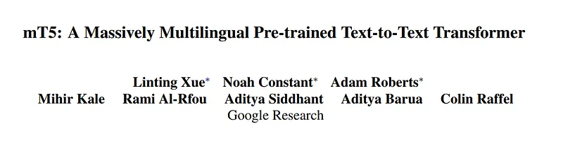
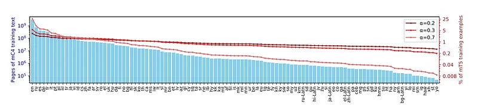
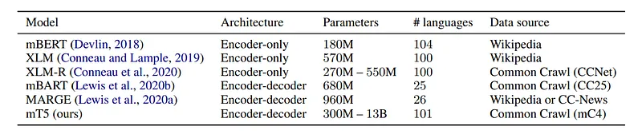
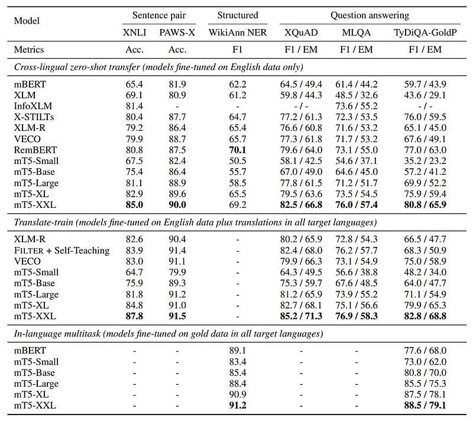
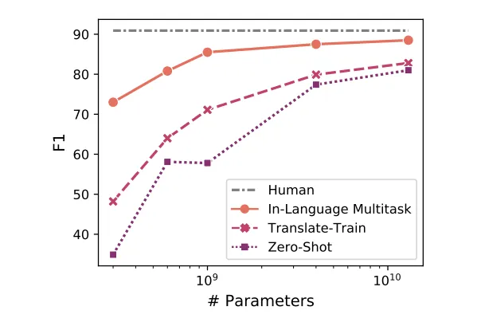
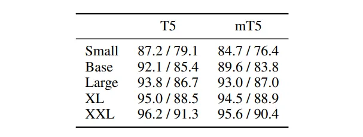
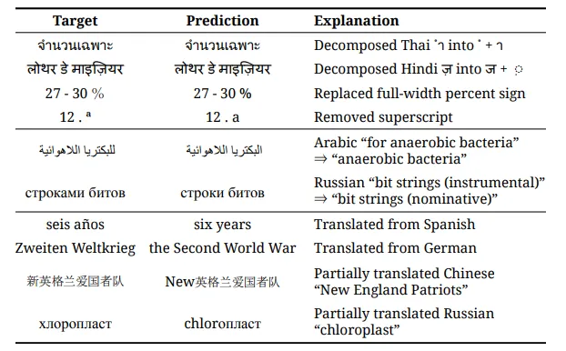

# Papers Explained 113 - mT5

mT5 is a multilingual variant of the T5 model pre-trained on a dataset covering 101 languages (mC4), achieving state-of-the-art performance on multilingual benchmarks. This paper addresses the issue of “accidental translation” in generative multilingual models in the zero-shot setting

This page ingests the source article into the wiki and connects it to [[Papers Explained Corpus]], [[Multilingual Models]], [[Large Language Models]], [[Synthetic Data]], [[Code Models]].

## Source Metadata

- Source file: `raw/2024-03-15_Papers-Explained-113--mT5-c61e03bc9218.md`
- Source title: Papers Explained 113: mT5
- Published: 2024-03-15
- Canonical: [https://medium.com/@ritvik19/papers-explained-113-mt5-c61e03bc9218](https://medium.com/@ritvik19/papers-explained-113-mt5-c61e03bc9218)

## Key Ideas

- mT5 is a multilingual variant of the T5 model pre-trained on a dataset covering 101 languages (mC4), achieving state-of-the-art performance on multilingual benchmarks.
- The project is available at https://goo.gle/mt5-code
- Recommended Reading [Papers Explained 44: T5](https://medium.com/dair-ai/papers-explained-44-t5-9d974a3b7957)
- The C4 dataset was explicitly designed to be English only, langdetect was used to discard non english texts. In contrast, for mC4 cld3 is used to identify over 100 languages.
- However, six of these are just script variants of the same spoken language (e.g. ru is Russian in Cyrillic script and ru-Latn is Russian in Latin script).

## Notes

mT5 is a multilingual variant of the T5 model pre-trained on a dataset covering 101 languages (mC4), achieving state-of-the-art performance on multilingual benchmarks. This paper addresses the issue of “accidental translation” in generative multilingual models in the zero-shot setting

The project is available at https://goo.gle/mt5-code

Recommended Reading [Papers Explained 44: T5](https://medium.com/dair-ai/papers-explained-44-t5-9d974a3b7957)

## mC4

The C4 dataset was explicitly designed to be English only, langdetect was used to discard non english texts. In contrast, for mC4 cld3 is used to identify over 100 languages. Since some of these languages are relatively scarce on the internet, all of the 7 monthly web scrapes released so far by Common Crawl were used. Texts with below 70% confidence were removed. This resulted in a corpus of 107 languages.

However, six of these are just script variants of the same spoken language (e.g. ru is Russian in Cyrillic script and ru-Latn is Russian in Latin script).

*Figure: Page counts per language in mC4 (left axis), and percentage of mT5 training examples coming from each language, for different language sampling exponents α (right axis).*

## mT5

The model architecture and training procedure used for mT5 closely follows that of T5.1.1.

To boost lower-resource languages training examples are sampled according to the probability p(L) ∝ |L|α, where p(L) is the probability of sampling text from a given language during pre-training and |L| is the number of examples in the language.

The hyperparameter α (typically with α < 1) allows one to control how much to “boost” the probability of training on low-resource languages.

Values used by prior work include α = 0.7 for mBERT, α = 0.3 for XLM-R, and α = 0.2 for MMNMT. Upon experimentation α = 0.3 is found to give a reasonable compromise between performance on high- and low-resource languages.

The vocab is increased to 250,000 and SentencePiece tokenizer is used.

*Figure: Comparison of mT5 to existing multilingual pre-trained language models.*

## Evaluation

- Evaluated mT5 on 6 tasks: XNLI, XQuAD, MLQA, TyDi QA, WikiAnn NER, and PAWS-X, covering a range of languages.

- Tasks were cast into a text-to-text format for generative processing.

- Three task variants were considered: zero-shot, translate-train, and in-language multitask.

- mT5 models of five sizes were pre-trained and fine-tuned, with details on learning rates, dropout rates, and batch sizes provided.

- Model sizes ranged from Small (≈ 300M parameters) to XXL (13B parameters), with the increase in parameters attributed to a larger vocabulary.

*Figure: Results on XTREME sentence-pair classification, structured prediction and question answering tasks.*

- mT5-XXL exceeded state-of-the-art on all classification and QA tasks and was near state-of-the-art on NER.

- The results underscore the importance of model capacity in cross-lingual representation learning.

- In the translate-train setting, mT5 surpassed state-of-the-art on all XTREME classification and QA tasks.

*Figure: Average F1 on the TyDi QA GoldP task across languages.*

- Larger models showed diminishing returns from machine translations of monolingual datasets, suggesting potential to avoid multilingual data annotation.

- Comparison with dedicated models for specific languages indicated that larger mT5 models could effectively learn multiple languages without significant interference, closing the gap with English-specific T5 models on the SQuAD benchmark.

*Figure: Comparison of T5 vs. mT5 on SQuAD question answering (F1/EM).*

- Larger mT5 models approach or match the performance of their T5 counterparts.

## Illegal Predictions

Illegal predictions, as discussed in the context of using mT5 for span selection tasks like extractive question answering, refer to instances where the model generates outputs that do not adhere to the expected constraints of the task. These predictions can be categorized into three main types:

- Normalization: This involves predictions that would be correct except for the substitution of “equivalent” Unicode characters. Such predictions could potentially be corrected through Unicode NFKC normalization. This issue is particularly common in languages like Thai, Chinese, and Hindi.

- Grammatical Adjustment: This occurs when the model makes minor morphological changes to the original text to produce a grammatically correct answer in the target language, which might not strictly match the gold standard answer. This is often necessary in languages with extensive grammatical case marking, such as Russian, Turkish, and German.

- Accidental Translation: This is when the model translates part or all of a contextual span into English (the language of all fine-tuning data) instead of producing an answer in the target language. This can happen even though the model was not explicitly trained on parallel translation data. Accidental translation is observed across all model sizes and languages, but it is most prevalent in smaller models like mT5-Small and mT5-Base, particularly with languages like Greek and Russian.

*Figure: Illegal mT5-XXL predictions on XQuAD zeroshot, illustrating normalization (top), grammatical adjustment (middle) and translation (bottom).*

### Preventing accidental translation

Mixing Unsupervised Multilingual Pre-training Task into Fine-tuning: A simple yet effective technique involves incorporating a small amount of unsupervised multilingual pre-training task into the fine-tuning stage. This approach is inspired by domain/task-adaptive pre-training strategies. The key intuition is that during English-only fine-tuning, a model’s likelihood of generating non-English tokens decreases, making English the most likely output for any input. By mixing in multilingual data from the pre-training task, the model is reminded of how to generate in other languages, thus preventing it from defaulting to English. Specifically, for mT5, a small ratio of the unsupervised task covering 101 languages is mixed into the fine-tuning process. This has shown to significantly reduce illegal prediction rates and improve overall performance in zero-shot settings.

Adjusting Language Sampling Parameter: Alongside mixing in multilingual data, adjusting the language sampling parameter (α) to produce a near-uniform distribution of languages during this mixed fine-tuning process encourages the model to treat all languages as equally likely. This further aids in preventing the model from favoring English or accidentally translating into English.

## Paper

mT5: A massively multilingual pre-trained text-to-text transformer [2010.11934](https://arxiv.org/abs/2010.11934)

Recommended Reading: [Multi Task Language Models](https://ritvik19.medium.com/list/multi-task-language-models-e6a2a1e517e6)

## Figures

Figures from the Medium HTML export (`raw/2024-03-15_Papers-Explained-113--mT5-c61e03bc9218.md`); local copies under `wiki/assets/papers-explained-113-mt5/` when download succeeded.

| Figure | Caption |
|--------|---------|
|  | Title page of *mT5: A Massively Multilingual Pre-trained Text-to-Text Transformer*. |
|  | mC4 per-language page counts with sampling distributions for different alpha values. |
|  | Comparison of multilingual pre-trained models by architecture, size, language count, and data source. |
|  | XTREME benchmark results across zero-shot, translate-train, and in-language multitask settings. |
|  | TyDi QA GoldP average F1 scaling with model size across training settings. |
|  | SQuAD F1/EM comparison between T5 and mT5 model sizes. |
|  | Examples of illegal predictions: normalization artifacts, grammatical adjustment, and accidental translation. |
## Related

- [[Papers Explained Corpus]]
- [[Multilingual Models]]
- [[Large Language Models]]
- [[Synthetic Data]]
- [[Code Models]]
- [[Papers Explained 112 - Self Instruct]]
- [[Papers Explained 114 - Phi-1]]

#summary #topic
