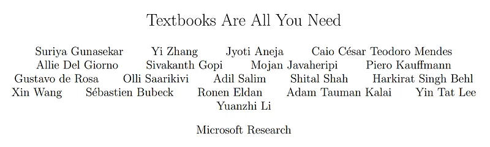
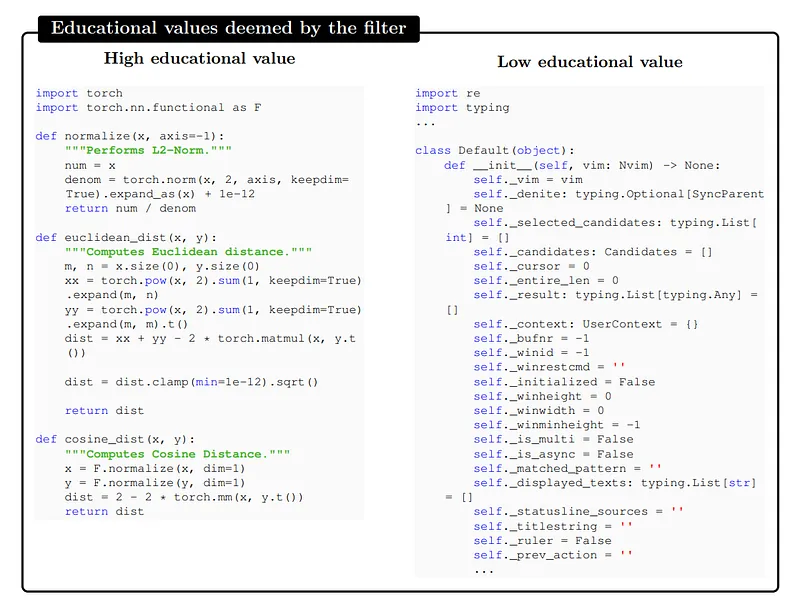
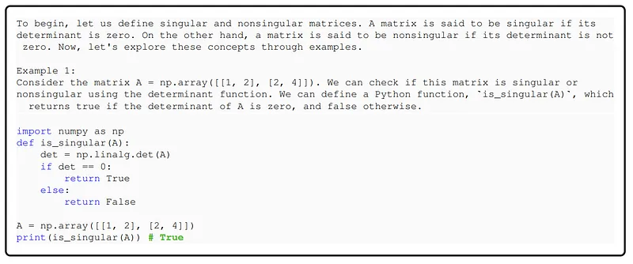
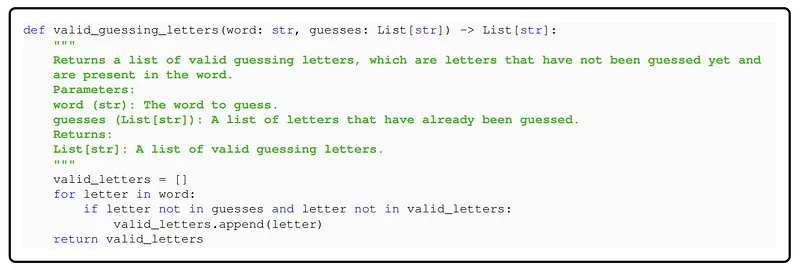
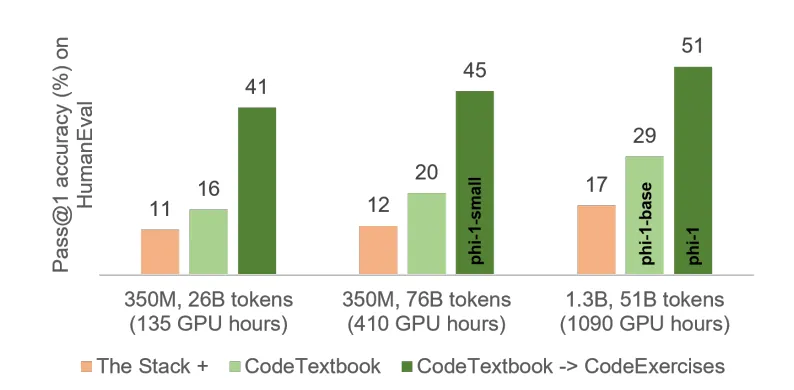
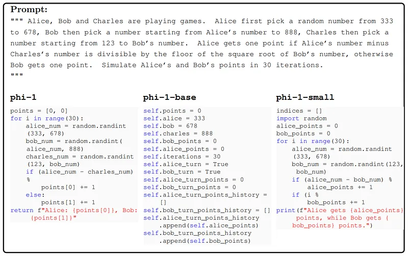
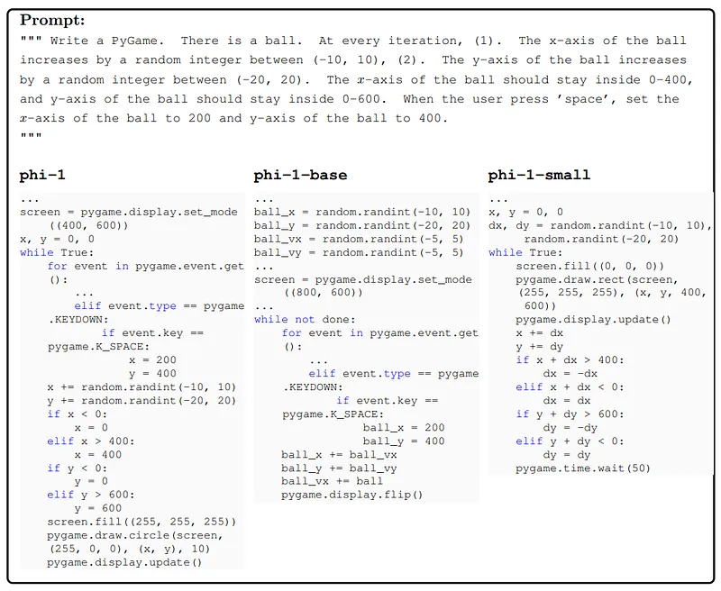
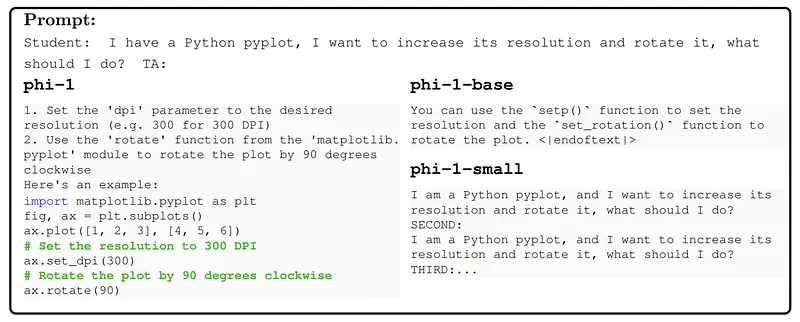
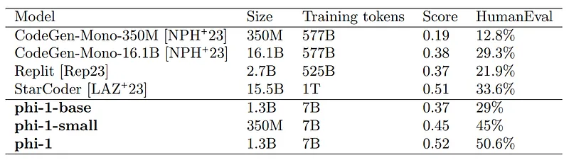

# Papers Explained 114 - Phi-1

Phi-1 is a transformer based 1.3B LLM for code, trained using a selection of “textbook quality” data from the web (6B tokens) and synthetically generated textbooks and exercises with GPT-3.5 (1B tokens). It competes on par with much larger models. It also displays surprising emergent properties.

This page ingests the source article into the wiki and connects it to [[Papers Explained Corpus]], [[Large Language Models]], [[Code Models]], [[Synthetic Data]], [[Reasoning Models]].

## Source Metadata

- Source file: `raw/2024-03-18_Papers-Explained-114--Phi-1-14a8dcc77ce5.md`
- Source title: Papers Explained 114: Phi-1
- Published: 2024-03-18
- Canonical: [https://medium.com/@ritvik19/papers-explained-114-phi-1-14a8dcc77ce5](https://medium.com/@ritvik19/papers-explained-114-phi-1-14a8dcc77ce5)

## Key Ideas

- Phi-1 is a transformer based 1.3B LLM for code, trained using a selection of “textbook quality” data from the web (6B tokens) and synthetically generated textbooks and exercises with GPT-3.5 (1B tokens). It competes on par with much larger models.
- The model is available on [HuggingFace](https://huggingface.co/microsoft/phi-1).
- The standard code datasets form a large and diverse corpus covering a broad range of topics and use cases. However many of these snippets are not very instructive for learning the basics of coding, and suffer from several drawbacks:
- Many samples are not self-contained, meaning that they depend on other modules or files that are external to the snippet, making them hard to understand without additional context.
- Typical examples do not involve any meaningful computation, but rather consist of trivial or boilerplate code, such as defining constants, setting parameters, or configuring GUI elements.

## Notes

Phi-1 is a transformer based 1.3B LLM for code, trained using a selection of “textbook quality” data from the web (6B tokens) and synthetically generated textbooks and exercises with GPT-3.5 (1B tokens). It competes on par with much larger models. It also displays surprising emergent properties.

The model is available on [HuggingFace](https://huggingface.co/microsoft/phi-1).

## Training Details

The standard code datasets form a large and diverse corpus covering a broad range of topics and use cases. However many of these snippets are not very instructive for learning the basics of coding, and suffer from several drawbacks:

- Many samples are not self-contained, meaning that they depend on other modules or files that are external to the snippet, making them hard to understand without additional context.

- Typical examples do not involve any meaningful computation, but rather consist of trivial or boilerplate code, such as defining constants, setting parameters, or configuring GUI elements.

- Samples that do contain algorithmic logic are often buried inside complex or poorly documented functions, making them difficult to follow or learn from.

- The examples are skewed towards certain topics or use cases, resulting in an unbalanced distribution of coding concepts and skills across the dataset.

Addressing this, the training of phi-1 relies on three main datasets:

- A filtered code-language dataset, which is a subset of The Stack and StackOverflow, obtained by using a language model-based classifier (consisting of about 6B tokens).

- A synthetic textbook dataset consisting of <1B tokens of GPT-3.5 generated Python textbooks.

- A small synthetic exercises dataset consisting of ∼180M tokens of Python exercises and solutions.

The combination of filtered code-language and synthetic textbook datasets is called “CodeTextbook” and is used in the pretraining phase to obtain the base model phi-1-base.

Then the 180M token synthetic exercises dataset, referred to as “CodeExercises”, is used to finetune the phi-1-base model to obtain phi-1.

### Filtering of existing code datasets using a transformer-based classifier

The Python subset of the deduplicated version of The Stack and StackOverflow is used, which, in combination, contains over 35 million files/samples, totaling over 35 billion tokens. A small subset of these files (about 100k samples) is annotated using GPT-4: the model is prompted to “determine its educational value for a student whose goal is to learn basic coding concepts.” This annotated dataset is then used to train a random forest classifier that predicts the quality of a file/sample using its output embedding from a pretrained codegen model as features.

## Creation of synthetic textbook-quality datasets

### The synthetic textbook dataset

This dataset is synthesized to provide a high-quality source of natural language heavy text interleaved with relevant code snippets. The content of these textbooks cover topics that promote reasoning and basic algorithmic skills. Here, diversity is obtained by providing constraints on topics and target audience of the generated textbook.

### The CodeExercises dataset

Each exercise is a docstring of a function that needs to be completed. The goal of this dataset is to align the model to perform function completion tasks based on natural language instructions. This dataset was also generated by GPT-3.5, where the main means of eliciting diversity is by constraining the function names.

## Model architecture and training

A decoder only transformer model using Flash Attention implementation of multi headed attention (MHA) is used. The MHA and MLP layers are used in parallel configuration. Rotary Position Embeddings with rotary dimension 32 are used. Aside from flash attention the models do not use other new techniques like Fill-In-the-Middle, or Multi-Query-Attention that could further boost performance and efficiency.

The same tokenizer as codegen-350M-mono is utilized.

The architecture for the 1.3B parameter phi-1 model consists of 24 layers, hidden dimension of 2048, MLP-inner dimension of 8192, and 32 attention heads of dimension 64 each.

The smaller 350M parameter phi1-small model consists of 20 layers, hidden dimension of 1024, MLP-inner dimension of 4096, and 16 attention heads of dimension 64 each.

For both pre training and finetuning, the respective datasets are concatenated into a single dimensional array with “⟨∣endotext∣⟩” token used for separating the files.

The models are trained on sequence length of 2048 sliced from the dataset array with next-token prediction loss.

## Evaluation

### Spikes of model capability after finetuning on CodeExercises

*Figure: Pass@1 accuracy (%) on HumanEval.*

- The largest improvement in HumanEval resulted from finetuning on the small CodeExercises dataset.

- The model after finetuning also exhibits a substantial improvement in executing tasks that are not featured in the finetuning dataset.

- Finetuning improves the model’s understanding: phi-1-base struggles with the logical relationships in the prompts, while phi-1 can interpret the question and generate the answer correctly.

- Finetuning improves the model’s ability to use external libraries: eventhough the exercises do not contain these libraries. This suggests that our finetuning not only improves the tasks we targeted, but also makes unrelated tasks easier to distill from pretraining.

- phi-1 has a better chat capability than phi-1-base despite that chat data is exclusive in pretraining, but not in the finetuning.

### Evaluation on unconventional problems with LLM grading

*Figure: LLM graded Understanding scores on 50 new unconventional coding problems.*

To address the concerns about the good performance of phi-1 on HumanEval due to potential memorization from CodeExercises dataset. A dedicated team created 50 new evaluation problems in the same format, with the goal of making them unlike real-world code or coding exercises.

Traditional binary evaluation of code (pass/fail) may not capture the nuances of model performance. A more informative evaluation assesses how well the model’s output matches the expected logic, similar to human coding interviews.

The approach used GPT-4 to grade candidate solutions, leveraging its knowledge and generative abilities for a fine-grained assessment.

- The results on the new unconventional problems show the same ranking as HumanEval, with phi-1 outperforming StarCoder.

- Confidence in phi-1’s performance validity increases because the new problems were designed to be outside the training distribution and had no chance to contaminate the training data.

## Paper

Textbooks Are All You Need [2306.11644](https://arxiv.org/abs/2306.11644)

## Figures

Figures from the Medium HTML export (`raw/2024-03-18_Papers-Explained-114--Phi-1-14a8dcc77ce5.md`); local copies under `wiki/assets/papers-explained-114-phi-1/` when download succeeded.

| Figure | Caption |
|--------|---------|
|  | Title page of *Textbooks Are All You Need*. |
|  | Examples of high- vs low-educational-value code identified by the filtering pipeline. |
|  | Synthetic textbook-style explanation plus code example for matrix singularity. |
|  | Synthetic coding exercise example with function docstring and reference implementation. |
|  | HumanEval Pass@1 gains from CodeTextbook pretraining and CodeExercises finetuning. |
|  | Unconventional coding prompt comparison across phi-1, phi-1-base, and phi-1-small. |
|  | Pygame simulation prompt outputs comparing phi model variants. |
|  | Plot-manipulation instruction-following example across phi model variants. |
|  | LLM-graded understanding benchmark on unconventional coding problems. |
## Related

- [[Papers Explained Corpus]]
- [[Large Language Models]]
- [[Code Models]]
- [[Synthetic Data]]
- [[Reasoning Models]]
- [[Papers Explained 113 - mT5]]
- [[Papers Explained 115 - Phi-1.5]]

#summary #topic
