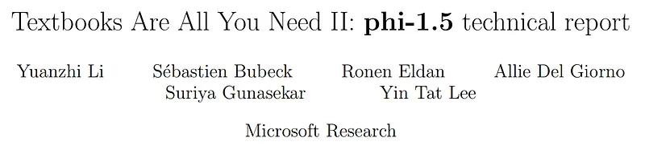
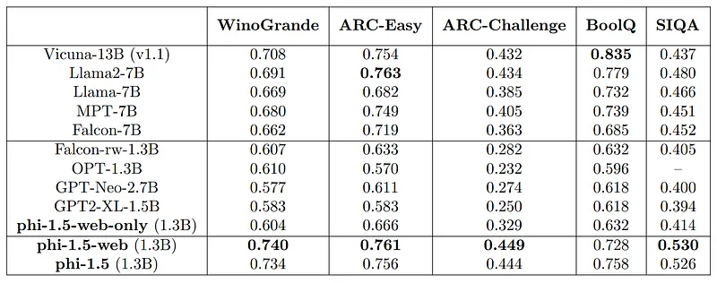
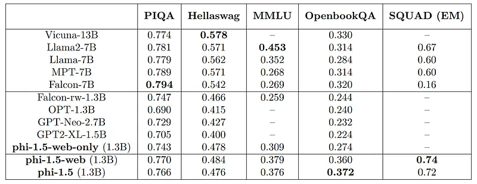
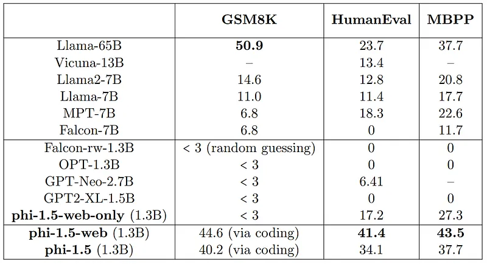
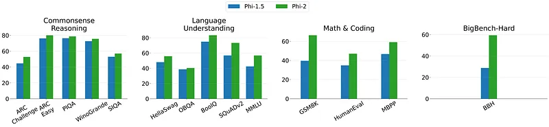
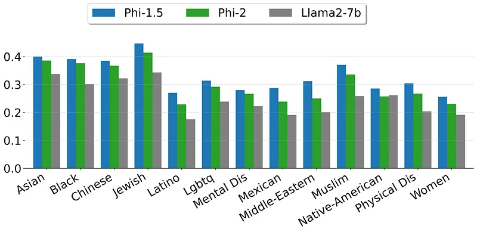
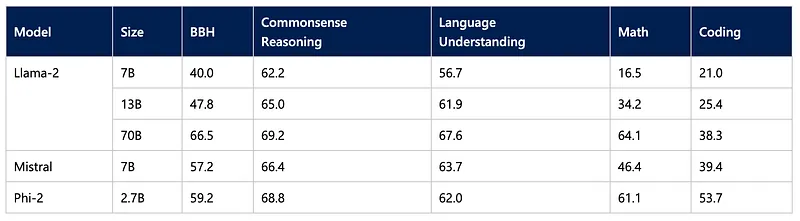
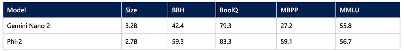

# Papers Explained 115 - Phi-1.5

Phi-1.5 follows the phi-1 approach, focusing this time on common sense reasoning in natural language, and creating a new 1.3 billion parameter model, with performance on natural language tasks comparable to models 5x larger.

This page ingests the source article into the wiki and connects it to [[Papers Explained Corpus]], [[Large Language Models]], [[Synthetic Data]], [[Reasoning Models]], [[Evaluation and Benchmarks]], [[Embedding and Retrieval]].

## Source Metadata

- Source file: `raw/2024-03-20_Papers-Explained-115--Phi-1-5-2857e56dbd2a.md`
- Source title: Papers Explained 115: Phi-1.5
- Published: 2024-03-20
- Canonical: [https://medium.com/@ritvik19/papers-explained-phi-1-5-2857e56dbd2a](https://medium.com/@ritvik19/papers-explained-phi-1-5-2857e56dbd2a)

## Key Ideas

- The model is available on [HuggingFace](https://huggingface.co/microsoft/phi-1_5).
- Recommended Reading [Papers Explained 114: Phi-1](https://ritvik19.medium.com/papers-explained-114-phi-1-14a8dcc77ce5)
- The architecture for phi-1.5 (and its variants) is exactly the same as the previous model phi-1. It is a Transformer with 24 layers, 32 heads, and each head has dimension 64.
- Rotary embedding with rotary dimension 32, and context length 2048 are used. Flash-attention is used for training speed up.
- The tokenizer of codegen-mono is utilized.

## Notes

Phi-1.5 follows the phi-1 approach, focusing this time on common sense reasoning in natural language, and creating a new 1.3 billion parameter model, with performance on natural language tasks comparable to models 5x larger.

The model is available on [HuggingFace](https://huggingface.co/microsoft/phi-1_5).

Recommended Reading [Papers Explained 114: Phi-1](https://ritvik19.medium.com/papers-explained-114-phi-1-14a8dcc77ce5)

## Architecture

The architecture for phi-1.5 (and its variants) is exactly the same as the previous model phi-1. It is a Transformer with 24 layers, 32 heads, and each head has dimension 64.

Rotary embedding with rotary dimension 32, and context length 2048 are used. Flash-attention is used for training speed up.

The tokenizer of codegen-mono is utilized.

## Training Data

The training data for phi-1.5 is a combination of phi-1’s training data (7B tokens) and newly created synthetic, “textbook-like” data (roughly 20B tokens) for the purpose of teaching common sense reasoning and general knowledge of the world (science, daily activities, theory of mind, etc.). 20K topics are carefully selected to seed the generation of this new synthetic data.

The authors remark that the experience gained in the process of creating the training data for both phi-1 and phi-1.5 leads us to the conclusion that the creation of a robust and comprehensive dataset demands more than raw computational power.

### Filtered web data

To probe the importance of traditional web data, two other models, phi-1.5-web-only and phi-1.5-web are created. To do so a dataset of 95B tokens of filtered web data following the filtering technique in phi-1 is created. This filtered web data consists of 88B tokens filtered from the Falcon refined web dataset, and 7B tokens of code data filtered from The Stack and StackOverflow.

The phi-1.5-web-only model is trained purely on the filtered web data with about 80% training tokens from NLP data sources and 20% from code datasets (no synthetic data).

The phi-1.5-web model on the other hand is trained on a mix of all the datasets: a subset of the filtered web data, phi-1’s code data, and our newly created synthetic NLP data in proportions roughly 40%, 20%, 40%, respectively.

None of the models have undergone instruction finetuning or RLHF. Nevertheless, they can be prompted to follow instructions in question-answering formats, but not perfectly.

## Evaluation

*Figure: Common Sense Reasoning Benchmarks.*

- phi-1.5 achieves comparable results to Llama2–7B, Falcon-7B and Vicuna-13B on nearly all of the benchmarks.

- phi-1.5-web-only model trained purely on filtered web data already outperforms all existing models of similar size.

*Figure: Language Understanding and Knowledge Benchmarks.*

- The difference with other models is not as large and depends on the task.

*Figure: Multi-Step Reasoning Benchmarks.*

- phi1.5 outperforms all existing models, including Llama 65B on coding tasks.

- the web data does help more here, as phi-1.5-web outperforms phi-1.5 somewhat significantly on those reasoning tasks.

- phi-1.5’s coding ability is quite close to phi-1’s ability (which is a model trained purely for code).

## Phi-2

Phi-2 is 2.7B parameter language model, which demonstrates exceptional reasoning and language understanding capabilities, matching or exceeding the performance of models up to 25 times larger, thanks to innovations in model scaling and the curation of high-quality training data.

Unlike other large language models, Phi-2 achieves state-of-the-art performance without relying on reinforcement learning from human feedback (RLHF) or instruct fine-tuning.

For Phi-2, the team prioritized “textbook-quality” data, including synthetic datasets designed to enhance the model’s understanding of common sense, general knowledge, and other areas. This approach, combined with selected web data of high educational value, allowed the model to surpass conventional language model scaling laws.

### Evaluations

*Figure: Comparison between Phi-2 (2.7B) and Phi-1.5 (1.3B) models. All tasks are evaluated in 0-shot except for BBH and MMLU which use 3-shot CoT and 5-shot, respectively.*

- The Phi-2 model consistently outperforms Phi-1.5 across all benchmarks, with notable improvements in Language Understanding (e.g., BoolQ and SQuADv2) and Math & Coding (e.g., GSM8K and MBPP).

- The most significant performance gap is observed in the BigBench-Hard (BBH) category, where Phi-2 nearly doubles the accuracy compared to Phi-1.5.

- While both models perform similarly in Commonsense Reasoning, Phi-2 slightly edges out in most tasks, indicating better overall reasoning abilities.

*Figure: Safety scores computed on 13 demographics from ToxiGen. A subset of 6541 sentences are selected and scored between 0 to 1 based on scaled perplexity and sentence toxicity.*

- Phi-2 consistently receives strong safety scores (close to 1) for all 13 demographics, demonstrating its effectiveness in minimizing toxic outputs.

*Figure: Averaged performance on grouped benchmarks compared to popular open-source SLMs.*

- With only 2.7 billion parameters, Phi-2 surpasses the performance of Mistral and Llama-2 models at 7B and 13B parameters on various aggregated benchmarks.

- Notably, it achieves better performance compared to 25x larger Llama-2–70B model on muti-step reasoning tasks, i.e., coding and math.

*Figure: Comparison between Phi-2 and Gemini Nano 2 Model on Gemini’s reported benchmarks.*

- Phi-2 matches or outperforms the recently-announced Google Gemini Nano 2, despite being smaller in size.

## Paper

Textbooks Are All You Need II: phi-1.5 technical report [2309.05463](https://arxiv.org/abs/2309.05463)

[Phi-2: The surprising power of small language models](https://www.microsoft.com/en-us/research/blog/phi-2-the-surprising-power-of-small-language-models/)

## Figures

Figures from the Medium HTML export (`raw/2024-03-20_Papers-Explained-115--Phi-1-5-2857e56dbd2a.md`); local copies under `wiki/assets/papers-explained-115-phi-1-5/` when download succeeded.

| Figure | Caption |
|--------|---------|
|  | Title page of *Textbooks Are All You Need II: phi-1.5 technical report*. |
|  | Common-sense reasoning benchmark table for phi-1.5 variants vs open baselines. |
|  | Language-understanding and knowledge benchmark comparison. |
|  | Multi-step reasoning benchmark results (GSM8K, HumanEval, MBPP). |
|  | Phi-2 vs Phi-1.5 grouped comparison across reasoning, language, math, and coding. |
|  | ToxiGen safety scores across 13 demographic groups for Phi-1.5, Phi-2, and Llama2-7B. |
|  | Grouped benchmark averages comparing Phi-2 with open-source small language models. |
|  | Phi-2 vs Gemini Nano 2 benchmark comparison (BBH, BoolQ, MBPP, MMLU). |
## Related

- [[Papers Explained Corpus]]
- [[Large Language Models]]
- [[Synthetic Data]]
- [[Reasoning Models]]
- [[Evaluation and Benchmarks]]
- [[Embedding and Retrieval]]
- [[Papers Explained 114 - Phi-1]]
- [[Papers Explained 116 - Phi-2]]

#summary #topic
