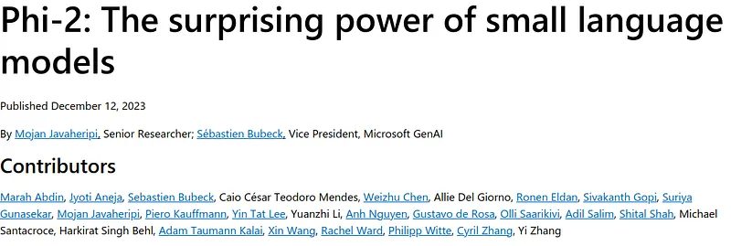
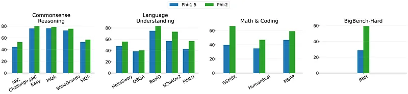
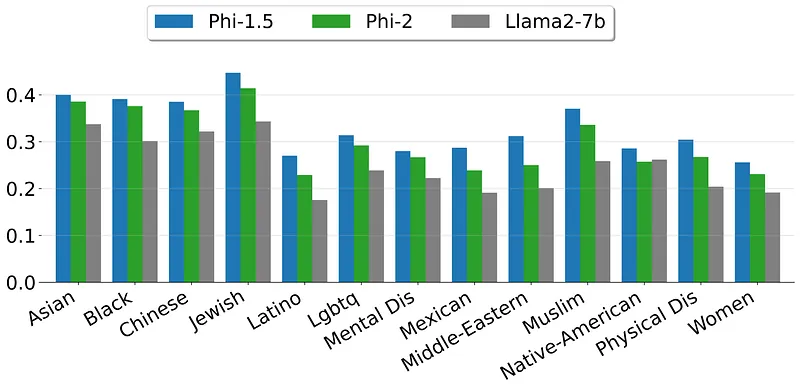
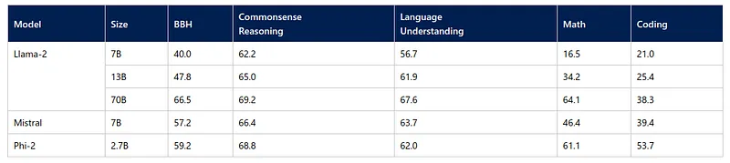
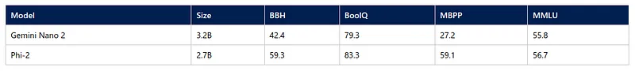

# Papers Explained 116 - Phi-2

Phi-2 is a 2.7B parameter model that follows the phi approach, trained on 1.4T tokens from multiple passes on a mixture of Synthetic and Web datasets for NLP and coding.It is developed to explore whether emergent abilities achieved by large-scale language models can also be achieved at a smaller scale using strategic choices for...

This page ingests the source article into the wiki and connects it to [[Papers Explained Corpus]], [[Large Language Models]], [[Synthetic Data]], [[Code Models]], [[Safety and Alignment]], [[Reasoning Models]], [[Reinforcement Learning]].

## Source Metadata

- Source file: `raw/2024-03-22_Papers-Explained-116--Phi-2-cef4a0bee146.md`
- Source title: Papers Explained 116: Phi-2
- Published: 2024-03-22
- Canonical: [https://medium.com/@ritvik19/papers-explained-116-phi-2-cef4a0bee146](https://medium.com/@ritvik19/papers-explained-116-phi-2-cef4a0bee146)

## Key Ideas

- Phi-2 is a 2.7B parameter model that follows the phi approach, trained on 1.4T tokens from multiple passes on a mixture of Synthetic and Web datasets for NLP and coding.It is developed to explore whether emergent abilities achieved by large-scale language...
- The model is available on [HuggingFace](https://huggingface.co/microsoft/phi-2).
- Recommended Reading [Papers Explained 114: Phi-1](https://ritvik19.medium.com/papers-explained-114-phi-1-14a8dcc77ce5) [Papers Explained 115: Phi-1.5](https://ritvik19.medium.com/papers-explained-phi-1-5-2857e56dbd2a)
- The training data mixture contains synthetic datasets specifically created to teach the model common sense reasoning and general knowledge, including science, daily activities, and theory of mind, among others.
- Phi-2 is a base model, i.e., it has not undergone alignment through RLHF, nor has it been instruction-fine-tuned.

## Notes

Phi-2 is a 2.7B parameter model that follows the phi approach, trained on 1.4T tokens from multiple passes on a mixture of Synthetic and Web datasets for NLP and coding.It is developed to explore whether emergent abilities achieved by large-scale language models can also be achieved at a smaller scale using strategic choices for training, such as data selection.

The model is available on [HuggingFace](https://huggingface.co/microsoft/phi-2).

Recommended Reading [Papers Explained 114: Phi-1](https://ritvik19.medium.com/papers-explained-114-phi-1-14a8dcc77ce5) [Papers Explained 115: Phi-1.5](https://ritvik19.medium.com/papers-explained-phi-1-5-2857e56dbd2a)

## Training Details

The training data mixture contains synthetic datasets specifically created to teach the model common sense reasoning and general knowledge, including science, daily activities, and theory of mind, among others. The training corpus is further augmented with carefully selected web data that is filtered based on educational value and content quality.

Phi-2 is a base model, i.e., it has not undergone alignment through RLHF, nor has it been instruction-fine-tuned. Despite this, it achieves better behavior with respect to toxicity and bias compared to existing open-source models that have gone through alignment.

Phi-2 is developed starting from the 1.3B phi-1.5, using innovative techniques to scale up and embed its knowledge in the 2.7B model. This scaled knowledge transfer not only accelerates training convergence but shows clear boost in Phi-2 benchmark scores.

## Evaluation

The first model, Phi-1 (1.3B), achieved state-of-the-art performance on Python coding among existing SLMs (specifically on the HumanEval and MBPP benchmarks).

Phi-1.5 (1.3B) extended the focus to common sense reasoning and language understanding with performance comparable to models 5x larger.

Phi-2 (2.7B) demonstrates outstanding reasoning and language understanding capabilities, showcasing state-of-the-art performance among base language models with less than 13 billion parameters.

On complex benchmarks Phi-2 matches or outperforms models up to 25x larger, thanks to new innovations in model scaling and training data curation.

*Figure: Comparison between Phi-2 (2.7B) and Phi-1.5 (1.3B) models. All tasks are evaluated in 0-shot except for BBH and MMLU which use 3-shot CoT and 5-shot, respectively.*

- Phi-2 outperforms phi-1.5 in all the mentioned benchmarks.

*Figure: Safety scores computed on 13 demographics from ToxiGen.*

- Despite not being aligned, Phi-2 demonstrates better behaviour with respect to toxicity and bias compared to existing open-source models that went through alignment.

- Phi-2 is evaluated across various academic benchmarks including Big Bench Hard (BBH), commonsense reasoning, language understanding, math, and coding.

- Despite having only 2.7 billion parameters, Phi-2 surpasses the performance of larger models such as Mistral (7B) and Llama-2 (13B).

- Phi-2 also outperforms the significantly larger Llama-2–70B model, especially in multi-step reasoning tasks like coding and math.

- Phi-2’s performance is comparable or superior to Google Gemini Nano 2, despite Phi-2’s smaller size.

- Phi-2 was also evaluated using Microsoft’s internal proprietary datasets and tasks, showing it generally outperforms Mistral-7B and Llama-2 models across various sizes (7B, 13B, and 70B).

## Paper

[Phi-2: The surprising power of small language models](https://www.microsoft.com/en-us/research/blog/phi-2-the-surprising-power-of-small-language-models/)

[HuggingFace Model Card](https://huggingface.co/microsoft/phi-2)

## Figures

Figures from the Medium HTML export (`raw/2024-03-22_Papers-Explained-116--Phi-2-cef4a0bee146.md`); local copies under `wiki/assets/papers-explained-116-phi-2/` when download succeeded.

| Figure | Caption |
|--------|---------|
|  | Header image from Microsoft’s Phi-2 announcement page. |
|  | Phi-2 vs Phi-1.5 grouped benchmark comparison across reasoning, language, math, and coding. |
|  | Safety scores across demographics from ToxiGen for Phi models and Llama2-7B. |
|  | Averaged grouped benchmark performance compared with open-source SLM baselines. |
|  | Phi-2 and Gemini Nano 2 comparison on selected reported benchmarks. |
## Related

- [[Papers Explained Corpus]]
- [[Large Language Models]]
- [[Synthetic Data]]
- [[Code Models]]
- [[Safety and Alignment]]
- [[Reasoning Models]]
- [[Reinforcement Learning]]
- [[Papers Explained 115 - Phi-1.5]]
- [[Papers Explained 117 - MM1]]

#summary #topic
