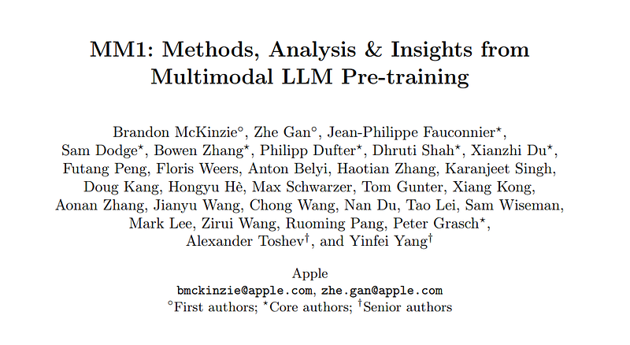
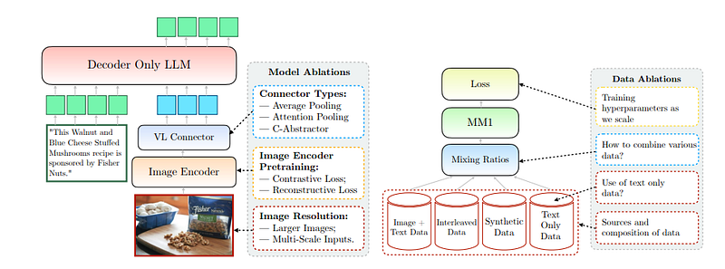
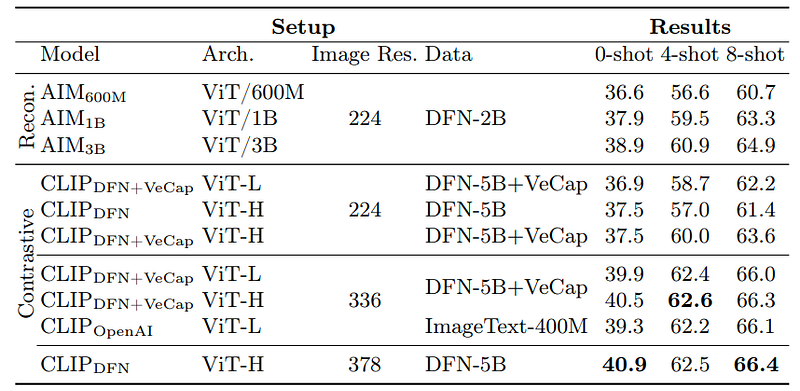
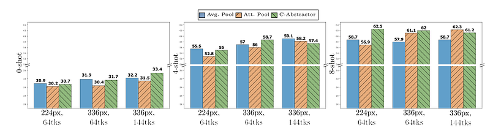
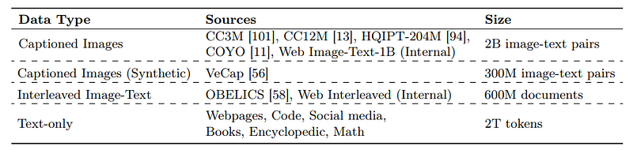
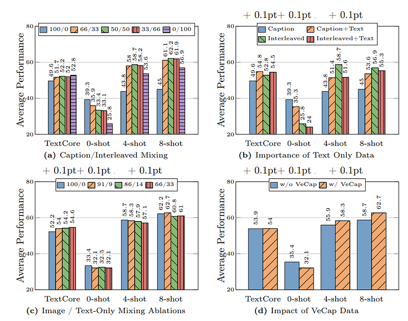
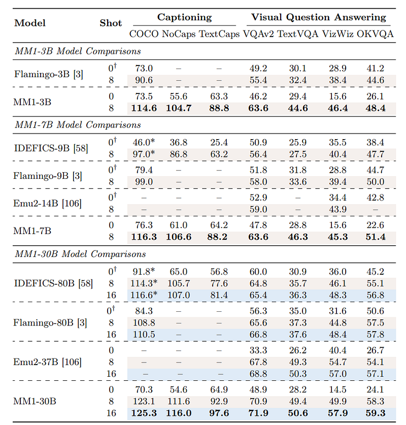
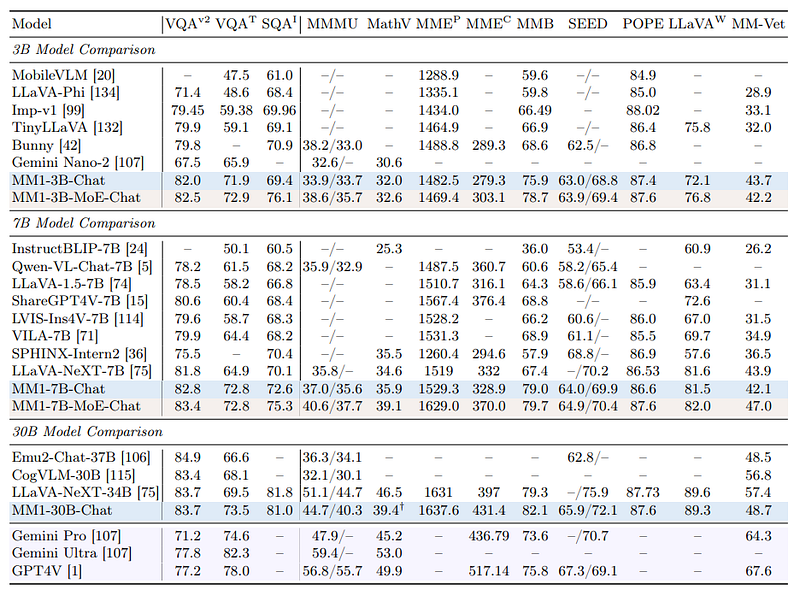
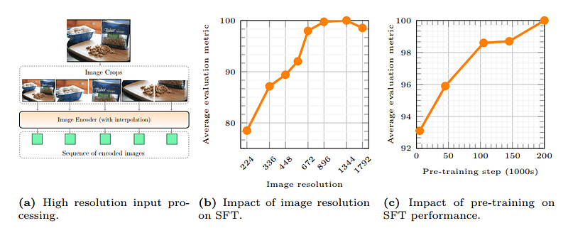
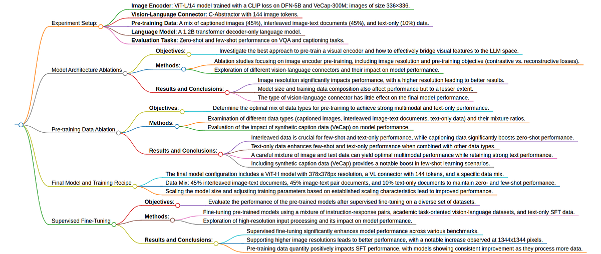

# Papers Explained 117 - MM1

MM1 is a family of multimodal models up to 30B parameters, consisting of both dense models and mixture-of-experts variants, that are SOTA in pre-training metrics and achieve competitive performance after supervised fine-tuning on a range of established multimodal benchmarks.

This page ingests the source article into the wiki and connects it to [[Papers Explained Corpus]], [[Vision Language Models]], [[Mixture of Experts]], [[Evaluation and Benchmarks]], [[Supervised Fine-Tuning]].

## Source Metadata

- Source file: `raw/2024-03-26_Papers-Explained-117--MM1-c579142bcdc0.html`
- Source title: Papers Explained 117: MM1
- Published: 2024-03-26
- Canonical: [https://medium.com/@ritvik19/papers-explained-117-mm1-c579142bcdc0](https://medium.com/@ritvik19/papers-explained-117-mm1-c579142bcdc0)

## Key Ideas

- MM1 is a family of multimodal models up to 30B parameters, consisting of both dense models and mixture-of-experts variants, that are SOTA in pre-training metrics and achieve competitive performance after supervised fine-tuning on a range of established...
- The study demonstrates that for large-scale multimodal pre-training using a careful mix of image-caption, interleaved image-text, and text-only data is crucial for achieving SOTA few-shot results across multiple benchmarks.
- It further shows that the image encoder together with image resolution and the image token count has substantial impact, while the vision-language connector design is of comparatively negligible importance.
- Three major axis of design decisions are explored in the study
- Architecture: Different pre-trained image encoders and various ways of connecting LLMs with these encoders.

## Notes

MM1 is a family of multimodal models up to 30B parameters, consisting of both dense models and mixture-of-experts variants, that are SOTA in pre-training metrics and achieve competitive performance after supervised fine-tuning on a range of established multimodal benchmarks.

The study demonstrates that for large-scale multimodal pre-training using a careful mix of image-caption, interleaved image-text, and text-only data is crucial for achieving SOTA few-shot results across multiple benchmarks.

It further shows that the image encoder together with image resolution and the image token count has substantial impact, while the vision-language connector design is of comparatively negligible importance.

## Recipe for Building MM1

*Figure: Model and Data Ablations*

Three major axis of design decisions are explored in the study

- Architecture: Different pre-trained image encoders and various ways of connecting LLMs with these encoders.

- Data: Different types of data and their relative mixture weights.

- Training Procedure: How to train the MLLM including the hyperparameters and what parts of the model to train at what stage.

A smaller base configuration is used and one component is modified at a time, either an architectural module or a data source, the impact of the design choice is assessed.

The base configuration for ablations is as follows:

- Image Encoder: A ViT-L/14 model trained with a CLIP loss on DFN-5B and VeCap-300M; images of size 336×336.

- Vision-Language Connector: C-Abstractor with 144 image tokens.

- Pre-training Data: A mix of captioned images (45%), interleaved imagetext documents (45%), and text-only (10%) data.

- Language Model: A 1.2B transformer decoder-only language model.

### Model Architecture Ablations

The following Design Choices are investigated:

- Image Encoder Pre-training: Investigation of the impact of image resolution and pre-training objectives on the performance of visual encoders, using a 2.9B parameter LLM for capacity.

- Contrastive vs. Reconstructive Losses: Comparison of image encoders trained with contrastive losses (for semantic understanding) and reconstructive losses (for detailed image understanding).

- Vision-Language Connector and Image Resolution: Examination of how to convert spatially arranged image tokens to the sequential format of LLMs, considering different numbers of visual tokens, image resolutions, and architectural options (Average Pooling, Attention Pooling, Convolutional Mapping).

Image Encoder Pre-training

*Figure: MM1 pre-training ablation across different image encoders.*

- Image resolution significantly impacts performance, with a 3% boost across all metrics when increasing resolution from 224 to 336 pixels.

- Doubling the model size (from ViT-L to ViT-H) results in a modest performance increase of usually less than 1%.

- Adding synthetic captions dataset (VeCap-300M) yields more than a 1% boost in few-shot scenarios.

- Contrastive methods generally outperform reconstructive ones, though the results are inconclusive due to data and model size differences

Vision-Language Connector and Image Resolution

*Figure: 0-shot, 4-shot, and 8-shot ablations across different visual-language connectors for two image resolutions, and two image token sizes.*

- Increasing the number of visual tokens or image resolution enhances both zero- and few-shot performance.

- Different architectural designs for the Vision-Language (VL) connector (Average Pooling, Attention Pooling, Convolutional Mapping) do not conclusively produce stronger models, with all three achieving similar results after instruction tuning at 336px and 114 token settings.

### Pre-training Data Ablation

*Figure: List of datasets for pre-training multimodal large language models.*

- Models were trained using a combination of captioning data, interleaved image-text documents, and text-only data.

- The training involved 200k steps to fully leverage large-scale data.

- Evaluation included a set of commonly employed text tasks (TextCore1) to assess the effects of data mixture.

- Different mixes of data were tested to observe their impact on zero-shot, few-shot, and text-only performance .

*Figure: Data Ablations Results.*

Captioning Data:

- Increases zero-shot performance consistently from 25.8% to 39.3% as the amount of captioned data is increased.

- Boosts zero-shot performance on captioning benchmarks.

Interleaved Data:

- Crucial for maintaining high few-shot performance (over 61% for 8-shot and 58% for 4-shot) when at least 50% of the data is interleaved.

- Benefits text-only performance, likely due to the presence of long-form text.

Text-Only Data:

- Helps maintain the language understanding capabilities of the model.

- Boosts few-shot performance when combined with captioned data but leads to a minor drop in performance when combined with interleaved data.

- Increases text-only performance as shown by the boost in TextCore numbers.

Optimal Data Mixture:

- A careful mixture of image and text data (caption/interleaved/text ratio of 5:5:1) yields optimal multimodal performance while retaining strong text performance.

Synthetic Data (VeCap):

- Provides a non-trivial boost in few-shot performance by 2.4% and 4% absolute, despite being only 7% of all caption data.

## Final Model and Training Recipe

- Image Encoder: Utilized a ViT-H model with 378x378px resolution, pre-trained with a CLIP objective on DFN-5B.

- Vision-Language Connector: Employed a VL connector with 144 tokens, choosing C-Abstractor for its architecture.

- Data: Mixed 45% interleaved image-text documents, 45% image-text pair documents, and 10% text-only documents to maintain zero- and few-shot performance.

- Model Scaling: Scaled up the LLM size to 3B, 7B, and 30B parameters, training on the same text-only dataset for 200k steps with specific configurations.

- Learning Rate Optimization: Performed a grid search at smaller scales to identify optimal learning rates and extrapolated to larger models using linear regression in log space.

- Scaling via Mixture-of-Experts (MoE): Explored scaling the dense model by adding more experts in the FFN layers, following GShard and ST-MoE guidelines.

### Results

*Figure: Multimodal pre-training evaluations.*

- Evaluated on captioning and VQA tasks, showing superior few-shot performance across captioning benchmarks and VizWiz-QA benchmark at 30B scale.

- Comparable performance to Emu2 for VQAv2, TextVQA, OKVQA.

- Zero-shot performance was favorable on TextCaps across all model sizes, and comparable to Flamingo-3B at small scales for most benchmarks.

- The MM1 model outperforms all published prior work for pre-trained MLLMs in few-shot settings and demonstrates competitive zero-shot performance without instruction fine-tuning.

## Supervised Fine-Tuning

Utilized approximately 1M SFT examples from a diverse set of datasets, including instruction-response pairs, academic task-oriented vision-language datasets, and text-only SFT data. The datasets were mixed together and randomly sampled during training. Employed positional embedding interpolation and sub-image decomposition to support high-resolution SFT, enabling the model to handle image resolutions up to 1792×1792.

### Results

Comparison with SOTA (State of the Art)

*Figure: Comparison with SOTA models on MLLM benchmarks.*

MM1 models after SFT outperformed all listed models of the same size, setting new state-of-the-art benchmarks for model sizes. MoE models showed uniformly better performance, indicating potential for further scaling. MM1–30B-Chat outperformed competitors on several benchmarks but had limitations in multi-image reasoning and few-shot prompting

*Figure: The impact of image resolution and pre-training for SFT performance.*

- Impact of Image Resolution: Higher image resolutions significantly improved performance, with a 15% relative increase observed at 1344×1344 resolution. However, performance slightly decreased at the largest tested resolution of 1792×1792, likely due to resizing artifacts.

- Impact of Pre-training: Large-scale pre-training positively impacted final model performance, with consistent improvements observed as the model was exposed to more unique data samples.

- Few-shot Chain-of-Thought Reasoning after SFT: MM1–30B-Chat exhibited multi-image reasoning capabilities and improved performance in few-shot scenarios, demonstrating the effectiveness of interleaved data and the potential of mixed resolution in-context examples for enhancing performance.

- Lessons from Pre-training: Pre-training with caption-only data improved SFT metrics, and different vision-language connector architectures had negligible impact on final results, indicating that lessons learned during pre-training transferred effectively to SFT.

## TLDR

Recommended Reading [Multi Modal Transformers](https://ritvik19.medium.com/list/multi-modal-transformers-67453f215ecf)

## Paper

MM1: Methods, Analysis & Insights from Multimodal LLM Pre-training [2403.09611](https://arxiv.org/abs/2403.09611)

## Figures

Figures from the Medium HTML export (`raw/2024-03-26_Papers-Explained-117--MM1-c579142bcdc0.html`); local copies under `wiki/assets/papers-explained-117-mm1/` when download succeeded.

| Figure | Caption |
|--------|---------|
|  | Title page of *MM1: Methods, Analysis & Insights from Multimodal LLM Pre-training*. |
|  | MM1 ablation framework covering model choices, data mixture, and training losses. |
|  | Image-encoder pretraining ablation table comparing reconstructive and contrastive setups. |
|  | Connector, resolution, and visual-token ablations for zero-, 4-shot, and 8-shot performance. |
|  | Pretraining dataset inventory for captioned, interleaved, synthetic, and text-only data sources. |
|  | Data-mixture ablations showing effects of caption/interleaved/text mixing and VeCap inclusion. |
|  | Multimodal pretraining evaluation on captioning and VQA benchmarks across model scales. |
|  | Post-SFT benchmark comparison with contemporary MLLM baselines. |
|  | SFT analysis: high-resolution input processing and effects of image resolution and pretraining steps. |
|  | Mind-map summary of MM1 experimental setup, ablations, and key findings. |
## Related

- [[Papers Explained Corpus]]
- [[Vision Language Models]]
- [[Mixture of Experts]]
- [[Evaluation and Benchmarks]]
- [[Supervised Fine-Tuning]]
- [[Papers Explained 116 - Phi-2]]
- [[Papers Explained 118 - WRAP]]

#summary #topic
