# Papers Explained 118 - WRAP

WRAP (Web Rephrase Augmented Pre-training) uses instruction-tuned models to paraphrase noisy web documents into synthetic training data, improving pre-training efficiency and out-of-distribution performance.

This page ingests the source article into the wiki and connects it to [[Papers Explained Corpus]], [[Large Language Models]], [[Synthetic Data]], [[Evaluation and Benchmarks]].

## Source Metadata

- Source file: `raw/2024-03-28_Papers-Explained-118--WRAP-e563e009fe56.md`
- Source title: Papers Explained 118: WRAP
- Published: 2024-03-28
- Canonical: [https://medium.com/@ritvik19/papers-explained-118-wrap-e563e009fe56](https://medium.com/@ritvik19/papers-explained-118-wrap-e563e009fe56)

## Key Ideas

- WRAP (Web Rephrase Augmented Pre-training) uses instruction-tuned models to paraphrase noisy web documents into synthetic training data, improving pre-training efficiency and out-of-distribution performance.
- As a remedy to these challenges this study proposes WRAP that leverages the natural diversity of articles on the web, allowing one to utilize significantly smaller LLMs (than GPT-3.5) to generate high-quality paraphrases of noisy and unstructured articles on...
- This work has attempted rephrasing documents on the web in four different styles: Easy, Medium, Hard and Q/A using a frozen Mistral-7B instruction-tuned model.
- The model output is used to create a parallel corpus of “high-quality” synthetic data corresponding to the original noisy web data.
- This method although incorporates the information diversity found on the internet, it does not incorporate the noise in real data, such as typos and linguistic errors which helps the LLMs not fail in user facing situations.

## Notes

WRAP (Web Rephrase Augmented Pre-training) addresses challenges related to data curation, limited data availability, and computational efficiency in pre-training LLMs. It involves using an off-the-shelf instruction-tuned model prompted to paraphrase documents on the web in specific styles such as “like Wikipedia” or in “question-answer format” to jointly pre-train Large Language Models (LLMs) on real and synthetic rephrases. By rephrasing documents from the web into different styles, WRAP allows models to learn more efficiently and achieve performance gains on out-of-distribution datasets.

Recommended Reading [Papers Explained 114: Phi-1](https://ritvik19.medium.com/papers-explained-114-phi-1-14a8dcc77ce5) [Papers Explained 115: Phi-1.5](https://ritvik19.medium.com/papers-explained-phi-1-5-2857e56dbd2a) [Papers Explained 116: Phi-2](https://ritvik19.medium.com/papers-explained-116-phi-2-cef4a0bee146)

## WRAP:Web Rephrase Augmented Pretraining

*Figure: WRAP Recipe*

Prior approaches to generating synthetic textbook quality data using LLMs such as [ Phi 1 & Phi 1.5 ] required a language model that contains sufficient world knowledge to generate articles worth training on, thereby increasing generation cost; and a careful selection of prompts that enable generating high quality, and diverse articles that fill any knowledge gaps in the synthetic corpus. This approach has the potential of inadvertently creeping in biases in the language models as opposed to those trained on the natural diversity of the web.

As a remedy to these challenges this study proposes WRAP that leverages the natural diversity of articles on the web, allowing one to utilize significantly smaller LLMs (than GPT-3.5) to generate high-quality paraphrases of noisy and unstructured articles on the web.

This work has attempted rephrasing documents on the web in four different styles: Easy, Medium, Hard and Q/A using a frozen Mistral-7B instruction-tuned model.

*Figure: Rephrase Prompt Templates*

The model output is used to create a parallel corpus of “high-quality” synthetic data corresponding to the original noisy web data. Each example has a maximum of 300 tokens, decided based on the empirical observation that asking an LLM to rephrase more than 300 tokens, often led to loss of information.

This method although incorporates the information diversity found on the internet, it does not incorporate the noise in real data, such as typos and linguistic errors which helps the LLMs not fail in user facing situations. In order to incorporate this style diversity in language modeling, real and synthetic data are sampled in a 1:1 ratio.

### Implementation Details

Decoder only transformers are trained at three different scales for a maximum length of 1024.

*Figure: Model Hyperparameters, None of the models use dropouts.*

## Evaluation

### Perplexity

- Models trained on the C4 dataset or a stylistic rephrase of the same were evaluated on 21 sub-domains of the Pile dataset, created from the first 10,000 documents of each domain.

- The evaluation focuses on the perplexity of the model on these subsets

*Figure: Weighted average perplexity over 21 sub-domains of the Pile for varying model sizes and amount of pre-training data.*

- Models trained for fewer tokens (150B) and smaller models (350M) outperform those trained on the full C4 for 300B tokens, showing faster learning with synthetic rephrases.

*Figure: WRAP (C4 + QA-85B) v/s C4: Comparison of perplexity on the Pile for a 1.3B LLM trained for 300B tokens shows that WRAP outperforms models trained on 2x real data.*

- In specific domains like ArXiv and HackerNews, training with synthetic data reduced perplexity by nearly 3x compared to models trained on real data alone, suggesting a significant performance advantage of synthetic data pre-training.

- On average, across multiple subsets of the Pile, models improved perplexity by 50% over those trained on real data alone.

- A notable learning speed-up was observed, where at the first checkpoint (10B tokens) of WRAP training, the average perplexity on the Pile was lower than that achieved by pre-training on C4 for 15 checkpoints, indicating a 15x pre-training speed-up.

### Zero-shot Tasks

- Evaluation on 13 different zero-shot benchmarks covering common sense reasoning, language and knowledge understanding, and mathematical reasoning.

- Baseline methods include training on different sizes of the C4 dataset, the RefinedWeb Dataset, and comparisons with Pythia-1.4B and TinyLlama models.

General Improvements:

*Figure: Evaluation of ∼ 1.3B parameter LLMs on ‘General Understanding Tasks’ on datasets focusing on general reasoning, language understanding, and common sense.*

- Models trained on synthetic data combined with the C4 dataset showed higher average performance (49.4%) compared to those trained only on the real C4 dataset (47.4%) (Referenced in Table 1).

- The inclusion of synthetic data enhances the general understanding capabilities of NLP models.

- The TinyLlama model, despite being trained with significantly more compute and data, performs comparably to other models, suggesting minimal gains from adding more real data.

Specialized Knowledge Tasks:

*Figure: Evaluation of ∼ 1.3B parameter LLMs on ‘Specialized Knowledge Tasks’ that require specific domain knowledge such as science, medicine, mathematics, and logic.*

- Synthetic data does not impart new knowledge but helps in faster pre-training.

- Larger datasets improve performance by exposing the LLM to more “knowledge”.

- Performance improvements saturate with very large datasets; for example, the RefinedWeb (320B) model only slightly outperforms the RefinedWeb (160B) model.

Specific Improvements:

- The Synthetic (85B) model showed the maximum improvement on the TruthfulQA dataset, significantly outperforming other models.

- Adding real data to the synthetic model reduced performance on TruthfulQA by 4%, indicating a dilution of benefits from synthetic data when combined with real data.

- Other datasets like HellaSwag and BoolQ showed benefits from incorporating combinations of C4 and synthetic rephrases.

## Analysis and Ablations

### Real vs. Synthetic Data:

*Figure: Comparing perplexity on the Pile when pre-training on C4 with synthetic data vs. synthetic data only. Models are 1.3B parameters trained for a total of 150B tokens on a real data subset containing 35 Billion tokens of the C4.*

- Synthetic data alone can lead to strong performance on QA tasks but shows significant degradation in perplexity on Pile perplexity across many sub-domains.

*Figure: Evaluation of ∼ 1.3B parameter LLMs trained for 150B tokens on General Understanding Tasks.*

*Figure: Evaluation of ∼ 1.3B parameter LLMs on Specialized Knowledge Tasks.*

- Real data improves zero-shot performance, highlighting the importance of real data in training .

### Combining Multiple Synthetic Datasets:

*Figure: Perplexity across all domains of the Pile comparing combining multiple styles of synthetic data. Models are 1.3B parameters trained for a total of 150B tokens.*

*Figure: Evaluation of ∼ 1.3B parameter LLMs trained for 150B tokens on ‘Specialized Knowledge Tasks’.*

*Figure: Evaluation of ∼ 1.3B parameter LLMs trained for 150B tokens on General Understanding Tasks.*

- Combining multiple synthetic styles with C4 data shows a small improvement in average perplexity on the Pile, with certain domains benefiting more from specific synthetic styles.

### Quality of Re-phrasers:

*Figure: Perplexity across all the Pile domains for WRAP on data generated by different LLMs.*

- Pre-training on data generated by smaller re-phrase models like Qwen-1.8B and Mistral-7B achieves lower perplexity than larger models, indicating the effectiveness of high-quality re-phrasers (Figure 5).

### Synthetic Data vs. Augmentations:

*Figure: Perplexity comparison on the Pile for different augmemntation strategies. 350M parameter models are trained for a total of 15B tokens.*

- Models trained on combinations of real and synthetic data perform significantly better than those trained on augmented data, suggesting synthetic data provides more than just augmentation benefits.

### Impact of Synthetic Data Style:

*Figure: Perplexity across all domains of the Pile comparing different styles of synthetic data.*

- No single style of synthetic data performs best across all domains, but training with combinations of real C4 and synthetic data matching the domain style improves performance.

- An oracle selecting the best synthetic style for each domain could improve perplexity by 16%, indicating the value of diverse data styles for generalization.

### Data Leakage:

*Figure: Comparison between synthetic and real data from the C4 corpus showing that synthetic data maintains semantic meaning compared with the real C4 data and primarily changes style for (a) medium rephrases of C4, and (b) QA rephrases of C4.*

- Analysis shows high cosine similarity between synthetic and real data pairs, indicating that re-phrases maintain similar meaning without adding new information, thus minimizing concerns about data leakage.

## Paper

Rephrasing the Web: A Recipe for Compute and Data-Efficient Language Modeling [2401.16380](https://arxiv.org/abs/2401.16380)

## Figures

Figures from the Medium HTML export (`raw/2024-03-28_Papers-Explained-118--WRAP-e563e009fe56.md`); local copies under `wiki/assets/papers-explained-118-wrap/` when download succeeded.

| Figure | Caption |
|--------|---------|
| 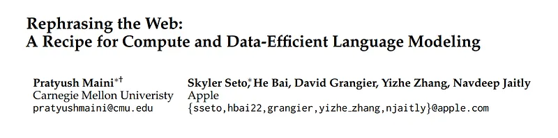 | Title page of *Rephrasing the Web: A Recipe for Compute and Data-Efficient Language Modeling*. |
| 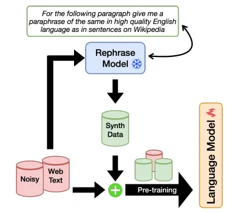 | WRAP training recipe: paraphrase noisy web text, mix real and synthetic data, then pre-train. |
| 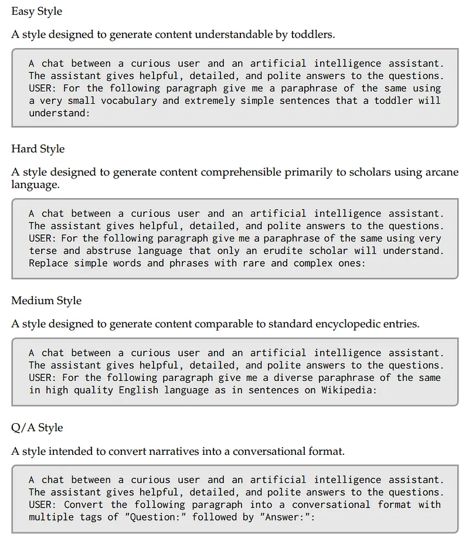 | Prompt templates for Easy, Hard, Medium, and Q/A rephrase styles. |
| 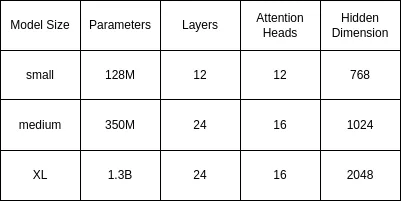 | Model hyperparameter table for small, medium, and XL decoder-only models. |
| 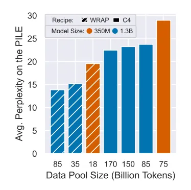 | Weighted average Pile perplexity across model sizes and effective data pool sizes. |
| 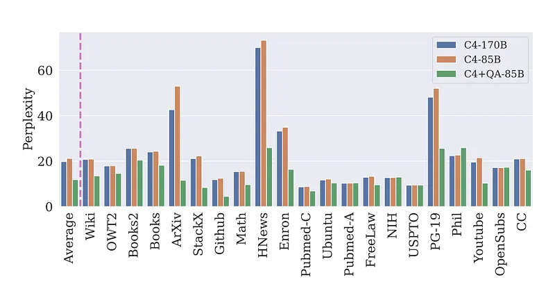 | Domain-wise Pile perplexity comparing C4-only vs WRAP (C4 plus QA synthetic). |
| 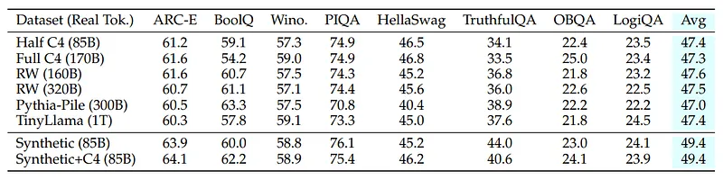 | General understanding zero-shot benchmark results across real and synthetic training mixes. |
| 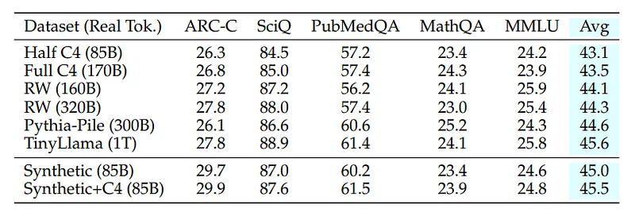 | Specialized knowledge task results for real-data and synthetic-data training recipes. |
| 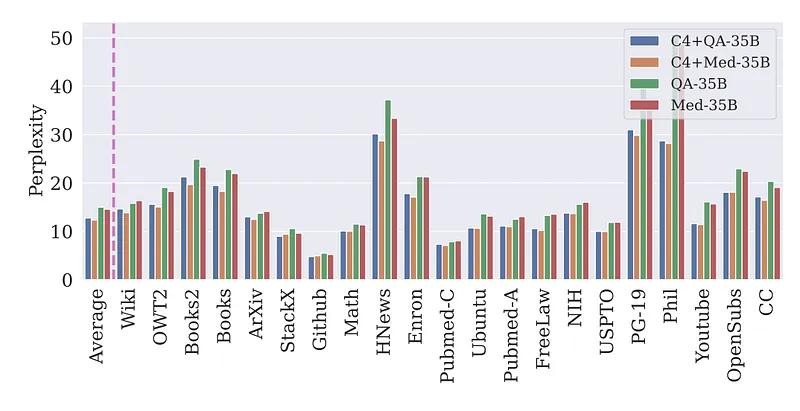 | Pile perplexity comparison of synthetic-only vs mixed synthetic+real recipes. |
| 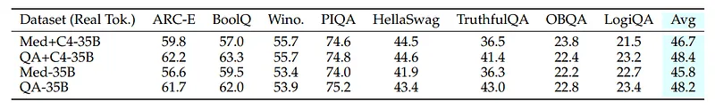 | General understanding task results for medium-style, QA-style, and mixed synthetic datasets. |
| 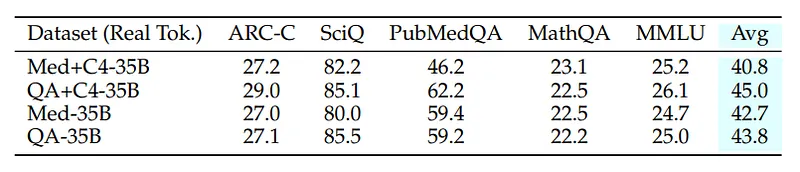 | Specialized knowledge benchmark results for medium-style and QA-style synthetic data mixes. |
| 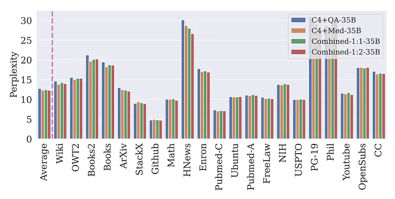 | Pile perplexity when combining multiple synthetic rephrase styles during training. |
| 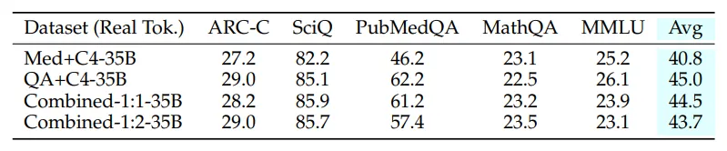 | Specialized knowledge results for combined synthetic-style training variants. |
| 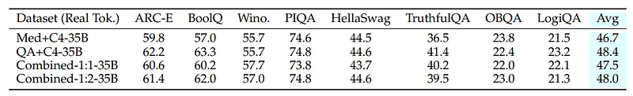 | General understanding results for combined synthetic-style variants vs single-style mixes. |
| 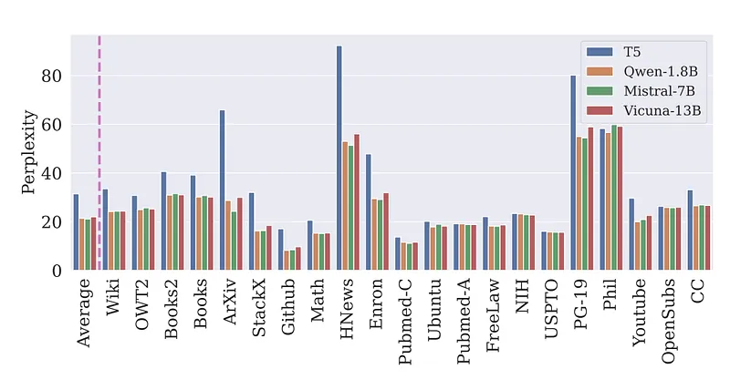 | Impact of rephraser model choice (T5, Qwen, Mistral, Vicuna) on downstream perplexity. |
| 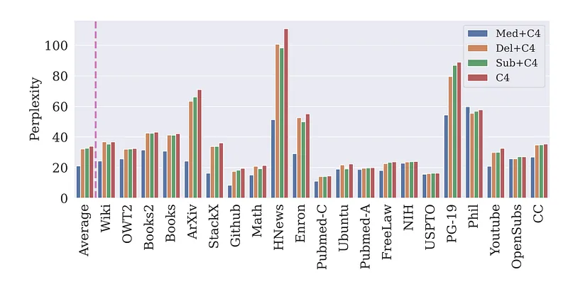 | Perplexity comparison across augmentation strategies (add, delete, substitute) vs baseline C4. |
| 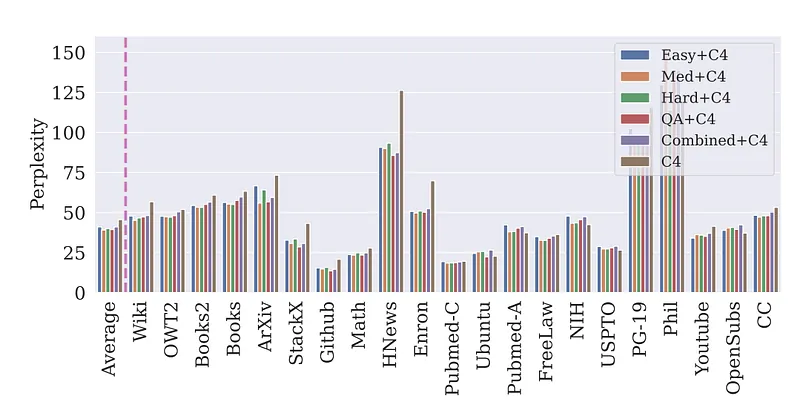 | Perplexity across Pile domains for different synthetic style choices and combined style training. |
| 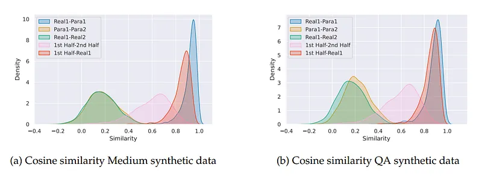 | Cosine-similarity distributions showing semantic preservation between real and synthetic rephrases. |
## Related

- [[Papers Explained Corpus]]
- [[Large Language Models]]
- [[Synthetic Data]]
- [[Evaluation and Benchmarks]]
- [[Papers Explained 117 - MM1]]
- [[Papers Explained 119 - DBRX]]

#summary #topic
