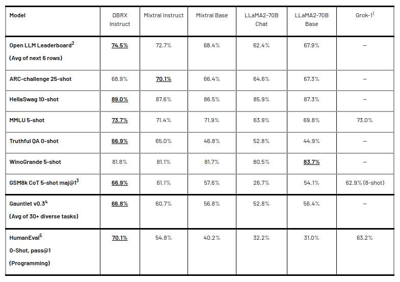
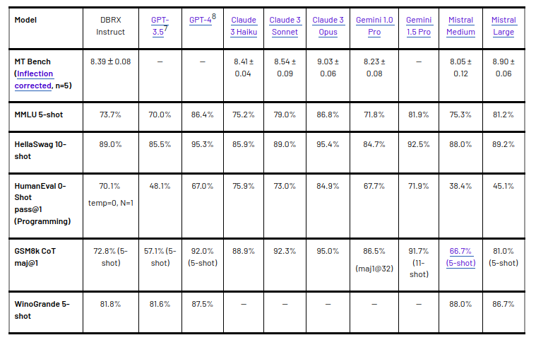
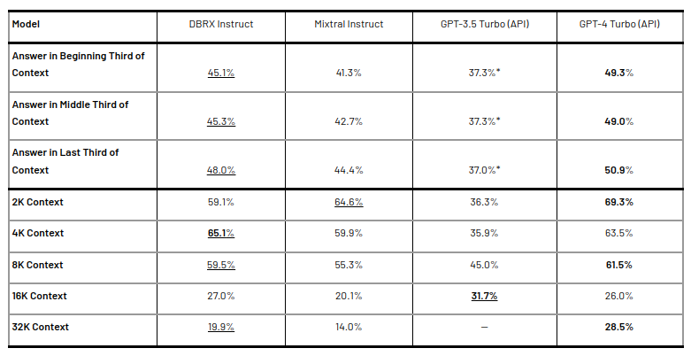
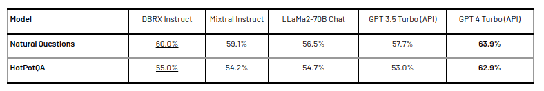

# Papers Explained 119 - DBRX

DBRX is an open, general-purpose Large Language Model (LLM) created by Databricks. It sets a new state-of-the-art surpassing existing models like GPT-3.5 and is competitive with Gemini 1.0 Pro in various benchmarks.

This page ingests the source article into the wiki and connects it to [[Papers Explained Corpus]], [[Large Language Models]], [[Mixture of Experts]], [[Code Models]], [[Reasoning Models]], [[Model Compression and Efficiency]].

## Source Metadata

- Source file: `raw/2024-04-01_Papers-Explained-119--DBRX-17c61739983c.html`
- Source title: Papers Explained 119: DBRX
- Published: 2024-04-01
- Canonical: [https://medium.com/@ritvik19/papers-explained-119-dbrx-17c61739983c](https://medium.com/@ritvik19/papers-explained-119-dbrx-17c61739983c)

## Key Ideas

- DBRX uses a transformer-based decoder-only architecture incorporating a fine-grained mixture-of-experts (MoE) design. Specifically, it has 132B total parameters, of which 36B parameters are active on any given input.
- DBRX architecture is characterized by its use of a larger number of smaller experts, having 16 experts and choosing 4 for any given task, compared to Mixtral and Grok-1, which have 8 experts and choose 2.
- Additionally, DBRX employs rotary position encodings (RoPE), gated linear units (GLU), and grouped query attention (GQA), and uses the GPT-4 tokenizer from the tiktoken repository.
- The MoE architecture allows DBRX to achieve marked improvements in both training and inference performance.
- To evaluate DBRX’s performance across standard benchmarks in language understanding, programming, and mathematics like MMLU, HumanEval, GSM8K, and others.

## Notes

DBRX is an open, general-purpose Large Language Model (LLM) created by Databricks. It sets a new state-of-the-art surpassing existing models like GPT-3.5 and is competitive with Gemini 1.0 Pro in various benchmarks. It was developed with a fine-grained mixture-of-experts (MoE) architecture, leading to marked improvements in training and inference performance.

## Architecture

DBRX uses a transformer-based decoder-only architecture incorporating a fine-grained mixture-of-experts (MoE) design. Specifically, it has 132B total parameters, of which 36B parameters are active on any given input. DBRX was trained on 12T tokens of text and code data.

DBRX architecture is characterized by its use of a larger number of smaller experts, having 16 experts and choosing 4 for any given task, compared to Mixtral and Grok-1, which have 8 experts and choose 2. This approach provides 65x more possible combinations of experts, which is found to improve model quality.

Additionally, DBRX employs rotary position encodings (RoPE), gated linear units (GLU), and grouped query attention (GQA), and uses the GPT-4 tokenizer from the tiktoken repository.

The MoE architecture allows DBRX to achieve marked improvements in both training and inference performance. Specifically, inference is up to 2x faster than LLaMA2–70B, and DBRX is about 40% of the size of Grok-1 in terms of both total and active parameter-counts. Training MoEs is also about 2x more FLOP-efficient than training dense models for the same final model quality.

## Evaluation

### Benchmark Performance

To evaluate DBRX’s performance across standard benchmarks in language understanding, programming, and mathematics like MMLU, HumanEval, GSM8K, and others.

*Figure: Quality of DBRX Instruct and leading open models.*

- DBRX sets new state-of-the-art records on several benchmarks, outperforming both open and closed models in various domains.

- Demonstrates exceptional strength in programming and mathematics, surpassing specialized models like CodeLLaMA-70B.

- Scores higher than all other models considered on the MMLU benchmark.

*Figure: Quality of DBRX Instruct and leading closed models.*

- Across nearly all the considered benchmarks, DBRX Instruct surpasses or — at worst — matches GPT-3.5.

## Long-Context Task Performance

To assess DBRX’s performance on long-context tasks and its ability to handle extended sequence lengths on benchmarks such as KV-Pairs and HotpotQAXL. Comparison with the latest versions of GPT-3.5 Turbo and GPT-4 Turbo APIs.

*Figure: The average performance of models on the KV-Pairs and HotpotQAXL benchmarks.*

- DBRX performs better than GPT-3.5 Turbo across all context lengths and parts of the sequence, with performance generally similar to Mixtral Instruct.

- Shows competitive performance even when compared to GPT-4 Turbo, especially in the beginning and middle thirds of the context.

## Retrieval Augmented Generation (RAG) Performance

To evaluate the effectiveness of DBRX in RAG tasks when provided with content relevant to a prompt from a database, on benchmarks like Natural Questions and HotPotQA, using top 10 passages retrieved from Wikipedia.

*Figure: The performance of the models measured when each model is given the top 10 passages retrieved from a Wikipedia corpus using bge-large-en-v1.5.*

- DBRX shows competitive performance with open models and the current version of GPT-3.5 Turbo on RAG tasks.

- Demonstrates the model’s capability to leverage external information effectively in generating responses.

## Paper

[Introducing DBRX: A New State-of-the-Art Open LLM](https://www.databricks.com/blog/introducing-dbrx-new-state-art-open-llm)

## Figures

Figures from the Medium HTML export (`raw/2024-04-01_Papers-Explained-119--DBRX-17c61739983c.html`); local copies under `wiki/assets/papers-explained-119-dbrx/` when download succeeded.

| Figure | Caption |
|--------|---------|
|  | Header image from the Databricks DBRX launch post. |
|  | DBRX Instruct quality comparison against leading open models. |
|  | DBRX Instruct benchmark comparison with closed-model APIs. |
|  | Long-context performance on KV-Pairs and HotpotQAXL across context positions and lengths. |
|  | RAG benchmark results on Natural Questions and HotPotQA with top-10 retrieved passages. |
## Related

- [[Papers Explained Corpus]]
- [[Large Language Models]]
- [[Mixture of Experts]]
- [[Code Models]]
- [[Reasoning Models]]
- [[Model Compression and Efficiency]]
- [[Papers Explained 118 - WRAP]]
- [[Papers Explained 120 - BloombergGPT]]

#summary #topic
