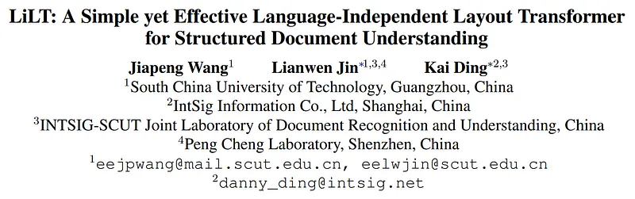
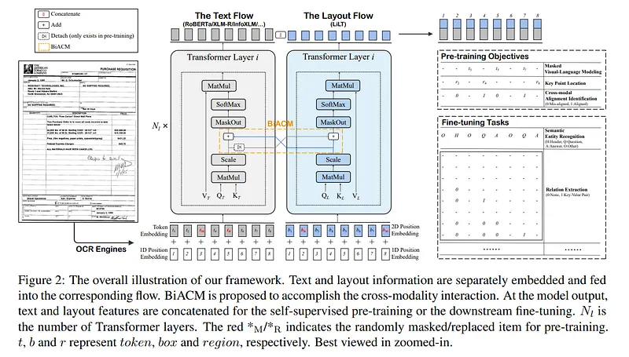

# Papers Explained 12 - LiLT

All the bounding box coordinates are normalised and discretized to integers in the range [0, 1000], and four embedding layers are used to generate x-axis, y-axis, height and width features separately.

This page ingests the source article into the wiki and connects it to [[Papers Explained Corpus]], [[Document AI]], [[Large Language Models]], [[Embedding and Retrieval]], [[Supervised Fine-Tuning]].

## Source Metadata

- Source file: `raw/2023-02-06_Papers-Explained-12--LiLT-701057ec6d9e.md`
- Source title: Papers Explained 12: LiLT
- Published: 2023-02-06
- Canonical: [https://medium.com/@ritvik19/papers-explained-12-lilt-701057ec6d9e](https://medium.com/@ritvik19/papers-explained-12-lilt-701057ec6d9e)

## Key Ideas

- where CAT is the channel wise concatenation operation. The special tokens [CLS], [SEP] and [PAD] are also attached with (0, 0, 0, 0, 0, 0), (1000, 1000, 1000, 1000, 0, 0) and (0, 0, 0, 0, 0, 0) respectively.
- Given attention scores of the text and layout flows located in the same head of the same layer:
- BiACM shares them as common knowledge, which is formulated as:
- In order to maintain the ability of LiLT to cooperate with different off-the-shelf text models in finetuning as much as possible, we heuristically adopt the detached attention scores, so that the textual stream will not be affected by the gradient of...
- Masked Visual-Language Modeling MVLM randomly masks some of the input tokens and the model is asked to recover them over the whole vocabulary using the output encoded features, driven by a cross-entropy loss.

## Notes

The whole framework can be regarded as a parallel dual-stream Transformer. Given an input document image, first an off-the-shelf OCR engine is used to get text bounding boxes and contents. Then, the text and layout information are separately embedded and fed into the corresponding Transformer-based architecture to obtain enhanced features. Bi-directional attention complementation mechanism (BiACM) is introduced to accomplish the cross-modality interaction of text and layout clues. Finally, the encoded text and layout features are concatenated and additional heads are added upon them, for the self-supervised pre-training or the downstream fine-tuning.

Text Embeddings

where LN is the Layer Normalization

Layout Embeddings

All the bounding box coordinates are normalised and discretized to integers in the range [0, 1000], and four embedding layers are used to generate x-axis, y-axis, height and width features separately.

where CAT is the channel wise concatenation operation. The special tokens [CLS], [SEP] and [PAD] are also attached with (0, 0, 0, 0, 0, 0), (1000, 1000, 1000, 1000, 0, 0) and (0, 0, 0, 0, 0, 0) respectively.

BiACM

Given attention scores of the text and layout flows located in the same head of the same layer:

BiACM shares them as common knowledge, which is formulated as:

In order to maintain the ability of LiLT to cooperate with different off-the-shelf text models in finetuning as much as possible, we heuristically adopt the detached attention scores, so that the textual stream will not be affected by the gradient of non-textual one during pre-training, and its overall consistency can be preserved. Finally, the modified attention scores are used to weight the projected value vectors for subsequent modules in both flows.

## Pretraining

- Masked Visual-Language Modeling MVLM randomly masks some of the input tokens and the model is asked to recover them over the whole vocabulary using the output encoded features, driven by a cross-entropy loss. Meanwhile, the non-textual information remains unchanged.

- MVLM improves model learning on the language side with cross-modality information. The given layout embedding can also help the model better capture both inter- and intra-sentence relationships.

- Key Point Location KPL equally divides the entire layout into several regions (7×7=49 regions by default) and randomly masks some of the input bounding boxes. The model is required to predict which regions the key points (top-left corner, bottom-right corner, and center point) of each box belong to using separate heads.

- KPL makes the model to fully understand the text content and know where to put a specific word/sentence when the surrounding ones are given.

- Cross-modal Alignment Identification CMAI collects those encoded features of token-box pairs that are masked by MVLM and KPL, and build an additional head upon them to identify whether each pair is aligned.

- CMAI makes the model to learn the cross-modal perception capacity.

## Paper

LiLT: A Simple yet Effective Language-Independent Layout Transformer for Structured Document Understanding [2202.13669](https://arxiv.org/abs/2202.13669)

## Figures

Figures from the Medium HTML export (`raw/2023-02-06_Papers-Explained-12--LiLT-701057ec6d9e.md`); local copies under `wiki/assets/papers-explained-12-lilt/` when download succeeded.

| Figure | Caption |
|--------|---------|
|  | Title block of *LiLT: A Simple yet Effective Language-Independent Layout Transformer for Structured Document Understanding*. |
|  | LiLT dual-stream framework with text/layout flows, BiACM cross-modality attention complementation, and pretraining/fine-tuning task heads. |
|  | Text-embedding formulation for the textual stream (token, position, and segment composition). |
|  | Layout-embedding construction from normalized box coordinates (x, y, width, height feature embeddings). |
|  | BiACM attention-sharing setup combining text-flow and layout-flow attention scores. |
|  | Detached-attention variant used to preserve compatibility with off-the-shelf text backbones during pretraining. |
|  | Key Point Location (KPL) objective for masked box-region prediction in pretraining. |
|  | Cross-modal Alignment Identification (CMAI) objective for token-box pair alignment classification. |
## Related

- [[Papers Explained Corpus]]
- [[Document AI]]
- [[Large Language Models]]
- [[Embedding and Retrieval]]
- [[Supervised Fine-Tuning]]
- [[Papers Explained 11 - Layout LM v2]]
- [[Papers Explained 13 - Layout LM v3]]

#summary #topic
