# Papers Explained 120 - BloombergGPT

BloombergGPT is a 50 billion parameter language model that supports a wide range of tasks within the financial industry.

This page ingests the source article into the wiki and connects it to [[Papers Explained Corpus]], [[Large Language Models]], [[Synthetic Data]], [[Supervised Fine-Tuning]].

## Source Metadata

- Source file: `raw/2024-04-03_Papers-Explained-120--BloombergGPT-4bedd52ef54b.md`
- Source title: Papers Explained 120: BloombergGPT
- Published: 2024-04-03
- Canonical: [https://medium.com/@ritvik19/papers-explained-120-bloomberggpt-4bedd52ef54b](https://medium.com/@ritvik19/papers-explained-120-bloomberggpt-4bedd52ef54b)

## Key Ideas

- Rather than building a general-purpose LLM, or a small LLM exclusively on domain-specific data, it takes a mixed approach,as at Bloomberg, a very large and diverse set of tasks, are well served by a general model, but the vast majority of the applications are...
- The other possible alternatives for such kind of goals could be:
- further pretraining a pretrained model on domain-specific data
- finetuning a pretrained model on domain-specific data.
- To train BloombergGPT, “FinPile”, a comprehensive dataset consisting of a range of English financial documents including news, filings, press releases, web-scraped financial documents, and social media drawn from the Bloomberg archives is constructed.

## Notes

BloombergGPT is a 50 billion parameter language model that supports a wide range of tasks within the financial industry.

Rather than building a general-purpose LLM, or a small LLM exclusively on domain-specific data, it takes a mixed approach,as at Bloomberg, a very large and diverse set of tasks, are well served by a general model, but the vast majority of the applications are within the financial domain, better served by a specific model.

*Figure: The different ways of pretraining and finetuning LLMs. [Source: [Ten Noteworthy AI Research Papers of 2023](https://magazine.sebastianraschka.com/p/10-ai-research-papers-2023)]*

The other possible alternatives for such kind of goals could be:

- further pretraining a pretrained model on domain-specific data

- finetuning a pretrained model on domain-specific data.

## Dataset

*Figure: Breakdown of the full training set used to train BloombergGPT.*

To train BloombergGPT, “FinPile”, a comprehensive dataset consisting of a range of English financial documents including news, filings, press releases, web-scraped financial documents, and social media drawn from the Bloomberg archives is constructed. These documents have been acquired through their business process over the past two decades. FinPile is augmented with public data widely used to train LLMs. The result is a training corpus that is roughly half domain-specific text and half general-purpose text.

### Tokenization

Unigram tokenizer is and instead of a greedy merge-based sub-word tokenizer, such as Byte Pair Encoding (BPE). Following GPT-2, the data is treated as a sequence of bytes rather than Unicode characters, and each of the 256 bytes is included as tokens.

In a pre tokenization step, the input byte sequence is broken into chunks by greedily matching the following regular expression: [ A-Za-z]+|[0–9]|[^A-Za-z0–9]+. This follows GPT-2 in preventing multiple character classes from appearing in a single token. However, we include spaces in the alphabetic chunks, which allows multi-word tokens to be learned, increasing information density and reducing context lengths.

The pre tokenization follows the approach of PaLM in placing each digit in its own chunk, with the hope that this will lead to better handling of numbers.

*Figure: Number of tokens in each training dataset with BLOOM, NeoX, OPT (GPT2), and BloombergGPT tokenizers. All token counts are in billions (B).*

A vocabulary size of 2¹⁷ tokens is selected based on experiments with vocabulary ranging from 25,000 to 550,000. For each vocabulary size, the C4 dataset is tokenized and the total size is computed (in bytes) for the dataset, where each token is represented using log2(vocabulary size) bits. The heuristic is to choose the vocabulary size that leads to the smallest encoded representation of C4.

## Model Architecture

The model is a decoder-only causal language model based on BLOOM, containing 70 layers of transformer decoder blocks defined as follows:

where SA is multi-head self-attention, LN is layer-norm, and FFN is a feed-forward network with 1-hidden layer. Inside FFN, the non-linear function is GELU. ALiBi positional encoding is applied through additive biases at the selfattention component of the transformer network. The input token embeddings are tied to the linear mapping before the final softmax. The model has an additional layer normalization after token embeddings, formally:

where h0 is the initial token embedding and LNem is the new component of embedding layer-normalization. Notice that the second term includes two consecutive layer-normalizations.

## Evaluation

The performance of BloombergGPT is evaluated on two broad categories of tasks: finance-specific and general purpose.

- The finance-specific tasks help to test the hypothesis that training on high-quality finance-specific data will yield better results on financial tasks.

- The general purpose tasks investigate whether the performance of the model is directly comparable to previously published results

*Figure: Evaluation Benchmarks.*

BloombergGPT is complared to the three closest models based on model size, type of training data, overall performance, and most importantly, access.

- GPT-NeoX: the best performing available model under 50B parameters.

- OPT66B: the model size and structure roughly match, though Bloomberg GPT is smaller.

- BLOOM176B: While this model is substantially larger than BloombergGPT, same model architecture and software stack used are the same. Note that BLOOM176B is multilingual, so while it is much larger, it also is trained on data from more languages.

*Figure: Evaluation model cohort.*

### Financial Tasks

*Figure: Template for the different tasks evaluated in the financial domain.*

- NLP tasks in finance are similar to broader NLP tasks but exhibit unique characteristics when applied to financial data.

- A headline’s sentiment might differ from general sentiment due to financial implications.

- Headlines like “COMPANY to cut 10,000 jobs” might imply negative sentiment generally, but in finance, it could lead to positive financial sentiment for the company due to potential stock price or investor confidence increases.

External Financial Tasks

Evaluated Tasks and Setups:

- FPB: Sentiment classification on financial news, evaluated in a 5-shot setup. Reported F1 score weighted by support.

- FiQA SA: Aspect-specific sentiment analysis on English financial news and microblog headlines. Annotated in a classification setup with negative, neutral, and positive classes. Evaluated in a 5-shot setup, reporting weighted F1.

- Headline: Binary classification task on whether a news headline in the gold commodity domain includes certain information. Utilized verbalized tags from the official documentation. 5-shot evaluation, reporting average weighted F1 score across all categories.

- NER: Named entity recognition task on financial data from SEC filings. Annotated entity types include PER, LOC, ORG, and MISC. Evaluated with 20 shots and reported entity-level F1 score after dropping sentences without entities and MISC tags.

- ConvFinQA: Task involving S&P 500 earnings reports, requiring numerical reasoning over text and tables. Evaluated based on exact match accuracy on the public development set. The context of the conversation is used as input, with appended context for future turns after each conversation turn concludes.

Model Performance:

- BloombergGPT achieved the best performance among tested models in four out of five tasks (ConvFinQA, FiQA SA, FPB, and Headline). Ranked second in NER.

- BloombergGPT also has the highest win rate among all tested models.

- ConvFinQA is particularly challenging due to the necessity of conversational input for reasoning over tables and generating answers. BloombergGPT showed a notable performance gap compared to equally-sized models in this task.

Internal Task: Sentiment Analysis

*Figure: An overview of the Bloomberg-internal sentiment analysis tasks.*

- Equity News Sentiment, Equity Social Media Sentiment, and Equity Transcript Sentiment involve predicting sentiment towards companies in news, social media, and transcripts.

- ES News Sentiment focuses on sentiments about environmental and social policies.

- Country News Sentiment predicts sentiments towards a country’s economy.

*Figure: Results on internal aspect-specific sentiment analysis datasets.*

- BloombergGPT significantly outperforms other models in internal aspect-specific sentiment tasks, except for social media sentiment.

- Outperforms by at least 25 to over 60 points in three tasks: Equity News, Equity Social Media, and Equity Transcript Sentiment.

Exploratory Task: NER and NER+NED

NER, a well-established NLP task, is largely unexplored for generative Language Model (LLMs). Generative LLMs face challenges in NER, requiring extensive prompt engineering and more shots for reasonable results. Named Entity Disambiguation (NED) links entity mentions to known entities in financial knowledge bases.

Internal NER Datasets:

- Seven internal NER datasets cover various domains in the financial sector.

- Examples include BN NER, BFW NER, Filings NER, Headlines NER, Premium NER, Transcripts NER, and Social Media NER.

- 4,000 training and 500 testing examples are randomly sampled from each filtered internal dataset.

- Evaluation involves 20-shot prompts, and the results are mixed across tasks.

*Figure: Results on internal NER and NED datasets.*

- The much larger BLOOM176B wins most of the NER tasks. Of the like-sized models, BloombergGPT performs the best placing first once (Headlines), second four times (BN, Premium, Transcripts, Social media), third once (BFW), and last once (Filings).

- In NER + NED, BloombergGPT outperforms all other models by a large margin, except on social media data where it comes in second behind BLOOM176B.

- In the social media data, companies are often referenced by their tickers, removing the requirement of the model to link the mention and reverting the task to NER.

### BIG-bench Hard

*Figure: BIG-bench hard results using standard 3-shot prompting.*

- BloombergGPT, though behind larger models like PaLM540B and BLOOM176B in parameters, outperformed similarly sized models like GPT-NeoX and OPT66B.

- Specifically excelled in date understanding, hyperbaton (ordering of adjectives), and tracking shuffled objects.

- The evaluation suggests that focusing on finance-specific tasks with BloombergGPT didn’t compromise its general-purpose capabilities.

### Knowledge Assessments

*Figure: Knowledge tasks 1-shot results.*

- BloombergGPT outperforms models of similar size and is almost on par with much larger models.

*Figure: Results (5-shot) on the MMLU benchmark.*

- In MMLU (57 subjects), BloombergGPT consistently outperforms OPT66B, which outperforms GPT-NeoX, while GPT-3 performs the best.

### Reading Comprehension

*Figure: Reading Comprehension Results (1-shot).*

- GPT-3 performs the best overall, with BloombergGPT ranking closely behind.

- Among BLOOM176B, GPT-NeoX, and OPT66B, BloombergGPT performs best in most tasks except OpenBookQA.

- Surprisingly, BLOOM176B significantly lags in performance in comparison to the others.

### Linguistic Tasks

*Figure: Results on the Linguistic Scenarios (1-shot).*

- BloombergGPT falls slightly behind GPT-3 and outperforms the other models.

- Similar to the reading comprehension category, BLOOM176B falls behind BloombergGPT.

## Paper

BloombergGPT: A Large Language Model for Finance [2303.17564](https://arxiv.org/abs/2303.17564)

## Figures

Figures from the Medium HTML export (`raw/2024-04-03_Papers-Explained-120--BloombergGPT-4bedd52ef54b.md`); local copies under `wiki/assets/papers-explained-120-bloomberggpt/` when download succeeded.

| Figure | Caption |
|--------|---------|
| 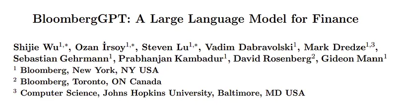 | Title page of *BloombergGPT: A Large Language Model for Finance*. |
| 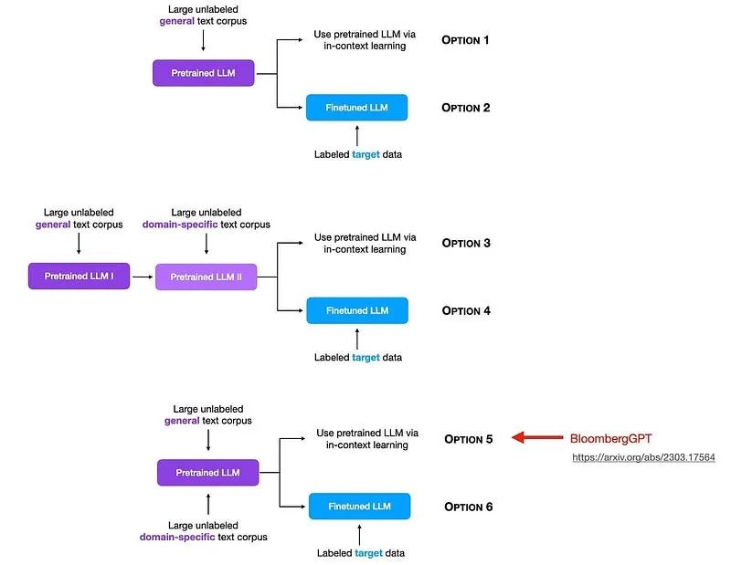 | Overview of pretraining/finetuning strategies, highlighting BloombergGPT’s mixed-domain approach. |
| 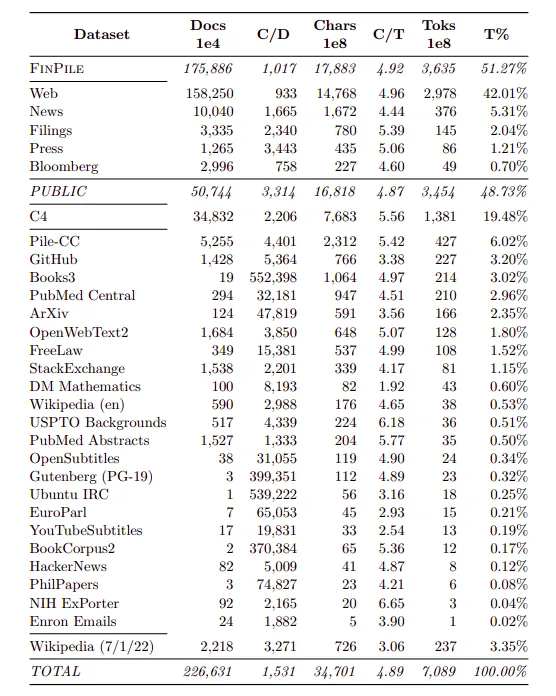 | FinPile and public-data training corpus breakdown by documents, characters, and tokens. |
| 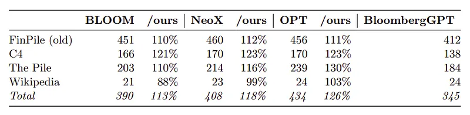 | Tokenization efficiency comparison across BLOOM, NeoX, OPT/GPT2, and BloombergGPT tokenizers. |
| 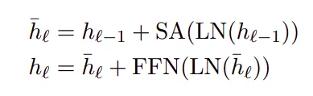 | Decoder block equations for BloombergGPT’s transformer architecture. |
| 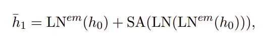 | Embedding-layer normalization formulation used before self-attention. |
| 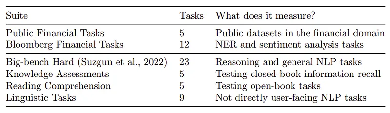 | Evaluation benchmark suite summary across financial and general NLP tasks. |
| 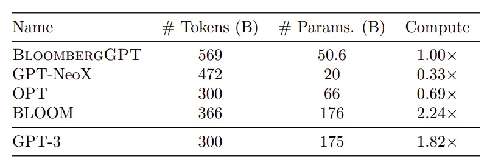 | Evaluation cohort comparison by training tokens, parameter count, and compute. |
| 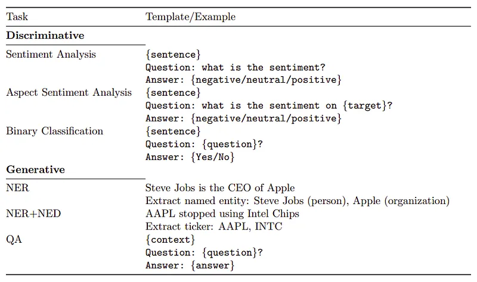 | Prompt templates for discriminative and generative financial tasks (sentiment, NER, NED, QA). |
| 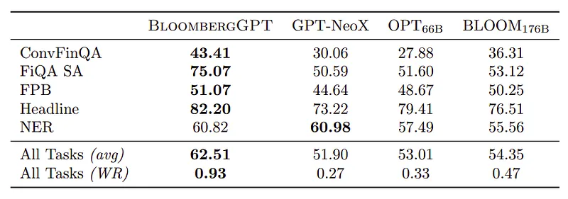 | External financial-task results comparing BloombergGPT with GPT-NeoX, OPT-66B, and BLOOM-176B. |
| 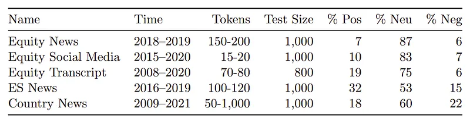 | Bloomberg internal sentiment dataset overview across five domains. |
| 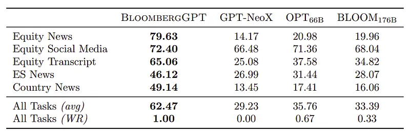 | Results on internal aspect-specific sentiment analysis tasks. |
| 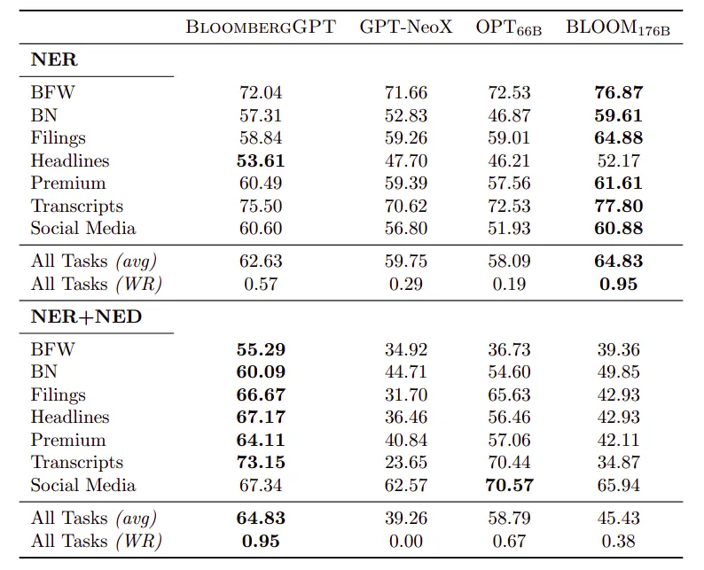 | Internal NER and NER+NED benchmark comparison across financial domains. |
| 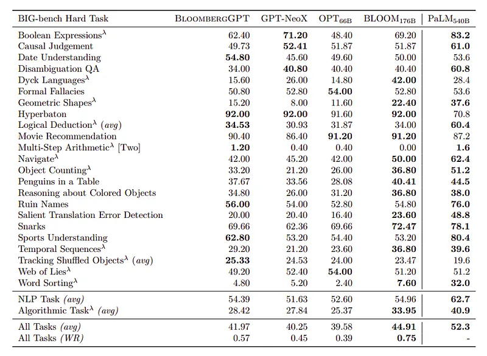 | BIG-bench Hard 3-shot results across reasoning and algorithmic tasks. |
| 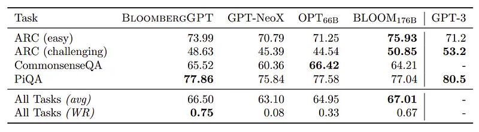 | Knowledge-task 1-shot results (ARC, CommonsenseQA, PIQA) across model cohort. |
| 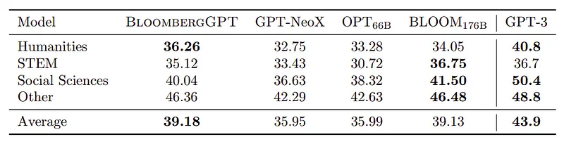 | MMLU 5-shot results by subject group (humanities, STEM, social sciences, other). |
| 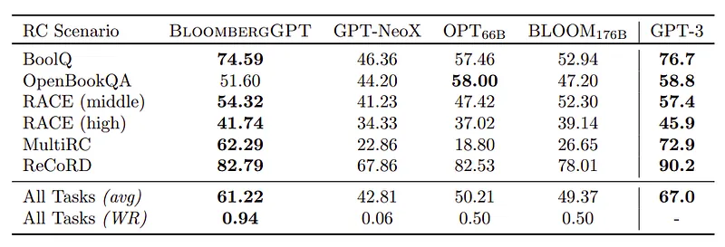 | Reading-comprehension benchmark comparison across RC scenarios. |
| 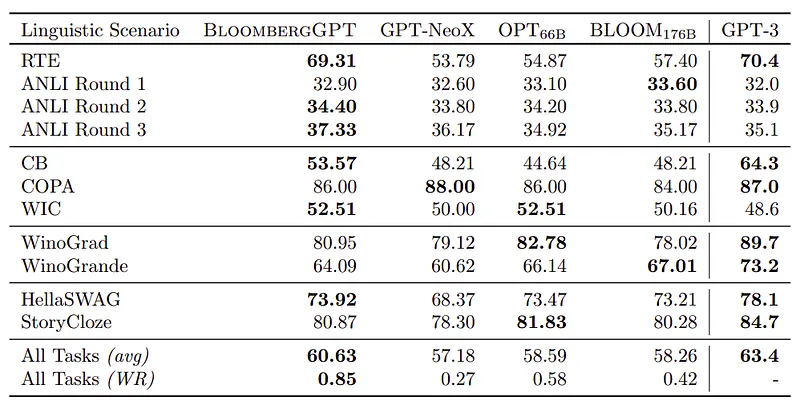 | Linguistic-scenario benchmark results (RTE, ANLI, COPA, WIC, Winograd, HellaSwag, StoryCloze). |
## Related

- [[Papers Explained Corpus]]
- [[Large Language Models]]
- [[Synthetic Data]]
- [[Supervised Fine-Tuning]]
- [[Papers Explained 119 - DBRX]]
- [[Papers Explained 121 - Pythia]]

#summary #topic
