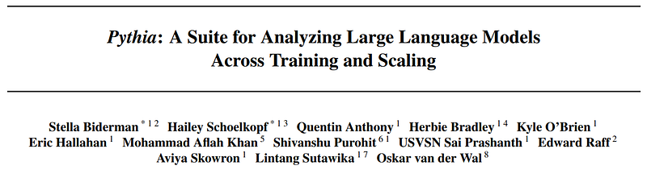
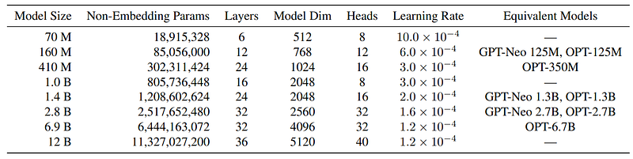
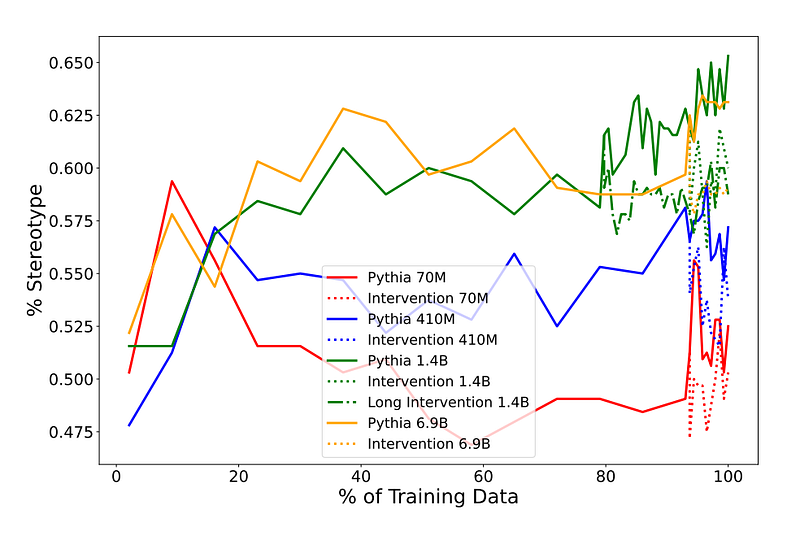
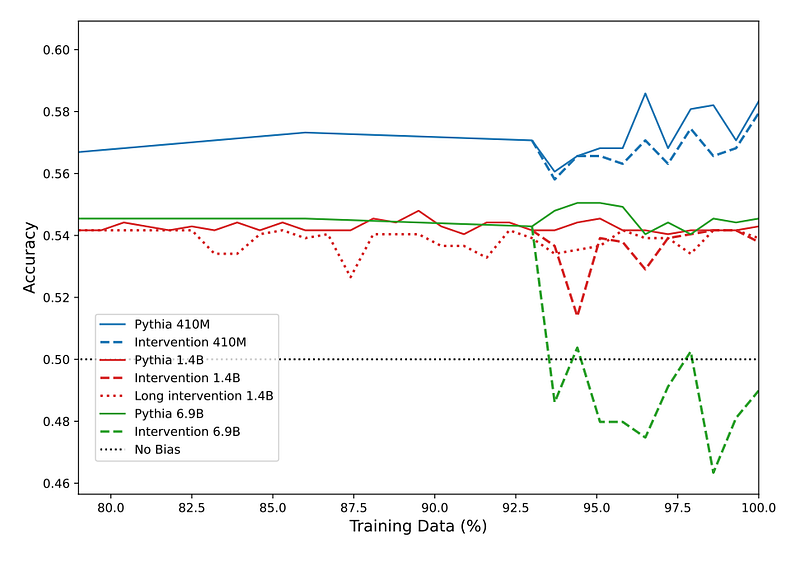
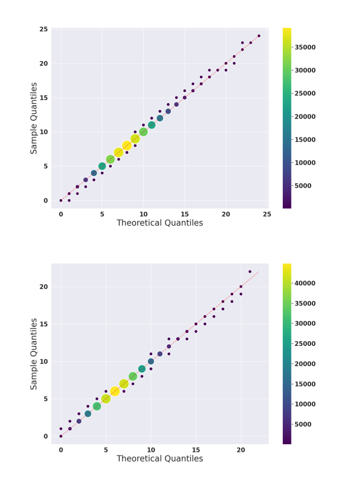
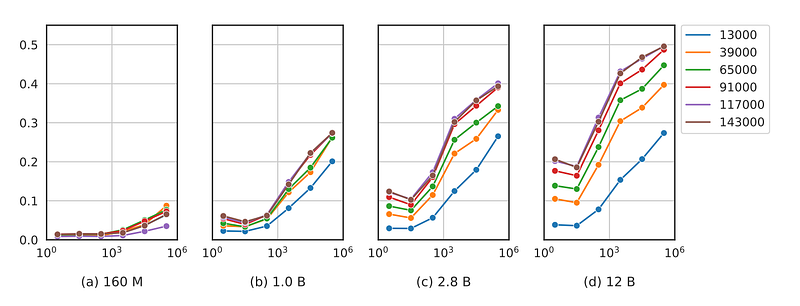

# Papers Explained 121 - Pythia

Pythia is a suite of 16 LLMs all trained on public data seen in the exact same order and ranging in size from 70M to 12B parameters, with public access provided to 154 checkpoints for each one of the 16 models.

This page ingests the source article into the wiki and connects it to [[Papers Explained Corpus]], [[Large Language Models]], [[Embedding and Retrieval]], [[Synthetic Data]].

## Source Metadata

- Source file: `raw/2024-04-05_Papers-Explained-121--Pythia-708284c32964.html`
- Source title: Papers Explained 121: Pythia
- Published: 2024-04-05
- Canonical: [https://medium.com/@ritvik19/papers-explained-121-pythia-708284c32964](https://medium.com/@ritvik19/papers-explained-121-pythia-708284c32964)

## Key Ideas

- All the models are trained on the Pile. This dataset has three major benefits over its competitors: first, it is freely and publicly available;
- The BPE tokenizer developed for GPT Neo is utilized as it is trained specifically on the Pile.
- The model architecture and hyperparameters largely follow GPT Neo with a few notable deviations.
- Instead of using sparse and dense attention layers in alternation, only fully dense layers are used.
- Flash Attention is used during training for improved device throughput.

## Notes

Pythia is a suite of 16 LLMs all trained on public data seen in the exact same order and ranging in size from 70M to 12B parameters, with public access provided to 154 checkpoints for each one of the 16 models.

## Training Data

All the models are trained on the Pile. This dataset has three major benefits over its competitors: first, it is freely and publicly available; second, it reports a higher downstream performance than popular crawl-based datasets C4 and OSCAR and third, it has been widely used by state-of-the-art models.

The BPE tokenizer developed for GPT Neo is utilized as it is trained specifically on the Pile.

## Architecture

*Figure: Models in the Pythia suite and select hyperparameters.*

The model architecture and hyperparameters largely follow GPT Neo with a few notable deviations.

- Instead of using sparse and dense attention layers in alternation, only fully dense layers are used.

- Flash Attention is used during training for improved device throughput.

- Rotary Embeddings are used as positional embedding.

- The parallelized attention and feedforward technique and model initialization methods introduced by GPT-J are used.

- Untied embedding / unembedding matrices are used.

## Training

Model checkpoints are saved at initialization and every 2,097,152,000 tokens (or 1,000 iterations), resulting in 144 checkpoints evenly spaced throughout training. Additionally, log-spaced checkpoints are saved early in training at iterations {1, 2, 4, 8, 16, 32, 64, 128, 256, 512}. This results in a total of 154 checkpoints per model.

All models are trained for 299,892,736,000 ≈ 300B tokens, with tokens matched to the original GPT-3 and OPT model suites.

The deduplicated Pile only contains 207B tokens, so we run for ≈1.5 epochs on it. This allows users of the Pythia suite to study deduplication in greater detail by comparing models shortly before the epoch boundary to those slightly after the epoch boundary.

The models trained on the original Pile are referred to as “Pythia-xxx,” where ‘xxx’ represents the model’s total parameter count rounded to 2 significant figures, and their counterparts trained on the deduplicated Pile are referred to as “Pythia-xxx-deduped.”

## Case Studies

### How Does Data Bias Influence Learned Behaviors?

*Figure: The CrowS-Pairs gender bias.*

*Figure: The WinoBias gender bias results.*

- The study investigates the impact of changing corpus statistics during pretraining on language model biases.

- This is done by replacing morphologically masculine pronouns with feminine counterparts in the training data and measuring the model’s performance on bias-related benchmarks.

- The controlled setup provided by Pythia allows for isolating the effect of pronoun frequency in pretraining.

- Results show a decrease in stereotypical accuracy and gender bias as a result of the intervention, especially in larger model sizes.

### Does Training Order Influence Memorization?

*Figure: Quantile-Quantile plot of rate of occurrence of memorized sequences in 12B model compared to a Poisson Point Process, with (top) and without (bottom) deduplication. Color and dot size indicates number of points.*

- The experiment is theoretically driven, based on the idea that transformers work iteratively by adding new information to a latent space, predicting that data encountered later will be memorized more.

- The experiment measures memorization using a definition, where a string is (k, ℓ)-memorized if the model can generate the next ℓ tokens correctly when prompted with a string of length k from the training data.

- A Poisson model fits the data well, suggesting that training order has little impact on memorization, and memorized sequences are not concentrated at the beginning or end of training.

- The Poisson process represents the occurrence of memorized sequences within training data batches.

- Q-Q plots are used as a goodness of fit test to confirm that the rate of memorized sequences in training data is uniform.

- The finding are that controlling which sequences are memorized cannot be achieved by simply placing undesirable sequences at the beginning or end of training. However, placing such sequences at the beginning may help to detect undesirable memorization behavior early in training.

### Do Pretraining Term Frequencies Influence Task Performance Throughout Training?

*Figure: Accuracy on Trivia QA plotted againts the number of relevant entity counts found in a QA-pair. (With train step counts denoted by color on the right) Each point represents the average accuracy (y-axis) of binned counts (x-axis).*

- The study investigates the impact of language model corpora statistics on downstream tasks. across model checkpoints and sizes using arithmetic and QA tasks.

- Arithmetic tasks involve operands x1 and x2, with accuracy linked to the frequency of x1 in the pretraining data.

- QA tasks are based on TriviaQA, and term frequencies are calculated for question-answer pairs.

- Model size affects the correlation between performance and term frequencies, particularly in larger models.

- Smaller models struggle with these tasks, even in later training stages.

- The performance gap between the most frequent and least frequent input operands widens over training.

## Paper

Pythia: A Suite for Analyzing Large Language Models Across Training and Scaling [2304.01373](https://arxiv.org/abs/2304.01373)

## Figures

Figures from the Medium HTML export (`raw/2024-04-05_Papers-Explained-121--Pythia-708284c32964.html`); local copies under `wiki/assets/papers-explained-121-pythia/` when download succeeded.

| Figure | Caption |
|--------|---------|
|  | Title page of *Pythia: A Suite for Analyzing Large Language Models Across Training and Scaling*. |
|  | Pythia model suite sizes and key hyperparameters with GPT-Neo/OPT equivalents. |
|  | CrowS-Pairs gender-bias trajectory over training with pronoun-intervention variants. |
|  | WinoBias accuracy near late training stages for baseline and intervention runs. |
|  | Q-Q plots of memorized-sequence occurrence rates with and without deduplication. |
|  | TriviaQA accuracy vs entity-frequency bins across training checkpoints and model scales. |
## Related

- [[Papers Explained Corpus]]
- [[Large Language Models]]
- [[Embedding and Retrieval]]
- [[Synthetic Data]]
- [[Papers Explained 120 - BloombergGPT]]
- [[Papers Explained 122 - Sparse Transformer]]

#summary #topic
