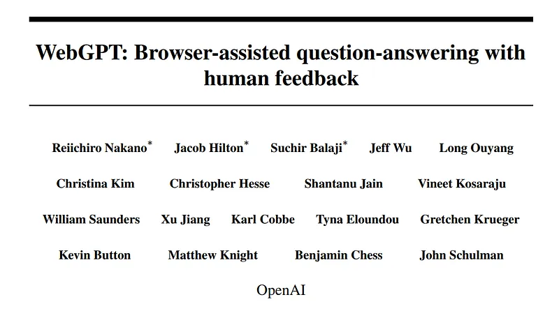
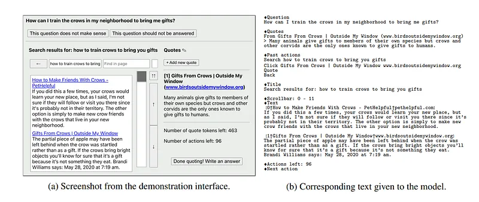
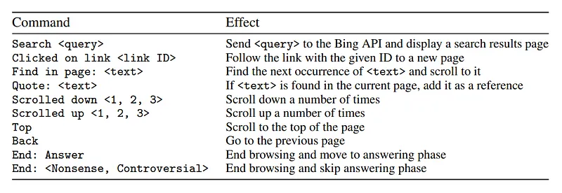
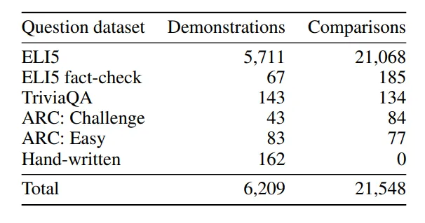
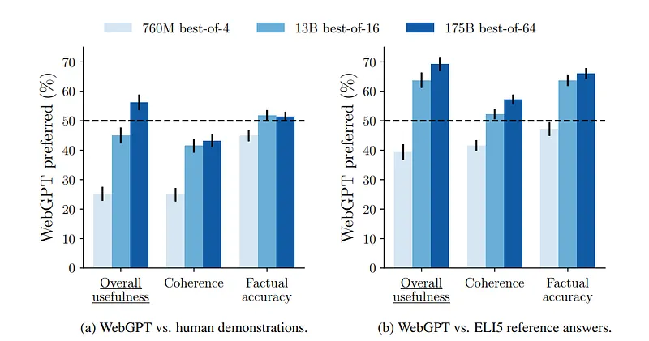
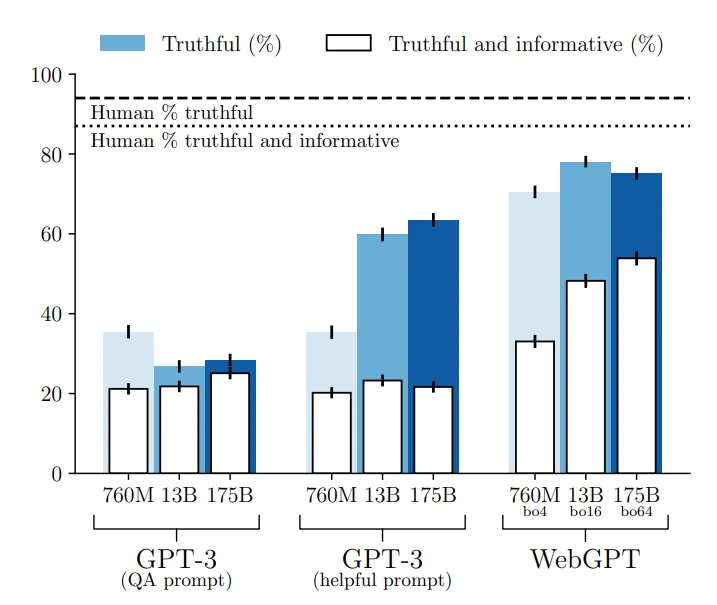

# Papers Explained 123 - WebGPT

WebGPT is GPT-3 fine-tuned to answer long-form questions using a text-based web browsing environment (allowing the model to search and navigate the web) using imitation learning and then the answer quality is optimized with human feedback.

This page ingests the source article into the wiki and connects it to [[Papers Explained Corpus]], [[Agentic AI]], [[Reinforcement Learning Topic]], [[Large Language Models]], [[Reinforcement Learning]], [[KL Regularization]], [[Supervised Fine-Tuning]].

## Source Metadata

- Source file: `raw/2024-04-11_Papers-Explained-123--WebGPT-5bb0dd646b32.md`
- Source title: Papers Explained 123: WebGPT
- Published: 2024-04-11
- Canonical: [https://medium.com/@ritvik19/papers-explained-123-webgpt-5bb0dd646b32](https://medium.com/@ritvik19/papers-explained-123-webgpt-5bb0dd646b32)

## Key Ideas

- A text-based web-browsing environment is designed. The model is prompted with a written summary of the current state of the environment, including the question, the text of the current page at the current cursor location, and some other information.
- In response to this, the model must issue one of the commands given, which performs an action such as running a Bing search, clicking on a link, or scrolling around.
- This process is then repeated with a fresh context. After the browsing has ended as long as there is at least one reference, the model is prompted with the question and the references, and must compose its final answer.
- In total around 6K demonstrations (examples of humans using the browser to answer questions) and 21.5K comparisons (pairs of model-generated answers to the same question) are collected.
- The 760M, 13B and 175B models of the GPT3 model family are fine tuned. Four main training methods are used.

## Notes

WebGPT is GPT-3 fine-tuned to answer long-form questions using a text-based web browsing environment (allowing the model to search and navigate the web) using imitation learning and then the answer quality is optimized with human feedback.

## Environment Design

A text-based web-browsing environment is designed. The model is prompted with a written summary of the current state of the environment, including the question, the text of the current page at the current cursor location, and some other information.

In response to this, the model must issue one of the commands given, which performs an action such as running a Bing search, clicking on a link, or scrolling around.

*Figure: : Actions the model can take. If a model generates any other text, it is considered to be an invalid action. Invalid actions still count towards the maximum, but are otherwise ignored.*

This process is then repeated with a fresh context. After the browsing has ended as long as there is at least one reference, the model is prompted with the question and the references, and must compose its final answer.

## Data Collection

In total around 6K demonstrations (examples of humans using the browser to answer questions) and 21.5K comparisons (pairs of model-generated answers to the same question) are collected. The vast majority of questions were taken from ELI5, mixed with a small number of questions from other sources, such as TriviaQA .

*Figure: Breakdown of the demonstrations and comparisons by question dataset.*

## Training

The 760M, 13B and 175B models of the GPT3 model family are fine tuned. Four main training methods are used.

- Behavior cloning (BC). Fine-tuning is done on the demonstrations using supervised learning, with the commands issued by the human demonstrators as labels.

- Reward modeling (RM). Starting from the BC model with the final unembedding layer removed, a model is trained to take in a question and an answer with references, and output a scalar reward. The reward represents an Elo score, scaled such that the difference between two scores represents the logit of the probability that one will be preferred to the other by the human labelers. The reward model is trained using a cross-entropy loss, with the comparisons as labels. Ties are treated as soft 50% labels.

- Reinforcement learning (RL). The BC model is fine tuned on the environment using PPO. For the environment reward,the reward model score at the end of each episode is taken , and added to a KL penalty from the BC model at each token to mitigate over optimization of the reward model.

- Rejection sampling (best-of-n). A fixed number of answers (4, 16 or 64) are sampled from either the BC model or the RL model, and the one ranked highest by the reward model is related . This is used as an alternative method of optimizing against the reward model, which requires no additional training, but instead uses more inference-time computation.

Mutually disjoint sets of questions are used for each of BC, RM and RL.

## Evaluation

### ELI5

WebGPT-generated answers are compared against both human-demonstrated responses and reference answers from the ELI5 dataset.

*Figure: Human evaluations on ELI5.*

- The best WebGPT model outperformed human-demonstrated answers 56% of the time and surpassed ELI5 reference answers 69% of the time.

- Uusing human feedback was crucial for achieving a preference rate higher than 50%.

- Substantial improvement over prior work is achieved, whose best model achieved only a 23% preference rate against reference answers despite using less compute power.

### TruthfulQA

TruthfulQA Dataset is designed to reveal false beliefs/misconceptions in answers.

*Figure: TruthfulQA results.*

- WebGPT models outperformed all GPT-3 models (using both prompts).

- WebGPT excels in providing both truthful and informative answers.

- Larger WebGPT models exhibit increased percentages of truthful and informative answers, unlike GPT-3 models with either prompt.

## Paper

WebGPT: Browser-assisted question-answering with human feedback [2112.09332](https://arxiv.org/abs/2112.09332)

## Figures

Figures from the Medium HTML export (`raw/2024-04-11_Papers-Explained-123--WebGPT-5bb0dd646b32.md`); local copies under `wiki/assets/papers-explained-123-webgpt/` when download succeeded.

| Figure | Caption |
|--------|---------|
|  | Title page of *WebGPT: Browser-assisted question-answering with human feedback*. |
|  | Demonstration UI and corresponding serialized browser-state text fed to the model. |
|  | Allowed browser action commands and their effects in the WebGPT environment. |
|  | Dataset breakdown of demonstrations and pairwise comparisons by question source. |
|  | Human preference results on ELI5 vs demonstrations and reference answers. |
|  | TruthfulQA truthful and informative rates for GPT-3 prompts vs WebGPT models. |
## Related

- [[Papers Explained Corpus]]
- [[Agentic AI]]
- [[Reinforcement Learning Topic]]
- [[Large Language Models]]
- [[Reinforcement Learning]]
- [[KL Regularization]]
- [[Supervised Fine-Tuning]]
- [[Papers Explained 122 - Sparse Transformer]]
- [[Papers Explained 124 - CodeGemma]]

#summary #topic
