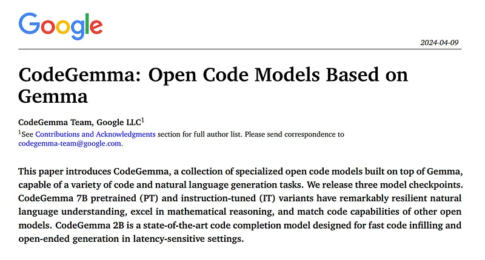
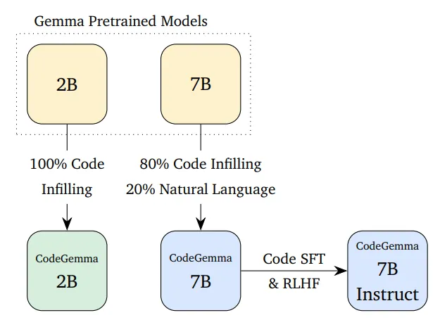
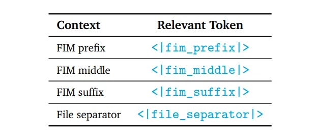
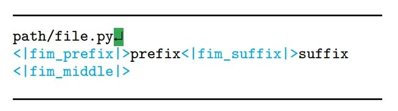
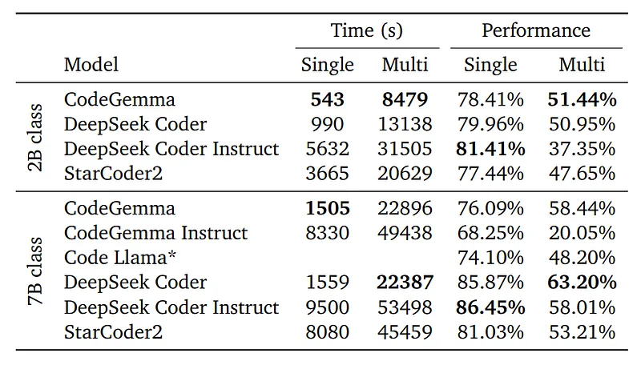
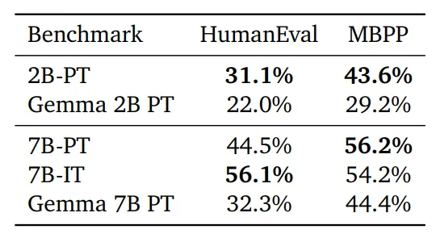
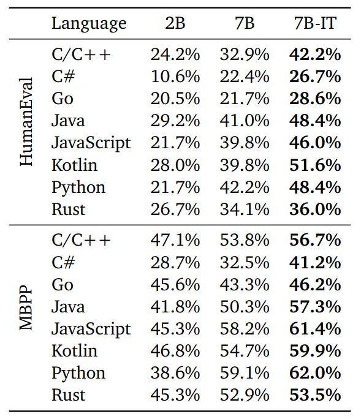
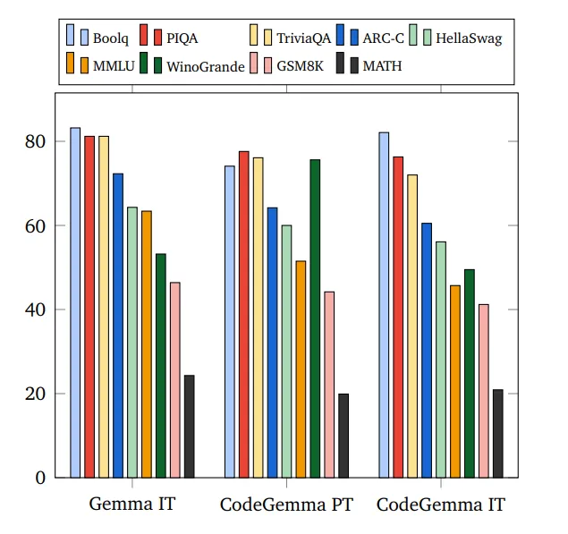
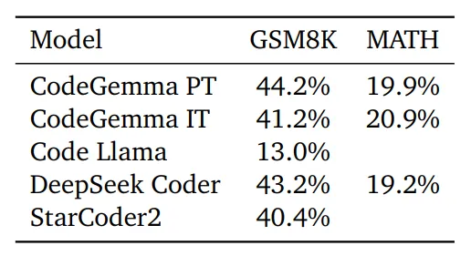

# Papers Explained 124 - CodeGemma

CodeGemma is a collection of open code models built on top of Gemma by further training on more than 500 billion tokens of code, capable of a variety of code and natural language generation tasks.

This page ingests the source article into the wiki and connects it to [[Papers Explained Corpus]], [[Code Models]], [[Large Language Models]], [[Evaluation and Benchmarks]].

## Source Metadata

- Source file: `raw/2024-04-15_Papers-Explained-124--CodeGemma-85faa98af20d.md`
- Source title: Papers Explained 124: CodeGemma
- Published: 2024-04-15
- Canonical: [https://medium.com/@ritvik19/papers-explained-124-codegemma-85faa98af20d](https://medium.com/@ritvik19/papers-explained-124-codegemma-85faa98af20d)

## Key Ideas

- A 7B code pretrained model and a 7B instruction-tuned code model are released. Further, a specialized 2B model, trained specifically for code infilling and open-ended generation is also released.
- Recommended Reading [Papers Explained 106: Gemma](https://ritvik19.medium.com/papers-explained-106-gemma-ca2b449321ac)
- The 2B models are trained with 100% code while the 7B models are trained with a 80% code, 20% natural language mixture.
- The code corpus comes from publicly available code repositories. Datasets are deduplicated and filtered to remove contamination of evaluation code and certain personal and sensitive data.
- The pre-trained CodeGemma models are trained using a method based on the fill-in-the-middle (FIM) task. The models are trained to work with both PSM (Prefix-Suffix-Middle) and SPM (Suffix-Prefix-Middle) modes.

## Notes

CodeGemma is a collection of open code models built on top of Gemma by further training on more than 500 billion tokens of code, capable of a variety of code and natural language generation tasks.

A 7B code pretrained model and a 7B instruction-tuned code model are released. Further, a specialized 2B model, trained specifically for code infilling and open-ended generation is also released.

*Figure: Both pretrained models are derived from corresponding Gemma pretrained models.*

Recommended Reading [Papers Explained 106: Gemma](https://ritvik19.medium.com/papers-explained-106-gemma-ca2b449321ac)

## Pretraining

### Training Data

The 2B models are trained with 100% code while the 7B models are trained with a 80% code, 20% natural language mixture.

The code corpus comes from publicly available code repositories. Datasets are deduplicated and filtered to remove contamination of evaluation code and certain personal and sensitive data.

### Preprocessing for Fill-in-the-Middle

The pre-trained CodeGemma models are trained using a method based on the fill-in-the-middle (FIM) task. The models are trained to work with both PSM (Prefix-Suffix-Middle) and SPM (Suffix-Prefix-Middle) modes.

*Figure: Formatting control tokens used for FIM task.*

### Multi-file Packing

As downstream code-related tasks may involve generating code based on a repository-level context as opposed to a single file, training examples are created by co-locating the most relevant source files within code repositories and best-effort grouping them into the same training examples.

The dependency graph is constructed by grouping files by repository. For each source file, imports are extracted from the top N lines and suffix matching is performed to determine the longest matching paths within the repository structure. Edge importance (a heuristic measure) between files is determined, and unimportant edges are removed to break cyclic dependencies (common in Python). All-pairs shortest paths within the graph are then calculated, where shorter distances signify stronger file relationships. Finally, the graph of files is linearized using a topological sort, with the next unparented node selected based on minimum distance to sorted nodes and ties broken using lexicographic order.

Files not covered by this dependency graph method are sorted alphabetically within their repository with unit tests packed next to their implementations.

## Instruction Tuning

### Mathematics Datasets

To enhance the mathematical reasoning capabilities of coding models, supervised finetuning is performed on a diverse set of mathematics datasets, including MATH, GSM8k, MathQA and a programmatically-generated dataset of algebraic problems.

The training experiments indicate that these datasets significantly boost code generation performance.

### Coding Dataset

Synthetic code instruction data generation is used to create datasets for the supervised fine tuning (SFT) and reinforcement learning from human feedback (RLHF) phase.

A set of self-contained question-answer pairs is generated and then filtered using an LLM tasked with evaluating the helpfulness and correctness of the generated question-answer pairs.

## Evaluation

*Figure: Prompt in PSM mode.*

### Infilling Capability

To assess the code completion capabilities of CodeGemma models using single-line and multi-line settings and Validate the infilling abilities of CodeGemma in real-world scenarios with code dependencies.

*Figure: Single-line and multi-line code completion capability of CodeGemma compared to other FIM-aware code models.*

- CodeGemma’s 2B pretrained model performs comparably to other models but with nearly twice the speed during inference.

- Attributes performance enhancement to the architectural decisions of the base Gemma model.

### Python Coding Capability

Evaluation of the performance of CodeGemma on canonical coding benchmarks.

- CodeGemma models significantly outperform base Gemma models on coding tasks.

### Multi-lingual Coding Benchmarks

Assessed the code generation performance of CodeGemma across various programming languages.

*Figure: Multi-lingual coding capability of CodeGemma (CG) on BabelCode-translated HumanEval and Mostly Basic Python Problems (MBPP) datasets.*

- CodeGemma shows strong performance across multiple languages, particularly in instruction-tuned versions.

### Language Capability

Assessed the natural language understanding and mathematical reasoning capabilities of CodeGemma.

*Figure: Language capability comparison of CodeGemma and the instruction-tuned version of Gemma (7B).*

- CodeGemma shows strong performance across multiple languages, particularly in instruction-tuned versions.

*Figure: Math reasoning capability of other code models in the same 7B size class.*

- CodeGemma excels at mathematical reasoning compared to similarly sized models.

## Paper

[CodeGemma: Open Code Models Based on Gemma](https://storage.googleapis.com/deepmind-media/gemma/codegemma_report.pdf)

Recommended Reading [Gemini / Gemma Models](https://ritvik19.medium.com/list/gemini-gemma-models-4cb7dfc50d42) [LLMs for Code](https://ritvik19.medium.com/list/llms-for-code-e5360a1b353a) [Small LLMs](https://ritvik19.medium.com/list/small-llms-41124d5c7c80)

## Figures

Figures from the Medium HTML export (`raw/2024-04-15_Papers-Explained-124--CodeGemma-85faa98af20d.md`); local copies under `wiki/assets/papers-explained-124-codegemma/` when download succeeded.

| Figure | Caption |
|--------|---------|
|  | Title page of *CodeGemma: Open Code Models Based on Gemma*. |
|  | CodeGemma training lineage from Gemma base models to 2B/7B and 7B-Instruction checkpoints. |
|  | FIM control-token mapping for prefix, middle, suffix, and file separator spans. |
|  | Example code sequence formatted in prefix-suffix-middle infilling mode. |
|  | Single-line and multi-line infilling speed/performance comparison against FIM-aware baselines. |
|  | HumanEval and MBPP gains of CodeGemma over corresponding Gemma pretrained models. |
|  | Multilingual coding results across HumanEval and MBPP translated benchmarks. |
|  | Language capability comparison among Gemma IT, CodeGemma PT, and CodeGemma IT. |
|  | Math reasoning comparison across 7B-class code models on GSM8K and MATH. |
## HF Blog Cross-References

- [CodeGemma — an official Google release for code LLMs](https://huggingface.co/blog/codegemma) (2024-04-09) — Hugging Face's release post for the same 2B/7B models covered above, focused on Transformers usage, quantization, and integration with local tools (VS Code, llama.cpp) rather than new technical content.

## Related

- [[Papers Explained Corpus]]
- [[Code Models]]
- [[Large Language Models]]
- [[Evaluation and Benchmarks]]
- [[Papers Explained 123 - WebGPT]]
- [[Papers Explained 125 - CodeGen]]

#summary #topic
