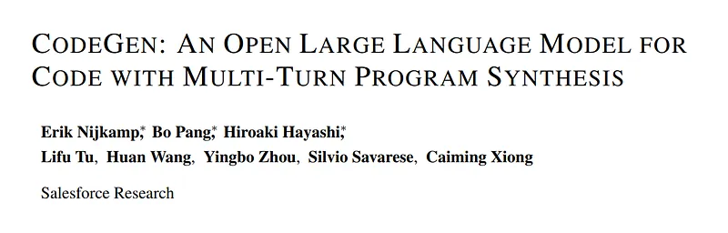
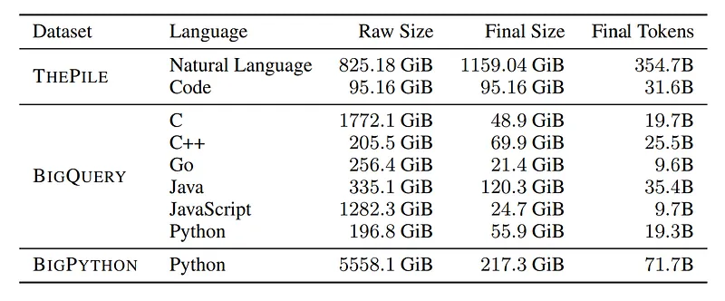
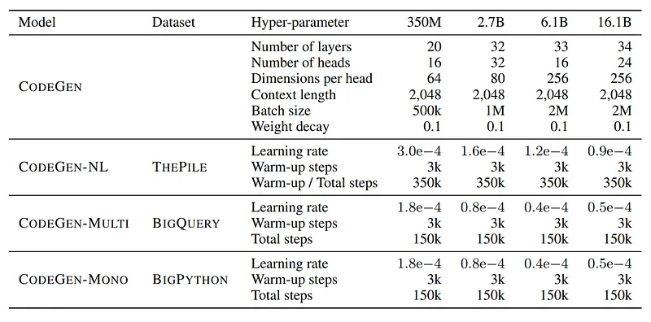
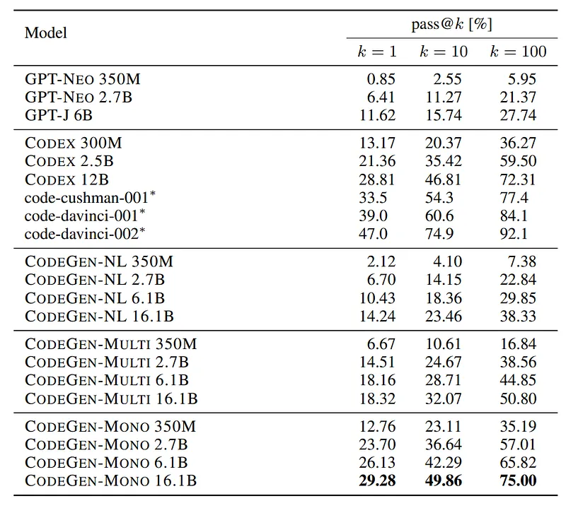
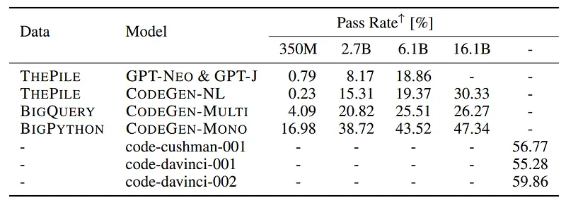

# Papers Explained 125 - CodeGen

CodeGen is a 16.1B parameter LLM trained for program synthesis using input-output examples and natural language descriptions.

This page ingests the source article into the wiki and connects it to [[Papers Explained Corpus]], [[Code Models]], [[Large Language Models]], [[Reasoning Models]], [[Synthetic Data]], [[Evaluation and Benchmarks]].

## Source Metadata

- Source file: `raw/2024-04-17_Papers-Explained-125--CodeGen-a6bae5c1f7b5.md`
- Source title: Papers Explained 125: CodeGen
- Published: 2024-04-17
- Canonical: [https://medium.com/@ritvik19/papers-explained-125-codegen-a6bae5c1f7b5](https://medium.com/@ritvik19/papers-explained-125-codegen-a6bae5c1f7b5)

## Key Ideas

- The project is available at [GitHub](https://github.com/salesforce/CodeGen).
- The family of CodeGen models is trained sequentially on three datasets:
- CodeGen-NL (natural Language CodeGen Models) are trained on the Pile, an English text Corpus.
- CodeGen-Multi models are trained on a subset of BigQuery dataset, which consists of code in 6 choosen programming languages: C, C++, Go, Java, JavaScript and Python.
- CodeGen-Mono models are trained on BigPython dataset.

## Notes

CodeGen is a 16.1B parameter LLM trained for program synthesis using input-output examples and natural language descriptions. CodeGen demonstrates competitive performance in generating Python code and shows that breaking down programming problems into multi-turn prompts enhances program synthesis compared to single-turn prompts, as evidenced by the Multi-Turn Programming Benchmark (MTPB) introduced in this paper.

The project is available at [GitHub](https://github.com/salesforce/CodeGen).

## Training Datasets for CodeGen

The family of CodeGen models is trained sequentially on three datasets:

- CodeGen-NL (natural Language CodeGen Models) are trained on the Pile, an English text Corpus.

- CodeGen-Multi models are trained on a subset of BigQuery dataset, which consists of code in 6 choosen programming languages: C, C++, Go, Java, JavaScript and Python.

- CodeGen-Mono models are trained on BigPython dataset.

*Figure: Approximate statistics for training corpora along the pre-processing steps.*

## CodeGen Models

The CodeGen models are in the form of autoregressive transformers with next-token prediction language modeling as the learning objective. The models are trained in various sizes with 350M, 2.7B, 6.1B, and 16.1B parameters.

The CodeGen models are trained in a sequential nature over datasets. CodeGen-NL is first trained on The Pile. CodeGen-Multi is initialized from CodeGen-NL and trained on BigQuery. Finally CodeGen-Mono is initialized from CodeGen-Multi and trained on BigPython.

*Figure: Hyper-parameters for model specification and optimization for the family of CodeGen models.*

## CodeGen Evaluation

### Single Turn Evaluation

*Figure: Evaluation results on the HumanEval benchmark*

- CodeGen-NL models outperform or perform similarly to GPT-NEO and GPT-J models.

- CodeGen-Multi outperforms the other models, while CodeGen-Mono substantially improves program synthesis capacity.

- Increasing model size generally leads to improved performance across all models.

- CodeGen-Mono 2.7B competes with Codex 2.5B.

- CodeGen-Mono 6.1B approaches the performance of Codex 12B.

- CodeGen-Mono 16.1B is competitive or outperforms Codex 12B.

### MultiTurn Evaluation

*Figure: Evaluation results on the Multi-Turn Programming Benchmark.*

- MTPB (Multi-Turn Program Benchmark) has 5 test cases, with 40 samples for each case per model.

- Pass rate is calculated for each problem based on the sampled data.

- Performance on MTPB improves with larger model and data sizes, indicating that multi-step program synthesis capacity scales with model and data size.

## Paper

CodeGen: An Open Large Language Model for Code with Multi-Turn Program Synthesis [2203.13474](https://arxiv.org/abs/2203.13474)

Recommended Reading [LLMs for Code](https://ritvik19.medium.com/list/llms-for-code-e5360a1b353a)

## Figures

Figures from the Medium HTML export (`raw/2024-04-17_Papers-Explained-125--CodeGen-a6bae5c1f7b5.md`); local copies under `wiki/assets/papers-explained-125-codegen/` when download succeeded.

| Figure | Caption |
|--------|---------|
|  | Title page of *CodeGen: An Open Large Language Model for Code with Multi-Turn Program Synthesis*. |
|  | Training-corpus statistics across The Pile, BigQuery language subsets, and BigPython. |
|  | CodeGen architecture and optimization hyperparameters across model sizes and training stages. |
|  | HumanEval pass@k comparison across GPT, Codex, and CodeGen-NL/Multi/Mono families. |
|  | Multi-Turn Programming Benchmark pass-rate comparison by model size and data stage. |
## Related

- [[Papers Explained Corpus]]
- [[Code Models]]
- [[Large Language Models]]
- [[Reasoning Models]]
- [[Synthetic Data]]
- [[Evaluation and Benchmarks]]
- [[Papers Explained 124 - CodeGemma]]
- [[Papers Explained 126 - CodeGen2]]

#summary #topic
