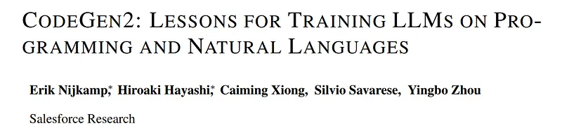
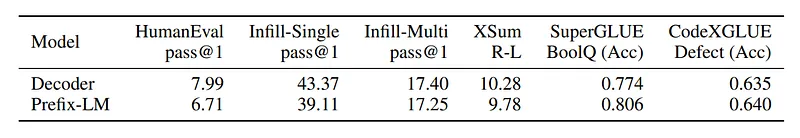
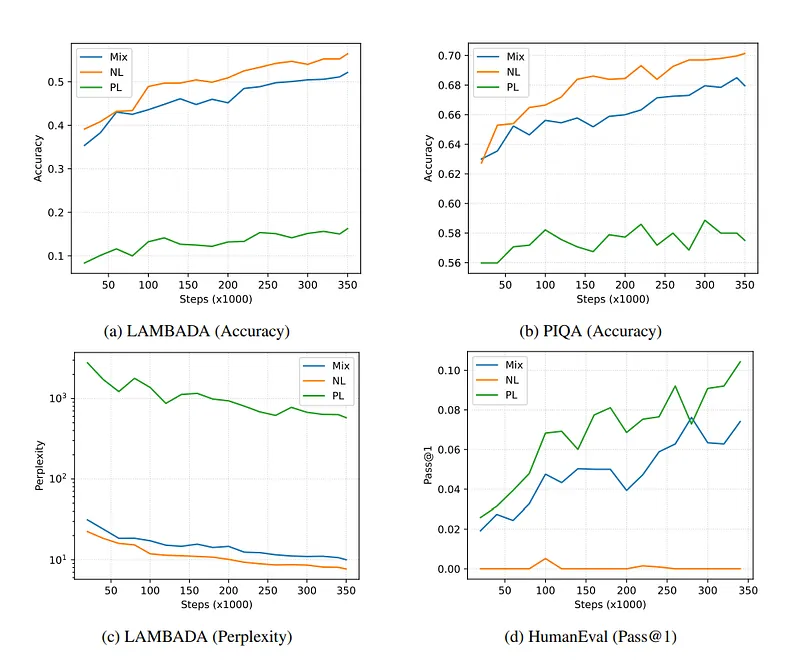
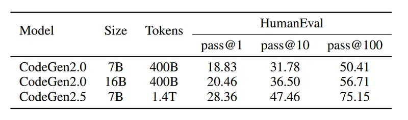

# Papers Explained 126 - CodeGen2

CodeGen2 proposes an approach to make the training of LLMs for program synthesis more efficient by unifying key components of model architectures, learning methods, infill sampling, and data distributions, distilling lessons learned from comprehensive empirical experiments.

This page ingests the source article into the wiki and connects it to [[Papers Explained Corpus]], [[Model Compression and Efficiency]], [[Code Models]], [[Large Language Models]], [[Reasoning Models]].

## Source Metadata

- Source file: `raw/2024-04-19_Papers-Explained-126--CodeGen2-d2690d7eb831.md`
- Source title: Papers Explained 126: CodeGen2
- Published: 2024-04-19
- Canonical: [https://medium.com/@ritvik19/papers-explained-codegen2-d2690d7eb831](https://medium.com/@ritvik19/papers-explained-codegen2-d2690d7eb831)

## Key Ideas

- CodeGen2 proposes an approach to make the training of LLMs for program synthesis more efficient by unifying key components of model architectures, learning methods, infill sampling, and data distributions, distilling lessons learned from comprehensive...
- Recommended Reading: [Papers Explained 125: CodeGen](https://ritvik19.medium.com/papers-explained-125-codegen-a6bae5c1f7b5)
- To approach the unification of these aspects in a principled manner, the following hypotheses are evaluated:
- Model Architecture: Encoder and decoder representations can be unified into a PrefixLM for which the bi-directional self-attention is beneficial for harder few-shot tasks without degradation in performance over standard causal-decoders.
- Learning Algorithm: A mixture of objectives for causal language modeling and span corruption yields efficient information transport for zero-shot learning (decoder) and understanding tasks (encoder).

## Notes

CodeGen2 proposes an approach to make the training of LLMs for program synthesis more efficient by unifying key components of model architectures, learning methods, infill sampling, and data distributions, distilling lessons learned from comprehensive empirical experiments.

Recommended Reading: [Papers Explained 125: CodeGen](https://ritvik19.medium.com/papers-explained-125-codegen-a6bae5c1f7b5)

To approach the unification of these aspects in a principled manner, the following hypotheses are evaluated:

- Model Architecture: Encoder and decoder representations can be unified into a PrefixLM for which the bi-directional self-attention is beneficial for harder few-shot tasks without degradation in performance over standard causal-decoders.

- Learning Algorithm: A mixture of objectives for causal language modeling and span corruption yields efficient information transport for zero-shot learning (decoder) and understanding tasks (encoder).

- Sampling Procedure: Equipping a model with both left-to-right and infill sampling, under the assumption of the ”free lunch” hypothesis, does not increase computational cost.

- Data Distributions: A mixture of natural and programming languages simultaneously benefits tasks in both domains without affecting performance within a single modality.

The findings for the postulated hypotheses are summarized as follows:

- Model Architecture: Failed to provide evidence to quantify any benefits of Prefix-LM over the causal-decoder baseline within the set of evaluation tasks.

- Learning Algorithm: A simple combination of objective functions was successfully achieved while zero-shot performance was preserved.

- Sampling Procedure: Failed to provide evidence for the “free lunch” hypothesis of equipping models with infill sampling without incurring an additional cost in compute.

- Data Distributions: A promising evidence of mixing natural and programming languages into a single model, providing strong results for multi-epoch training.

The project is available at [GitHub](https://github.com/salesforce/CodeGen).

## Components

### Model Architecture

In representation learning with transformers, two prevalent schemes of modeling are described:

- Bi-directional encoder-based representations: Each token in a sequence can attend to all other tokens in the sequence. This is useful for understanding tasks.

- Uni-directional decoder-based representations: Each token can only attend to previous tokens in the sequence, which is essential for language modeling, where the joint density is factorized over time.

To unify both schemes, the concept of “prefix-based language modeling” (PrefixLM) is introduced. It divides the input sequence into a prefix (bi-directional representations) and a context (uni-directional decoder representations) to achieve a balance between understanding and language modeling.

### Learning Algorithm:

The choice of encoder or decoder-based model architectures guides the selection of learning algorithms for language modeling.

Encoder-based models are typically trained using masked language modeling tasks, where spans of tokens are corrupted, and the model needs to recover the original sequence.

Decoder-based models are often trained using maximum likelihood-based learning, where the task is to predict the next token given the previous tokens.

This work explores a learning algorithm that combines both causal language modeling and span corruption tasks while aiming to minimize task-specific biases.

### Sampling Procedure:

For program synthesis, auto-regressive sampling from a language model is commonly used. Left-to-right sampling considers only previous tokens, but in some cases, context before and after the current position within a file is essential.

Various sampling variants rearrange sequences to enable learning of infilling tasks (predicting missing tokens) with standard next-token-prediction objectives.

The “free lunch” hypothesis suggests that training models with such modified observations doesn’t add computational cost or degrade performance in zero-shot generation tasks.

### Data Distribution:

In maximum likelihood learning, models are trained by minimizing the divergence between the data distribution and the model distribution.

It is noted that with an increase in the number of observations and model parameters, models can exhibit few-shot abilities, which means they can generate correct outputs with minimal supervision.

The approach of mixing natural language and programming language data is proposed to enhance model performance in both domains and downstream tasks.

## Lesson 1: Prefix-LM’s Benefit is Questionable

The performance of Prefix-LM is evaluated from three perspectives: data, representation, and objective.

### Data Perspective:

Context and Hypothesis: The Prefix-LM is trained with next token prediction, where the loss for the non-causal part is masked because it relies on future tokens for encoding. It is hypothesized that this masking might negatively impact learning.

*Figure: Comparison of causal decoder and Prefix-LM on various tasks. HumanEval, Infill-Single, and Infill-Multi are evaluated as zero-shot code generation, XSum is evaluated as 1-shot summarization, SuperGLUE (BoolQ) and CodeXGLUE (defect detection) are evaluated by fine-tuning.*

Results and Findings: Experiments are conducted on BigPython and Stack dataset, observing that, surprisingly, the performance of Prefix-LM is competitive with causal decoders in most cases. However, in the Stack dataset, worse performance is noticed, suggesting a potential negative effect due to a lack of gradient updates for the target language.

### Representation Perspective:

Context and Hypothesis: Prefix-LM offers the advantage of bi-directional attention, allowing it to contextualize hidden states with both past and future tokens. It is hypothesized that the model can provide competitive encoder representations while still functioning as a decoder.

Results and Findings: Experiments show that Prefix-LM performs well on discriminative tasks when fine-tuned with a mixture of causal language modeling and span corruption. However, it struggles to outperform smaller encoder-only pre-trained models on some tasks, indicating that its representations may not be informative enough to justify its use in all cases.

### Objective Perspective:

Context and Hypothesis: Prefix-LM can be trained using objectives which combine causal language modeling and denoising. It is hypothesized to achieve competitive results in the programming language domain.

Results and Findings: Surprisingly, when trained with UL2, Prefix-LM performs significantly worse on the HumanEval task compared to the causal language modeling baseline. This is attributed to the small ratio of non-corrupted sequences used by one of the UL2 objectives, which treats a large portion of a sequence as the prefix. Modifying the denoiser hyperparameters leads to improved results, suggesting that maximizing the number of tokens in the sequence used for gradient updates is crucial for competitive performance.

## Lesson 2: Infill is not a Free Lunch

Context and Hypothesis: Writing code involves not just adding tokens at the end of a file but also making changes within the file itself. It is hypothesized that whether infill can be achieved without negatively impacting the model’s performance when generating text from left to right.

Results and Findings: To test the hypothesis, a “causal decoder” model is trained using a combination of CLM (Causal Language Modeling) and PSM (Prefix, Suffix, Middle sequence reordering) infilling objectives.

The results of their experiment show that the model’s performance decreases by about 1 point in pass@1 in HumanEval performance compared to a baseline model that is trained only with causal language modeling.

The results hence suggest that infill is not “free.” In other words, training a model for infill objectives may come at the cost of its ability to generate text from left to right without degradation in performance.

## Lesson 3: Objective Can Be Simple, Yet Needs to Be Carefully Chosen

Context and Hypothesis: The objective is to train a causal decoder model with competitive left-to-right and infill sampling capabilities. To achieve this, certain modifications are made:

- Align the sequence format (e.g., no task tokens).

- Assume uniform distributions over task mixture and span lengths to avoid bias.

- Choose span corruption as the base infill objective.

A different approach is taken in selecting the spans for corruption:

- A dynamic ratio of sequence to mask out is sampled.

- Span length is then sampled, and mask out locations are determined to match the total number of tokens to the original sequence’s ratio.

Two changes are introduced:

- Mixed Objective: Instead of solely using span corruption, they incorporate a causal language modeling objective for some sequences. The choice between span corruption and causal language modeling is decided with a probability of 0.5. No task tokens are prefixed to the sequence.

- File-level Corruption: To prevent span corruption from accidentally masking document boundaries and causing confusion, span corruption is applied at the file level. This means that if a sequence can be split into two subsequences due to a document boundary, span corruption is applied to each subsequence, and they are concatenated together.

Results and Findings: The research examines their approach on four different model sizes: 1B, 3.7B, 7B, and 16B, referred to as CodeGen2.

A subset of the Stack v1.1 dataset, filtered with a stronger permissive license guideline, is used for training. The models’ performance is evaluated using two metrics: HumanEval and HumanEval-Infill. They also follow the truncation strategies of previous research.

A discrepancy is noted in experimental results related to InCoder, as they only use the end-of-mask token (<eom>) instead of heuristics to determine the end of the infill sequence for measuring the line-agnostic ability to infill and stop.

## Lesson 4: Multi-Modal Data Mixing

Context and Hypothesis:

The hypothesis is that while there’s already some implicit mixture of modalities in programming language data (e.g., comments and documents) and natural language data (e.g., code snippets in online QA forums), this might not be sufficient for LLMs to perform well in both domains.

The aim is to test whether the performance of LLMs can be improved by providing a more explicit and balanced mixture of natural language and programming language data during training.

A causal decoder is trained using a combination of causal language modeling and span corruption objectives. This model is trained on a mixture of natural and programming languages (referred to as “Mix”).

Training samples are collected from: the Pile dataset (for natural language data) and the Stack dataset (for programming language data). Examples are sampled equally from both sources.

Results and Findings:

*Figure: Results on LAMBADA and PIQA for NL and HumanEval for PL over number of training steps.*

The model trained on the mixed data (Mix) is evaluated in a zero-shot manner on both programming and natural language tasks. The evaluation focuses on different downstream tasks, such as HumanEval, LAMBADA, and PIQA.

- Mix does not outperform the other baselines when given the same compute budget. This is because the exposure to each domain is reduced by 50% in Mix.

- However, Mix performs similarly to the domain-matched models. In other words, it shows substantial improvement over models that are trained on a single domain but are evaluated on the other domain.

- The results suggest that mixing natural and programming languages during training is beneficial when compute resources are limited, and the resulting model needs to be used for both domains.

## Lesson 5: Multi Epoch Training

Context and Hypothesis:

Typically, models are pre-trained on data for only one epoch, meaning each sequence is seen once during training. The hypothesis is that the model can benefit from repeated observations of the same data.

Span corruption, a method of introducing perturbations to the original data, can serve as a form of data augmentation. It implies that variations in the data can still provide valuable information.

Using an extended learning rate decay function with a larger token budget allows the model to learn with higher learning rates for a longer duration.

A 7B model (CodeGen2.5) is trained using the CodeGen2 objective, using StarCoderData, which is a multilingual programming language dataset containing commits and issues, totaling 1.4 trillion tokens. The model was trained for a total of 5 epochs.

Results and Findings:

*Figure: Pass@k on HumanEval under temperatures t = 0.2, 0.6, 0.8 for k = 1, 10, 100, respectively.*

- When compared to the baseline CodeGen2–7B model, CodeGen2.5 showed a significant improvement in terms of pass@k, indicating enhanced program synthesis capability.

- However, it’s not clear which factors contributed to this improvement: (1) having more tokens, (2) using span corruption as a form of data augmentation, or (3) having a higher learning rate for an extended period.

## Paper

CodeGen2: Lessons for Training LLMs on Programming and Natural Languages [2305.02309](https://arxiv.org/abs/2305.02309)

Recommended Reading [LLMs for Code](https://ritvik19.medium.com/list/llms-for-code-e5360a1b353a)

## Figures

Figures from the Medium HTML export (`raw/2024-04-19_Papers-Explained-126--CodeGen2-d2690d7eb831.md`); local copies under `wiki/assets/papers-explained-126-codegen2/` when download succeeded.

| Figure | Caption |
|--------|---------|
|  | Title page of *CodeGen2: Lessons for Training LLMs on Programming and Natural Languages*. |
|  | Decoder vs Prefix-LM comparison across coding, summarization, and understanding tasks. |
|  | Mixed natural/programming data training curves on LAMBADA, PIQA, and HumanEval. |
|  | HumanEval pass@k comparison between CodeGen2.0 and multi-epoch CodeGen2.5. |
## Related

- [[Papers Explained Corpus]]
- [[Model Compression and Efficiency]]
- [[Code Models]]
- [[Large Language Models]]
- [[Reasoning Models]]
- [[Papers Explained 125 - CodeGen]]
- [[Papers Explained 127 - WizardLM]]

#summary #topic
