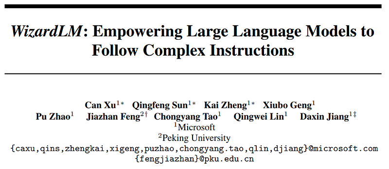
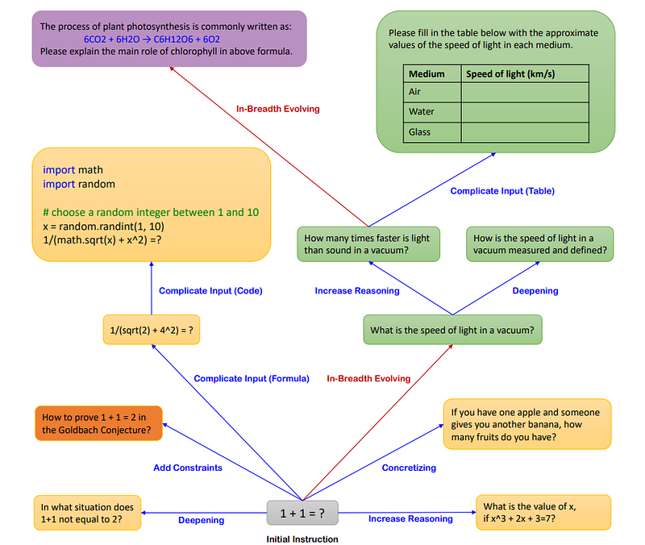
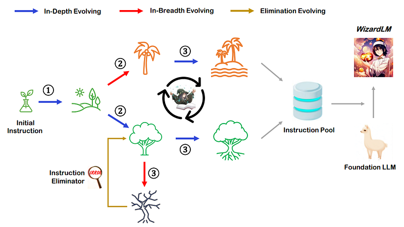
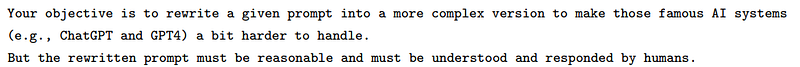
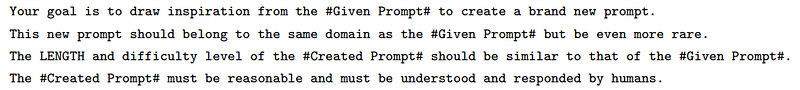
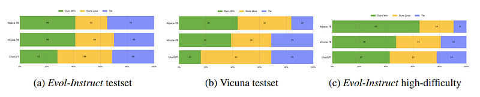
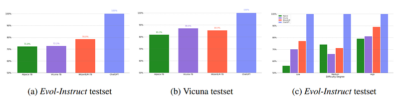
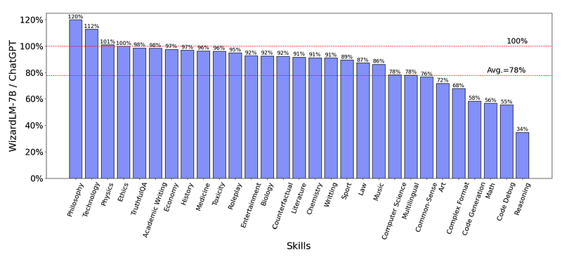

# Papers Explained 127 - WizardLM

Wizard LM shows an avenue for creating large amounts of instruction data with varying levels of complexity using LLM instead of humans. Starting with an initial set of instructions, the proposed Evol — Instruct is used to rewrite them step by step into more complex instructions.

This page ingests the source article into the wiki and connects it to [[Papers Explained Corpus]], [[Synthetic Data]], [[Large Language Models]], [[Reasoning Models]], [[Code Models]].

## Source Metadata

- Source file: `raw/2024-04-22_Papers-Explained-127--WizardLM-65099705dfa3.html`
- Source title: Papers Explained 127: WizardLM
- Published: 2024-04-22
- Canonical: [https://medium.com/@ritvik19/papers-explained-127-wizardlm-65099705dfa3](https://medium.com/@ritvik19/papers-explained-127-wizardlm-65099705dfa3)

## Key Ideas

- Wizard LM shows an avenue for creating large amounts of instruction data with varying levels of complexity using LLM instead of humans.
- The code and data are public at [GitHub](https://github.com/nlpxucan/WizardLM).
- Recommended Reading [Papers Explained 112: Self Instruct](https://ritvik19.medium.com/papers-explained-112-self-instruct-5c192580103a)
- The instruction evolver is used to evolve each fetched instruction, and the instruction eliminator to check whether the evolution fails.
- The Instruction Evolver is an LLM that uses prompts to evolve instructions, with two types: in-depth evolving and in-breadth evolving.

## Notes

Wizard LM shows an avenue for creating large amounts of instruction data with varying levels of complexity using LLM instead of humans. Starting with an initial set of instructions, the proposed Evol — Instruct is used to rewrite them step by step into more complex instructions. All generated instruction data is mixed to fine-tune LLAMA, resulting in Wizard LM.

The code and data are public at [GitHub](https://github.com/nlpxucan/WizardLM).

Recommended Reading [Papers Explained 112: Self Instruct](https://ritvik19.medium.com/papers-explained-112-self-instruct-5c192580103a)

*Figure: Running Examples of Evol-Instruct.*

## Approach

*Figure: Overview of Evol-Instruct*

The evolution is initiated from a given initial instruction dataset D(0) = (I(0)k, R(0)k)1≤k≤N, where I(0)k represents the k-th instruction in D(0), R(0)k denotes the corresponding response for the k-th instruction, and N is the number of samples in D(0). In each evolution, all the I(t) in D(t) are upgraded to I(t+1) through the application of a LLM instruction evolution prompt, and then the generation of corresponding responses R(t+1) for the newly evolved I(t+1) is performed using the LLM. As a result, an evolved instruction dataset D(t+1) is obtained. Through the iterative execution of M evolutions, a sequence of M evolution datasets [D(1) · · ·D(M)] can be sequentially obtained.

The instruction evolver is used to evolve each fetched instruction, and the instruction eliminator to check whether the evolution fails. Successful evolved instructions are added to the pool, while unsuccessful ones are placed back as they are, with the hope of upgrading them successfully in the next evolution epoch.

### Instruction Evolver.

The Instruction Evolver is an LLM that uses prompts to evolve instructions, with two types: in-depth evolving and in-breadth evolving.

### Prompts of In-Depth Evolving.

In-Depth Evolving enhances instructions by making them more complex and difficult through five types of prompts: add constraints, deepening, concretizing, increased reasoning steps, and complicating input.

*Figure: The core part of In-Depth Evolving’s prompt.*

### Prompts of In-Breadth Evolving

In-Breadth Evolving aims to enhance topic coverage, skill coverage, and overall dataset diversity.

*Figure: The core part of In-Breadth Evolving’s prompt.*

### Response Generation

The same LLM is used to generate the corresponding responses for the evolved instructions.

### Elimination Evolving

The following four situations are classified as instruction evolution failure:

- The evolved instruction does not provide any information gain compared to the original one.

- The evolved instruction makes it difficult for the LLM to generate a response. We found that when the generated response contains “sorry” and is relatively short in length (i.e., less than 80 words), it often indicates that the LLM struggles to respond to the evolved instruction. So we can use this rule to make a judgment.

- The response generated by the LLM only contains punctuation and stop words.

- The evolved instruction obviously copies some words from the evolving prompt, such as “given prompt”, “rewritten prompt”, “#Rewritten Prompt#”, etc.

After all evolutions have been completed, the initial instruction dataset will be merged with the evolved instruction data from all epochs, and the samples will be randomly shuffled to create the final fine-tuning dataset, ensuring that there is an even distribution of instructions of varying difficulty levels in the dataset, maximizing the smoothness of model fine-tuning.

## Experiment

The dataset was constructed by initializing it with the 52K instruction dataset of Alpaca. After M=4 evolutions were iteratively performed, a total of 250K instructions were obtained. For each instruction in each round of evolution, one evolving prompt was randomly selected from a total of six prompts (i.e., five from in-depth evolving and one from in-breadth evolving) with equal probability.

## Evaluation

### Human Evaluation

*Figure: Human evaluation results on Evol-Instruct testset and Vicuna testset.*

- WizardLM achieved significantly better results than Alpaca and Vicuna-7b, which demonstrates the effectiveness of Evol-Instruct.

- WizardLM has more cases that are preferred by human labelers than ChatGPT in the high-difficulty instructions.

### GPT-4 Automatic Evaluation

*Figure: Response quality assessed by GPT-4 on Evol-Instruct and Vicuna testset.*

- WizardLM outperforms Alpaca-7B and Vicuna-7B on Evol-Instruct testset by a large margin (i.e., 6.2% and 5.8% for Alpaca-7B and Vicuna-7B, respectively), and achieves comparable performance with Vicuna-7B on Vicuna testset.

- WizardLM surpasses Vicuna in all difficulty levels and exceeds Alpaca in easy and hard skills, and reaches almost 88% capacity of ChatGPT on hard skills. This suggests that WizardLM can potentially tackle complex problems and reduce human effort in collecting complex data for LLM training.

*Figure: GPT-4 score of each skill between WizardLM and ChatGPT on Evol-Instruct testset.*

- WizardLM achieves 78% of ChatGPT’s performance on average, with almost more than 90% capacity on 17 skills.

- However, WizardLM struggles with code, math, and reasoning scenarios, revealing a noticeable gap with ChatGPT.

## Paper

WizardLM: Empowering Large Language Models to Follow Complex Instructions [2304.12244](https://arxiv.org/abs/2304.12244)

Recommended Reading [Wizard Models](https://ritvik19.medium.com/list/wizard-models-9b972e860683)

## Figures

Figures from the Medium HTML export (`raw/2024-04-22_Papers-Explained-127--WizardLM-65099705dfa3.html`); local copies under `wiki/assets/papers-explained-127-wizardlm/` when download succeeded.

| Figure | Caption |
|--------|---------|
|  | Title page of *WizardLM: Empowering Large Language Models to Follow Complex Instructions*. |
|  | Running examples of Evol-Instruct transformations (deepening, constraints, breadth, and input complexity). |
|  | Pipeline overview of in-depth/in-breadth evolution, elimination, and instruction-pool training. |
|  | Core prompt template for in-depth instruction evolution. |
|  | Core prompt template for in-breadth instruction evolution. |
|  | Human evaluation win/lose/tie results on Evol-Instruct and Vicuna testsets. |
|  | GPT-4 automatic evaluation across datasets and instruction difficulty levels. |
|  | Skill-wise WizardLM-to-ChatGPT performance ratio on Evol-Instruct evaluations. |
## Related

- [[Papers Explained Corpus]]
- [[Synthetic Data]]
- [[Large Language Models]]
- [[Reasoning Models]]
- [[Code Models]]
- [[Papers Explained 126 - CodeGen2]]
- [[Papers Explained 128 - WizardCoder]]

#summary #topic
