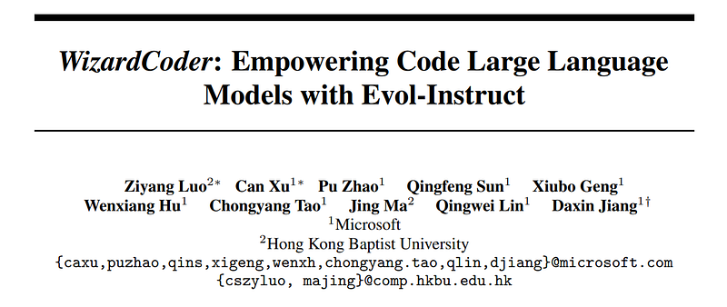
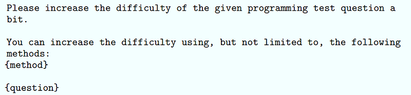
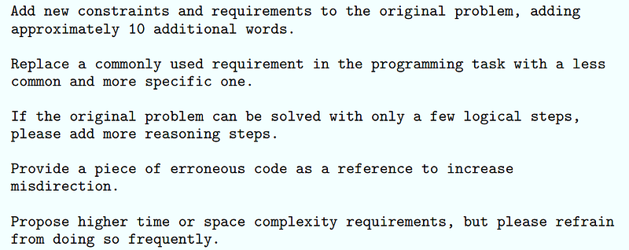
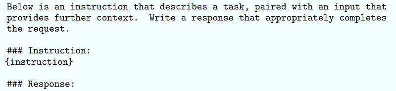
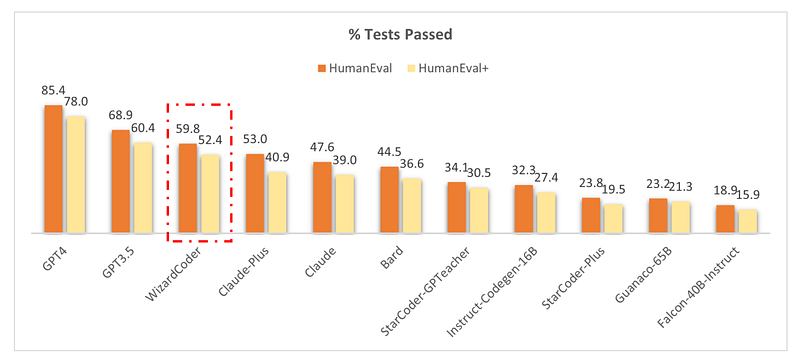
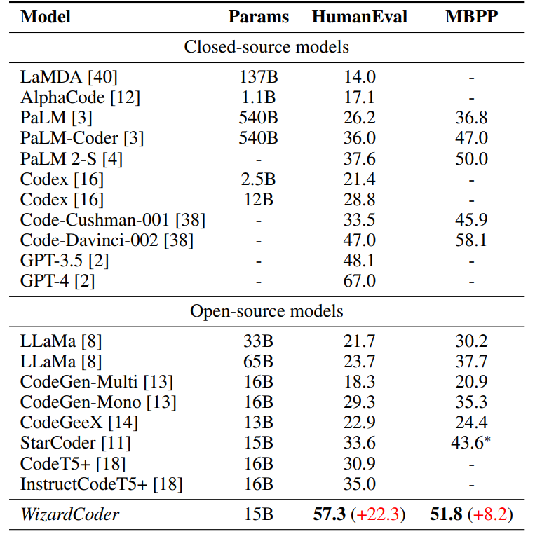
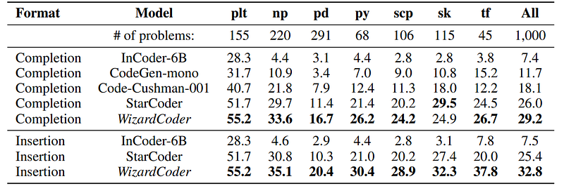

# Papers Explained 128 - WizardCoder

WizardCoder empowers Code LLMs (specifically StarCoder) with complex instruction fine-tuning, by adapting the Evol-Instruct method to the domain of code. It surpasses all other open-source Code LLMs by a substantial margin. It even outperforms the largest closed LLMs, Anthropic’s Claude and Google’s Bard, on HumanEval and HumanEval+.

This page ingests the source article into the wiki and connects it to [[Papers Explained Corpus]], [[Code Models]], [[Large Language Models]], [[Synthetic Data]], [[Supervised Fine-Tuning]].

## Source Metadata

- Source file: `raw/2024-04-24_Papers-Explained-128--WizardCoder-a12ecb5b93b6.html`
- Source title: Papers Explained 128: WizardCoder
- Published: 2024-04-24
- Canonical: [https://medium.com/@ritvik19/papers-explained-wizardcoder-a12ecb5b93b6](https://medium.com/@ritvik19/papers-explained-wizardcoder-a12ecb5b93b6)

## Key Ideas

- WizardCoder empowers Code LLMs (specifically StarCoder) with complex instruction fine-tuning, by adapting the Evol-Instruct method to the domain of code. It surpasses all other open-source Code LLMs by a substantial margin.
- The code, model weights, and data are public at [Github](https://github.com/nlpxucan/WizardLM).
- Recommended Reading [Papers Explained 112: Self Instruct](https://ritvik19.medium.com/papers-explained-112-self-instruct-5c192580103a) [Papers Explained 127: WizardLM](https://ritvik19.medium.com/papers-explained-127-wizardlm-65099705dfa3)
- Following WizardLM, the Evol-Instruct method is applied to evolve Code Alpaca dataset, generated using self-instruct and the pre-trained Code LLM StarCoder is then fine tuned with the evolved data.
- To adapt Evol-Instruct to the realm of code, we made the following modifications to the evolutionary prompt:

## Notes

WizardCoder empowers Code LLMs (specifically StarCoder) with complex instruction fine-tuning, by adapting the Evol-Instruct method to the domain of code. It surpasses all other open-source Code LLMs by a substantial margin. It even outperforms the largest closed LLMs, Anthropic’s Claude and Google’s Bard, on HumanEval and HumanEval+.

The code, model weights, and data are public at [Github](https://github.com/nlpxucan/WizardLM).

Recommended Reading [Papers Explained 112: Self Instruct](https://ritvik19.medium.com/papers-explained-112-self-instruct-5c192580103a) [Papers Explained 127: WizardLM](https://ritvik19.medium.com/papers-explained-127-wizardlm-65099705dfa3)

## Approach

Following WizardLM, the Evol-Instruct method is applied to evolve Code Alpaca dataset, generated using self-instruct and the pre-trained Code LLM StarCoder is then fine tuned with the evolved data.

### Evol-Instruct Prompts for Code

To adapt Evol-Instruct to the realm of code, we made the following modifications to the evolutionary prompt:

- Streamlined the evolutionary instructions by removing deepening, complicating input, and In-Breadth Evolving.

- Simplified the form of evolutionary prompts by unifying the evolutionary prompt template.

- Addressing the specific characteristics of the code domain, two evolutionary instructions are added: code debugging and code time-space complexity constraints.

The unified code evolutionary prompt template is as follows:

Here, {question} represents the current code instruction awaiting evolution, and {method} is the type of evolution. The five types used in the experiments are :

The evolved dataset consists of approximately 78k samples.

### Training WizardCoder

StarCoder 15B is used as the foundation and fine-tuned using the evolved training set. The prompt format for fine-tuning is outlined as follows:

The training dataset is initialized with the 20K instruction-following dataset called Code Alpaca. The Evol-Instruct technique is iteratively applied on this dataset to produce evolved data. After each round of data evolution, the evolved data from all previous rounds is merged with the original dataset to finetune StarCoder. The pass@1 metric is observed on HumanEval. Once a decline is observed, the usage of Evol-Instruct is discontinued and the model with the highest pass@1 is selected as the ultimate model.

## Evaluation

### Evaluation on HumanEval, HumanEval+, and MBPP

*Figure: The percentage of pass rates on the HumanEval (164 problems) with a single attempt.*

*Figure: Results of pass@1(%) on HumanEval and MBPP.*

- WizardCoder outperforms the largest closed-source LLMs, including Claude, Bard, PaLM, PaLM-2, and LaMDA, despite being significantly smaller.

- WizardCoder outperforms all the open-source Code LLMs by a large margin (+22.3 on HumanEval), including StarCoder, CodeGen, CodeGee, and CodeT5+.

- WizardCoder significantly outperforms all the open-source Code LLMs with instructions fine-tuning, including InstructCodeT5+, StarCoder-GPTeacher, and Instruct-Codegen-16B.

### Evaluation on DS-1000

*Figure: Performance of WizardCoder and baseline models on DS-1000.*

- WizardCoder demonstrates a significant superiority over all other models when tackling data science problems on the DS-1000 benchmark.

- This observation holds true across nearly all data science libraries.

## Paper

WizardCoder: Empowering Code Large Language Models with Evol-Instruct [2306.08568](https://arxiv.org/abs/2306.08568)

Recommended Reading [Wizard Models](https://ritvik19.medium.com/list/wizard-models-9b972e860683)

## Figures

Figures from the Medium HTML export (`raw/2024-04-24_Papers-Explained-128--WizardCoder-a12ecb5b93b6.html`); local copies under `wiki/assets/papers-explained-128-wizardcoder/` when download succeeded.

| Figure | Caption |
|--------|---------|
|  | Title page of *WizardCoder: Empowering Code Large Language Models with Evol-Instruct*. |
|  | Unified code-domain Evol-Instruct prompt template for difficulty enhancement. |
|  | Code-specific evolution methods: extra constraints, reasoning depth, debugging, and complexity limits. |
|  | Instruction-following fine-tuning prompt format used for WizardCoder training. |
|  | HumanEval/HumanEval+ single-attempt pass-rate comparison with closed and open baselines. |
|  | Benchmark table showing WizardCoder vs closed-source and open-source code models. |
|  | DS-1000 performance across data-science libraries for completion and insertion settings. |
## Related

- [[Papers Explained Corpus]]
- [[Code Models]]
- [[Large Language Models]]
- [[Synthetic Data]]
- [[Supervised Fine-Tuning]]
- [[Papers Explained 127 - WizardLM]]
- [[Papers Explained 129 - WizardMath]]

#summary #topic
