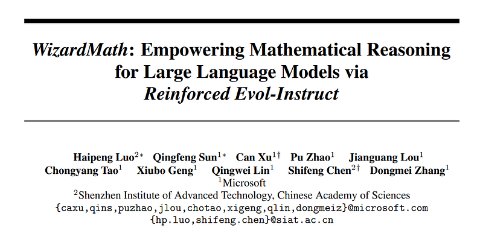
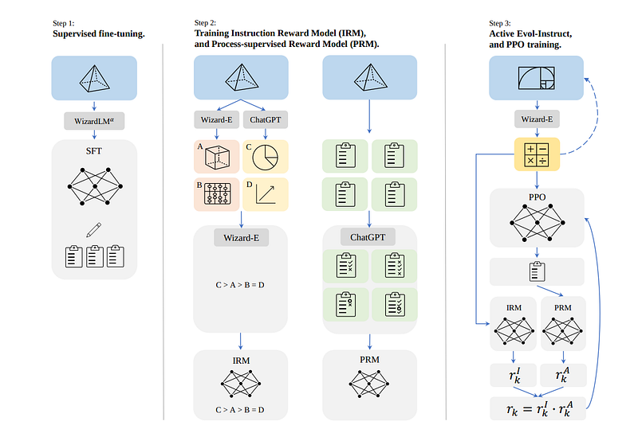
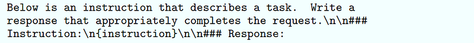
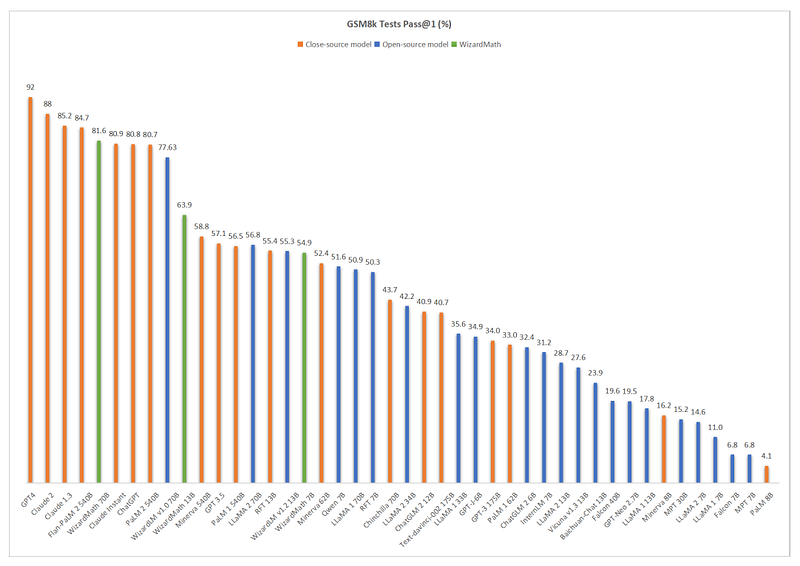
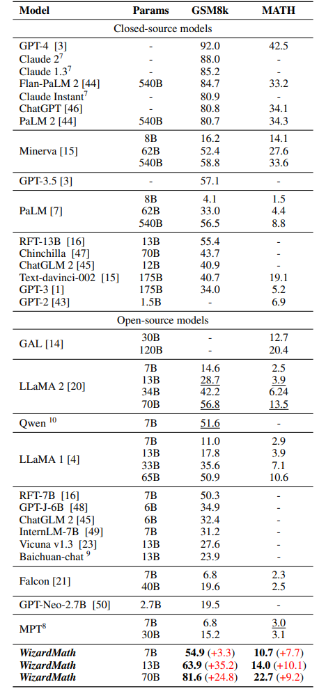

# Papers Explained 129 - WizardMath

WizardMath enhances the mathematical reasoning abilities of Llama-2, by applying the proposed Reinforcement Learning from Evol-Instruct Feedback (RLEIF) method to the domain of math. WizardMath surpasses all other open source LLMs by a substantial margin. It even outperforms various main closed-source LLMs.

This page ingests the source article into the wiki and connects it to [[Papers Explained Corpus]], [[Reinforcement Learning Topic]], [[Reasoning Models]], [[Large Language Models]], [[Code Models]], [[Reinforcement Learning]], [[Supervised Fine-Tuning]].

## Source Metadata

- Source file: `raw/2024-04-26_Papers-Explained-129--WizardMath-265e6e784341.html`
- Source title: Papers Explained 129: WizardMath
- Published: 2024-04-26
- Canonical: [https://medium.com/@ritvik19/papers-explained-129-wizardmath-265e6e784341](https://medium.com/@ritvik19/papers-explained-129-wizardmath-265e6e784341)

## Key Ideas

- WizardMath enhances the mathematical reasoning abilities of Llama-2, by applying the proposed Reinforcement Learning from Evol-Instruct Feedback (RLEIF) method to the domain of math. WizardMath surpasses all other open source LLMs by a substantial margin.
- Code and model weights are public at [GitHub](https://github.com/nlpxucan/WizardLM).
- Recommended Reading [Papers Explained 112: Self Instruct](https://ritvik19.medium.com/papers-explained-112-self-instruct-5c192580103a) [Papers Explained 127: WizardLM](https://ritvik19.medium.com/papers-explained-127-wizardlm-65099705dfa3) [[Papers...
- Following WizardLM and PRM, RLEIF integrates the Evol-Instruct and reinforced process supervision method to evolve GSM8k and MATH, and then the pre-trained Llama-2 is fine tuned with the evolved data and reward models. The method applies three steps :
- Training instruction reward model, and process supervised reward model.

## Notes

WizardMath enhances the mathematical reasoning abilities of Llama-2, by applying the proposed Reinforcement Learning from Evol-Instruct Feedback (RLEIF) method to the domain of math. WizardMath surpasses all other open source LLMs by a substantial margin. It even outperforms various main closed-source LLMs.

Code and model weights are public at [GitHub](https://github.com/nlpxucan/WizardLM).

Recommended Reading [Papers Explained 112: Self Instruct](https://ritvik19.medium.com/papers-explained-112-self-instruct-5c192580103a) [Papers Explained 127: WizardLM](https://ritvik19.medium.com/papers-explained-127-wizardlm-65099705dfa3) [Papers Explained 128: WizardCoder](https://ritvik19.medium.com/papers-explained-wizardcoder-a12ecb5b93b6)

## Approach

*Figure: The three steps of our Reinforcement Learning from Evol-Instruct Feedback (RLEIF).*

Following WizardLM and PRM, RLEIF integrates the Evol-Instruct and reinforced process supervision method to evolve GSM8k and MATH, and then the pre-trained Llama-2 is fine tuned with the evolved data and reward models. The method applies three steps :

- Supervised fine-tuning.

- Training instruction reward model, and process supervised reward model.

- Active Evol-Instruct, and PPO training.

### Supervised fine-tuning

Firstly the base is finetuned with supervised instruction response pairs, which contains:

To make the parsing of each step easier, 15k answers for GSM8k and MATH were few-shot re-generated with an Alpha version of WizardLM 70B model to produce solutions in a step-by-step format, then those with a correct answer were identified, and this data was used to finetune the base Llama model.

To enhance the model’s ability to adhere to neural and diverse instructions, 1.5k open-domain conversations were sampled from WizardLM’s training data, then merged with the above math corpus as the final SFT training data.

### Evol-Instruct principles for math

Evol-Instruct is adapted to a new paradigm including two evolution lines:

Downward evolution: It enhances instructions by making the questions easier. For example i): revising high difficulty questions to lower difficulty, or ii) producing a new and easier question with another different topic.

Upward evolution: Derived from the original Evol-Instruct method, it deepens and generates new and harder questions by i) adding more constraints, ii) concretizing, iii) increasing reasoning.

### Reinforcement Learning from Evol-Instruct Feedback (RLEIF)

Two reward models are trained to predict the quality of the instructions and the correctness of each step in the answer respectively:

Instruction Reward Model (IRM): This model aims to judge the quality of the evolved instructions on three aspects: i) Definition, ii) Precision, and iii) Integrity. To produce the ranking list training data of IRM, for each instruction, firstly ChatGPT and Wizard-E are used to generate 2~4 evolved instructions respectively. Then Wizard-E ranks the quality of those 4~8 instructions.

Process-supervised Reward Model (PRM): As there was no powerful open-source math reasoning LLMs before this work, ChatGPT is used to provide process supervision, and is asked to assess the correctness of each step in the solutions generated by the model.

PPO training. The original math (GSM8k + MATH) instructions are evolved by 8 turns, increasing the data size from 15k to 96k. IRM and PRM are used to generate the instruction reward (rI) and the answer reward (rA). Then a product as the final reward r = rI ·rA is applied .

Note that Wizard-E (Wizard-Evol-Generator) is an Alpha version fine-tuned Llama model specifically used to execute Evol-Instruct without APIs.

The following prompt is used for training WizardMath

## Evaluation

*Figure: The pass@1 performance of main LLM models on the GSM8k benchmark.*

*Figure: Results of pass@1 (%) on GSM8k and MATH.*

- WizardMath 13B outperforms PaLM 1 540B (63.9 vs 56.5), Minerva 540B (63.9 vs 58.8), and GPT-3.5 (63.9 vs 57.1) on GSM8k. Meanwhile,it surpasses PaLM 1 540B (14.0 vs. 8.8), GPT-3 175B (14.0 vs. 5.2) on MATH.

- WizardMath 70B, achieves either superior or comparable performance with Claude Instant (81.6 vs 80.9), ChatGPT (81.6 vs 80.8) and PaLM 2 (81.6 vs 80.7) on GSM8k. Concurrently, WizardMath 70B also exceeds Text-davinci-002 (22.7 vs. 19.1) by a margin of 3.6% on the MATH benchmarks.

- WizardMath 7B surpasses most open-source models with parameter counts ranging approximately from 7B to 40B, including MPT, Falcon, Baichuan-chat, Vicuna v1.3, ChatGLM 2, Qwen, Llama 1 and Llama 2 on the GSM8k and MATH benchmarks. Even though its parameter counts are significantly lower.

- WizardMath 13B is significantly superior to Llama 1 65B (63.9 vs. 50.9) and Llama 2 70B (63.9 vs. 56.8) on GSM8k. Additionally, it substantially outperforms both Llama 1 65B (14.0 vs. 10.6) and Llama 2 70B (14.0 vs. 13.5) on MATH.

- WizardMath 70B exemplifies a substantial advancement in performance, surpassing Llama 2 70B (81.6 vs. 56.8) by a significant margin of 24.8% on GSM8k. Concurrently, it also outperforms Llama 2 70B (22.7 vs. 13.5) by a margin of 9.2% on MATH.

## Paper

WizardMath: Empowering Mathematical Reasoning for Large Language Models via Reinforced Evol-Instruct [2308.09583](https://arxiv.org/abs/2308.09583)

Recommended Reading [Wizard Models](https://ritvik19.medium.com/list/wizard-models-9b972e860683)

## Figures

Figures from the Medium HTML export (`raw/2024-04-26_Papers-Explained-129--WizardMath-265e6e784341.html`); local copies under `wiki/assets/papers-explained-129-wizardmath/` when download succeeded.

| Figure | Caption |
|--------|---------|
|  | Title page of *WizardMath: Empowering Mathematical Reasoning for Large Language Models via Reinforced Evol-Instruct*. |
|  | Three-stage RLEIF pipeline: SFT, reward-model training, and active Evol-Instruct with PPO. |
|  | Instruction-response training prompt format used for WizardMath. |
|  | GSM8K pass@1 leaderboard comparison of WizardMath with open and closed models. |
|  | GSM8K and MATH pass@1 benchmark table across closed-source and open-source baselines. |
## Related

- [[Papers Explained Corpus]]
- [[Reinforcement Learning Topic]]
- [[Reasoning Models]]
- [[Large Language Models]]
- [[Code Models]]
- [[Reinforcement Learning]]
- [[Supervised Fine-Tuning]]
- [[Papers Explained 128 - WizardCoder]]
- [[Papers Explained 130 - Phi-3]]

#summary #topic
