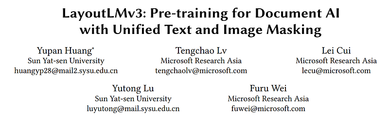
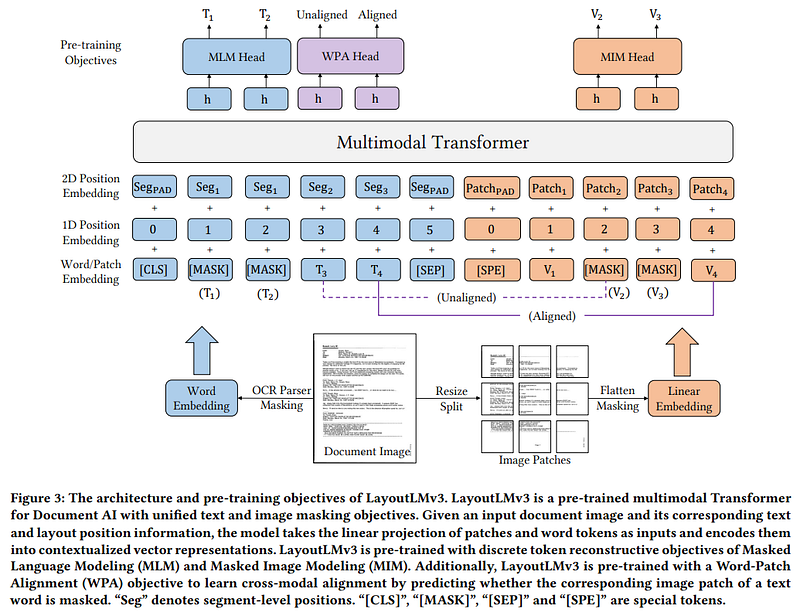

# Papers Explained 13 - Layout LM v3

The word Embeddings are initialized with a word embedding matrix from a pre-trained model RoBERTa.

This page ingests the source article into the wiki and connects it to [[Papers Explained Corpus]], [[Embedding and Retrieval]], [[Document AI]], [[Large Language Models]], [[Safety and Alignment]], [[Computer Vision]].

## Source Metadata

- Source file: `raw/2023-02-06_Papers-Explained-13--Layout-LM-v3-3b54910173aa.html`
- Source title: Papers Explained 13: Layout LM v3
- Published: 2023-02-06
- Canonical: [https://medium.com/@ritvik19/papers-explained-13-layout-lm-v3-3b54910173aa](https://medium.com/@ritvik19/papers-explained-13-layout-lm-v3-3b54910173aa)

## Key Ideas

- Text embedding is a combination of word embeddings and position embeddings.
- The position embeddings include 1D position and 2D layout position embeddings, where the 1D position refers to the index of tokens within the text sequence, and the 2D layout position refers to the bounding box coordinates of the text sequence.
- Following the LayoutLM, we normalize all coordinates by the size of images, and use embedding layers to embed x-axis, y-axis, width and height features separately.
- The LayoutLM and LayoutLMv2 adopt word-level layout positions, where each word has its positions. Instead, we adopt segment-level layout positions that words in a segment share the same 2D position since the words usually express the same semantic meaning.
- Masked Image Modelling (MIM): The MIM objective is a symmetry to the MLM objective, about 40% image tokens are randomly masked with the blockwise masking strategy.

## Notes

LayoutLMv3 applies a unified text-image multimodal Transformer to learn cross-modal representations. The Transformer has a multilayer architecture and each layer mainly consists of multi-head self-attention and position-wise fully connected feed-forward networks. The input of Transformer is a concatenation of text embedding Y = y1:𝐿 and image embedding X = x1:𝑀 sequences, where 𝐿 and 𝑀 are sequence lengths for text and image respectively. Through the Transformer, the last layer outputs text-and-image contextual representations.

Text Embedding

- Text embedding is a combination of word embeddings and position embeddings.

- The word Embeddings are initialized with a word embedding matrix from a pre-trained model RoBERTa.

- The position embeddings include 1D position and 2D layout position embeddings, where the 1D position refers to the index of tokens within the text sequence, and the 2D layout position refers to the bounding box coordinates of the text sequence.

- Following the LayoutLM, we normalize all coordinates by the size of images, and use embedding layers to embed x-axis, y-axis, width and height features separately.

- The LayoutLM and LayoutLMv2 adopt word-level layout positions, where each word has its positions. Instead, we adopt segment-level layout positions that words in a segment share the same 2D position since the words usually express the same semantic meaning.

Image Embedding

Document images ar represented with linear projection features of image patches before feeding them into the multimodal Transformer. A document image is resized into 𝐻 ×𝑊 and denote the image with I ∈ R 𝐶×𝐻×𝑊 , where 𝐶, 𝐻 and𝑊 are the channel size, width and height of the image respectively. Image is split into a sequence of uniform 𝑃 × 𝑃 patches, linearly project the image patches to 𝐷 dimensions and flatten them into a sequence of vectors, which length is 𝑀 = 𝐻𝑊 /𝑃 2. Then learnable 1D position embeddings are added to each patch.

## Pre Training

Masked Language Modeling (MLM): 30% of text tokens are masked with a span masking strategy with span lengths drawn from a Poisson distribution (𝜆 = 3). The pre-training objective is to maximize the log-likelihood of the correct masked text tokens y𝑙 based on the contextual representations of corrupted sequences of image tokens X𝑀′ and text tokens Y𝐿′, where 𝑀′ and 𝐿′ represent the masked positions. As the layout informationis kept unchanged, this objective facilitates the model to learn the correspondence between layout information and text and image context.

Masked Image Modelling (MIM): The MIM objective is a symmetry to the MLM objective, about 40% image tokens are randomly masked with the blockwise masking strategy. The MIM objective is driven by a cross-entropy loss to reconstruct the masked image tokens x𝑚 under the context of their surrounding text and image tokens. MIM facilitates learning high-level layout structures rather than noisy low-level details.

Word-Patch Alignment (WPA): The WPA objective is to predict whether the corresponding image patches of a text word are masked. Specifically, an aligned label is assigned to an unmasked text token when its corresponding image tokens are also unmasked. Otherwise, an unaligned label is assigned. The masked text tokens are excluded when calculating WPA loss to prevent the model from learning a correspondence between masked text words and image patches.

To learn a universal representation for various document tasks, LayoutLMv3 is pretrained on a large IIT-CDIP dataset.

## Model Configurations

LayoutLMv3BASE adopts a 12-layer Transformer encoder with 12-head self-attention, hidden size of
𝐷 = 768, and 3,072 intermediate size of feed-forward networks.

LayoutLMv3LARGE adopts a 24-layer Transformer encoder with 16-head self-attention, hidden size of 𝐷 = 1, 024, and 4,096 intermediate size of feed-forward networks.

- To pre-process the text input, the text sequence are tokenized with Byte-Pair Encoding (BPE), with a maximum sequence length 𝐿 = 512.

- A [CLS] and a [SEP] token is added at the beginning and end of each text sequence.

- When the length of the text sequence is shorter than 𝐿, [PAD] tokens are appended to it. The bounding box coordinates of these special tokens are all zeros.

- The parameters for image embedding are 𝐶 × 𝐻 ×𝑊 = 3 × 224 × 224, 𝑃 = 16, 𝑀 = 196.

## Fine Tuning

- Form and Receipt Understanding: FUNSD and CORD dataset

- Document Image Classification: RVL-CDIP dataset

- Document Visual Question Answering: DocVQA dataset

- Document Layout Analysis: PubLayNet dataset

## Paper

LayoutLMv3: Pre-training for Document AI with Unified Text and Image Masking [2204.08387](https://arxiv.org/abs/2204.08387)

## Figures

Figures from the Medium HTML export (`raw/2023-02-06_Papers-Explained-13--Layout-LM-v3-3b54910173aa.html`); local copies under `wiki/assets/papers-explained-13-layout-lm-v3/` when download succeeded.

| Figure | Caption |
|--------|---------|
|  | Title block of *LayoutLMv3: Pre-training for Document AI with Unified Text and Image Masking*. |
|  | LayoutLMv3 unified multimodal pretraining architecture with MLM, MIM, and word-patch alignment (WPA) objectives. |
## Related

- [[Papers Explained Corpus]]
- [[Embedding and Retrieval]]
- [[Document AI]]
- [[Large Language Models]]
- [[Safety and Alignment]]
- [[Computer Vision]]
- [[Papers Explained 12 - LiLT]]
- [[Papers Explained Review 01 - Convolutional Neural Networks]]

#summary #topic
