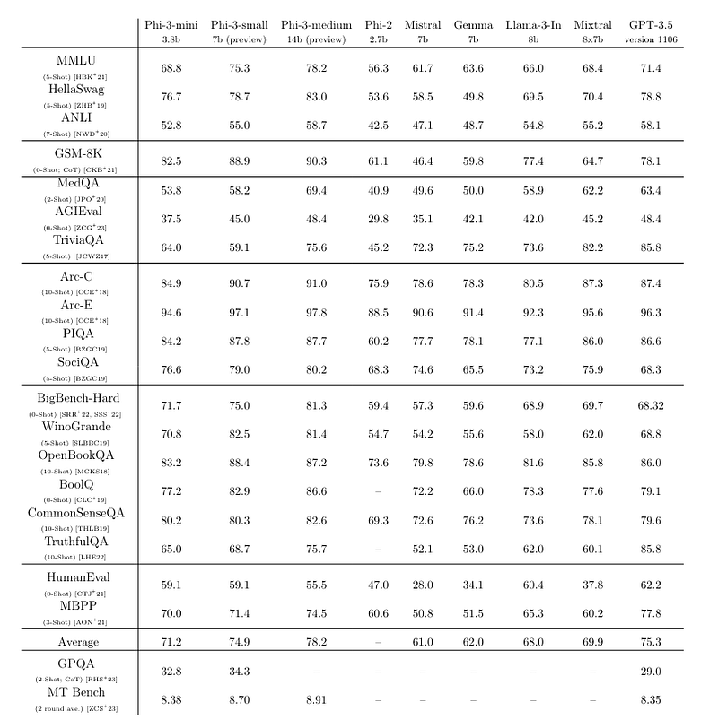
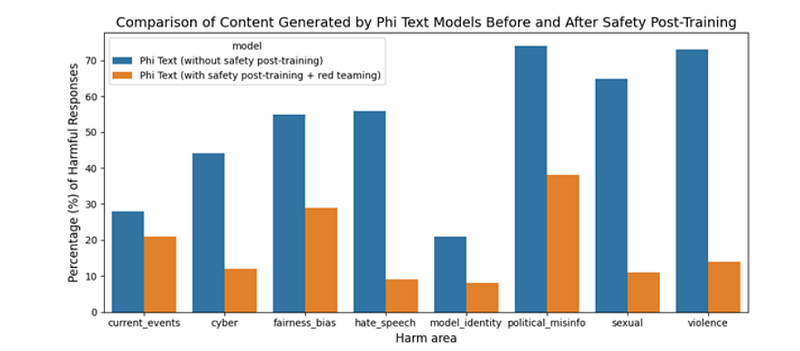
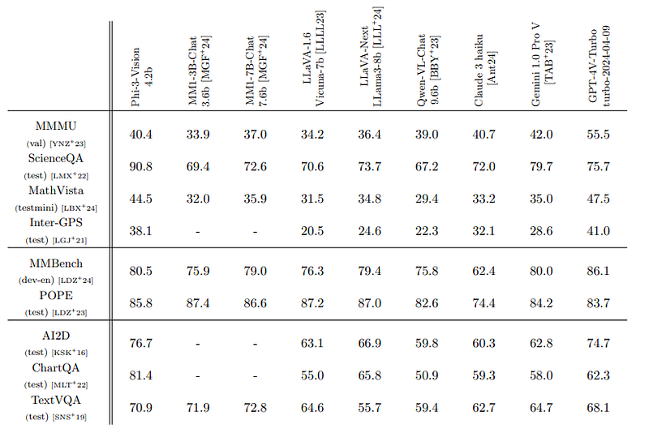
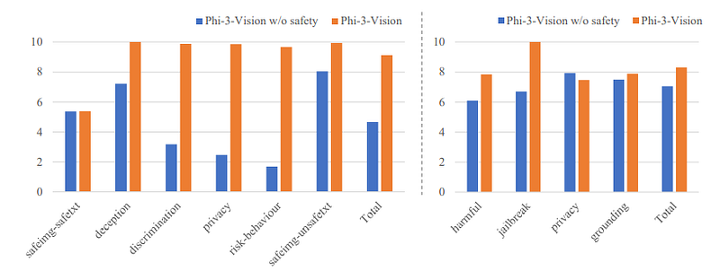
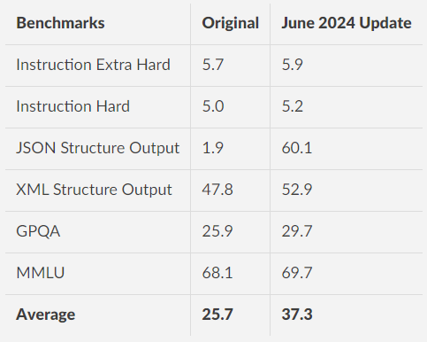
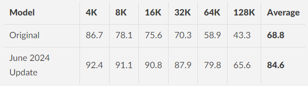
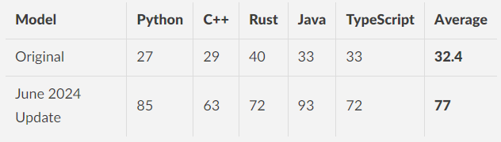

# Papers Explained 130 - Phi-3

phi-3-mini is a 3.8B language model trained on 3.3T tokens data which is a scaled-up version of the one used for phi-2, composed of heavily filtered web data and synthetic data.It rivals the performance of models such as Mixtral 8x7B and GPT-3.5.

This page ingests the source article into the wiki and connects it to [[Papers Explained Corpus]], [[Large Language Models]], [[Synthetic Data]], [[Model Compression and Efficiency]], [[Mixture of Experts]], [[Reasoning Models]].

## Source Metadata

- Source file: `raw/2024-04-29_Papers-Explained-130--Phi-3-0dfc951dc404.html`
- Source title: Papers Explained 130: Phi-3
- Published: 2024-04-29
- Canonical: [https://medium.com/@ritvik19/papers-explained-130-phi-3-0dfc951dc404](https://medium.com/@ritvik19/papers-explained-130-phi-3-0dfc951dc404)

## Key Ideas

- The models are available on [HuggingFace](https://huggingface.co/collections/microsoft/phi-3-6626e15e9585a200d2d761e3).
- Recommended Reading [Papers Explained 114: Phi-1](https://ritvik19.medium.com/papers-explained-114-phi-1-14a8dcc77ce5) [Papers Explained 115: Phi-1.5](https://ritvik19.medium.com/papers-explained-phi-1-5-2857e56dbd2a) [[Papers Explained 116...
- The phi-3-mini model is built upon a similar block structure as Llama-2 and uses the same tokenizer with vocabulary size of 32064. The model uses 3072 hidden dimension, 32 heads and 32 layers. It is trained using bfloat16 with default context length 4K.
- phi-3-mini-128K is also introduced that extends the context length to 128K, via LongRope .
- The phi-3-medium model with (14B) is trained using the same tokenizer and architecture of phi-3-mini, and trained on the same data for slightly more epochs (4.8T tokens total as for phi-3-small).

## Notes

phi-3-mini is a 3.8B language model trained on 3.3T tokens data which is a scaled-up version of the one used for phi-2, composed of heavily filtered web data and synthetic data.It rivals the performance of models such as Mixtral 8x7B and GPT-3.5. Furthermore, 7B and 14B models are trained for 4.8T tokens, called phi-3-small and phi-3-medium, performing significantly better than phi-3-mini.

The models are available on [HuggingFace](https://huggingface.co/collections/microsoft/phi-3-6626e15e9585a200d2d761e3).

Recommended Reading [Papers Explained 114: Phi-1](https://ritvik19.medium.com/papers-explained-114-phi-1-14a8dcc77ce5) [Papers Explained 115: Phi-1.5](https://ritvik19.medium.com/papers-explained-phi-1-5-2857e56dbd2a) [Papers Explained 116: Phi-2](https://ritvik19.medium.com/papers-explained-116-phi-2-cef4a0bee146)

## Architecture

The phi-3-mini model is built upon a similar block structure as Llama-2 and uses the same tokenizer with vocabulary size of 32064. The model uses 3072 hidden dimension, 32 heads and 32 layers. It is trained using bfloat16 with default context length 4K.

phi-3-mini-128K is also introduced that extends the context length to 128K, via LongRope .

The phi-3-small model (7B) leverages the tiktoken tokenizer for better multilingual tokenization with a vocabulary size of 100352 and has default context length 8K. It follows the standard decoder architecture of a 7B model class, having 32 layers and a hidden size of 4096. To minimize KV cache footprint, the model also leverages a grouped-query attention, with 4 queries sharing 1 key. Moreover it uses alternative layers of dense attention and a novel block sparse attention to further optimize on KV cache savings while maintaining long context retrieval performance. An additional 10% multilingual data was also used for this model.

The phi-3-medium model with (14B) is trained using the same tokenizer and architecture of phi-3-mini, and trained on the same data for slightly more epochs (4.8T tokens total as for phi-3-small). The model has 40 heads and 40 layers, with embedding dimension 5120.

## Data

The sequence of works initiated in “Textbooks Are All You Need” is followed to utilize high quality training data to improve the performance of small language models and deviate from the standard scaling-laws.

In particular,the web data is filtond to contain the correct level of “knowledge” and keep more web pages that could potentially improve the “reasoning ability” for the model.

## Training Methodology

Pre-training is performed in two disjoint and sequential phases:

Phase-1 comprises mostly web sources aimed at teaching the model general knowledge and language understanding.

Phase-2 merges even more heavily filtered webdata (a subset used in Phase-1) with some synthetic data that teach the model logical reasoning and various niche skills.

Post-training of phi-3-mini went through two stages, including supervised finetuning (SFT) and direct preference optimization (DPO).

SFT leverages highly curated high-quality data across diverse domains, e.g., math, coding, reasoning, conversation, model identity, and safety. The SFT data mix starts with using English-only examples.

DPO data covers chat format data, reasoning, and responsible AI efforts.

The models are chat fine-tuned with following the chat template:

## Evaluation

### Benchmark Performance Comparison

Standardized evaluation using few-shot prompts to compare the reasoning performance of phi-3-mini against other models across multiple benchmarks.

### Safety and Harmfulness Evaluation

Evaluation of the safety alignment and harmful content management in post-training enhancements of phi-3-mini.

## Phi 3 Vision

Phi-3-vision is a 4.2B multimodal model with language and vision capabilities.

It is the first multimodal model in the Phi-3 family, bringing the ability to reason over real-world images and extract and reason over text from images. It has also been optimized for chart and diagram understanding and can be used to generate insights and answer questions. Phi-3-vision builds on the language capabilities of the Phi-3-mini, continuing to pack strong language and image reasoning quality in a small model.

### Architecture

The Phi-3-Vision model is a multimodal model that processes an image and a textual prompt as inputs and generates textual outputs. It consists of two primary components: an image encoder (CLIP ViT-L/14) and a transformer decoder (phi-3-mini-128K-instruct)

The visual tokens, once extracted by the image encoder, are then combined with text tokens in an interleaved way (no particular order for image and text tokens). To accommodate high-resolution images and various aspect ratios, a dynamic cropping strategy is utilized to split the input image into a 2d array of blocks, where the tokens of the blocks are concatenated to represent the whole image.

### Pre-Training

The model undergoes a pre-training phase using a diverse dataset that includes interleaved image-text documents, image-text pairs, synthetic data from OCR of PDF files, datasets for chart/table comprehension, and text-only data. The objective is to predict the next token for text tokens, while ignoring any loss associated with image tokens. The pre-training process involves 0.5T tokens and a maximum image resolution of 1344 × 1344.

### Post-Training

The Phi-3-Vision model has two post-training stages: supervised fine-tuning (SFT) and direct preference optimization (DPO). For SFT, the model is fine-tuned on text SFT datasets, public multimodal instruct tuning datasets, and a curated large-scale multimodal instruct tuning datasets covering diverse domains and tasks such as general natural image understanding, chart/table/- diagram understanding/reasoning, PowerPoint understanding, and model safety. The multimodal SFT data has about 15B tokens.

For DPO, the model is trained on text DPO datasets and a smaller-scale multimodal DPO dataset. Both stages involve jointly training multimodal tasks and text-only tasks to achieve multi-modal reasoning while maintaining language capabilities.

### Evaluation

*Figure: Comparison results on public MLLM benchmarks.*

- Phi-3-vision with just 4.2B parameters outperforms larger models such as Claude-3 Haiku and Gemini 1.0 Pro across general visual reasoning tasks, OCR, table, and chart understanding tasks.

- However, it lags behind GPT-4V-Turbo and Claude 3 Haiku on the MMMU benchmark.

*Figure: Comparison of categorized RAI performance of Phi-3-Vision with and without the safety post-training.*

- Safety post-training notably enhances the RAI performance of Phi-3-Vision across all RAI benchmarks.

## Phi 3 Mini June 2024 Update

The model used additional post-training data leading to:

- Significantly increased code understanding in Python, C++, Rust, and Typescript.

- Improved multi-turn instruction following.

- Improved reasoning and long-context understanding.

- Better-structured output generation.

- Significantly improve reasoning capability.

It now also explicitly supports <|system|> tag.

- The results highlights improvements on instruction following, structure output, reasoning, and long-context understanding

*Figure: RULER: a retrieval-based benchmark for long context understanding*

*Figure: RepoQA: a benchmark for long context code understanding*

## Paper

Phi-3 Technical Report: A Highly Capable Language Model Locally on Your Phone [2404.14219](https://arxiv.org/abs/2404.14219)

[Phi-3 Microsoft Blog](https://aka.ms/Phi-3Build2024)

## Figures

Figures from the Medium HTML export (`raw/2024-04-29_Papers-Explained-130--Phi-3-0dfc951dc404.html`); local copies under `wiki/assets/papers-explained-130-phi-3/` when download succeeded.

| Figure | Caption |
|--------|---------|
|  | Title page of *Phi-3 Technical Report: A Highly Capable Language Model Locally on Your Phone* (Microsoft). |
|  | Chat template using `<|user|>`, `<|end|>`, and `<|assistant|>` turn markers for instruction-tuned inference. |
|  | Benchmark scorecard comparing Phi-3-mini/small/medium with Phi-2, Mistral, Gemma, Llama-3, Mixtral, and GPT-3.5. |
|  | Harm-area breakdown showing reduced harmful-response rates after safety post-training and red teaming. |
|  | Phi-3-Vision 4.2B vs leading VLMs on MMMU, ScienceQA, chart/OCR, and related multimodal benchmarks. |
|  | Side-by-side RAI benchmark bars for Phi-3-Vision with and without safety post-training. |
|  | June 2024 post-training gains on instruction hardness, structured JSON/XML outputs, GPQA, and MMLU. |
|  | RULER long-context retrieval scores by evaluated window (4K–128K): original Phi-3-mini vs June 2024 update. |
|  | RepoQA long-context code understanding scores by language: original vs June 2024 post-training. |
## Related

- [[Papers Explained Corpus]]
- [[Large Language Models]]
- [[Synthetic Data]]
- [[Model Compression and Efficiency]]
- [[Mixture of Experts]]
- [[Reasoning Models]]
- [[Papers Explained 129 - WizardMath]]
- [[Papers Explained 131 - Hawk, Griffin]]

#summary #topic
