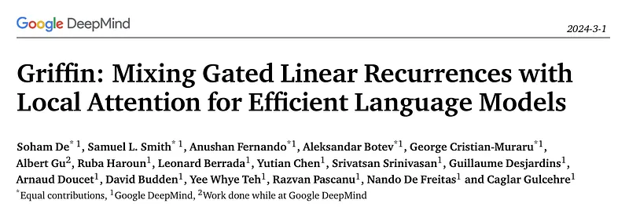
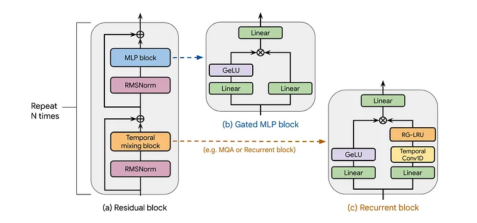
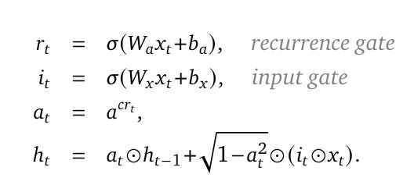
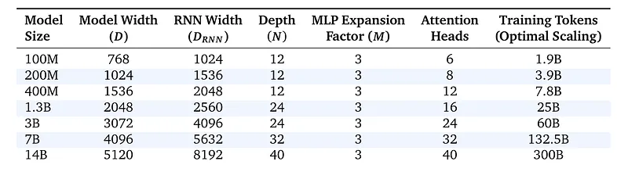
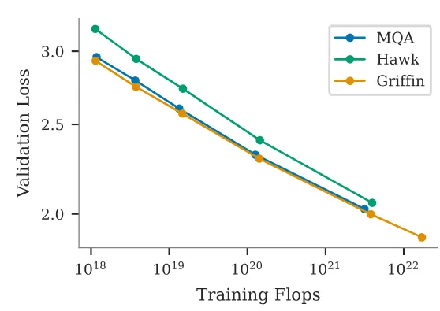
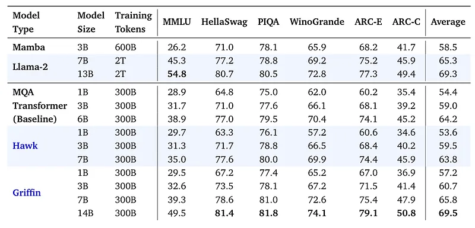
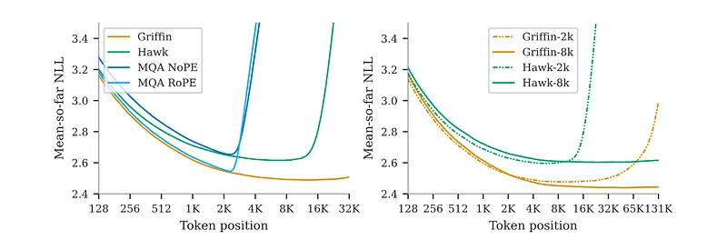
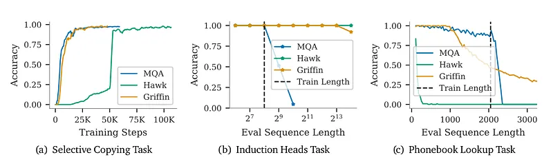

# Papers Explained 131 - Hawk, Griffin

This work presents the Real-Gated Linear Recurrent Unit (RG-LRU) layer, a novel gated linear recurrent layer, around which a new recurrent block is designed to replace Multi Query Attention.

This page ingests the source article into the wiki and connects it to [[Papers Explained Corpus]], [[Embedding and Retrieval]].

## Source Metadata

- Source file: `raw/2024-05-01_Papers-Explained-131--Hawk--Griffin-dfc8c77f5dcd.md`
- Source title: Papers Explained 131: Hawk, Griffin
- Published: 2024-05-01
- Canonical: [https://medium.com/@ritvik19/papers-explained-131-hawk-griffin-dfc8c77f5dcd](https://medium.com/@ritvik19/papers-explained-131-hawk-griffin-dfc8c77f5dcd)

## Key Ideas

- All the models contain a residual block, an MLP block, and a temporal-mixing block.
- The residual block defines the global structure of the models and is inspired by pre-norm Transformers.
- The residual block contains two components, applied in order. The first component takes the hidden state 𝑥 and applies an RMSNorm, followed by the temporal-mixing block. The output is then merged with a skip connection from 𝑥 through addition.
- A gated MLP block is used which creates two branches from its input of dimension 𝐷. A linear layer with output dimension 𝑀𝐷 is applied on each branch, where 𝑀=3 denotes the expansion factor.
- The temporal-mixing block aggregates hidden layer activations at different temporal locations in the sequence.

## Notes

This work presents the Real-Gated Linear Recurrent Unit (RG-LRU) layer, a novel gated linear recurrent layer, around which a new recurrent block is designed to replace Multi Query Attention. Two new models are built using this recurrent block: Hawk, a model which interleaves MLPs with recurrent blocks, and Griffin, a hybrid model which interleaves MLPs with a mixture of recurrent blocks and local attention.

## Model Architecture

All the models contain a residual block, an MLP block, and a temporal-mixing block. While the residual & MLP blocks are the same across all models, three temporal mixing blocks are considered: global Multi-Query Attention (MQA), local (sliding-window) MQA and the proposed Real-Gated Linear Recurrent Unit (RG-LRU).

The residual block defines the global structure of the models and is inspired by pre-norm Transformers. After embedding the input sequence is passed through 𝑁 such blocks (𝑁 denoting the model depth), and then RMSNorm is applied to produce the final activations. To compute the token probabilities a final linear layer is applied followed by a softmax. The weights of this layer are shared with the input embedding layer.

### Residual block

The residual block contains two components, applied in order. The first component takes the hidden state 𝑥 and applies an RMSNorm, followed by the temporal-mixing block. The output is then merged with a skip connection from 𝑥 through addition. Similarly, the second component applies RMSNorm, followed by the MLP block and then merges its output with a skip connection from the input of the RMSNorm.

### MLP block

A gated MLP block is used which creates two branches from its input of dimension 𝐷. A linear layer with output dimension 𝑀𝐷 is applied on each branch, where 𝑀=3 denotes the expansion factor. A GeLU non-linearity is applied on one of the branches before merging them by element-wise multiplication, similar to GeGeLU. However, a final linear layer with output dimension 𝐷 is applied on the outputs of the GeGeLU layer.

### Temporal-mixing blocks

The temporal-mixing block aggregates hidden layer activations at different temporal locations in the sequence.

Global multi-query attention

A fixed head dimension 𝐷ℎ𝑒𝑎𝑑 =128 is used , and the number of attention heads 𝐻 is fixed such that 𝐻𝐷ℎ𝑒𝑎𝑑 = 𝐷. This requires the model dimension 𝐷 to be a multiple of 128. Rotary Position Embedding (RoPE) is used as a relative positional embedding.

Local sliding window attention

One of the key disadvantages of using global attention is that its computational complexity grows quadratically in the sequence length. To address this, sliding window attention with all the details same as the global MQA is used.

Recurrent block

Two linear layers with output dimension 𝐷𝑅𝑁𝑁 are applied in parallel to the input of dimension 𝐷, creating two branches. On the first branch, a small separable Conv1D layer, with a temporal filter dimension of 4 is applied followed by the proposed RG-LRU layer. On the second branch a GeLU nonlinearity is applied. The branches are then merged by element-wise multiplication. Then a final linear layer with output dimension 𝐷 is applied.

### Real-Gated Linear Recurrent Unit (RG-LRU)

The RG-LRU combines elements from traditional linear recurrent units (LRUs) and gated mechanisms found in LSTMs and GRUs. The RG-LRU aims to improve the handling of information across time steps by using gates that control the flow of information.

Recurrence Gate (rt):

- This gate determines how much of the past information (from previous time steps) will be carried over to the current state.

Input Gate (it):

- Similar to the input gate in LSTMs, this gate controls how much of the new input data at the current time step, 𝑥𝑡, should be allowed to affect the state of the RNN.

Scaled Recurrence Weight (𝑎𝑡):

- 𝑎 is a learnable parameter, and 𝑐 is a constant set to 8. This equation scales the recurrence weight by raising it to the power of 𝑐𝑟𝑡, which is computed in log-space for numerical stability.

- This scaling helps in stabilizing the recurrence by ensuring the weights are within a controlled range.

Hidden State Update (ℎ𝑡):

- This equation updates the hidden state by blending the previous hidden state (ℎ𝑡−1) and the gated input.

- The term 𝑎𝑡 ⊙ ℎ𝑡−1 represents the contribution of the past state, modulated by the scaled recurrence weight.

- The term sqrt(1 — 𝑎𝑡²) ⊙ (𝑖𝑡 ⊙ 𝑥𝑡)) represents the contribution of the current input, where the input is first gated by 𝑖𝑡 and then scaled by sqrt(1 — 𝑎𝑡²) to ensure the total variance remains controlled.

Output (𝑦𝑡)

- The output of the layer at each time step is simply the hidden state.

### Experiment Setup

MQA Transformer baseline

The Transformer baseline uses the residual pattern and the gated MLP blocks in combinationwithMQA and RoPE.

Hawk

The Hawk architecture uses the same residual pattern and MLP block as the Transformer baseline, but it uses the recurrent block with a RG-LRU layer as the temporal mixing block, instead of MQA. The width of the recurrent block is expanded by a factor of approximately 4/3 (i.e. 𝐷𝑅𝑁𝑁 ≈4𝐷/3) in order to roughly match the parameter count of a MHA block when both use the same model dimension 𝐷.

Griffin

Griffin also uses the same residual pattern and MLP block as our Transformer baseline. But it uses a layered structure of two alternating residual blocks with a recurrent block followed by one residual block which uses the local (MQA) attention block, the local attention window size is fixed to 1024 tokens.

## Evaluation

### Scaling Efficiency of Recurrent Models vs. Transformers

- Training models from 100M to 7B parameters, with an additional Griffin model at 14B parameters.

- Adjusting the number of training tokens proportionally to model parameters based on Chinchilla scaling laws.

*Figure: Scaling curve during training*

- Griffin model demonstrates lower validation loss across all FLOPs budgets compared to the Transformer baseline.

- Hawk shows slightly higher validation loss, which narrows as the training budget increases.

### Performance on Downstream Tasks

- Evaluation of the performance of Hawk and Griffin models on various downstream tasks against external baselines.

*Figure: Character normalized accuracy.*

- Hawk and Griffin both show strong performance on downstream tasks.

- Hawk-3B outperforms Mamba-3B despite being trained on half as many tokens.

- Griffin models are competitive with, or outperform, Llama-2 despite significantly fewer training tokens.

### Improving Next Token Prediction with Longer Contexts

- Evaluation of trained models on a held-out books dataset across various sequence lengths.

- Training models on sequences of 2048 and 8192 tokens to compare performance.

*Figure: Performance of various 1B parameter models on a held-out evaluation set of books.*

- Hawk and Griffin show improved performance and extrapolation to longer sequences compared to Transformer baselines.

- Models trained on longer sequences (8192 tokens) perform better on these sequences but slightly worse on shorter sequences, suggesting a trade-off based on intended use.

### Copy and Retrieval Capabilities

- Training on synthetic tasks such as Selective Copying and Induction Heads.

- Evaluation of pre-trained models on a phone number lookup task.

- In synthetic tasks, Griffin matches the learning speed of Transformers and shows no slowdown, while Hawk is slower.

- Pre-trained Hawk and Griffin models show varying success on the phone number lookup task, with Griffin performing well up to its local attention window size.

- The results indicate potential areas for improvement in model design for tasks requiring memory and retrieval over longer contexts.

## Paper

Griffin: Mixing Gated Linear Recurrences with Local Attention for Efficient Language Models [2402.19427](https://arxiv.org/abs/2402.19427)

Recommended Reading [Beyond Transformers](https://ritvik19.medium.com/list/beyond-transformers-8d75e5dd0c10)

## Figures

Figures from the Medium HTML export (`raw/2024-05-01_Papers-Explained-131--Hawk--Griffin-dfc8c77f5dcd.md`); local copies under `wiki/assets/papers-explained-131-hawk-griffin/` when download succeeded.

| Figure | Caption |
|--------|---------|
|  | Title page of *Griffin: Mixing Gated Linear Recurrences with Local Attention for Efficient Language Models*. |
|  | Model blocks: pre-norm residual stack (a), gated GeGLU-style MLP (b), and RG-LRU recurrent temporal mixer (c). |
|  | RG-LRU gating equations for recurrence gate, input gate, scaled recurrence weight, and hidden-state update. |
|  | Scaling table of width, RNN width, depth, heads, and Chinchilla-matched token budgets from 100M to 14B parameters. |
|  | Validation loss vs training FLOPs for MQA, Hawk, and Griffin (Griffin lowest at matched compute). |
|  | Downstream accuracy vs Mamba, Llama-2, and MQA baselines across MMLU, HellaSwag, PIQA, WinoGrande, and ARC. |
|  | Mean NLL vs token position on book-like eval: Griffin/Hawk vs MQA, and effect of 2K vs 8K train contexts. |
|  | Synthetic copying/induction/phonebook tasks comparing MQA, Hawk, and Griffin extrapolation past train length. |
## Related

- [[Papers Explained Corpus]]
- [[Embedding and Retrieval]]
- [[Papers Explained 130 - Phi-3]]
- [[Papers Explained 132 - RecurrentGemma]]

#summary #topic
