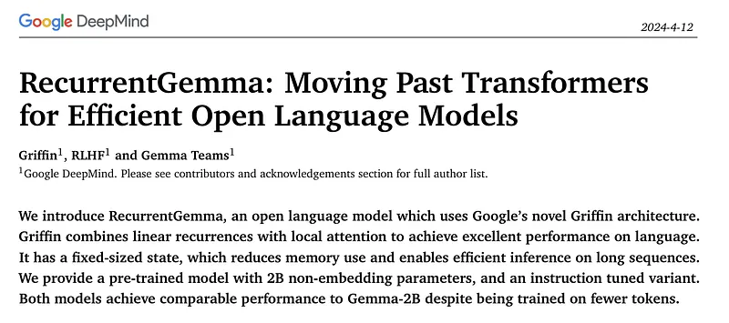
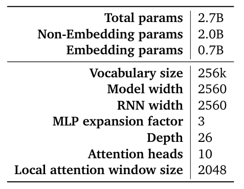
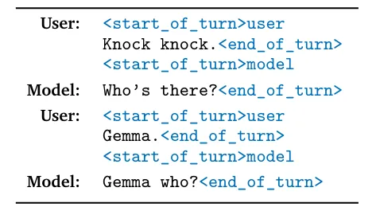
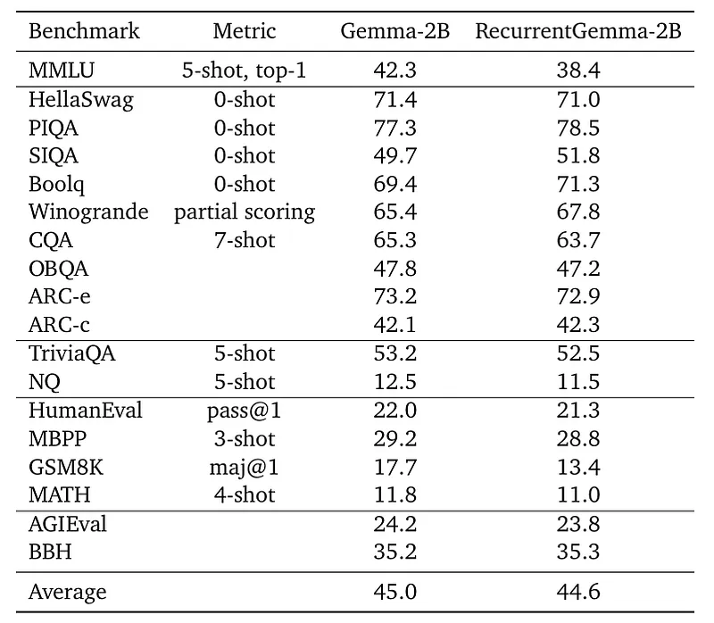
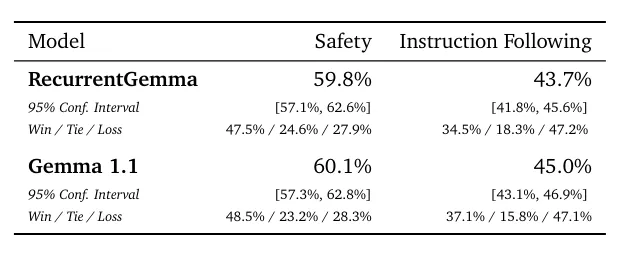
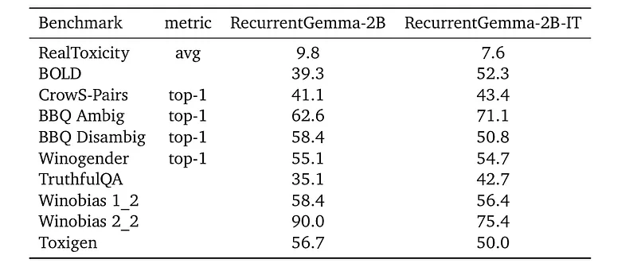
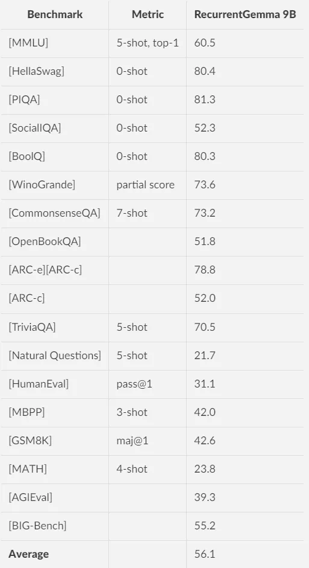
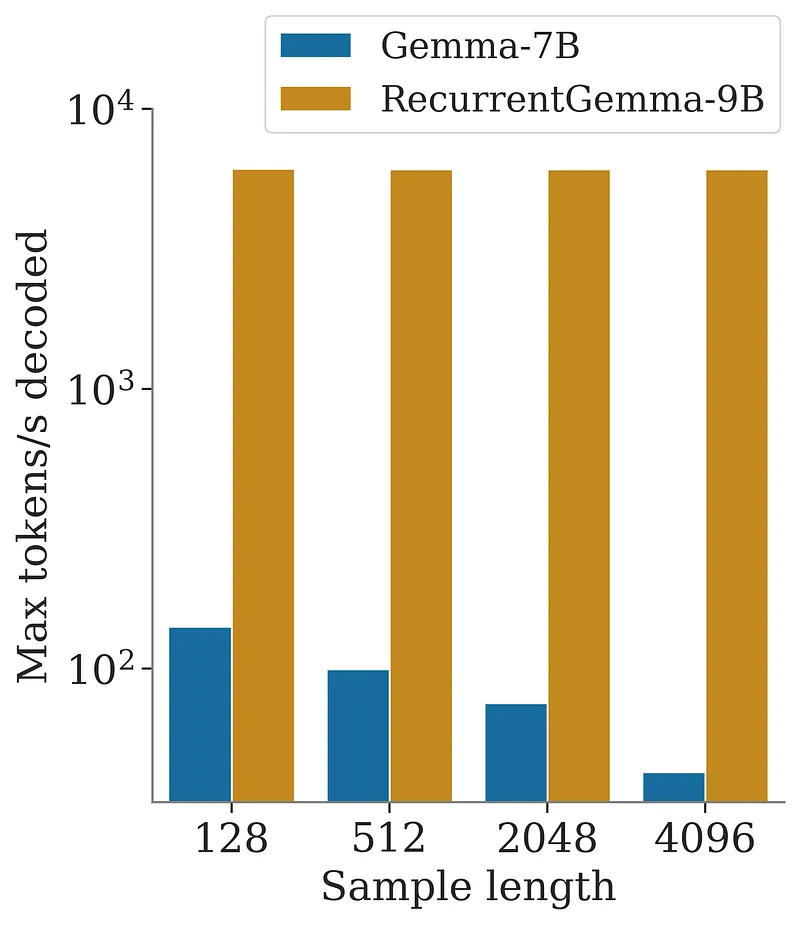
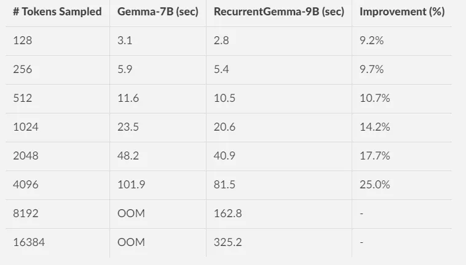

# Papers Explained 132 - RecurrentGemma

RecurrentGemma-2B is an open model based on the Griffin architecture. It uses a combination of linear recurrences and local attention instead of global attention.

This page ingests the source article into the wiki and connects it to [[Papers Explained Corpus]], [[Large Language Models]], [[Embedding and Retrieval]], [[Code Models]].

## Source Metadata

- Source file: `raw/2024-05-03_Papers-Explained-132--RecurrentGemma-52732d0f4273.md`
- Source title: Papers Explained 132: RecurrentGemma
- Published: 2024-05-03
- Canonical: [https://medium.com/@ritvik19/papers-explained-132-recurrentgemma-52732d0f4273](https://medium.com/@ritvik19/papers-explained-132-recurrentgemma-52732d0f4273)

## Key Ideas

- The project is available at [GitHub](https://github.com/google-deepmind/recurrentgemma).
- The models are available at [HuggingFace](https://huggingface.co/collections/google/recurrentgemma-release-66152cbdd2d6619cb1665b7a).
- Recommended Reading [Papers Explained 131: Hawk, Griffin](https://ritvik19.medium.com/papers-explained-131-hawk-griffin-dfc8c77f5dcd)
- One single modification is made to the Griffin architecture, which is to multiply the input embeddings by a constant equal to the square root of model width. The input and output embeddings are tied, but this factor is not applied to the output.
- A similar multiplicative factor appears in Gemma as well.

## Notes

RecurrentGemma-2B is an open model based on the Griffin architecture. It uses a combination of linear recurrences and local attention instead of global attention.

The project is available at [GitHub](https://github.com/google-deepmind/recurrentgemma).

The models are available at [HuggingFace](https://huggingface.co/collections/google/recurrentgemma-release-66152cbdd2d6619cb1665b7a).

Recommended Reading [Papers Explained 131: Hawk, Griffin](https://ritvik19.medium.com/papers-explained-131-hawk-griffin-dfc8c77f5dcd)

## Architecture

One single modification is made to the Griffin architecture, which is to multiply the input embeddings by a constant equal to the square root of model width. The input and output embeddings are tied, but this factor is not applied to the output.

A similar multiplicative factor appears in Gemma as well.

*Figure: Key model hyper-parameters.*

## Training

### Pre training

Recurrent Gemma is trained on sequences of 8192 tokens of the same pre-training data as Gemma-2B, which comprises primarily English data from web documents, mathematics and code.

RecurrentGemma-2B is trained on 2T tokens as compared to 3T tokens in case of Gemma-2B.

Like Gemma, a subset of the SentencePiece tokenizer, with a vocabulary size of 256k tokens is used.

### Instruction turing and RLHF

A similar instruction tuning approach to Gemma, including a novel RLHF algorithm to fine-tune the model to output responses with high reward is followed.

*Figure: Example dialogue with control tokens.*

## Evaluation

### Automated Benchmarks

*Figure: Academic benchmark results, compared to the Gemma-2B model.*

- RecurrentGemma-2B shows comparable performance to Gemma-2B, despite being trained on 50% fewer tokens.

### Human Evaluation

Human evaluation with a held-out collection of prompts (1000 for creative and coding tasks, 400 for safety protocols).

*Figure: Human evaluation scores for safety and instruction following on RecurrentGemma vs Gemma 1.1, with 95% confidence intervals and win/tie/loss breakdowns.*

- RecurrentGemma-2B-IT achieves a 43.7% win rate in creative and coding tasks, slightly below Gemma-1.1–2B-IT’s 45.0%.

- Demonstrates competitive performance despite the smaller model size.

### Model Safety and Responsible Deployment

Evaluation on standard academic safety benchmarks and Independent ethics and safety evaluations.

*Figure: Safety academic benchmark results.*

- RecurrentGemma meets safety benchmarks with improved scores in instruction-tuned variants.

## RecurrentGemma 9B

### Automated Benchmarks

### Inference Speed Results

The throughput is evaluated as the maximum number of tokens produced per second by increasing the batch size, of RecurrentGemma-9B compared to Gemma-7B, using a prefill of 2K tokens.

- RecurrentGemma provides improved sampling speeds, particularly for long sequences or large batch sizes.

End-to-end speedups achieved by RecurrentGemma-9B are comparedover Gemma-7B when sampling a long sequence after a prefill of 4K tokens and using a batch size of 1.

## Paper

RecurrentGemma: Moving Past Transformers for Efficient Open Language Models [2404.07839](https://arxiv.org/abs/2404.07839)

Recommended Reading [Beyond Transformers](https://ritvik19.medium.com/list/beyond-transformers-8d75e5dd0c10) [Gemini / Gemma Models](https://ritvik19.medium.com/list/gemini-gemma-models-4cb7dfc50d42)

## Figures

Figures from the Medium HTML export (`raw/2024-05-03_Papers-Explained-132--RecurrentGemma-52732d0f4273.md`); local copies under `wiki/assets/papers-explained-132-recurrentgemma/` when download succeeded.

| Figure | Caption |
|--------|---------|
|  | Title and abstract of *RecurrentGemma: Moving Past Transformers for Efficient Open Language Models*. |
|  | RecurrentGemma-2B parameter split (total vs non-embedding) and core architecture hyperparameters. |
|  | Example Gemma-style dialogue with `<start_of_turn>` / `<end_of_turn>` control tokens. |
|  | Academic benchmarks comparing Gemma-2B and RecurrentGemma-2B (near-matched averages ~45.0 vs ~44.6). |
|  | Human-eval safety and instruction-following scores for RecurrentGemma vs Gemma 1.1 with confidence intervals. |
|  | Safety and bias benchmark scores for RecurrentGemma-2B vs its instruction-tuned RecurrentGemma-2B-IT variant. |
|  | RecurrentGemma-9B scores across MMLU, commonsense, QA, coding, math, and BIG-Bench-style evaluations. |
|  | Decoding throughput vs output length for Gemma-7B vs RecurrentGemma-9B after ~2K-token prefill. |
|  | Long-sequence sampling latency and memory: Gemma-7B OOMs while RecurrentGemma-9B completes up to 16K tokens. |
## Related

- [[Papers Explained Corpus]]
- [[Large Language Models]]
- [[Embedding and Retrieval]]
- [[Code Models]]
- [[Papers Explained 131 - Hawk, Griffin]]
- [[Papers Explained 133 - Rho-1]]

#summary #topic
