# Papers Explained 133 - Rho-1

The study analyzes token-level training dynamics of language models, revealing distinct loss patterns for different tokens. RHO-1 leverages these insights and employs Selective Language Modeling (SLM), which selectively trains on useful tokens that are aligned with the desired distribution.

This page ingests the source article into the wiki and connects it to [[Papers Explained Corpus]], [[Large Language Models]], [[Safety and Alignment]].

## Source Metadata

- Source file: `raw/2024-05-06_Papers-Explained-133--Rho-1-788125e42241.md`
- Source title: Papers Explained 133: Rho-1
- Published: 2024-05-06
- Canonical: [https://medium.com/@ritvik19/papers-explained-132-rho-1-788125e42241](https://medium.com/@ritvik19/papers-explained-132-rho-1-788125e42241)

## Key Ideas

- The study analyzes token-level training dynamics of language models, revealing distinct loss patterns for different tokens.
- The project is available at [GitHub](https://github.com/microsoft/rho).
- Tinyllama-1B is continually pre-trained with 15B tokens from OpenWebMath and token-level loss is evaluated at these intervals using the validation set of approximately 320,000 tokens.
- Based on the loss trajectory, tokens fall into four categories:
- 11% are in the persistent high loss (H→H) category, likely due to high aleatoric uncertainty.

## Notes

The study analyzes token-level training dynamics of language models, revealing distinct loss patterns for different tokens. RHO-1 leverages these insights and employs Selective Language Modeling (SLM), which selectively trains on useful tokens that are aligned with the desired distribution.

The project is available at [GitHub](https://github.com/microsoft/rho).

*Figure: Upper: Even an extensively filtered pretraining corpus contains token-level noise. Left: Previous Causal Language Modeling (CLM) trains on all tokens. Right: Selective Language Modeling (SLM) selectively applies loss on those useful and clean tokens.*

## Selective Language Modeling

### Training Dynamics of Token Loss

Tinyllama-1B is continually pre-trained with 15B tokens from OpenWebMath and token-level loss is evaluated at these intervals using the validation set of approximately 320,000 tokens.

*Figure: The loss of four categories of tokens during pretraining.*

Based on the loss trajectory, tokens fall into four categories:

- 11% are in the persistent high loss (H→H) category, likely due to high aleatoric uncertainty.

- 12% experience an unlikely increasing loss (L→H).

- 26% show decreasing loss (H→L).

- 51% remain in the consistent low loss (L→L) category, indicating they have already been learned.

The loss of many L→L and H→H tokens show high variance during training.

### Overview

*Figure: The pipeline of Selective Language Modeling (SLM).*

Selective Language Modeling comprises three steps:

- The reference model is trained on a curated, high-quality dataset to begin with.

- The loss of each token within the pretraining corpus is then assessed by this model.

- The language model is then selectively trained, focusing on tokens with high excess loss between the training and reference model.

The intuition is that tokens with high excess loss are more learnable and better aligned with the desired distribution, naturally excluding tokens that are either irrelevant or of low quality.

### Reference Modeling

A reference model (RM) is trained using standard cross-entropy loss on the curated data. Thereference loss (Lref) of a token is calculated xi based on the probability that the RM assigns to this token:

### Selective Pretraining

Causal language modeling employs the cross-entropy loss:

The excess loss (L∆) for a token xi is defined as the difference between the current training model loss (Lθ) and the reference loss:

Selective Language Modeling trains the language model with a focus on tokens that exhibit a high excess loss when compared to the reference model. A token selection ratio k%, is used to determine the proportion of tokens to be included:

Here, N ∗ k% defines the number of tokens that fall within the top k% of excess loss. Ik%(xi) is the indicator function:

In practice, token selection can be implemented by ranking the tokens in a batch according to their excess loss and using only the top k% of tokens for training.

## Evaluation

### Experiment Setup

Reference Model Training To train the mathematical reference model, a dataset of 0.5B high-quality, math-related tokens is curated as a blend of synthetic data from GPT and manually curated data. For the general reference model, a corpus of 1.9B tokens is compiled from open-source datasets, such as Tulu-v2 and OpenHermes-2.5 . The reference models is trained for 3 epochs.

Pretraining For mathematical reasoning, the OpenWebMath dataset, which comprises approximately 14B tokens sourced from math-related web pages in the Common Crawl is used. In the general domain, the SlimPajama and StarCoderData are combined (both part of the Tinyllama corpus) with OpenWebMath, training on a total of 80 billion tokens with a mix ratio of 6:3:1. The pretraining is continued on the Tinyllama-1.1B model and the Mistral-7B model.

### Math Pre-training Results

Few-shot CoT Reasoning Results

*Figure: Few-shot CoT reasoning results of math pretraining.*

- RHO-1-Math models achieved an average few-shot accuracy improvement of 16.5% on 1B models and 10.4% on 7B models compared to continuing pretraining directly.

- After multiple training epochs on OpenWebMath, RHO-1 models further increased the average few-shot accuracy to 40.9%.

- RHO-1–7B, despite being pretrained on significantly fewer tokens (15 billion) compared to DeepSeekMath-7B (500 billion tokens), achieved comparable results, highlighting the efficiency of the approach used in this study.

Tool-Integrated Reasoning Results

RHO-1 and baseline models are finetuned on 69k ToRA corpus, consisting of 16k GPT-4-generated trajectories in a tool-integrated reasoning format, and 53k answer-augmented samples using LLaMA.

*Figure: Tool-integrated reasoning results of math pretraining.*

- RHO-1 models achieved state-of-the-art performance on the MATH dataset, with RHO-1–1B and RHO-1–7B models reaching 40.6% and 51.8% accuracy, respectively.

- Demonstrated generalizability on unseen tasks such as TabMWP and GSM-Hard, with RHO-1 models showing an average few-shot accuracy improvement of 6.2% for RHO-1-Math-1B and 2.7% for RHO-1-Math-7B.

### General Pre-training Results

*Figure: General pretraining results.*

- Although Tinyllama has already undergone extensive training, the application of SLM yields an average enhancement of 6.8% across 15 benchmarks compared to direct continual pretraining.

- The improvements were especially pronounced in code and math tasks, exceeding 10%.

## Paper

Rho-1: Not All Tokens Are What You Need [2404.07965](https://arxiv.org/abs/2404.07965)

## Figures

Figures from the Medium HTML export (`raw/2024-05-06_Papers-Explained-133--Rho-1-788125e42241.md`); local copies under `wiki/assets/papers-explained-133-rho-1/` when download succeeded.

| Figure | Caption |
|--------|---------|
| 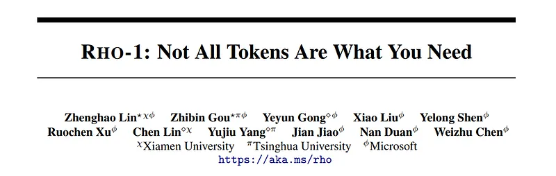 | Title page of *RHO-1: Not All Tokens Are What You Need*. |
| 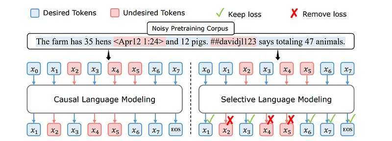 | Noisy-web example contrasting CLM (loss on every token) with SLM (mask loss on undesired tokens only). |
| 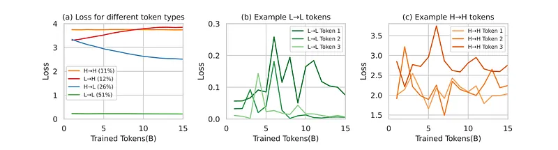 | Token-loss trajectories by category (L→L, H→L, L→H, H→H) plus example token traces for stable vs stubborn high-loss types. |
| 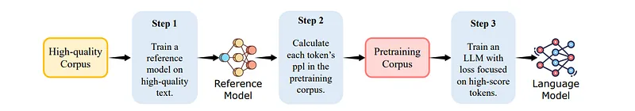 | SLM pipeline: train reference on clean text, score pretraining tokens, then train LM with selective loss on high-signal tokens. |
| 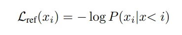 | Reference loss $\mathcal{L}_{\text{ref}}$ as negative log-probability under the reference model. |
| 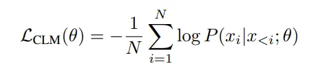 | Standard causal LM objective $\mathcal{L}_{\text{CLM}}$ averaged over all positions. |
| 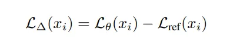 | Excess loss $\mathcal{L}_{\Delta}$ defined as training-model loss minus reference loss per token. |
| 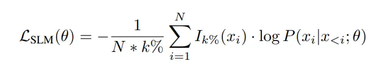 | Selective LM objective $\mathcal{L}_{\text{SLM}}$ summing log-loss only over top-$k\%$ excess-loss tokens. |
| 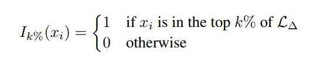 | Indicator mask $I_{k\%}$ selecting tokens in the top $k\%$ of excess loss for gradient updates. |
| 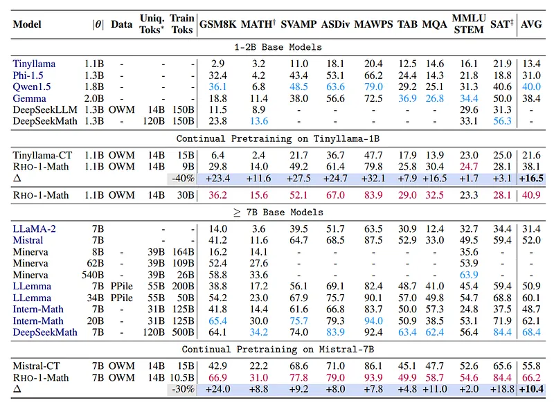 | Few-shot chain-of-thought math benchmark table for RHO-1-Math continual pretrain vs baselines (1B and 7B regimes). |
| 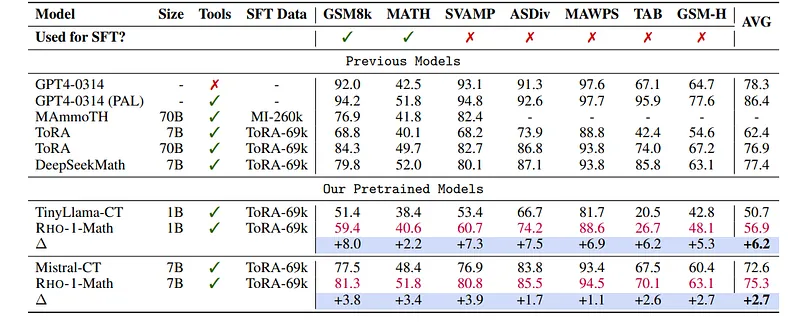 | Tool-integrated reasoning results after ToRA-style SFT, highlighting RHO-1-Math gains over TinyLlama-CT and Mistral-CT. |
| 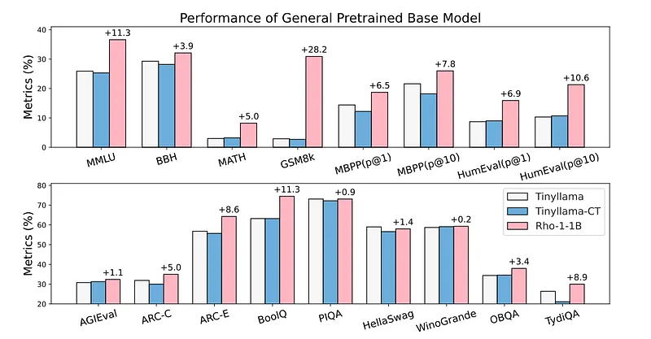 | General-domain pretraining bar charts: Rho-1-1B vs TinyLlama baselines on reasoning, math, code, and knowledge tasks. |
## Related

- [[Papers Explained Corpus]]
- [[Large Language Models]]
- [[Safety and Alignment]]
- [[Papers Explained 132 - RecurrentGemma]]
- [[Papers Explained 134 - Open ELM]]

#summary #topic
