# Papers Explained 134 - Open ELM

OpenELM is an open language model by Apple with not only open source model weights and inference code but the complete framework for training and evaluation of the language model.

This page ingests the source article into the wiki and connects it to [[Papers Explained Corpus]], [[Large Language Models]], [[Code Models]], [[Evaluation and Benchmarks]], [[Embedding and Retrieval]].

## Source Metadata

- Source file: `raw/2024-05-08_Papers-Explained-134--Open-ELM-864f6b28a6ab.html`
- Source title: Papers Explained 134: Open ELM
- Published: 2024-05-08
- Canonical: [https://medium.com/@ritvik19/papers-explained-133-open-elm-864f6b28a6ab](https://medium.com/@ritvik19/papers-explained-133-open-elm-864f6b28a6ab)

## Key Ideas

- It uses a layer-wise scaling strategy to efficiently allocate parameters within each layer of the transformer model, leading to enhanced accuracy.
- The source code along with pre-trained model weights and training recipes are available at [GitHub](https://github.com/apple/corenet).
- OpenELM adopts the decoder-only transformer-based architecture.
- Learnable bias parameters are not used in any fully-connected (linear) layers
- Pre-normalization is applied using RMSNorm

## Notes

OpenELM is an open language model by Apple with not only open source model weights and inference code but the complete framework for training and evaluation of the language model.

It uses a layer-wise scaling strategy to efficiently allocate parameters within each layer of the transformer model, leading to enhanced accuracy.

The source code along with pre-trained model weights and training recipes are available at [GitHub](https://github.com/apple/corenet).

## OpenELM Architecture

OpenELM adopts the decoder-only transformer-based architecture.

- Learnable bias parameters are not used in any fully-connected (linear) layers

- Pre-normalization is applied using RMSNorm

- Rotary positional embedding (ROPE) is used for encoding positional information

- Grouped query attention (GQA) is used instead of multi-head attention (MHA)

- The feed forward network (FFN) is replaced with SwiGLU FFN

- Flash attention is used for computing the scaled dot-product attention

- The tokenizer from LLama is used.

### Layer-wise scaling

A standard transformer model has N transformer layers and the dimensionality of the input to each layer is d_model. The MHA has n_h heads and dimension of each head is d_h = d_model /n_h .Also, the hidden dimension for FFN is d_FFN = m · d_model, where m is a scalar FFN multiplier.

Parameters α and β are introduced to scale the number of attention heads n_h and FFN multiplier m per layer, thus the width of the FFN layers respectively. For the i-th layer, n_h and m are computed as:

## Pre-training data

Publicly available datasets totalling 1.8 T tokens used for pretraining.

Text filtering and tokenization are performed on the fly facilitating seamless experimentation with various tokenizers. Sequences having less than 200 characters or 256 tokens are removed.

*Figure: Dataset used for pre-training OpenELM.*

## Training details

OpenELM variants are pre-trained for 350k iterations, with the following hyperparameters.

*Figure: Pre-training details for different variants of OpenELM.*

The cleaned variant of UltraFeedback dataset that consists of 60k prompts is used for instruction tuning using the Alignment Handbook library. For optimization, either the statistical rejection sampling method or the direct preference optimization method is used.

*Figure: Instruction tuning details for different variants of OpenELM.*

## Evaluation

*Figure: Tasks and metrics used for evaluating OpenELM.*

### Pre-training results

*Figure: . OpenELM’s performance across training iterations on standard zero-shot tasks.*

- OpenELM shows an overall increase in accuracy with longer training durations.

*Figure: Results on zero-shot tasks.*

*Figure: Results on OpenLLM Leaderboard tasks.*

*Figure: Results on LLM360 tasks.*

- OpenELM 1.1 B parameters 1.28% (Zero Shot Tasks), 2.36% (OpenLLM Leaderboard), and 1.72% (LLM360) higher accuracy compared to OLMo 1.2 B, while using 2× less pretraining data..

### Instruction tuning results

*Figure: Results on zero-shot tasks.*

*Figure: Results on OpenLLM Leaderboard tasks.*

*Figure: Results on LLM360 tasks.*

- Instruction tuning consistently improves OpenELM’s average accuracy by 1–2% across different evaluation frameworks.

### Parameter-efficient fine-tuning (PEFT) results.

*Figure: OpenELM with PEFT.*

- LoRA and DoRA deliver similar accuracy on average across the given CommonSense reasoning datasets.

## Paper

OpenELM: An Efficient Language Model Family with Open-source Training and Inference Framework [2404.14619](https://arxiv.org/abs/2404.14619)

Recommended Reading: [Small LLMs](https://ritvik19.medium.com/list/small-llms-41124d5c7c80)

## Figures

Figures from the Medium HTML export (`raw/2024-05-08_Papers-Explained-134--Open-ELM-864f6b28a6ab.html`); local copies under `wiki/assets/papers-explained-134-open-elm/` when download succeeded.

| Figure | Caption |
|--------|---------|
| 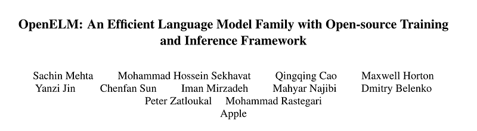 | Title page of *OpenELM: An Efficient Language Model Family with Open-source Training and Inference Framework*. |
| 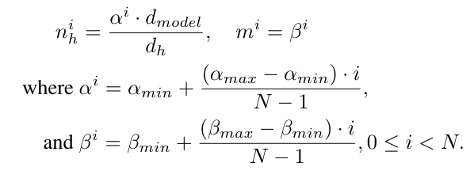 | Layer-wise scaling: linear interpolation of per-layer head counts ($n_h^i$) and FFN width multiplier ($m^i$) via $\alpha^i$, $\beta^i$. |
| 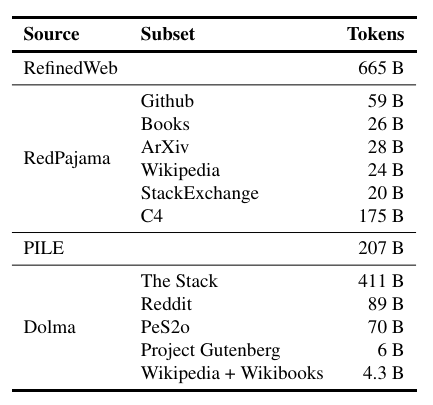 | Pretraining mixture token counts across RefinedWeb, RedPajama slices, PILE, and Dolma subsets (~1.8T tokens total). |
| 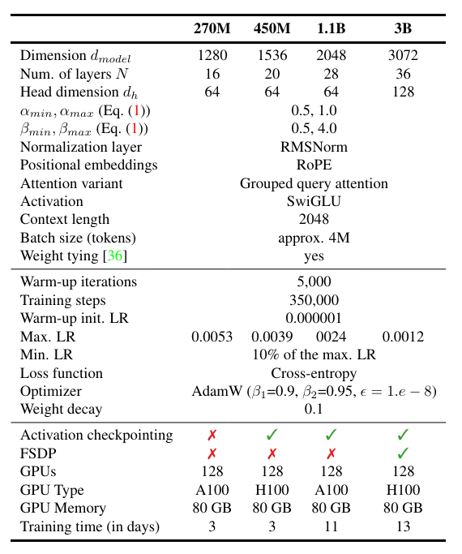 | OpenELM 270M–3B pretraining recipe: architecture dims, AdamW schedule, FSDP/checkpointing, GPUs, and wall-clock. |
| 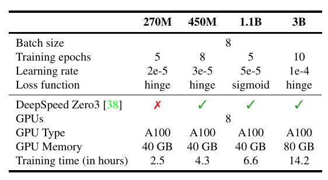 | Instruction-tuning stages: batch sizes, epochs, LR, loss variants, DeepSpeed ZeRO-3 usage, and train hours per scale. |
| 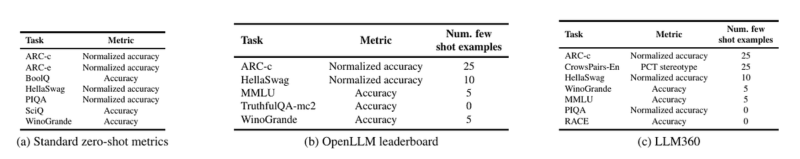 | Evaluation suites: standard zero-shot tasks, Hugging Face Open LLM Leaderboard tasks, and LLM360 tasks with few-shot counts. |
| 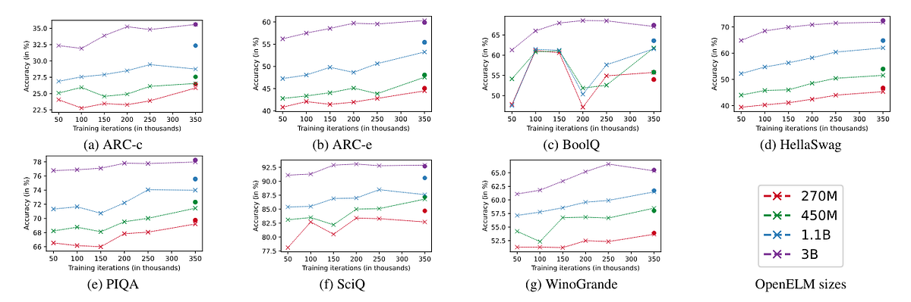 | Zero-shot accuracy vs training iterations (50k–350k) for OpenELM 270M–3B on ARC, BoolQ, HellaSwag, PIQA, SciQ, WinoGrande. |
| 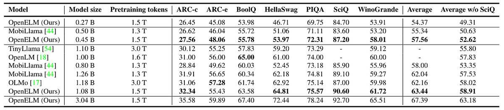 | Zero-shot benchmark table vs TinyLlama, OLMo, OpenLM, and MobiLlama at matched approximate parameter scales. |
| 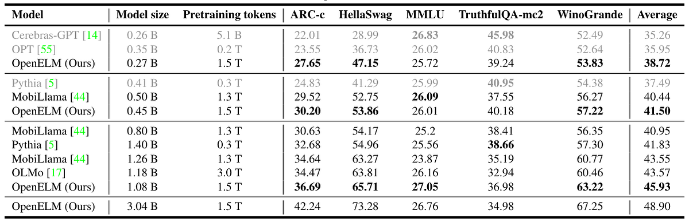 | Open LLM Leaderboard-style comparison across ARC-c, HellaSwag, MMLU, TruthfulQA, and WinoGrande. |
| 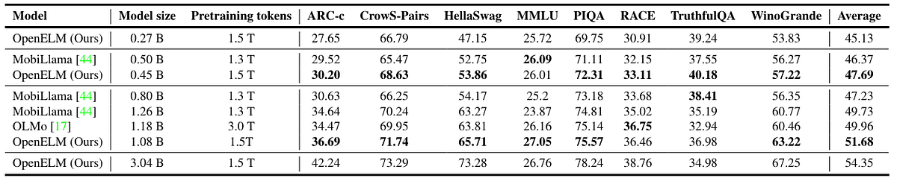 | LLM360-style comparison including bias (CrowS-Pairs) and reading comprehension (RACE) alongside core LM benchmarks. |
| 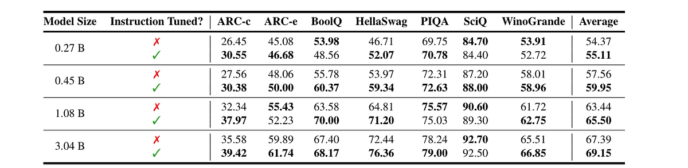 | Effect of instruction tuning on the standard zero-shot task bundle for each OpenELM model size. |
| 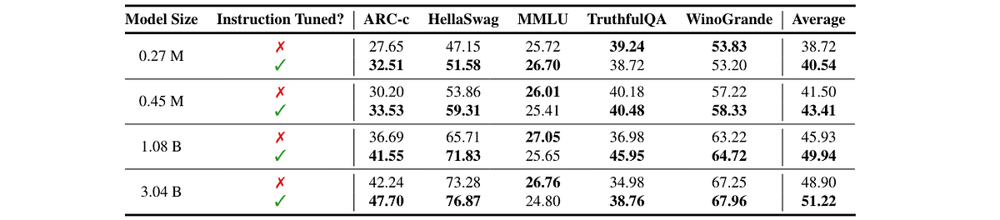 | Instruction tuning deltas on the Open LLM Leaderboard task mix by model scale. |
| 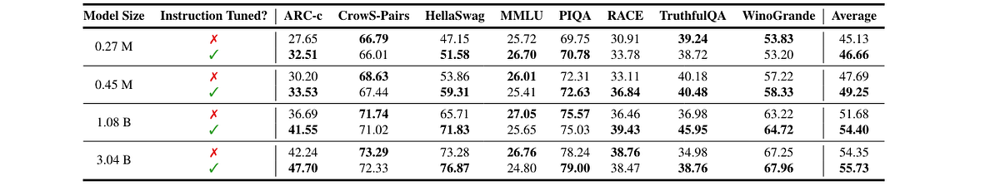 | Instruction tuning deltas on the LLM360 evaluation mix by model scale. |
| 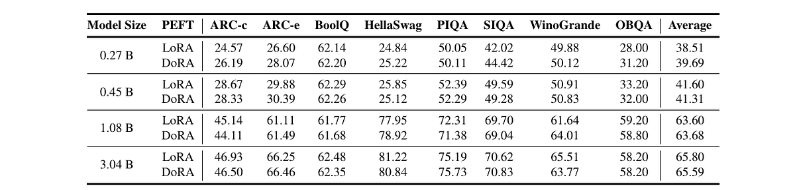 | Commonsense PEFT study comparing LoRA vs DoRA across OpenELM sizes on ARC, BoolQ, HellaSwag, PIQA, SIQA, OBQA, WinoGrande. |
## Related

- [[Papers Explained Corpus]]
- [[Large Language Models]]
- [[Code Models]]
- [[Evaluation and Benchmarks]]
- [[Embedding and Retrieval]]
- [[Papers Explained 133 - Rho-1]]
- [[Papers Explained 135 - DSPy]]

#summary #topic
