# Papers Explained 136 - LLMLingua

LLMLingua is a coarse-to-fine prompt compression method that involves a budget controller to maintain semantic integrity under high compression ratios, a token-level iterative compression algorithm to better model the interdependence between compressed contents, and an instruction tuning based method for distribution alignment between...

This page ingests the source article into the wiki and connects it to [[Papers Explained Corpus]], [[Model Compression and Efficiency]], [[Large Language Models]], [[Safety and Alignment]], [[Supervised Fine-Tuning]].

## Source Metadata

- Source file: `raw/2024-05-13_Papers-Explained-136--LLMLingua-f9b2f53f5f9b.md`
- Source title: Papers Explained 136: LLMLingua
- Published: 2024-05-13
- Canonical: [https://medium.com/@ritvik19/papers-explained-136-llmlingua-f9b2f53f5f9b](https://medium.com/@ritvik19/papers-explained-136-llmlingua-f9b2f53f5f9b)

## Key Ideas

- LLMLingua is a coarse-to-fine prompt compression method
that involves a budget controller to maintain semantic integrity under high compression ratios, a token-level iterative compression algorithm to better model the interdependence between compressed...
- The project is available at [llmlingua.com](https://llmlingua.com/).
- The original prompt, denoted as x of length L, is composed of three main elements: instruction (x_ins), demonstrations (x_dems), and question (x_que) of lengts L_ins, L_dems and L_querespectively.
- The compression rate is then defined as 𝜏 = 𝐿~/𝐿, 𝜏 ∈ [0, 1], and the compression ratio is 1/𝜏. A smaller value of 𝜏 implies a lower inference cost, which is preferable.
- The budget controller is designed to allocate different budgets, i.e., compression ratio, to different components in a prompt. It operates under two key considerations:

## Notes

LLMLingua is a coarse-to-fine prompt compression method
that involves a budget controller to maintain semantic integrity under high compression ratios, a token-level iterative compression algorithm to better model the interdependence between compressed contents, and an instruction tuning based method for distribution alignment between language models.

The project is available at [llmlingua.com](https://llmlingua.com/).

## Problem Formulation

The original prompt, denoted as x of length L, is composed of three main elements: instruction (x_ins), demonstrations (x_dems), and question (x_que) of lengts L_ins, L_dems and L_querespectively. The goal of the compression system is to generate a compressed version of the original prompt, (x~), which contains fewer tokens (L~) while retaining the essential information necessary for the llm to generate accurate and relevant outputs.

The compression rate is then defined as 𝜏 = 𝐿~/𝐿, 𝜏 ∈ [0, 1], and the compression ratio is 1/𝜏. A smaller value of 𝜏 implies a lower inference cost, which is preferable. Let x~G represent the LLM-generated results derived by x~ and xG denotes the tokens derived by x, the distribution of x~G is expected to be as similar to x𝐺 as possible. This can be formulated as:

## Method

*Figure: Framework of the proposed approach LLMLingua*

### Budget Controller

The budget controller is designed to allocate different budgets, i.e., compression ratio, to different components in a prompt. It operates under two key considerations:

- Importance of Components: Instructions and questions are deemed more critical for generating accurate results, as they encapsulate essential knowledge for answer generation. Demonstrations, however, might contain redundant information, thus can be subjected to higher compression.

- Compression Level: At high compression ratios, sentence-level dropout is preferred over token-level dropout to maintain linguistic integrity, especially when dealing with redundant demonstrations.

Firstly the compression rate for demonstrations is calculated according to the target overall compression rate and the pre-defined compression rate for instructions and questions:

Then a coarse-grained demonstration-level prompt compression is performed to construct D, a subset of x_dems by selecting demonstrations in decreasing order of perplexity calculated by small model M𝑠 (GPT-2 or LLaMA) until the total number of tokens in D exceed maximum tokens 𝑘 ·𝜏dems.𝐿dems, where 𝑘 is the granular control coefficient.

After obtaining the coarse-grained compression result D, the remaining budget is allocated to the instruction and the question:

### Iterative Token-level Prompt Compression

The ITPC algorithm addresses the limitations of using perplexity for prompt compression by mitigating the inaccuracies introduced by the conditional independence assumption.

It involves dividing the target prompt into segments and iteratively compressing tokens within each segment based on their conditional probabilities.

The corresponding probability estimation function can be formulated as:

where 𝑠𝑗,𝑖 denotes the 𝑖-th token in the 𝑗-th segment, 𝐿𝑠, 𝑗 and 𝐿~𝑠, 𝑗 represent the token length of 𝑗-th original and compressed segment, respectively.

When the conditional probabilities for each segment 𝑝(s𝑗) are obtained, the compression ratio threshold 𝛾𝑗 w.r.t. s𝑗 are dynamically calculated based on the PPL distribution and the corresponding compression ratio 𝜏s𝑗 , where

Finally, tokens in each s𝑗 with the PPL greater than 𝛾𝑗 are retained in the compressed prompt.

### Distribution Alignment

To narrow the gap between the distribution of the LLM and that of the small language model (M𝑠) used for prompt compression, the two distributions are aligned via instruction tuning using the data generated by the LLM.

The optimization of M𝑠 can be formulated as:

where 𝜃M𝑠 denotes the parameters of M𝑠, (x𝑖, yLLM) denotes the pair of instruction x𝑖 and 𝑖 the LLM generated texts yLLM, 𝑁 is the number of 𝑖 all examples used for instruction tuning.

## Evaluation

Datasets Used: For reasoning and in-context learning (ICL): GSM8K and BBH. — For contextual understanding: ShareGPT for conversation and Arxiv-March23 for summarization.

Evaluation Metrics: Exact Match for GSM8K and BBH. — BLEU, ROUGE, and BERTScore for ShareGPT and Arxiv-March23.

Implementation Details:

- Target LLMs: GPT-3.5-Turbo-0301 and Claude-v1.3.

- Small pre-trained language model M𝑠 for compression: Alpaca-7B4 or GPT2-Alpaca.

Baselines: GPT4-Generation, Random Selection, Selective-Context.

*Figure: Performance of different methods under different target compression ratios on the conversation (ShareGPT) and summarization (Arxiv-March23) task.*

*Figure: Performance of different methods under different target compression ratios on the GSM8K mathematical reasoning and Big-bench Hard (BBH) datasets.*

- LLMLingua significantly outperforms prior methods in almost all experiments.

- On GSM8K and BBH, the it achieves slightly higher results than the full-shot approach and impressive compression ratios, demonstrating effective retention of reasoning information.

- Under half-shot and quarter-shot constraints, performance slightly declines with compression ratios of up to 14x and 20x for GSM8K and 7x for BBH, yet remains satisfactory.

- On ShareGPT and Arxiv-March23, the it achieves acceleration ratios of 9x and 3.3x respectively, with high BERTScore F1, indicating successful retention of semantic information.

## Paper

LLMLingua: Compressing Prompts for Accelerated Inference of Large Language Models [2310.05736](https://arxiv.org/abs/2310.05736)

Recommended Reading [LLM Lingua Series](https://ritvik19.medium.com/list/llm-lingua-series-2f61b47d0343)

## Figures

Figures from the Medium HTML export (`raw/2024-05-13_Papers-Explained-136--LLMLingua-f9b2f53f5f9b.md`); local copies under `wiki/assets/papers-explained-136-llmlingua/` when download succeeded.

| Figure | Caption |
|--------|---------|
| 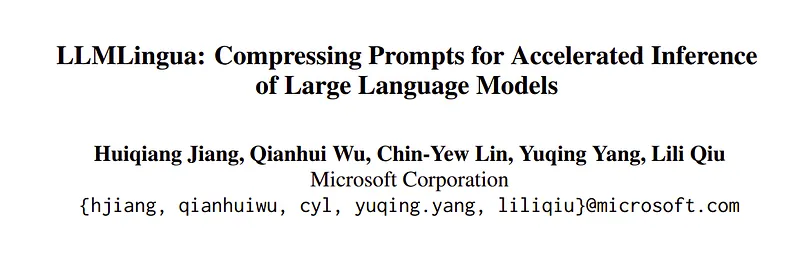 | Title page of *LLMLingua: Compressing Prompts for Accelerated Inference of Large Language Models*. |
| 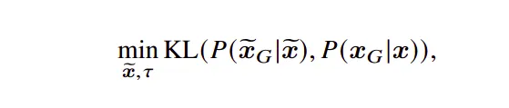 | KL-alignment objective: minimize divergence between outputs under compressed prompt $\tilde{x}$ versus full prompt $x$. |
| 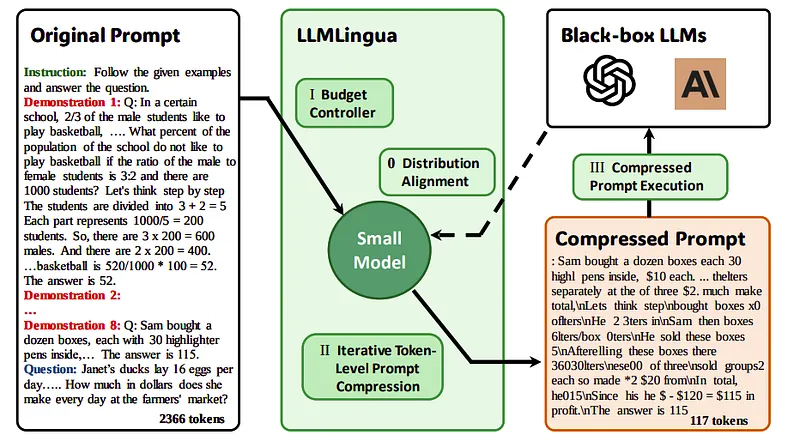 | End-to-end diagram: budget controller, iterative token-level compression, and distribution-aligned small model shrink a long prompt before calling black-box LLMs. |
| 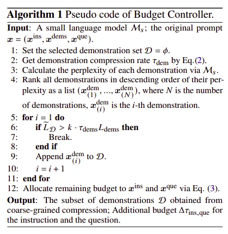 | Pseudocode for the budget controller: rank demonstrations by perplexity, pack until demo budget, then release slack to instruction and question. |
| 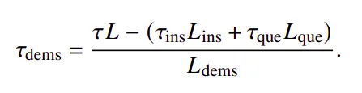 | Closed form for demonstration compression rate $\tau_{\text{dems}}$ given overall $\tau$ and fixed rates on instruction and question segments. |
| 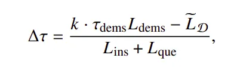 | Budget slack $\Delta\tau$ reassigned to instruction and question after coarse demo selection. |
| 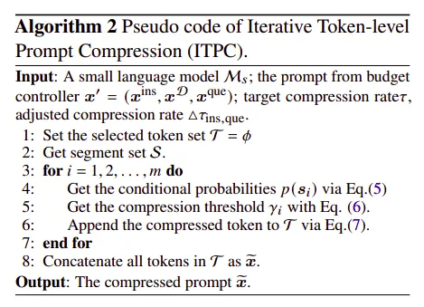 | Pseudocode for iterative token-level prompt compression (ITPC): segment-wise thresholds from conditional perplexities, then concatenate retained tokens. |
| 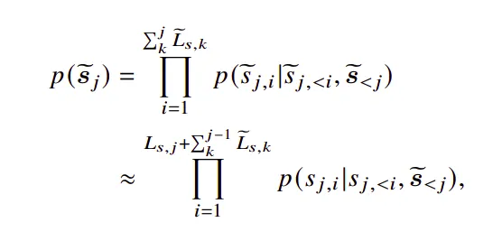 | Exact vs approximated segment probabilities used inside ITPC's perplexity-driven scoring. |
| 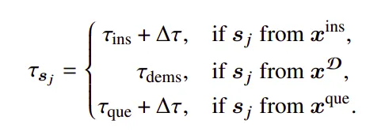 | Per-segment target compression rate $\tau_{s_j}$ varies by whether tokens come from instruction, retained demos, or question. |
| 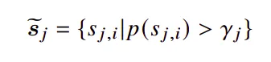 | Tokens kept in segment $j$ are those whose marginal scores exceed threshold $\gamma_j$. |
| 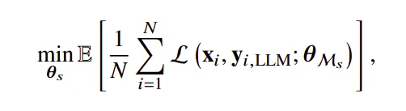 | Instruction-tuning loss aligning the small compressor's outputs with labels produced by the target LLM. |
| 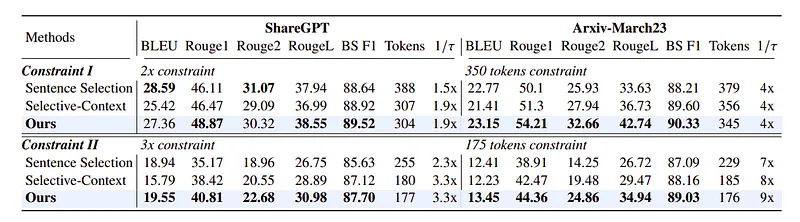 | Conversation (ShareGPT) and summarization (Arxiv-March23) quality vs baselines under two compression constraints. |
| 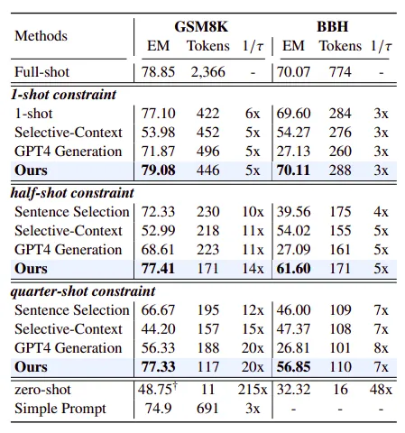 | GSM8K and BBH exact-match scores across full-shot, constrained-shot, and zero-shot settings with token counts and effective speedups. |
## Related

- [[Papers Explained Corpus]]
- [[Model Compression and Efficiency]]
- [[Large Language Models]]
- [[Safety and Alignment]]
- [[Supervised Fine-Tuning]]
- [[Papers Explained 135 - DSPy]]
- [[Papers Explained 137 - LongLLMLingua]]

#summary #topic
