# Papers Explained 137 - LongLLMLingua

LongLLMLingua is a framework designed for prompt compression in long context scenarios. It addresses three main challenges associated with LLMs in long context scenarios: higher computational/financial cost, longer latency, and inferior performance. LongLLMLingua achieves this through a series of innovative strategies:

This page ingests the source article into the wiki and connects it to [[Papers Explained Corpus]], [[Long Context]], [[Model Compression and Efficiency]], [[Document AI]].

## Source Metadata

- Source file: `raw/2024-05-15_Papers-Explained-137--LongLLMLingua-45961fa703dd.html`
- Source title: Papers Explained 137: LongLLMLingua
- Published: 2024-05-15
- Canonical: [https://medium.com/@ritvik19/papers-explained-137-longllmlingua-45961fa703dd](https://medium.com/@ritvik19/papers-explained-137-longllmlingua-45961fa703dd)

## Key Ideas

- LongLLMLingua is a framework designed for prompt compression in long context scenarios. It addresses three main challenges associated with LLMs in long context scenarios: higher computational/financial cost, longer latency, and inferior performance.
- Question-Aware Coarse-to-Fine Compression, to improve the density of information relevant to the question in the prompt by evaluating the tokens within the documents.
- Document Reordering Mechanism, to mitigate the issue of information loss in the middle of long contexts.
- Dynamic Compression Ratios, for adaptive granular control during compression to documents based on their relevance to the question.
- Post-Compression Sub-sequence Recovery Strategy, to improve the integrity of key information.

## Notes

LongLLMLingua is a framework designed for prompt compression in long context scenarios. It addresses three main challenges associated with LLMs in long context scenarios: higher computational/financial cost, longer latency, and inferior performance. LongLLMLingua achieves this through a series of innovative strategies:

- Question-Aware Coarse-to-Fine Compression, to improve the density of information relevant to the question in the prompt by evaluating the tokens within the documents.

- Document Reordering Mechanism, to mitigate the issue of information loss in the middle of long contexts.

- Dynamic Compression Ratios, for adaptive granular control during compression to documents based on their relevance to the question.

- Post-Compression Sub-sequence Recovery Strategy, to improve the integrity of key information.

The project is available at [llmlingua.com](https://llmlingua.com/).

Recommended Reading [Papers Explained 136: LLMLingua](https://ritvik19.medium.com/papers-explained-136-llmlingua-f9b2f53f5f9b)

## Problem Formulation

The objective is to extend the LLMLingua objective to scenarios specially dealing with prompts that include instructions, multiple documents, and a question.

- x~ is the compressed version of the original prompt ( x ).

- (D(y, y~ ) is a measure of how different the output from the LLM is when using the compressed prompt compared to the output when using the original prompt. This difference is quantified using a distance measure like KL divergence.

- λ is a parameter that helps balance between making the prompt as short as possible and keeping the LLM’s output as close as possible to what it would be with the original prompt.

- ( |x~|_0 ) represents the length of the compressed prompt, specifically counting the number of tokens it contains.

## Method

*Figure: Framework of LongLLMLingua. Gray Italic content: As in LLMLingua.*

### How to improve key information density in the prompt

Question-Aware Coarse-Grained Compression

In coarse grained compression, the documents which contain the information most relevant to the question at hand are determined by calculating a metric, denoted as (r_k), for each document.

r_k is calculated using document-level perplexity, which is a measure of how well the content of a document is predicted by the model. The idea is that documents with lower perplexity (i.e., those that the model predicts more accurately) are considered more important.

where x que,restrict i is the i-th token in the concatenated sequence of x que and x restrict and Nc in the number of tokens, and x restrict = “We can get the answer to this question in the given documents”.

Question-Aware Fine-Grained Compression

In fine-grained compression, the importance of each token in the instruction x ins, the question x que, and K′ retained documents x doc iis assessed.

The iterative compression mechanism following LLMLingua is incorporated and token perplexities are directly calculated to compress x ins and x que.

A straightforward solution to make the fine-grained token-level compression over the documents aware of the question is to simply concatenate it at the beginning of the whole context. However, this will result in low perplexities of relevant tokens in the context following the condition, further reducing their differentiation from general tokens. Hence contrastive perplexity, i.e., the distribution shift caused by the condition of the question, is used to represent the association between the token and the question.

*Figure: Comparison between perplexities and contrastive perplexities of tokens in the prompt from Multi-documemnt QA dataset. The document with the ground truth is located on the left side of the dashed line.*

It can be seen that tokens of high perplexities are widely distributed in all documents. However, tokens with high contrastive perplexities concentrate more on the left side of the dashed line, which corresponds to the document that contains the answer to the question. This suggests that the proposed contrastive perplexity can better distinguish tokens relevant to the question, thus improving the key information density in the compressed results.

### How to reduce information loss in the middle

LLM achieves the highest performance when relevant information occurs at the beginning and significantly degrades if relevant information is located in the middle of long contexts.

Therefore, the documents are reordered using their importance scores to better leverage LLMs’ information perception difference in positions:

### How to achieve adaptive granular control during compression

Coarse-grained compression is bridged to fine-grained compression using the importance scores r_k to guide the budget allocation for each document based in the key information density present in it.

Firstly, the initial budget τ doc (τ dems in llm lingua) is determined for the retained documents using the budget controller of LLMLingua. Then the iterative token-level compression algorithm in LLMLingua is followed but with dynamically assigned compression budget τ doc_k for each document x doc_k according to the ranking index I(r_k).

A linear scheduler is used for the adaptive allocation. Budget of each token xi can be formulated as:

where Nd denotes the number of documents, and δτ is a hyper-parameter that controls the overall budget for dynamic allocation.

### How to improve the integrity of key information

*Figure: The example of Subsequence Recovery, the red text represents the original text, and the blue text is the result after using the LLaMA 2–7B tokenizer.*

Certain tokens of key entities may be discarded during the fine-grained token-wise compression. The sub-sequence recovery method relies on the sub-sequence relationship among tokens in the original prompt, compressed prompt, and LLMs’ response.

## Evaluation

Datasets Used: NaturalQuestions, LongBench, and ZeroSCROLLS.

Baselines: Retrieval-based Methods (BM25, Gzip, Sentence-BERT, OpenAI Embedding) and Compression-based Methods (Selective Context, LLMLingua).

Target LLMs: GPT-3.5-Turbo-06134 and LongChat-13B-16k.

Compression Models: LLaMA-2–7B-Chat for small language models.

### Effectiveness of LongLLMLingua

*Figure: Performance of different methods with different compression ratios on NaturalQuestions*

*Figure: Performance of different methods under different compression ratios on LongBench and ZeroSCROLLS using GPT-3.5-Turbo.*

- LongLLMLingua achieves superior performance across various tasks and compression constraints.

- Demonstrates higher performance with significantly reduced input token count.

### Efficiency of LongLLMLingua

*Figure: Latency (s) on LongBench.*

- Significant reduction in latency, especially as the compression rate increases.

- The prompt compression system accelerates overall inference, with more pronounced effects in scenarios with longer API cost time.

### Ablation Study of LongLLMLingua Components

*Figure: Ablation study on NaturalQuestions with 2x constraint using GPT-3.5-Turbo.*

- Removing any component from LongLLMLingua leads to a performance drop.

- Validates the necessity and effectiveness of the question-aware mechanism, dynamic compression ratio, and subsequence recovery strategy.

- SBERT for coarse-grained compression results in inferior performance compared to the question-aware importance metric.

## Paper

LongLLMLingua: Accelerating and Enhancing LLMs in Long Context Scenarios via Prompt Compression [2310.06839](https://arxiv.org/abs/2310.06839)

Recommended Reading [LLM Lingua Series](https://ritvik19.medium.com/list/llm-lingua-series-2f61b47d0343)

## Figures

Figures from the Medium HTML export (`raw/2024-05-15_Papers-Explained-137--LongLLMLingua-45961fa703dd.html`); local copies under `wiki/assets/papers-explained-137-longllmlingua/` when download succeeded.

| Figure | Caption |
|--------|---------|
| 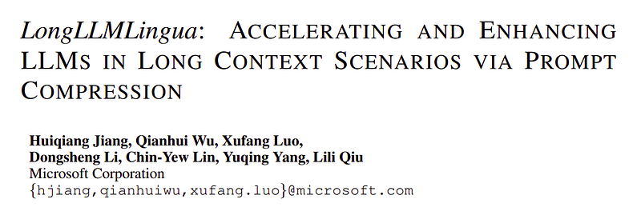 | Title page of *LongLLMLingua: Accelerating and Enhancing LLMs in Long Context Scenarios via Prompt Compression*. |
| 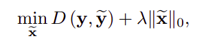 | Long-context compression objective balancing output discrepancy $D(\mathbf{y},\tilde{\mathbf{y}})$ against sparsity of the compressed prompt via $\lambda\|\tilde{\mathbf{x}}\|_0$. |
| 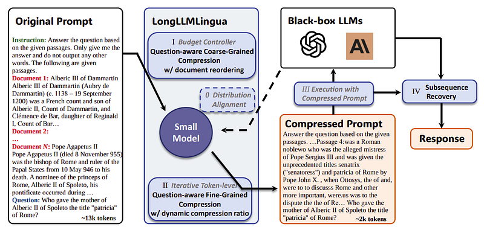 | Pipeline overview: question-aware coarse compression with reordering, fine-grained dynamic ratios, black-box execution, then subsequence recovery. |
| 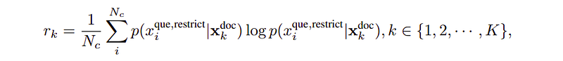 | Document importance score $r_k$ from averaged log-probabilities of restricted query tokens conditioned on each document. |
| 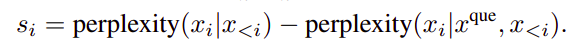 | Contrastive perplexity score per token as standard perplexity minus query-conditioned perplexity. |
| 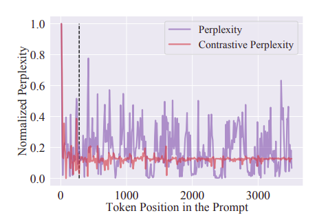 | Normalized perplexity vs contrastive perplexity along token positions; dashed line marks document boundary in the multi-document QA example. |
| 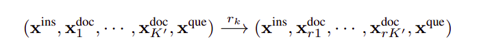 | Formal reordering of retained documents by ranking scores while fixing instruction and question order. |
| 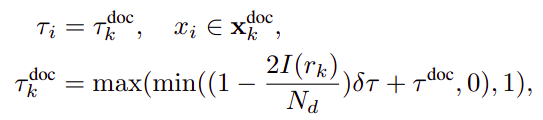 | Per-token budgets inherit document-level $\tau_k^{\text{doc}}$ with a clamped linear scheduler tied to rank index $I(r_k)$. |
| 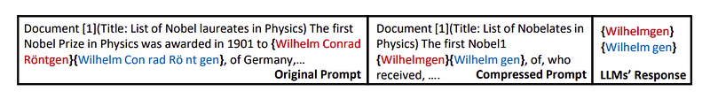 | Toy example of entity-preserving compression (original vs compressed snippet) and matching LLM outputs after compression. |
| 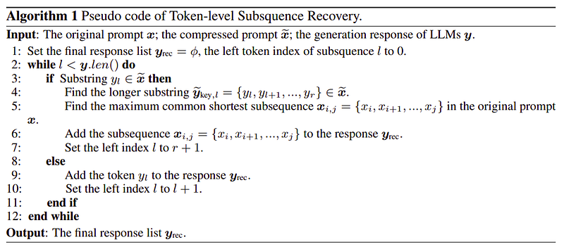 | Pseudocode mapping generations over compressed spans back to maximal matching subsequences in the original prompt. |
| 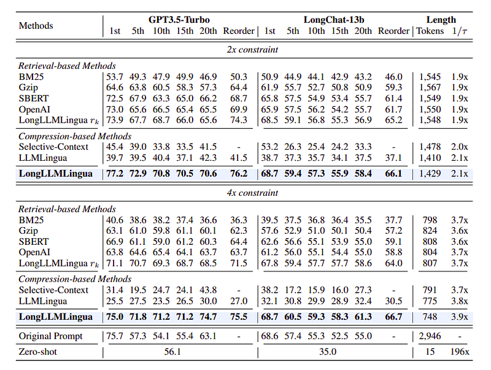 | NaturalQuestions accuracy vs gold-document rank under 2× and 4× budgets for retrieval vs compression baselines (GPT-3.5-Turbo and LongChat-13B). |
| 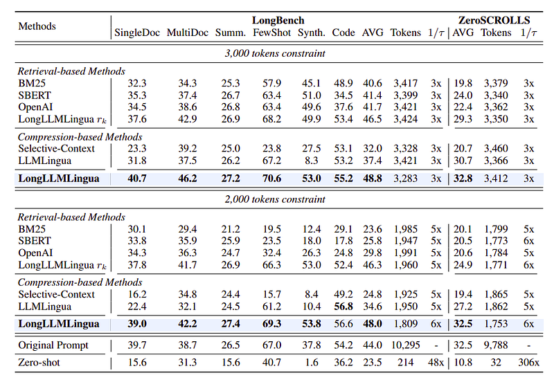 | LongBench task averages plus ZeroSCROLLS under 3k and 2k token caps versus uncompressed and zero-shot baselines. |
| 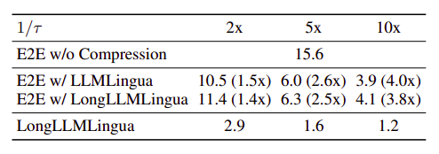 | End-to-end latency trade-offs at 2×, 5×, and 10× compression for LLMLingua vs LongLLMLingua including compressor overhead. |
| 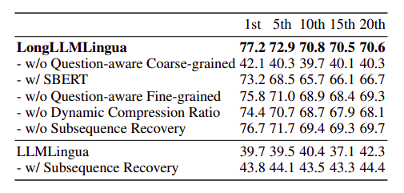 | Ablations on NaturalQuestions with a 2× constraint showing impact of question-aware stages, dynamic ratios, recovery, and SBERT coarse ranking. |
## Related

- [[Papers Explained Corpus]]
- [[Long Context]]
- [[Model Compression and Efficiency]]
- [[Document AI]]
- [[Papers Explained 136 - LLMLingua]]
- [[Papers Explained 138 - LLMLingua-2]]

#summary #topic
