# Papers Explained 138 - LLMLingua-2

LLMLingua-2 focuses on task-agnostic prompt compression for better generalizability and efficiency in LLMs. It proposes a data distillation procedure to derive knowledge from an LLM to compress prompts without losing crucial information, and introduces an extractive text compression dataset.

This page ingests the source article into the wiki and connects it to [[Papers Explained Corpus]], [[Model Compression and Efficiency]], [[Large Language Models]], [[Long Context]], [[Synthetic Data]], [[Model Distillation]].

## Source Metadata

- Source file: `raw/2024-05-17_Papers-Explained-138--LLMLingua-2-510c752368a8.html`
- Source title: Papers Explained 138: LLMLingua-2
- Published: 2024-05-17
- Canonical: [https://medium.com/@ritvik19/papers-explained-138-llmlingua-2-510c752368a8](https://medium.com/@ritvik19/papers-explained-138-llmlingua-2-510c752368a8)

## Key Ideas

- LLMLingua-2 focuses on task-agnostic prompt compression for better generalizability and efficiency in LLMs.
- It formulates prompt compression as a token classification problem to guarantee the faithfulness of the compressed prompt to the original one, and use a Transformer encoder to capture all essential information for prompt compression from the full...
- The project is available at [llmlingua.com](https://llmlingua.com/).
- Recommended Reading [Papers Explained 136: LLMLingua](https://ritvik19.medium.com/papers-explained-136-llmlingua-f9b2f53f5f9b) [\[ Papers Explained 137: LongLLMLingua](https://ritvik19.medium.com/papers-explained-137-longllmlingua-45961fa703dd)]
- The goal is to prompt GPT4 to generate compressed texts from original texts, while maintaining Informativeness and Faithfulness.

## Notes

LLMLingua-2 focuses on task-agnostic prompt compression for better generalizability and efficiency in LLMs. It proposes a data distillation procedure to derive knowledge from an LLM to compress prompts without losing crucial information, and introduces an extractive text compression dataset.

It formulates prompt compression as a token classification problem to guarantee the faithfulness of the compressed prompt to the original one, and use a Transformer encoder to capture all essential information for prompt compression from the full bidirectional context.

The project is available at [llmlingua.com](https://llmlingua.com/).

Recommended Reading [Papers Explained 136: LLMLingua](https://ritvik19.medium.com/papers-explained-136-llmlingua-f9b2f53f5f9b) [\[ Papers Explained 137: LongLLMLingua](https://ritvik19.medium.com/papers-explained-137-longllmlingua-45961fa703dd)]

*Figure: Overview of LLMLingua-2.*

## Dataset Construction

### Data Distillation

The goal is to prompt GPT4 to generate compressed texts from original texts, while maintaining Informativeness and Faithfulness. However, distilling such data from GPT-4 is challenging, as GPT-4 tends to modify expressions used in the original texts and sometimes generates hallucinated content. To address this challenge, the following dataset distillation procedure is proposed.

*Figure: The instruction used in GPT-4 compression.*

GPT4 is explicitly instructed to compress the text s short as possible while retaining as much information as possible by discarding unimportant words in the original texts only and not adding any new words during generation.

*Figure: Compression ratio w.r.t. original context length on MeetingBank.*

GPT-4 tends to apply a high compression ratio when processing very long context, which might be due to GPT-4’s limited ability to handle long context. This aggressive compression leads to substantial information loss, significantly impacting the performance of downstream tasks.

To mitigate this issue, each long context is first segmented into multiple chunks, each containing no more than 512 tokens and ending with a period. GPT-4 is then instructed to compress each chunk individually.

### Data Annotation

Having obtained pairs of original texts and their compressed versions from data distillation, the goal of data annotation is to assign a binary label to each token in the original texts to determine if it should be preserved or discarded after compression.

The following challenges are encountered in data annotation:

- Ambiguity: a word in the compressed texts may appear multiple times in the original content.

- Variation: GPT-4 may modify the original words in tense, plural form, etc. during compression.

- Reordering: The order of words may be changed after compression.

Alg. 1 outlines the overall procedure of the proposed annotation algorithm designed to deal with these obstacles.

### Quality Control

The two quality control metrics are introduced for assessing the quality of the compressed texts generated by GPT-4 distillation.

Variation Rate (VR): This metric measures the proportion of words in the compressed text that are absent in the original text.

*Figure: where | · | is the cardinality of a set.*

A high VR indicates that many words in the compressed text were not present in the original text, suggesting that the compression may have introduced new content or failed to follow the instructions properly. To ensure quality, examples with the top 5% highest variation rates are filtered out.

Alignment Gap (AG): This metric is calculated by first defining a matching rate (MR) and a hitting rate (HR) as a regularization term to measure the proportion of words in S_comp that are found in S_ori.

*Figure: Let l(·) represent the annotation function, where l(w) = True signifies that word w corresponds to a word in Scomp.*

The Alignment Gap (AG) is then defined as (AG = HR — MR).

A perfect annotation would have an AG of 0. A large AG indicates a high hitting rate but a poor matching rate, implying low-quality annotation for the example. Therefore, examples with the highest 10% alignment gap are discarded to ensure dataset quality.

## Compressor

A Transformer encoder based token classification model is trained on the dataset constructed from MeetingBank. During inference, it is determined whether to preserve or discard each token in the original prompt based on its probability calculated by the model.

First, the target number of tokens to be preserved in the compressed prompt x˜ is derived: N˜ = τN. Next, the probability pi of each word xi being labeled as preserve is predicted using the token classification model. Finally, the top N˜ words in the original prompt x with the highest pi are retained and their original order is maintained to form the compressed prompt x˜.

Specifically, xlm-roberta-large and multilingual-BERT are used for feature encoding in the compressor models, named as LLMLingua-2 and LLMLingua-2-small, respectively.

## Evaluation

Datasets & Evaluation Metrics:

- In-Domain: MeetingBank dataset for training and testing, with additional QA tasks.

- Out-of-Domain: LongBench and ZeroSCROLLS for long-context scenarios, GSM8K and Big Bench Hard for reasoning and in-context learning.

Baselines: Compares against Selective-Context and LLMLingua, both based on LLaMA-2–7B, and other task-aware compression methods.

### In-Domain Benchmark Performance

Evaluation of the performance of the proposed compression methods against baselines using the MeetingBank dataset.

*Figure: In-domain evaluation of different methods on MeetingBank.*

LLMLingua-2 models outperform baselines in QA and summarization tasks, demonstrating effective dataset utilization and compression model optimization.

### Out-Domain Benchmark Performance

Assessment the generalization ability of the proposed models on LongBench, ZeroSCROLLS, GSM8K, and BBH.

*Figure: Out-of-domain evaluation on general long-context scenarios.*

*Figure: Out-of-domain evaluation on reasoning and in-context learning.*

The models exhibit superior performance to task-agnostic baselines and comparable results to the original prompt, indicating good generalizability.

### Performance with Mistral-7B as Target LLM

*Figure: Evaluation with Mistral-7B as the Target LLM on MeetingBank and LongBench single doc QA task.*

LLMLingua-2 shows significant performance gains over baselines, suggesting effective prompt compression for different LLMs.

### Latency Evaluation

*Figure: Latency (s) comparison on MeetingBank.*

LLMLingua-2 achieves significant speedup and reduces GPU memory costs, highlighting its efficiency.

### Out-of-Domain Evaluation with Expanded Dataset

*Figure: Out-of-domain evaluation on general long-context benchmarks with the 2,000-token constraint.*

Shows improved performance on general long-context benchmarks, indicating the benefits of dataset expansion.

### Paper

LLMLingua-2: Data Distillation for Efficient and Faithful Task-Agnostic Prompt Compression [2403.12968](https://arxiv.org/abs/2403.12968)

Recommended Reading [LLM Lingua Series](https://ritvik19.medium.com/list/llm-lingua-series-2f61b47d0343)

## Figures

Figures from the Medium HTML export (`raw/2024-05-17_Papers-Explained-138--LLMLingua-2-510c752368a8.html`); local copies under `wiki/assets/papers-explained-138-llmlingua-2/` when download succeeded.

| Figure | Caption |
|--------|---------|
| 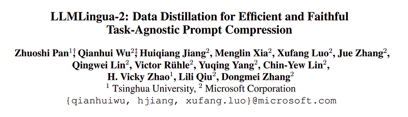 | Title page of *LLMLingua-2: Data Distillation for Efficient and Faithful Task-Agnostic Prompt Compression*. |
| 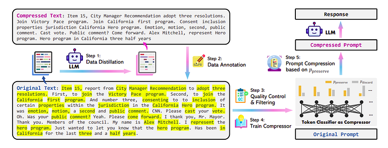 | Five-stage overview: GPT-4 distillation → token labeling → QC → train bidirectional token classifier → compress prompts by top-$P_{\text{preserve}}$ tokens at inference. |
| 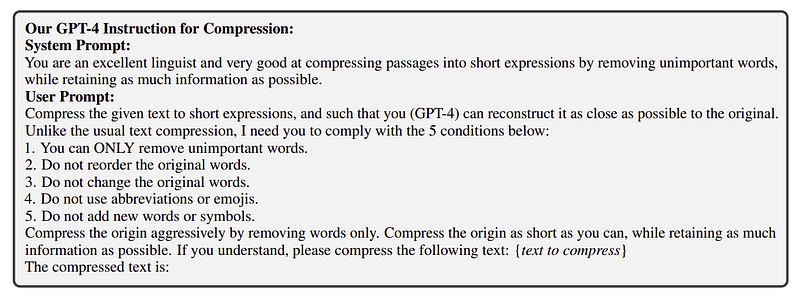 | Exact system and user instructions fed to GPT-4 for extractive, order-preserving compression without new tokens. |
| 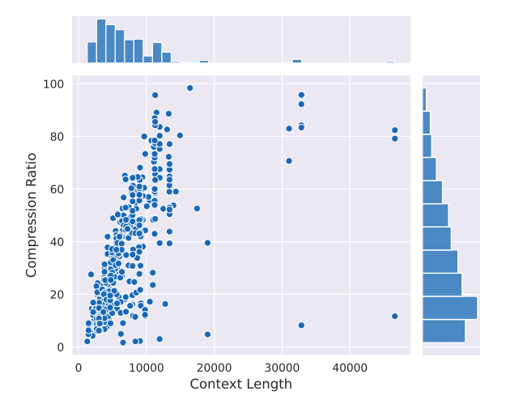 | MeetingBank scatter + marginals relating raw context length to realized GPT-4 compression ratio (longer contexts tend toward higher ratios). |
| 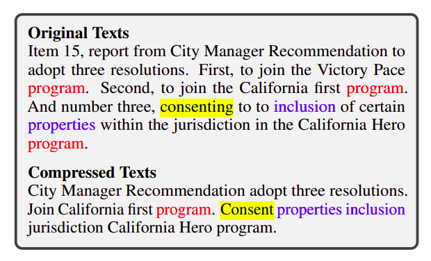 | Side-by-side MeetingBank excerpt showing which phrases survive GPT-4 compression (color-aligned spans). |
| 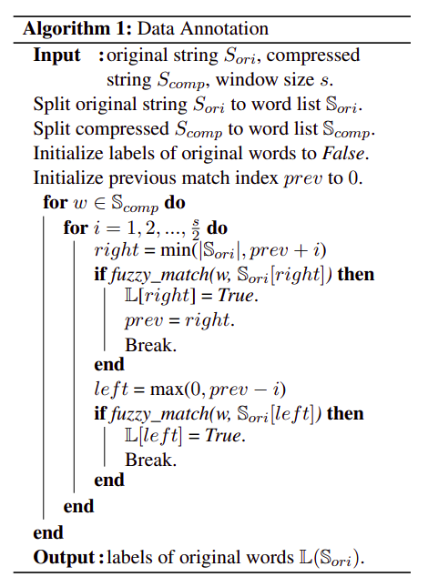 | Algorithm 1: fuzzy window search aligning compressed words back to original tokens to mint preserve/discard labels. |
| 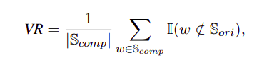 | Variation Rate (VR): fraction of compressed words absent from the original vocabulary bag. |
| 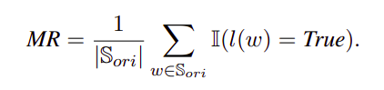 | Matching Rate (MR): share of original words labeled preserved after alignment. |
| 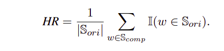 | Hitting Rate (HR): recall-style mass of compressed words that appear in the original. |
| 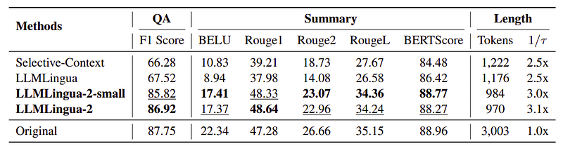 | MeetingBank in-domain QA F1 and summarization metrics vs Selective-Context, LLMLingua, and uncompressed prompts. |
| 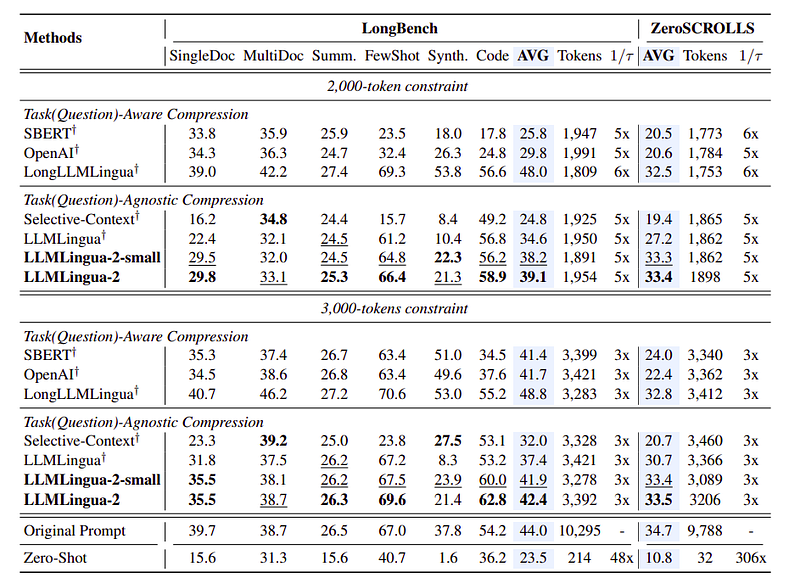 | LongBench and ZeroSCROLLS averages under 2k and 3k token budgets comparing task-aware vs task-agnostic compressors. |
| 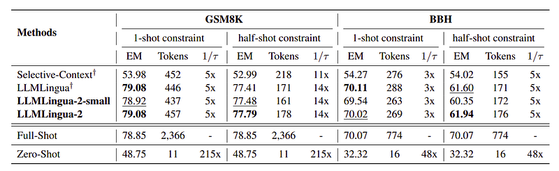 | GSM8K and BBH exact match under 1-shot and half-shot token budgets with acceleration factors. |
| 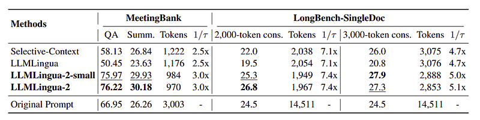 | Mistral-7B-targeted MeetingBank scores plus LongBench single-document QA under 2k/3k caps vs full prompt. |
| 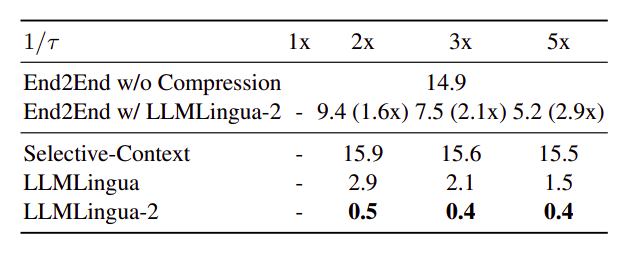 | MeetingBank end-to-end latency and per-method compression time vs ratio ($1/\tau$) showing LLMLingua-2's cheap encoder forward pass. |
| 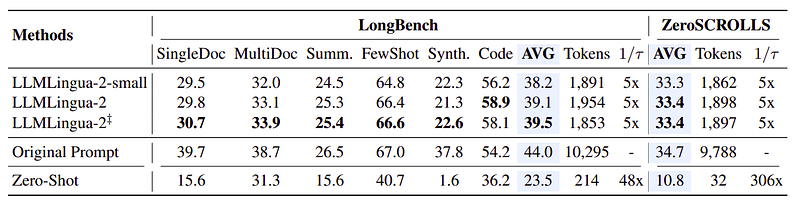 | Expanded-training variants at $\approx$5× compression on LongBench and ZeroSCROLLS near original-length accuracy with $\sim$1.9k tokens. |
## Related

- [[Papers Explained Corpus]]
- [[Model Compression and Efficiency]]
- [[Large Language Models]]
- [[Long Context]]
- [[Synthetic Data]]
- [[Model Distillation]]
- [[Papers Explained 137 - LongLLMLingua]]
- [[Papers Explained 139 - Gorilla]]

#summary #topic
