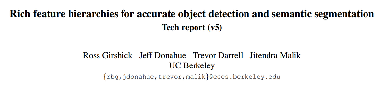
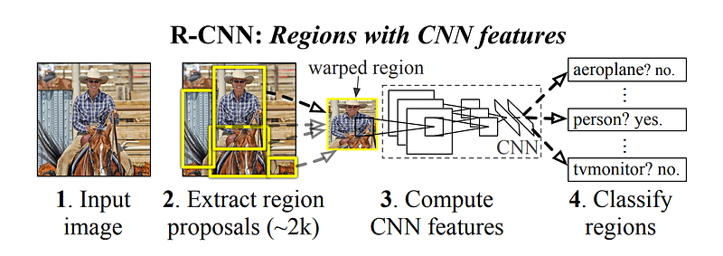

# Papers Explained 14 - RCNN

The first generates category-independent region proposals. These proposals define the set of candidate detections available to our detector.

This page ingests the source article into the wiki and connects it to [[Papers Explained Corpus]], [[Computer Vision]], [[Embedding and Retrieval]], [[Agentic AI]].

## Source Metadata

- Source file: `raw/2023-02-07_Papers-Explained-14--RCNN-ede4db2de0ab.html`
- Source title: Papers Explained 14: RCNN
- Published: 2023-02-07
- Canonical: [https://medium.com/@ritvik19/papers-explained-14-rcnn-ede4db2de0ab](https://medium.com/@ritvik19/papers-explained-14-rcnn-ede4db2de0ab)

## Key Ideas

- The second module is a large convolutional neural network that extracts a fixed-length feature vector from each region.
- The third module is a set of class specific linear SVMs.
- While R-CNN is agnostic to the particular region proposal method, Selective search is the most commonly used method to enable a controlled comparison with prior detection work.
- Rich feature hierarchies for accurate object detection and semantic segmentation [1311.2524](https://arxiv.org/abs/1311.2524)

## Notes

## Architecture

RCCN consists of three modules:

- The first generates category-independent region proposals. These proposals define the set of candidate detections available to our detector.

- The second module is a large convolutional neural network that extracts a fixed-length feature vector from each region.

- The third module is a set of class specific linear SVMs.

While R-CNN is agnostic to the particular region proposal method, Selective search is the most commonly used method to enable a controlled comparison with prior detection work.

## Implementation

At test time, selective search is conducted on the images to extract around 2000 region proposals. Each proposal is warped and then forwarded through the CNN to compute features. Following this, for each class, the score of each extracted feature vector is assessed using the SVM trained for that specific class. With all scored regions within an image, a greedy non-maximum suppression is applied (independently for each class), which discards a region if it has an intersection over union (IoU) overlap with a higher-scoring selected region that is larger than a learned threshold.

## Paper

Rich feature hierarchies for accurate object detection and semantic segmentation [1311.2524](https://arxiv.org/abs/1311.2524)

## Figures

Figures from the Medium HTML export (`raw/2023-02-07_Papers-Explained-14--RCNN-ede4db2de0ab.html`); local copies under `wiki/assets/papers-explained-14-rcnn/` when download succeeded.

| Figure | Caption |
|--------|---------|
|  | Title card: RCNN. |
|  | RCCN consists of three modules. |
## Related

- [[Papers Explained Corpus]]
- [[Computer Vision]]
- [[Embedding and Retrieval]]
- [[Agentic AI]]
- [[Papers Explained Review 01 - Convolutional Neural Networks]]
- [[Papers Explained 15 - Fast RCNN]]
- [[Object Detection for Dummies Part 3]] — Lilian Weng tutorial on R-CNN workflow, SVM stage, and bbox regression (pedagogical complement).

#summary #topic
