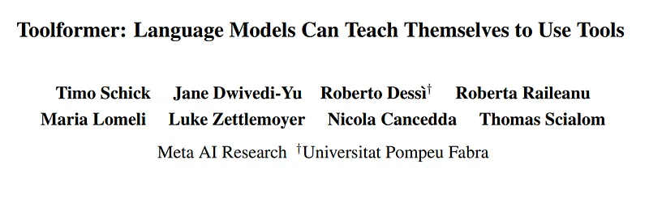
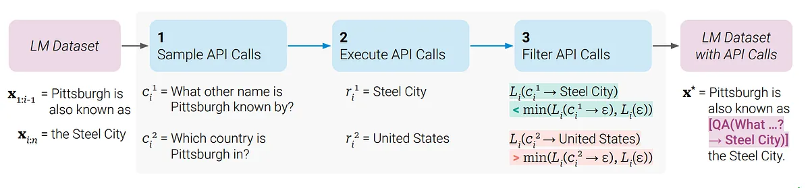
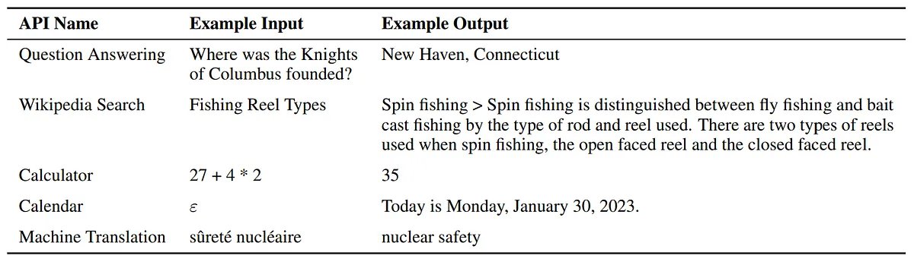
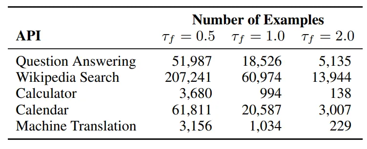
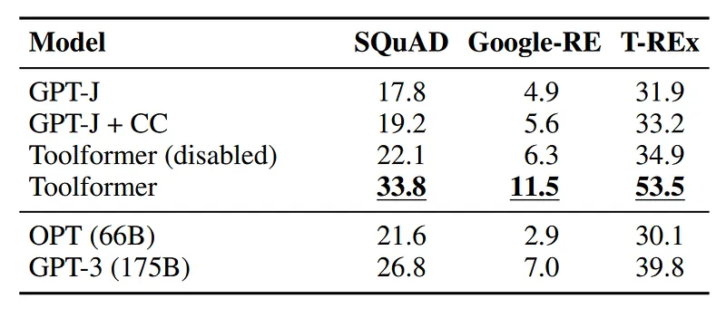
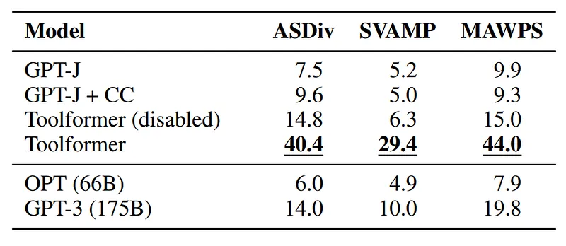
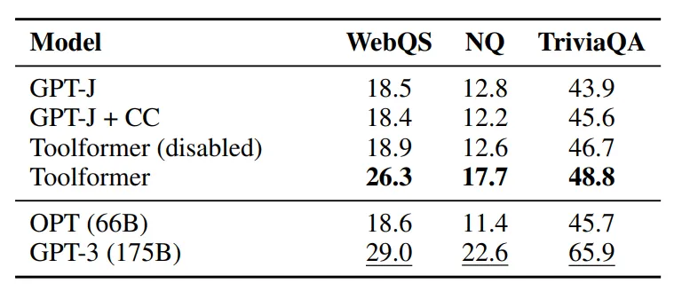
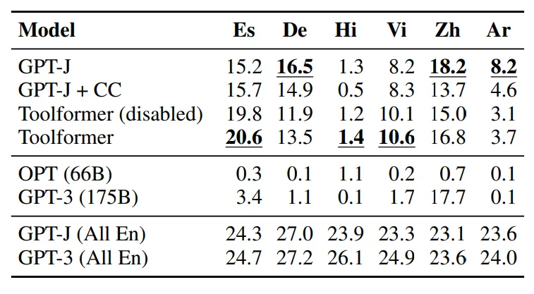
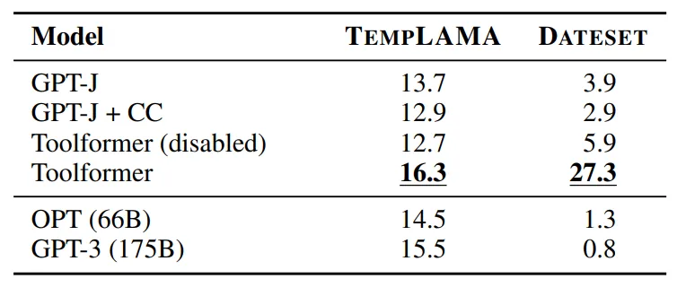
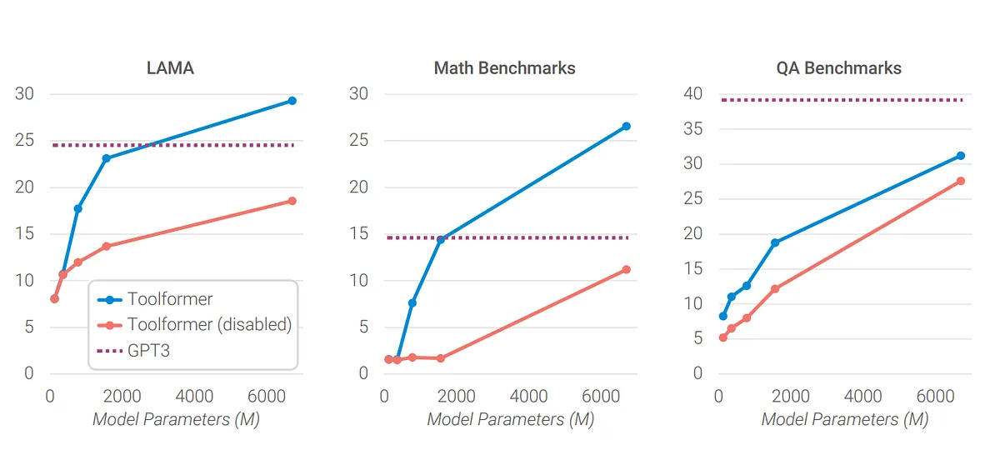

# Papers Explained 140 - Toolformer

Toolformer is a model trained to decide which APIs to call, when to call them, what arguments to pass, and how to best incorporate the results into future token prediction. This is done in a self-supervised way, requiring nothing more than a handful of demonstrations for each API.

This page ingests the source article into the wiki and connects it to [[Papers Explained Corpus]], [[Agentic AI]], [[Large Language Models]].

## Source Metadata

- Source file: `raw/2024-05-22_Papers-Explained-140--Toolformer-d21d496b6812.md`
- Source title: Papers Explained 140: Toolformer
- Published: 2024-05-22
- Canonical: [https://medium.com/@ritvik19/papers-explained-140-toolformer-d21d496b6812](https://medium.com/@ritvik19/papers-explained-140-toolformer-d21d496b6812)

## Key Ideas

- Toolformer is a model trained to decide which APIs to call, when to call them, what arguments to pass, and how to best incorporate the results into future token prediction.
- The goal is to equip a language model (referred to as “M”) with the ability to use different tools through API calls. The key aspects of this process are as follows:
- API Calls: API calls are represented as tuples, where “c” represents an API call and consists of two components:
- “ac” represents the name of the API being called.
- “ic” represents the input data or parameters for that API call.

## Notes

Toolformer is a model trained to decide which APIs to call, when to call them, what arguments to pass, and how to best incorporate the results into future token prediction. This is done in a self-supervised way, requiring nothing more than a handful of demonstrations for each API.

## Toolformer Approach

*Figure: Key steps in toolformer approach, illustrated for a question answering tool*

The goal is to equip a language model (referred to as “M”) with the ability to use different tools through API calls. The key aspects of this process are as follows:

API Calls: API calls are represented as tuples, where “c” represents an API call and consists of two components:

- “ac” represents the name of the API being called.

- “ic” represents the input data or parameters for that API call.

Text Sequence: Both the inputs and outputs of these API calls are represented as text sequences. This text-based representation allows for easy integration of API calls into text, using special tokens to mark the beginning and end of each API call.

Linearization of API Call: API calls are linearized, meaning they are converted into a standardized format using special tokens:

- “e(c)” represents the linearized sequence of an API call without including its result. It is enclosed within “<API>” and “</API>” tags.

- “e(c, r)” represents the linearized sequence of an API call, including its result. It uses “<API>”, “</API>”, and “→” tokens.

Dataset Augmentation: To train the language model to work with APIs, a dataset “C” of plain text is augmented with API calls. This augmentation process involves the following steps:

- First, the language model uses its in-context learning ability to generate potential API calls for various tools.

- These generated API calls are executed, meaning they are sent as requests to the respective APIs.

- The responses from the API calls are evaluated to determine their helpfulness in predicting future tokens. This evaluation serves as a filtering criterion to retain useful API calls.

- After filtering, the API calls for different tools are merged into the augmented dataset “C*.”

Fine-tuning: The language model “M” is then fine-tuned on this augmented dataset “C*.” This fine-tuning process helps the model learn how to use various APIs effectively and incorporate their results into text generation tasks.

## Tools

- Atlas, a retrieval-augmented LM finetuned on Natural Questions is used as Question Answering tool.

- BM25 retriever, that indexes the Wikipedia dump from KILT is used as the Wikipedia Search tool.

- The Calculator only support the four basic arithmetic operations, also, results are always rounded to two decimal places.

- The Calendar tool is an API that when queried returns the current date without taking any input.

- The 600M parameter NLLB is used as the multilingual machine translation model that works for 200 languages. The source language is automatically detected using the fastText classifier, while the target language is always set to English.

## Toolformer Dataset

*Figure: Number of examples with API calls in C ∗ for different values of filtering threshold τf .*

## Baseline Models

- GPT-J: A regular GPT-J model without any finetuning.

- GPT-J + CC: GPT-J finetuned on C, the subset of CCNet without any API calls.

- Toolformer: GPT-J finetuned on C ∗ , the subset of CCNet augmented with API calls.

- Toolformer (disabled): The same model as Toolformer, but API calls are disabled during decoding

## Toolformer Evaluation

### LAMA

*Figure: Results on subsets of LAMA.*

- Evaluation conducted on SQuAD, GoogleRE, and T-REx subsets of the LAMA benchmark.

- Task involves completing statements with missing facts, examples are filtered where the mask token is not the final token.

- Toolformer significantly outperforms GPT-J models without tool use.

- Toolformer outperforms OPT (66B) and GPT-3 (175B) despite being smaller.

- Toolformer independently uses the question answering tool in 98.1% of cases.

- Only 0.7% of cases use a different tool, and 1.2% use no tool at all.

### Math Datasets

*Figure: Results for various benchmarks requiring mathematical reasoning.*

- Mathematical reasoning abilities are evaluated on ASDiv, SVAMP, and MAWPS benchmarks.

- Evaluation involves checking the first number predicted by the model.

- GPT-J and GPT-J + CC perform similarly.

- Toolformer outperforms both GPT-J variants, even without API calls, likely due to fine-tuning on API call examples.

- Allowing API calls significantly improves performance across tasks.

- API calls outperform the larger OPT and GPT-3 models.

- In 97.9% of examples, the model chooses to ask the calculator tool for help.

### Question Answering

*Figure: Results for various question answering dataset.*

- Three question answering datasets are used for evaluation: Web Questions, Natural Questions, TriviaQA

- Evaluation criterion: First 20 words predicted by a model should contain the correct answer

- Toolformer outperforms other models based on GPT-J, achieving 99.3% accuracy using Wikipedia search API

- Toolformer lags behind GPT-3 (175B) due to simplicity of the search engine and inability to interact with it

### Multilingual Question Answering

*Figure: Results on MLQA for Spanish (Es), German (De), Hindi (Hi), Vietnamese (Vi), Chinese (Zh) and Arabic (Ar).*

- MLQA includes context paragraphs in English and questions in various languages (Arabic, German, Spanish, Hindi, Vietnamese, or Simplified Chinese).

- Models need to understand both the paragraph and the question, potentially benefiting from translating the question into English.

- Evaluation metric: Percentage of times the model’s generation (capped at 10 words) contains the correct answer.

- Using API calls consistently improves Toolformer’s performance for all languages, indicating it learned to use machine translation.

- Machine translation tool usage varies by language, ranging from 63.8% to 94.9%, with Hindi being an exception at 7.3%.

- Toolformer does not consistently outperform vanilla GPT-J, attributed to potential distribution shift during fine-tuning.

- OPT and GPT-3 perform weakly across all languages because they fail to provide answers in English despite instructions.

- GPT-J’s better performance might be due to its larger multilingual training data, including the EuroParl corpus.

- In a variant of MLQA with both context and questions in English, GPT-3 outperforms all other models, supporting the hypothesis that its lower performance on MLQA is due to its multilingual nature.

### Temporal Datasets

*Figure: Results for the temporal datasets.*

- Evaluation of the calendar API’s utility involves two datasets: TEMPLAMA and DATESET.

- TEMPLAMA consists of cloze queries based on changing facts with corresponding answers for the years between 2010 and 2020.

- DATESET is generated from templates using random dates/durations and requires knowledge of the current date to answer questions.

- Toolformer outperforms all baselines in both TEMPLAMA and DATESET evaluations.

- In TEMPLAMA, the improvement in performance is not due to the calendar tool but mostly because of Wikipedia search and question answering tools.

- TEMPLAMA’s named entities are often too specific and rare for the calendar tool to be effective.

- For DATESET, Toolformer’s improvement is mainly attributed to the calendar tool, used in 54.8% of all examples.

- Toolformer can’t perform the best course of action for TEMPLAMA (querying calendar API and question answering system) due to API usage restrictions and training data limitations.

### Scaling Laws

*Figure: Average performance on LAMA.*

- The ability to effectively use these tools becomes noticeable at around 775M parameters.

- Smaller models perform similarly with or without tools, except for the Wikipedia search engine, which is easier to utilize.

- Larger models improve in task-solving without API calls as they grow, but their ability to leverage the provided API also improves.

- Consequently, there is a substantial performance gap between predictions made with and without API calls, even for the largest model.

## Paper

Toolformer: Language Models Can Teach Themselves to Use Tools [2302.04761](https://arxiv.org/abs/2302.04761)

## Figures

Figures from the Medium HTML export (`raw/2024-05-22_Papers-Explained-140--Toolformer-d21d496b6812.md`); local copies under `wiki/assets/papers-explained-140-toolformer/` when download succeeded.

| Figure | Caption |
|--------|---------|
|  | Title page of *Toolformer: Language Models Can Teach Themselves to Use Tools*. |
|  | Self-supervised augmentation: sample candidate API calls from context, execute them, and keep only calls whose results lower LM loss on the continuation. |
|  | Linearized QA, Wikipedia search, calculator, calendar, and MT tools with representative inputs and returned strings. |
|  | Counts of retained training spans per API after filtering at thresholds $\tau_f \in \{0.5, 1.0, 2.0\}$. |
|  | LAMA SQuAD / Google-RE / T-REx scores for GPT-J variants vs OPT-66B and GPT-3–175B. |
|  | ASDiv, SVAMP, and MAWPS math reasoning with calculator-augmented Toolformer vs larger baselines. |
|  | WebQuestions, Natural Questions, and TriviaQA accuracy showing strong QA-tool usage gains. |
|  | MLQA-style multilingual QA (Es/De/Hi/Vi/Zh/Ar) comparing Toolformer with English-reference rows. |
|  | Temporal benchmarks TempLAMA and DATESET highlighting calendar tool effects vs disabling tools. |
|  | Scaling curves on LAMA, aggregate math, and QA suites with Toolformer vs disabled tools vs fixed GPT-3 baseline. |
## Related

- [[Papers Explained Corpus]]
- [[Agentic AI]]
- [[Large Language Models]]
- [[Papers Explained 139 - Gorilla]]
- [[Papers Explained 141 - Tool LLM]]

#summary #topic
