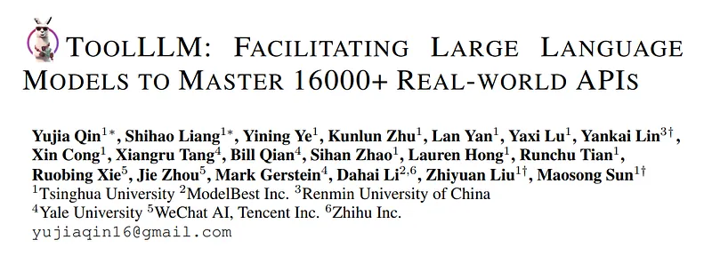
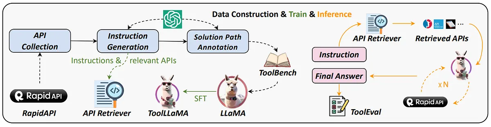
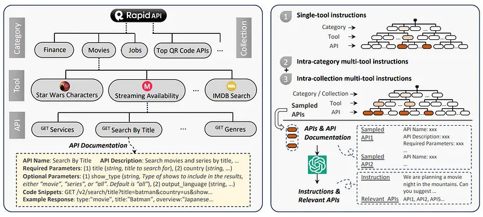
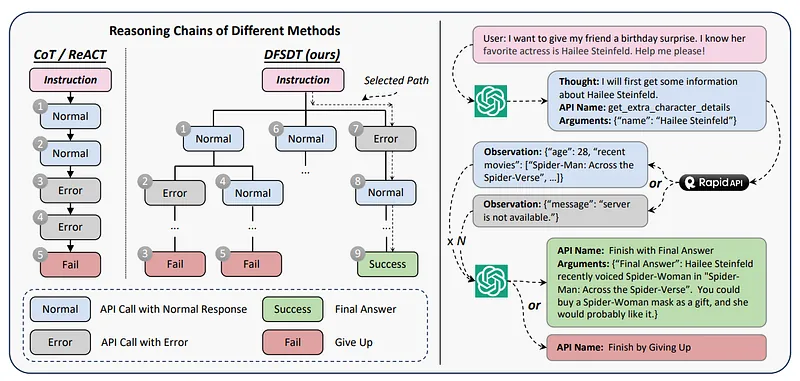
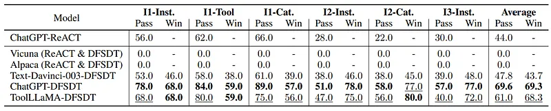
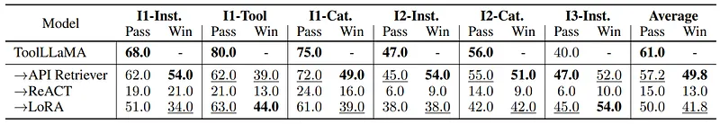

# Papers Explained 141 - Tool LLM

Open-source LLMs struggle with tasks that require interaction with external tools or APIs, to address this limitation, this paper introduces Tool Bench, an instruction-tuning dataset for tool use, automatically created using ChatGPT, which involves collecting a large number of real-world RESTful APIs and generating diverse human...

This page ingests the source article into the wiki and connects it to [[Papers Explained Corpus]], [[Agentic AI]], [[Model Compression and Efficiency]], [[Synthetic Data]], [[Large Language Models]], [[Reasoning Models]].

## Source Metadata

- Source file: `raw/2024-05-24_Papers-Explained-141--Tool-LLM-856f99e79f55.md`
- Source title: Papers Explained 141: Tool LLM
- Published: 2024-05-24
- Canonical: [https://medium.com/@ritvik19/papers-explained-141-tool-llm-856f99e79f55](https://medium.com/@ritvik19/papers-explained-141-tool-llm-856f99e79f55)

## Key Ideas

- Open-source LLMs struggle with tasks that require interaction with external tools or APIs, to address this limitation, this paper introduces Tool Bench, an instruction-tuning dataset for tool use, automatically created using ChatGPT, which involves collecting...
- A novel search algorithm called DFSDT (depth-first search-based decision tree) is developed to enhance the reasoning and planning abilities of LLMs when performing these tool-use tasks.
- An automatic evaluator named ToolEval is created to assess the performance of LLMs on tool-use instructions.
- LLaMA is fine-tuned on ToolBench to create ToolLLaMA, which demonstrates impressive tool-use capabilities, even when dealing with new, unseen APIs.
- API Collection: RapidAPI is an API marketplace that connects developers with various APIs. These APIs are grouped into categories like sports, finance, and weather, as well as more specific collections like Chinese APIs or AI-based APIs.

## Notes

Open-source LLMs struggle with tasks that require interaction with external tools or APIs, to address this limitation, this paper introduces Tool Bench, an instruction-tuning dataset for tool use, automatically created using ChatGPT, which involves collecting a large number of real-world RESTful APIs and generating diverse human instructions that involve using these APIs.

A novel search algorithm called DFSDT (depth-first search-based decision tree) is developed to enhance the reasoning and planning abilities of LLMs when performing these tool-use tasks.

An automatic evaluator named ToolEval is created to assess the performance of LLMs on tool-use instructions.

LLaMA is fine-tuned on ToolBench to create ToolLLaMA, which demonstrates impressive tool-use capabilities, even when dealing with new, unseen APIs.

## Dataset Construction

*Figure: The hierarchy of RapidAPI (left) and the process of instruction generation (right).*

API Collection: RapidAPI is an API marketplace that connects developers with various APIs. These APIs are grouped into categories like sports, finance, and weather, as well as more specific collections like Chinese APIs or AI-based APIs.

Hierarchy of RapidAPI: The hierarchy includes tools, each of which may have multiple associated APIs. Information about these tools and APIs is collected, including names, descriptions, URLs, parameters, and code snippets for API calls. This metadata is valuable for understanding and using the APIs.

API Filtering: Initially, 53190 APIs are gathered, but not all are reliable. A filtering process is applied, which includes basic functionality testing and evaluating example responses for speed and quality. Low-quality or non-operational APIs are discarded, resulting in a set of 16464 APIs.

API Response Compression: Some API responses are too long for effective use in LLMs. To address this, responses are compressed by removing unimportant information while maintaining critical data. ChatGPT is used to analyze responses and develop compression strategies. If a response is still too long after compression, it’s truncated to 2048 tokens.

## Instruction Generation

Generating high-quality instructions requires two crucial aspects: diversity, to ensure the LLMs handle a wide range of API usage scenarios and multi-tool usage, to mirror real-world situations that often demand the interplay of multiple tools.

Generating Instructions for All APIs and their Combinations: At each time a few APls are sampled from the total set. Then Chat GPT is prompted to understand their functionalities and interplay, and then generate possible instructions that involve these APIs, and relevant APIs for each Instruction.

Sampling Strategies for Different Scenarios: For single-tool instructions, each tool is iterated and instructions are generated for its APls. For multi-tool settings, the Rapid API hierarchy is leveraged. 2–5 tools from the same category / collection are selected and at most 3 APIs from each tool are sampled to generate the instructions. Over 200k qualified instruction relevant API pairs are collected.

## Solution Path Annotation

*Figure: A comparison of our DFSDT and conventional CoT or ReACT during model reasoning (left). Solution path annotation process using ChatGPT (right).*

The process involves ChatGPT receiving an instruction and trying to generate a valid sequence of actions (a1, a2, …aN) in response. This is treated as a multi-round conversation for ChatGPT.

At each time step (t), ChatGPT generates an action (at) based on previous interactions, including the instruction and real API responses (r1, r2, …rt). The action format includes a “Thought,” “API Name,” and “Parameters.”

Each API is treated as a special function, and ChatGPT is provided with API documentation to understand how to call these functions. All sampled APIs are made available, not just the relevant ones, expanding the model’s capabilities.

To finish an action sequence, two functions are defined: “Finish with Final Answer,” which requires a detailed final answer parameter, and “Finish by Giving Up,” which has no parameters and is used when the provided APIs cannot complete the instruction.

A Depth First Search-based Decision Tree is introduced to overcome limitations of conventional methods (like CoT or ReACT). It helps avoid error propagation and limited exploration in decision-making.

The DFSDT allows ChatGPT to assess different reasoning paths. It can either continue along a promising path or abandon a node (e.g., when an API call fails) by using the “Finish by Giving Up” function and exploring a new node.

Depth-First Search (DFS) is preferred over Breadth-First Search (BFS) because finding one valid path is sufficient for the task. BFS would require excessive API calls before reaching a terminal node.

The DFSDT uses a variant of DFS called “pre-order traversal” to balance effectiveness and cost (the number of API calls). This design achieves a similar performance as DFS while reducing costs.

The process results in the generation of 12,657 instruction-solution pairs, which are used to train ToolLLaMA. Despite the possibility of creating more training instances, this number is found to provide satisfactory generalization performance..

## Experiments

### Metrics:

- Pass Rate measures the proportion of successfully completed instructions within a limited number of actions (200 in this paper) and is considered a basic requirement for ideal tool use.

- Win Rate measures how well an instruction is completed and is determined by comparing two solution paths based on predefined criteria.

### ToolLLaMA

LLaMA 7B model is finetuned using the instruction-solution pairs. The original LLaMA model is pre-trained with a sequence length of 2048, hence positional interpolation is used to extend the context length to 8192.

*Figure: Main experiments on the test set of ToolBench.*

- ToolLLaMA outperforms ChatGPT-ReACT in pass rate and win rate, showing better generalization abilities.

- ToolLLaMA also performs better than Text-Dainci-003 when combined with DFSDT.

- Vicuna and Alpaca both fail to pass any instructions, revealing limitations in their instruction-following abilities.

- ToolLLaMA demonstrates competitive performance overall, with a pass rate slightly lower than ChatGPT+DFSDT.

- ToolLLaMA matches ChatGPT+DFSDT’s win rate and even surpasses it in the I2-Cat setting.

- These results demonstrate that ToolBench effectively elicits tool-use capabilities in LLMs, enabling them to master unseen APIs for various instructions.

Integrating API Retriever with ToolLLaMA

*Figure: Additional analyses of ToolLLaMA: (1) replacing the ground truth APIs with those recommended by our API retriever, (2) degrading the reasoning method from DFSDT to ReACT, and (3) tuning LLaMA using LoRA instead of full-parameter fine-tuning.*

- The API retriever only slightly decreases the pass rate compared to the ground truth API set.

- ToolLLaMA achieves an average win rate of 49.8, a significant accomplishment considering the vast pool of 16,000+ APIs it selects from.

- This demonstrates the excellent ability of the API retriever to find relevant APIs.

- In some scenarios, using the API retriever actually increases the win rate, suggesting it can replace less effective APIs in the ground truth set.

Comparing DFSDT with ReACT

- DFSDT outperforms ReACT significantly in terms of pass rate and preference across all scenarios.

- This highlights the superiority of DFSDT in decision-making tasks.

- The improvement of DFSDT over ReACT is more pronounced for ToolLLaMA than ChatGPT.

- Applying DFSDT to small-scale models has potential practical utility.

## Paper

ToolLLM: Facilitating Large Language Models to Master 16000+ Real-world APIs [2307.16789](https://arxiv.org/abs/2307.16789)

## Figures

Figures from the Medium HTML export (`raw/2024-05-24_Papers-Explained-141--Tool-LLM-856f99e79f55.md`); local copies under `wiki/assets/papers-explained-141-tool-llm/` when download succeeded.

| Figure | Caption |
|--------|---------|
|  | Title page of *ToolLLM: Facilitating Large Language Models to Master 16000+ Real-World APIs*. |
|  | End-to-end diagram: RapidAPI harvesting → ChatGPT instruction + trace labeling → ToolBench SFT of LLaMA into ToolLLaMA → retriever-grounded multi-hop RapidAPI execution evaluated by ToolEval. |
|  | RapidAPI hierarchy down to endpoint docs plus ChatGPT-driven instruction synthesis for single- and multi-tool scenarios. |
|  | DFSDT tree search recovers from failed RapidAPI branches versus linear CoT/ReACT traces; worked birthday-surprise example contrasts success vs give-up paths. |
|  | ToolBench test pass/win rates across instruction tiers for ReACT vs DFSDT with ChatGPT, Davinci, ToolLLaMA, and small instruct baselines. |
|  | Ablations replacing oracle APIs with the learned retriever, swapping DFSDT for ReACT, or swapping full FT for LoRA on ToolLLaMA. |
## Related

- [[Papers Explained Corpus]]
- [[Agentic AI]]
- [[Model Compression and Efficiency]]
- [[Synthetic Data]]
- [[Large Language Models]]
- [[Reasoning Models]]
- [[Papers Explained 140 - Toolformer]]
- [[Papers Explained 142 - Gemini 1.5 Flash]]

#summary #topic
