# Papers Explained 142 - Gemini 1.5 Flash

Gemini 1.5 Flash is a more lightweight variant designed for efficiency with minimal regression in quality. It is a transformer decoder model with the same 2M+ context and multimodal capabilities as Gemini 1.5 Pro, designed for efficient utilization of tensor processing units (TPUs) with lower latency for model serving.

This page ingests the source article into the wiki and connects it to [[Papers Explained Corpus]], [[Large Language Models]], [[Model Compression and Efficiency]], [[Vision Language Models]], [[Long Context]], [[Code Models]].

## Source Metadata

- Source file: `raw/2024-05-27_Papers-Explained-142--Gemini-1-5-Flash-415e2dc6a989.html`
- Source title: Papers Explained 142: Gemini 1.5 Flash
- Published: 2024-05-27
- Canonical: [https://medium.com/@ritvik19/papers-explained-142-gemini-1-5-flash-415e2dc6a989](https://medium.com/@ritvik19/papers-explained-142-gemini-1-5-flash-415e2dc6a989)

## Key Ideas

- The tech report introduces two new models: Gemini 1.5 Pro and Gemini 1.5 Flash.
- Gemini 1.5 Flash is a more lightweight variant designed for efficiency with minimal regression in quality.
- The Gemini 1.5 models are built to handle extremely long contexts, with the ability to recall and reason over fine-grained information from up to 10M tokens, enabling the processing of long-form mixed-modality inputs like five days of audio recordings (107...
- Recommended Reading [Papers Explained 105: Gemini 1.5 Pro](https://ritvik19.medium.com/papers-explained-105-gemini-1-5-pro-029bbce3b067)
- Gemini 1.5 Flash outperformed all other models in terms of speed for output generation across English, Japanese, Chinese, and French queries.

## Notes

The tech report introduces two new models: Gemini 1.5 Pro and Gemini 1.5 Flash.

Gemini 1.5 Pro is an updated version of the previous Gemini 1.5 Pro model, which outperforms its predecessor on most capabilities and benchmarks. It is a sparse mixture-of-expert (MoE) Transformer-based model that builds on the research advances and multimodal capabilities of Gemini 1.0. Gemini 1.5 Pro achieves near-perfect recall on long-context retrieval tasks across modalities, improves the state-of-the-art in long-document QA, long-video QA, and long-context ASR, and matches or surpasses Gemini 1.0 Ultra’s state-of-the-art performance across a broad set of benchmarks.

Gemini 1.5 Flash is a more lightweight variant designed for efficiency with minimal regression in quality. It is a transformer decoder model with the same 2M+ context and multimodal capabilities as Gemini 1.5 Pro, designed for efficient utilization of tensor processing units (TPUs) with lower latency for model serving. Gemini 1.5 Flash is trained with higher-order preconditioned methods for improved quality and is online distilled from the larger Gemini 1.5 Pro model.

The Gemini 1.5 models are built to handle extremely long contexts, with the ability to recall and reason over fine-grained information from up to 10M tokens, enabling the processing of long-form mixed-modality inputs like five days of audio recordings (107 hours), more than ten times the entirety of the 1440 page book (or 587,287 words) “War and Peace”, the entire Flax codebase (41,070 lines of code), or 10.5 hours of video at 1 frame-per-second.

Recommended Reading [Papers Explained 105: Gemini 1.5 Pro](https://ritvik19.medium.com/papers-explained-105-gemini-1-5-pro-029bbce3b067)

## Evaluations

### Serving efficiency and latency

*Figure: Time per output character (ms) of various APIs for English, Japanese, Chinese, and French responses, given inputs of 10,000 characters.*

- Gemini 1.5 Flash outperformed all other models in terms of speed for output generation across English, Japanese, Chinese, and French queries.

- Gemini 1.5 Pro also demonstrated faster output generation than GPT-4 Turbo, Claude 3 Sonnet, and Claude 3 Opus.

- For English queries specifically, Gemini 1.5 Flash generated over 650 characters per second, which is more than 30% faster than the second fastest model, Claude 3 Haiku.

### Long-context Evaluations

- Gemini 1.5 Pro achieves 100% recall at 200k tokens, surpassing Claude 2.1’s 98%, and maintains this level up to 530k tokens before slightly decreasing to 99.7% at 1M tokens.

- The model retains 99.2% recall when increasing from 1M tokens to 10M tokens, demonstrating robust long-context handling capabilities.

- Gemini 1.5 Flash achieves almost perfect recall across all three modalities (text, vision, audio) up to 2M tokens, with 100% on text, 99.8% on video, and 99.1% on audio.

### Perplexity over Long Sequences

Evaluation of the ability of language models to make use of very long contexts to improve next-token prediction by measuring the negative log-likelihood (NLL) of tokens at different positions within input sequences from held-out text.

*Figure: Cumulative average negative log-likelihood (NLL) as a function of token position in long documents and code data.*

- The NLL decreases monotonically with sequence length, indicating that prediction accuracy improves as the context length increases. This holds true for both long documents (up to 1 million tokens) and code repositories (up to 10 million tokens).

### Text Haystack

Assessment of the model’s ability to retrieve specific information (“needles”) from a larger body of text (“haystack”) of varying lengths.

- Gemini 1.5 Pro achieved 100% recall for contexts up to 530k tokens and over 99.7% recall for contexts up to 1M tokens.

- The model maintained high accuracy, with 99.2% recall, for contexts up to 10M tokens, demonstrating its ability to handle very long documents.

### Video Haystack

- The models achieve high recall, with Gemini 1.5 Flash obtaining >99.8% recall for up to 2 million tokens in the vision modality, indicating best-in-class long-context retrieval performance.

### Audio Haystack

- Gemini 1.5 Pro achieved a 100% success rate in identifying the secret keyword across all audio lengths tested.

- Gemini 1.5 Flash also successfully identified the keyword in 98.7% of instances.

- The combined model of Whisper and GPT-4 Turbo had an overall accuracy of approximately 94.5% in identifying the keyword.

### Improved Diagnostics

Comparing recall abilities in a “needle(s)-in-a-haystack” task and their reasoning and disambiguation skills in the Multiround Co-reference Resolution (MRCR) task.

*Figure: Retrieval performance of the “multiple needles-in-haystack” task, which requires retrieving 100 unique needles in a single turn.*

*Figure: Cumulative average string similarity score as a function of context length over 2000 instances of the MRCR task.*

- Gemini 1.5 Pro demonstrated improved recall over GPT-4 Turbo (up to 128K tokens) with around 70% recall up to 128K tokens and over 60% recall up to 1M tokens.

- GPT-4 Turbo’s recall averaged around 50% at 128K tokens, with a significant drop in performance at longer context lengths due to its context length limit.

- Gemini 1.5 Pro and Gemini 1.5 Flash outperformed GPT-4 Turbo and Claude 2.1 on both the “multiple needles-in-a-haystack” task and MRCR, with Gemini models maintaining high performance up to 1M tokens.

- Claude 2.1 scored around 20% at 128K tokens and underperformed other models by hallucinating or punting on requests.

### In-context language learning — learning to translate a new language from one book

Evaluation of Gemini 1.5 Flash & 1.5 Pro’s in-context learning abilities using the Machine Translation from One Book (MTOB) benchmark.

- Conducted human evaluations where a non-native, non-fluent speaker rates the quality of translations on a scale from 0 to 6.

- Used automatic metrics (BLEURT for kgv→eng and chrF for eng→kgv) to complement human evaluations.

*Figure: Quantitative results for Kalamang→English translation on MTOB*

*Figure: Quantitative results for English→Kalamang translation on MTOB.*

- Gemini 1.5, GPT-4 Turbo, and Claude 3 perform essentially randomly in the 0-shot setting, indicating no knowledge of Kalamang from their training data.

- Gemini 1.5 Pro outperforms GPT-4 Turbo and Claude 3 significantly when provided with half of the grammar book (see Tables 4 and 5).

- In the best setting, Gemini 1.5 Pro achieves a human evaluation score of 4.14 for kgv→eng translation, which is lower but similar to the “human language learner” score of 5.52. For eng→kgv, Gemini 1.5 Pro’s score is 5.46, close to the “human language learner” score of 5.58.

- Gemini 1.5 Flash also performs well, though not as strongly as Gemini 1.5 Pro, and outperforms GPT-4 Turbo and Claude 3.

### In-context language learning — learning to transcribe speech in a new language in context

Evaluation of Gemini 1.5’s performance in transcribing Kalamang speech from text and audio documentation using mixed-modal in-context learning, using a new benchmark, ASROB (Automatic Speech Recognition from One Book), which includes 104 speech recordings of Kalamang language from “The Kalamang Collection”

*Figure: Character Error Rate (CER, ↓) for Gemini 1.5 Pro learning Kalamang ASR in context.*

*Figure: Character Error Rate (CER, ↓) for Gemini 1.5 Flash learning Kalamang ASR in context.*

- Gemini 1.5 Pro achieves 35.0% CER without any context.

- ASR quality improves relatively gracefully as text and audio context are added, reaching 22.9% CER in the best setting.

- Gemini 1.5 Flash follows a similar trajectory to Pro, but with worse scores across the board.

### Scaling In-Context learning for low-resource machine translation

The study evaluates translation from English to 6 diverse low-resource languages: Acholi, Abkhaz, Navajo, Bemba, Ewe, and Kurdish.

*Figure: In-context learning scaling results (chrF↑) on low-resource translation.*

- Gemini 1.5 delivers consistent improvements in ICL scaling performance as the number of shots increases, unlike previous studies where performance saturates after dozens of examples.

- The quality gain over zero-shot translation is significant for some languages, with improvements ranging from +9.5 to +21.4 chrF.

- Gemini 1.5 Flash shows more pronounced many-shot scaling compared to Gemini 1.5 Pro, which may be due to its smaller model size and greater reliance on in-context examples.

- Gemini 1.5 Pro generally outperforms GPT-4 Turbo across languages and numbers of shots by a wide margin, with an interesting exception for Abkhaz where it lags behind with few prompts but surpasses it as ICL scales.

- Gemini 1.5 Flash improves with scaling up to 1K/4K examples and achieves superior performance to GPT-4 Turbo for most languages, e.g., +9.6/+6.4 chrF on Ewe/Acholi.

### Long-document QA

Evaluations of in-context language learning capabilities, focusing on question-answering performance using a large corpus like “Les Misérables” (710K tokens).

*Figure: Answer quality based on side-by-side auto-rater (Gemini 1.5 Pro), rankings and scores (𝑒 𝛽 ) computed via the Bradley-Terry Model.*

- Gemini 1.5 Pro outperformed Gemini 1.0 Pro in the question-answering task when using the entire book as context, with a probability of 0.7795 or 78% of cases being better than the retrieval-augmented generation with 4k tokens using Gemini 1.5 Pro.

- Full-context Gemini 1.5 Pro also provided better answers than retrieval-augmented GPT4-Turbo with 4k tokens in 83% of cases.

### Long-context Audio

Evaluation of long context understanding capabilities in audio inputs (ASR tasks).

*Figure: Word error rate (WER) for various models on 15-minute videos.*

- The 1.0 Pro model had a WER of 100% when transcribing 15-minute videos without segmentation due to a mismatch in training data.

- With video segmentation every 30 seconds and textual content provided across each segment boundary, the 1.0 Pro model achieved a WER of 7.8%.

- The USM model with a CTC decoder had a WER of 8.8%, showing robustness to long segments but not as accurate as the 1.0 Pro model.

- Whisper achieved a WER of 7.3% after segmenting the audio every 30 seconds, indicating it is not inherently robust to long segments.

- Gemini 1.5 Pro, without additional segmentation or pre-processing, transcribed 15-minute videos with a WER of 5.5%, outperforming all other models in this context.

- Gemini 1.5 Flash had a WER of 8.8%, which is still impressive given its smaller size and superior efficiency compared to the 1.0 Pro model.

### Long-context Video QA

Evaluation for long-context video understanding, using a new benchmark called 1H-VideoQA.

*Figure: Comparison between 1H-VideoQA and EgoSchema.*

*Figure: Comparison between GPT-4V and Gemini 1.5 models on 1H-VideoQA.*

- Gemini 1.5 Pro achieved a new state-of-the-art accuracy of 70.2% on EgoSchema using only 16 frames, which is an improvement over GPT4V’s 55.6% with the same frame limit.

- On EgoSchema, there were no significant gains from increasing the number of frames to 150, indicating that many questions could be solved with a limited number of frames.

- Gemini 1.5 Pro’s performance on 1H-VideoQA improved significantly as the number of frames provided increased, from the first frame to the full video, suggesting the benchmark’s effectiveness for long-context videos.

- Gemini 1.5 Pro outperformed GPT-4V on 1H-VideoQA regardless of whether the video was subsampled to 16 or 150 frames.

- Gemini 1.5 Flash, although smaller and more efficient, performed slightly behind GPT-4V with 150 frames but better with 16 frames.

### In-Context Planning

Evaluation of the planning capabilities using few-shot learning

*Figure: PDDL Planning and Natural Language Planning with few-shots.*

BlocksWorld:

- Gemini 1.5 Pro and Flash were tested on rearranging blocks with varying numbers of shots.

- At 1-shot, Gemini 1.5 Pro reached 28% accuracy, while Gemini 1.5 Flash was lower.

- With more shots, Gemini 1.5 Pro significantly improved, reaching 77% with 400 shots.

Logistics:

- Gemini 1.5 Pro outperformed GPT-4 Turbo at 1-shot, with 38% accuracy compared to under 10%.

- Both models improved with more shots, but Gemini 1.5 Pro consistently outperformed.

Mini-Grid:

- Similar to BlocksWorld, Gemini 1.5 Pro showed a significant improvement with an increase in shots.

- With 800 shots, it reached 77% accuracy, while GPT-4 Turbo was far behind at 38%.

Trip Planning:

- GPT-4 Turbo initially outperformed Gemini 1.5 Pro at 1-shot.

- However, Gemini 1.5 Pro’s performance improved dramatically with more shots, reaching 52% with 100 shots.

Calendar Scheduling:

- Both models struggled initially but improved with additional context.

- Gemini 1.5 Pro reached 52% accuracy with 100 shots, while GPT-4 Turbo reached 36%.

### Unstructured Multimodal Data Analytics Task

Performed an image structuralization task using LLMs.

- Presented LLMs with a dataset of 1024 images and aimed to extract the contained information into a structured data sheet.

- Utilized mini-batches with different batch sizes to handle the long-context task, where each model’s context length limited its processing capacity.

- Concatenated the results from each mini-batch to form a final structured table.

*Figure: Performance of models on unstructured data analytics tasks.*

- Gemini 1.5 Pro showed an improvement of 9% (absolute) or 27% (relative) in accuracy for all attributes extraction compared to GPT-4 Turbo.

- Claude 3 API was limited to analyzing only up to 20 images at a time due to technical constraints at the time of evaluation, resulting in incomplete results for comparison.

- Gemini 1.5 Pro demonstrated that with more images, the model’s accuracy improved, indicating its effectiveness in utilizing longer and additional context.

- In contrast, GPT-4 Turbo did not show a consistent improvement in accuracy when provided with more images, suggesting that it may have reached its optimal context length.

### Core Text Evals

Math and Science

- Gemini 1.5 Pro outperformed Gemini 1.0 Ultra and Gemini 1.0 Pro on grade-school math (GSM8K) and other benchmarks.

- Gemini 1.5 Flash demonstrated significant improvements over Gemini 1.0 Pro on various benchmarks.

- Gemini 1.5 Pro achieved a score of 81.1% on original problems and 64.6% on modified problems on Functional MATH.

- Gemini 1.5 Pro outperformed other models on PhysicsFinals and HiddenMath benchmarks.

General Reasoning

- Gemini 1.5 Pro achieves a state-of-the-art score of 89.2% on BigBench-Hard.

- Gemini 1.0 Ultra, 1.5 Pro, and 1.5 Flash all exceed 80% on MMLU.

- Gemini 1.5 Pro achieves 93.3% on Hellaswag.

- Gemini 1.5 Flash outperforms Gemini 1.0 Pro on Hellaswag.

Code

- Used HumanEval and Natural2Code as evaluation benchmarks

- Conducted an analysis of test data leakage of Gemini 1.0 Ultra

- Found that continued pre-training on a dataset containing even a single epoch of the test split for HumanEval boosted scores

- Created the Natural2Code benchmark to fill the gap in evaluating coding abilities of models

- Gemini 1.5 Pro outperformed Gemini 1.0 Ultra on HumanEval and Natural2Code

- Gemini 1.5 Flash outperformed Gemini Ultra 1.0

Multilinguality

- Gemini 1.5 Pro improves over Gemini 1.0 Ultra on both MGSM and WMT23 tasks.

- The improvement is substantial, with a gain of almost +9% on the MGSM dataset.

- The improvements are not limited to a particular resource group; rather, 1.5 Pro improves performance equally among differently-resourced languages.

- On medium and low resource languages, the gap between 1.0 Ultra and 1.5 Pro increases to > 9% and > 7%, respectively.

- Gemini 1.5 Flash achieves comparable performance to Gemini 1.0 Ultra on WMT23, and surpasses it by > 3 on MGSM, despite its much smaller size.

### Core Text Evals — Function Calling

*Figure: Function calling performance on Berkeley Function Calling Leaderboard splits (excluding Java and Javascript, and with various fixes).*

- Gemini 1.5 Pro shows a substantial improvement in overall weighted accuracy compared to Gemini 1.0 Pro.

- The improvement is largely due to the introduction of support for parallel function calling in Gemini 1.5 Pro.

### Core Text Evals — Instruction Following

*Figure: Instruction tuning performance on a) the set of 1326 prompts covering diverse tasks and enterprise domains; longer prompts and larger number of instructions per prompt, and b) set of 406 shorter prompts with fewer instructions.*

- Gemini 1.5 models demonstrated strong improvements, particularly on the set of long and enterprise prompts.

- The 1.5 Pro model achieved a 32% improvement over the 1.0 Pro model, fully following 59% of all long prompts.

- The smaller 1.5 Flash model also saw a 24% increase in response accuracy for these prompts.

- At instruction-level, the 1.5 Pro model achieved 90% accuracy.

- For the set of shorter prompts (406), the Gemini 1.5 models followed 86–87% of diverse instructions.

- 65% of the shorter prompts were fully followed, which is similar to the performance of the Gemini 1.0 Pro model.

### Real-world and long-tail expert GenAI tasks

Evaluation the performance in various tasks, including Expertise QA, Domain-Specific Long-Form Methodical Tasks, STEM QA with Context, and Hard, externally proposed real-world GenAI use cases.

*Figure: Performance of different models on Expertise QA. 95% confidence intervals via bootstrapping.*

- Gemini 1.5 models significantly outperform 1.0 Pro on Expertise QA.

*Figure: Evaluation results of Gemini 1.5 Pro, 1.5 Flash and Gemini 1.0 models on Domain-specific methodical tasks from Dolom ites benchmark. (Metric: LM-judge win rate).*

- Gemini 1.5 Pro achieves the highest win-rate of 55.3% in Domain-Specific Long-Form Methodical Tasks.

*Figure: STEM QA with Context: proportions [%] of accurate and inaccurate sentences in Gemini 1.0 and 1.5 model responses on the Qasper dataset. 95% C.I. obtained by bootstrap.*

- Gemini 1.5 models all significantly outperform Gemini 1.0 Pro and Ultra models in STEM QA with Context.

*Figure: The preference results are presented as win/tie/loss percentages, relative preference of each new Gemini model against Gemini 1.0 Pro and Ultra. There were multiple ratings per prompt by different raters and the order of model responses was randomized on the interface.*

- Gemini 1.5 models demonstrate superior performance compared to 1.0 Pro model in Hard, externally proposed real-world GenAI use cases.

*Figure: Time saving per industry of completing the tasks with an LLM response compared to without, weighted by the estimated frequency of the task over a year, with 95% confidence intervals.*

- Raters estimated a 56.4% time saving for the 1.5 Pro model and 27.7% for the 1.0 Pro model in real-world occupation-oriented prompts.

### Core Vision Multimodal Evaluations

Multimodal Reasoning

- Gemini 1.5 Pro achieves a score of 62.2% on MMMU, an improvement over Gemini 1.0 Ultra.

- On MathVista, Gemini 1.5 Pro scores 63.9%, setting a new state-of-the-art result.

- Gemini 1.5 Pro significantly outperforms all Gemini 1.0 models on the ChemicalDiagramQA benchmark with a score of 69.7%.

- Gemini 1.5 Flash shows strong performance across reasoning benchmarks, outperforming Gemini 1.0 Ultra on MathVista and ChemicalDiagramQA, except for MMMU where it is second to Gemini 1.5 Pro.

Charts & Documents

- Gemini 1.5 Pro significantly outperformed its previous generation (Gemini 1.0 Pro) on both ChartQA and BetterChartQA by more than 20%.

- On document understanding benchmarks, Gemini 1.5 Pro also outperformed its predecessors (Gemini 1.0 Pro and Gemini 1.0 Ultra) on both DUDE and TAT-DQA, with an improvement of more than 24% on TAT-DQA specifically.

- Notably, Gemini 1.5 Flash showed a surprisingly strong performance, outperforming Gemini 1.0 Ultra on 4 out of the 6 charts and documents understanding benchmarks tested.

Natural images

- Gemini 1.5 models show competitive performance compared to Gemini 1.0 models on TextVQA and VQAv2 benchmarks, particularly in OCR and generic QA tasks.

- On the RealWorldQA benchmark, Gemini 1.5 Pro outperforms previous state-of-the-art results reported for this benchmark, indicating an improved understanding of physical world scenarios and basic spatial reasoning.

- Both Gemini 1.5 models (Pro and Flash) demonstrate superior performance on the BLINK benchmark compared to previous state-of-the-art results, tackling tasks like multi-view reasoning and depth estimation effectively.

- On the V* Benchmark, Gemini 1.5 Pro significantly outperforms both Gemini 1.0 Pro and Gemini 1.0 Ultra, achieving performance levels close to those obtained using a specialized visual search guided technique (SEAL).

### Core Video Multimodal Evaluations

*Figure: Comparison of Gemini 1.5 Pro with Gemini 1.0 Pro and Ultra on video understanding benchmarks.*

CIDER scores are reported for VATEX, VATEX ZH, and YouCook2. Accuracy is reported for ActivityNet-QA and EgoSchema. Language model evaluation scores are reported for OpenEQA. A chain of thought rationale is generated by the models before a final answer is provided for EgoSchema.

- On question-answering datasets (ActivityNet-QA and EgoSchema) for several-minutes long videos, Gemini 1.5 Pro outperformed Gemini 1.0 Ultra.

- In the video captioning task, Gemini 1.5 Pro underperformed Gemini 1.0 Ultra on the YouCook2 dataset but performed better on VATEX and VATEX ZH.

- On OpenEQA, a benchmark for embodied question answering, Gemini 1.5 Flash outperformed Gemini 1.0 Ultra, while Gemini 1.5 Pro showed slightly lower performance and had issues with refusing to answer questions.

### Core Audio Multimodal Evaluations

*Figure: Comparison of Gemini 1.5 Pro with USM, Whisper, Gemini 1.0 Pro and Gemini 1.0 Ultra on audio understanding tasks.*

- Gemini 1.5 Pro significantly improves over specialist models like USM and Whisper on speech understanding benchmarks (Figure 20)

- Gemini 1.5 Pro performs similarly to Gemini 1.0 Pro on Speech Understanding, showing that the addition of long-context abilities does not compromise performance on non-long-context tasks

- Gemini 1.0 Ultra offers slight benefits over 1.5 Pro, but requires more training compute and serving resources

- Gemini 1.5 Flash outperforms specialist models, but ranks behind more powerful generalist models in the Gemini 1.0 series and 1.5 Pro

### Advancing mathematical reasoning

A math-specialized LLM model was trained to enhance its performance on mathematical problems.

*Figure: Performance on mathematical reasoning benchmarks.*

- The math-specialized Gemini 1.5 Pro achieved an accuracy of 80.6% on the MATH benchmark with a single sample.

- With 256 samples and selecting a candidate answer, the model’s accuracy increased to 91.1%, which is comparable to human expert performance.

- The model solved four times more problems from AIME than with general-purpose training.

- Significant improvements were observed in solving problems from Math Odyssey, HiddenMath, and IMO-Bench compared to the baseline performance.

- Flash-8B inherits the core architecture, optimizations, and data mixture refinements from Flash.

- The model’s performance was evaluated using established benchmarks to assess its multimodal capabilities.

- Long context performance was assessed by evaluating the model on long documents and code data sources similar to those used for Gemini 1.5 Pro and Gemini 1.5 Flash.

- A power law model (𝐿(𝑥) = 𝛼𝑥 𝛽 + 𝛾) was fitted to the cumulative negative log-likelihood (NLL) up to a specific token index to understand the relationship between sequence length and prediction accuracy.

## Flash-8B

- Flash-8B inherits the core architecture, optimizations, and data mixture refinements from Flash.

- The model’s performance was evaluated using established benchmarks to assess its multimodal capabilities.

- Long context performance was assessed by evaluating the model on long documents and code data sources similar to those used for Gemini 1.5 Pro and Gemini 1.5 Flash.

*Figure: Cumulative average negative log-likelihood (NLL) as a function of token position in long documents and code data.*

- Although with some expected degradation fompared to Gemini 1.5 Flash, Gemini 1.5 Flash-8B shows the same impresive long context scaling trends as Gemini 1.5 Pro and Gemini 1.5 Flash for both long documents and code data up to 2 million tokens.

*Figure: A sampling of evaluation results comparing Gemini 1.5 Flash-8B and Gemini 1.5 Flash models on a few standard evaluations spanning capabilities and modalities. U*

- Flash-8B demonstrates strong multimodal performance, achieving approximately 80–90% of the performance exhibited by Flash on established benchmarks.

## Paper

[Gemini 1.5: Unlocking multimodal understanding across millions of tokens of context](https://storage.googleapis.com/deepmind-media/gemini/gemini_v1_5_report.pdf)

Recommended Reading [Gemini / Gemma Models](https://ritvik19.medium.com/list/gemini-gemma-models-4cb7dfc50d42) [Multi Modal Transformers](https://ritvik19.medium.com/list/multi-modal-transformers-67453f215ecf)

## Figures

Figures from the Medium HTML export (`raw/2024-05-27_Papers-Explained-142--Gemini-1-5-Flash-415e2dc6a989.html`); local copies under `wiki/assets/papers-explained-142-gemini-1-5-flash/` when download succeeded.

| Figure | Caption |
|--------|---------|
| 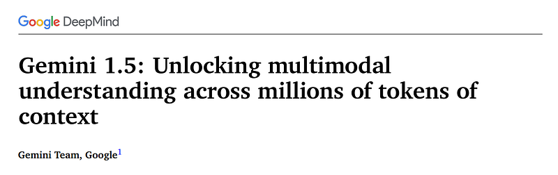 | Title slide of the Gemini 1.5 technical report (*Gemini 1.5: Unlocking multimodal understanding across millions of tokens of context*). |
| 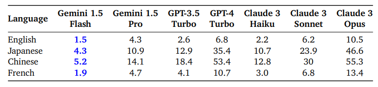 | Time per output character (ms) for Gemini 1.5 Flash (highlighted), 1.5 Pro, GPT-3.5/4 Turbo, and Claude 3 Haiku/Sonnet/Opus on EN/JA/ZH/FR prompts (~10k input chars). |
| 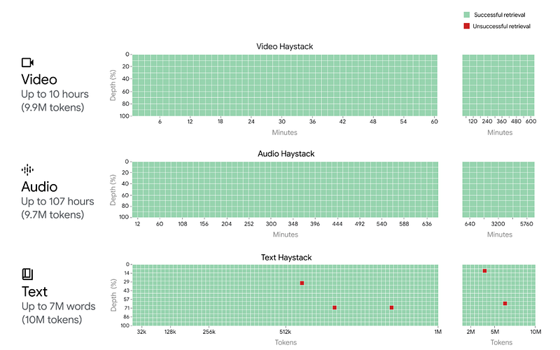 | Multimodal needle-in-a-haystack heatmaps for video (~10h), audio (~107h), and text (~10M tokens): depth vs span with successful retrieval (green) dominant across modalities. |
| 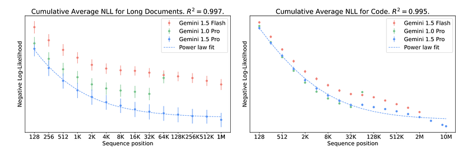 | Cumulative average NLL vs sequence position for long documents (to 1M tokens) and code (to 10M): Gemini 1.5 Pro, 1.5 Flash, and 1.0 Pro vs dashed power-law fits ($R^2 \approx 0.997$ / $0.995$). |
| 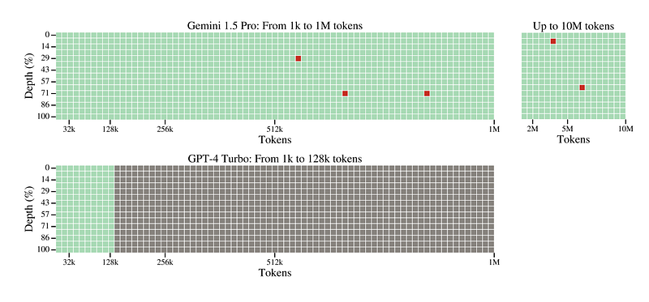 | Text haystack retrieval for Gemini 1.5 Pro (1k–1M and up to 10M tokens) vs GPT-4 Turbo (green only to 128k; grey for unsupported longer contexts). |
| 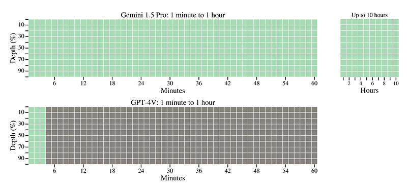 | Video haystack: Gemini 1.5 Pro solid green to 10 hours vs GPT-4V collapsing to failure (grey) after a few minutes within the 1-hour grid. |
| 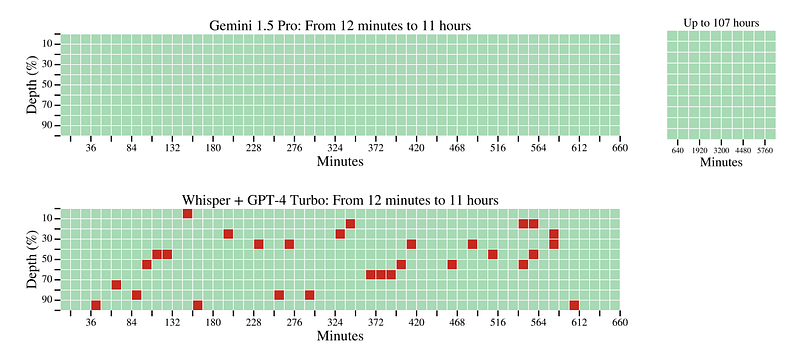 | Audio haystack: Gemini 1.5 Pro through ~107 hours vs Whisper + GPT-4 Turbo with intermittent failures over ~12 minutes–11 hours. |
| 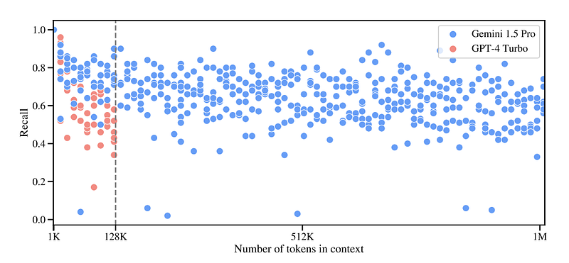 | Multi-needle recall vs context length: Gemini 1.5 Pro to 1M tokens vs GPT-4 Turbo stopping at 128k (vertical dashed marker). |
| 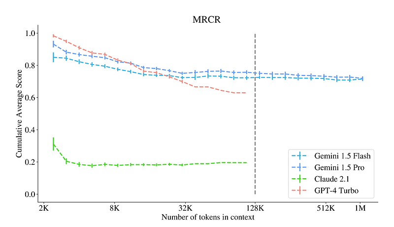 | MRCR cumulative average score vs context length to 1M tokens for Gemini 1.5 Pro/Flash vs GPT-4 Turbo and Claude 2.1 (GPT/Claude truncated near 128k). |
| 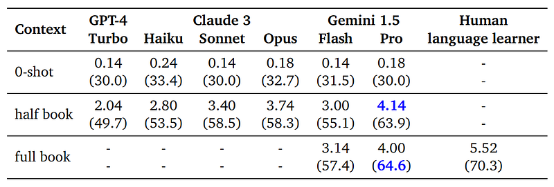 | MTOB Kalamang→English: human ratings (and BLEURT %) under 0-shot, half-book, and full-book context for GPT-4 Turbo, Claude 3 variants, Gemini 1.5 Flash/Pro, and human learner. |
| 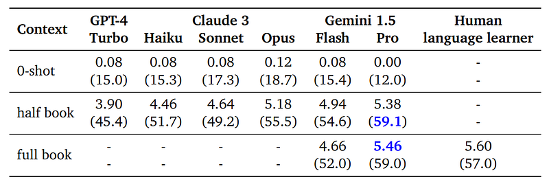 | MTOB English→Kalamang with the same models; only Gemini 1.5 reaches full-book cells beside the human learner baseline. |
| 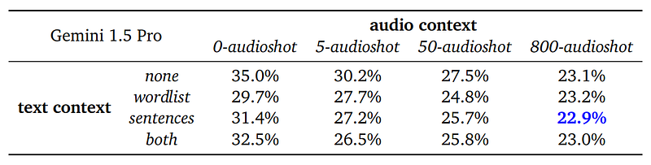 | ASROB Kalamang ASR: Gemini 1.5 Pro character error rate (%) over audio-shot count × text-context type (best highlighted ~22.9%). |
| 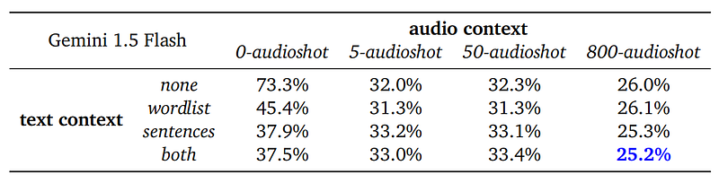 | Same ASROB grid for Gemini 1.5 Flash (best CER ~25.2%). |
| 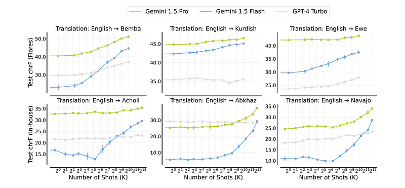 | Many-shot English→low-resource translation: chrF vs few-shot count ($2^0$–$2^{12}$) on six languages for Gemini 1.5 Pro/Flash vs GPT-4 Turbo (Flores + in-house splits). |
| 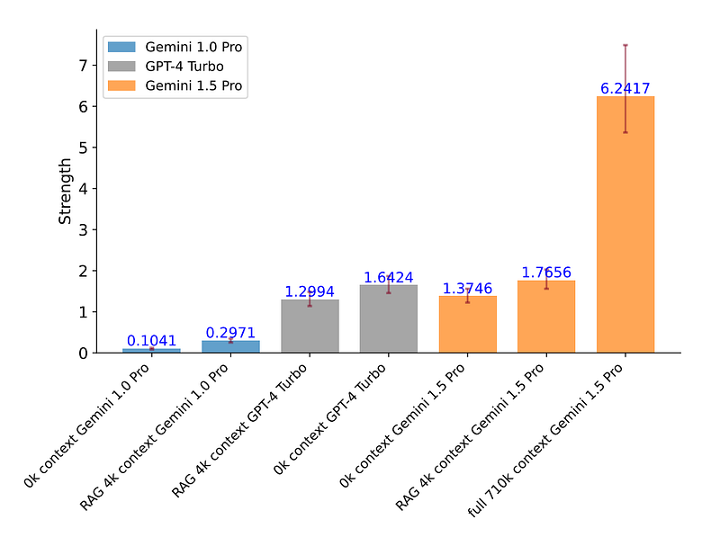 | Long-document QA on *Les Misérables*: Bradley–Terry “strength” for 0k vs RAG@4k vs full ~710k-token Gemini 1.5 Pro vs GPT-4 Turbo / Gemini 1.0 Pro baselines. |
| 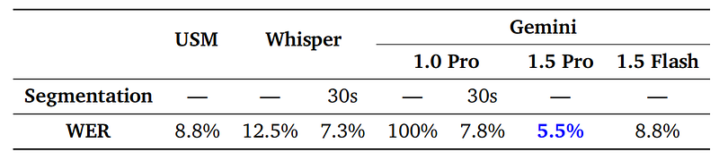 | 15-minute video ASR word error rates for USM, Whisper (±30 s segmentation), Gemini 1.0 Pro (±segmentation), Gemini 1.5 Pro (5.5%), and 1.5 Flash (8.8%). |
| 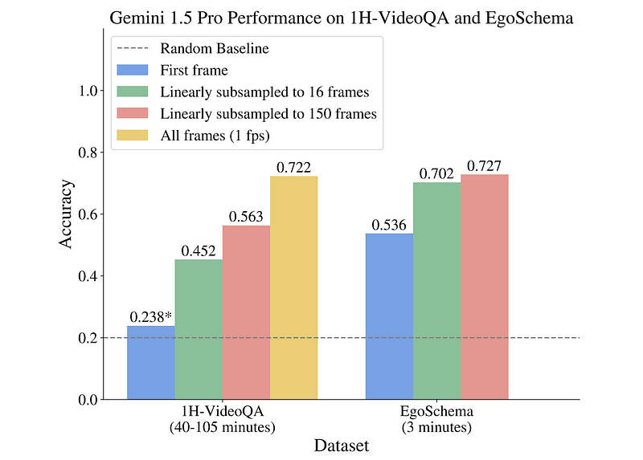 | Gemini 1.5 Pro on 1H-VideoQA vs EgoSchema: accuracy vs first-frame / 16 / 150 frames and full 1 fps video on the hour-long split. |
| 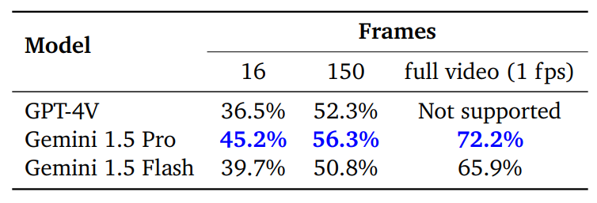 | 1H-VideoQA table: GPT-4V vs Gemini 1.5 Pro and Flash at 16 frames, 150 frames, and full-video 1 fps (GPT-4V unsupported on full video). |
| 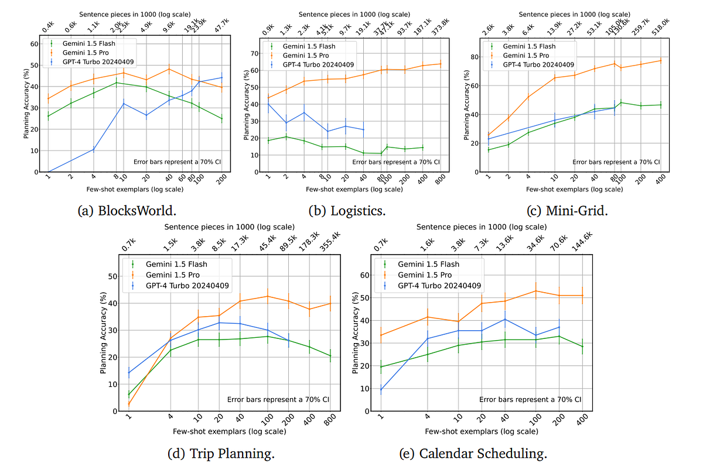 | Few-shot planning accuracy vs exemplars (log-scaled) for BlocksWorld, Logistics, Mini-Grid, Trip Planning, Calendar: Gemini 1.5 Flash/Pro vs GPT-4 Turbo. |
| 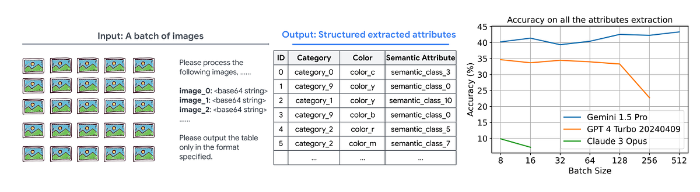 | Unstructured multimodal analytics benchmark: batched image→structured attribute extraction setup plus accuracy vs batch size for Gemini 1.5 Pro, GPT-4 Turbo, Claude 3 Opus. |
| 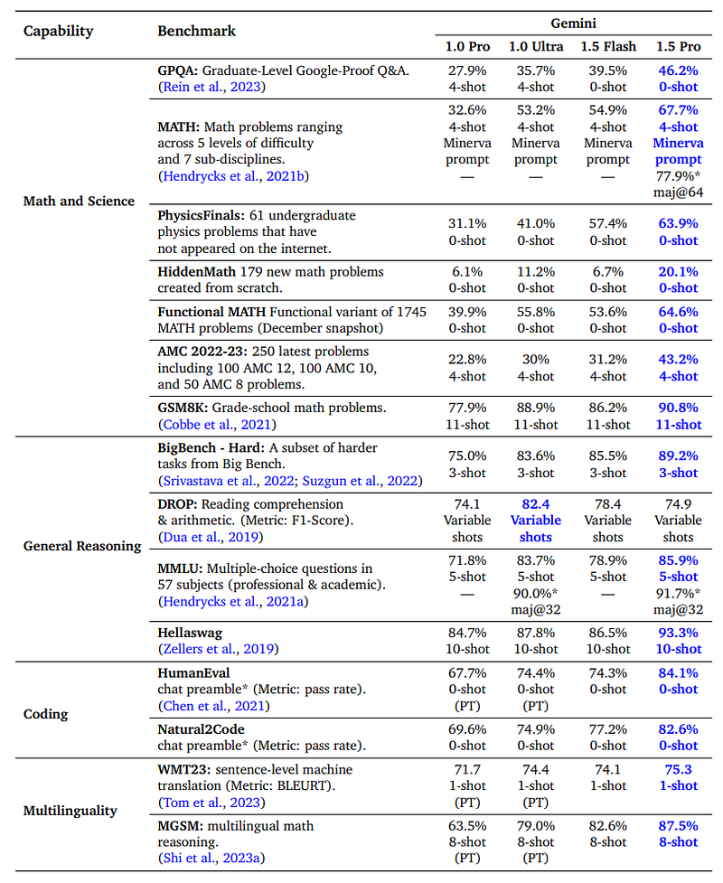 | Core text evaluations table (Math & Science, General Reasoning, Coding, Multilinguality) comparing Gemini 1.0 Pro/Ultra with 1.5 Flash and 1.5 Pro. |
| 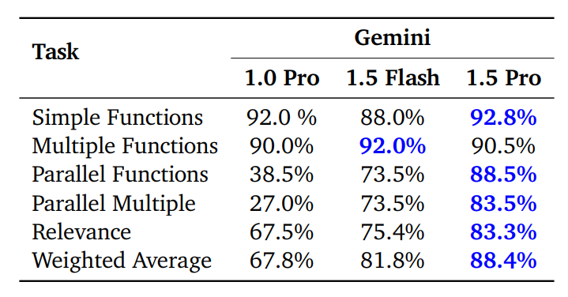 | Function-calling leaderboard-style splits (simple / multiple / parallel / relevance) with weighted averages for Gemini 1.0 Pro, 1.5 Flash, and 1.5 Pro. |
| 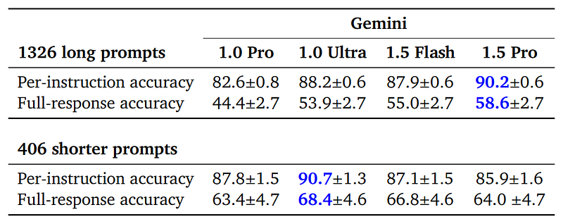 | Instruction-following accuracy on 1326 long prompts vs 406 shorter prompts: per-instruction vs full-response rates for Gemini 1.0 Pro/Ultra and 1.5 Flash/Pro (± CIs). |
| 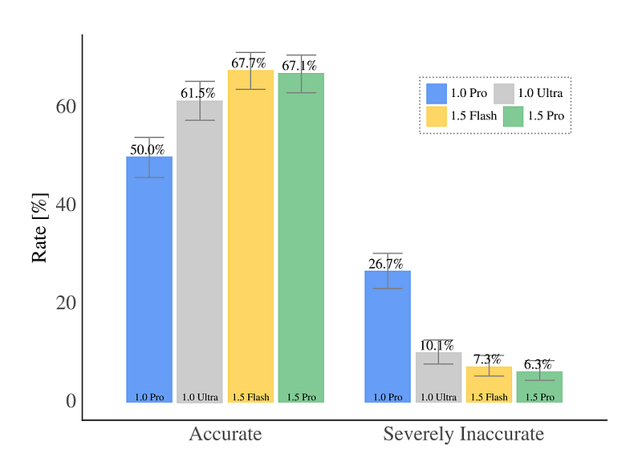 | Expertise QA: share of responses rated Accurate vs Severely inaccurate across Gemini 1.0 Pro/Ultra and 1.5 Flash/Pro with bootstrap error bars. |
| 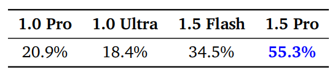 | Dolomites-style domain methodical tasks: LM-judge win rates topping at **55.3%** for Gemini 1.5 Pro among four Gemini variants. |
| 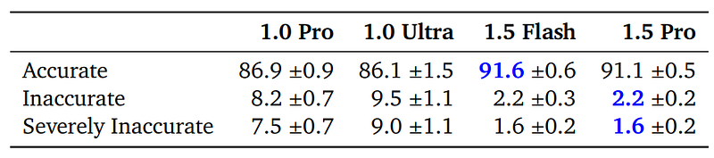 | STEM QA with context on Qasper: proportions of accurate vs inaccurate vs severely inaccurate sentences (± bootstrap CIs) for four Gemini models. |
| 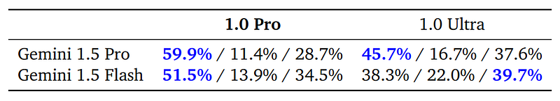 | Preference breakdown (win / tie / loss %) for Gemini 1.5 Pro and Flash vs Gemini 1.0 Pro and Ultra on hard real-world GenAI prompts. |
| 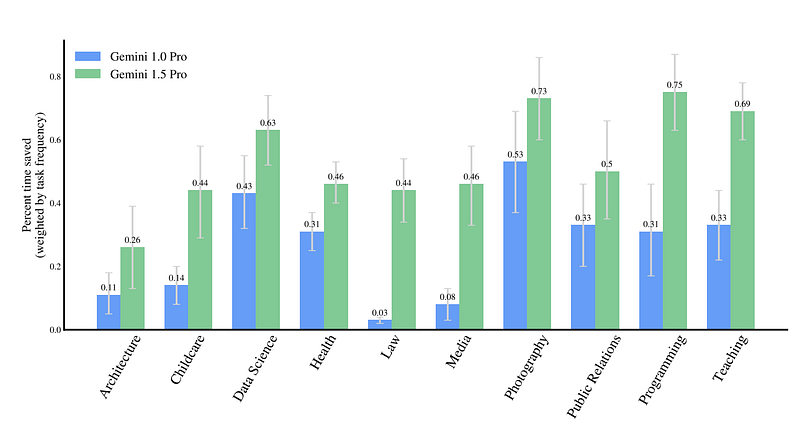 | Frequency-weighted percent time saved by occupation when completing prompts with Gemini 1.5 Pro vs 1.0 Pro (ten industries, ± CIs). |
| 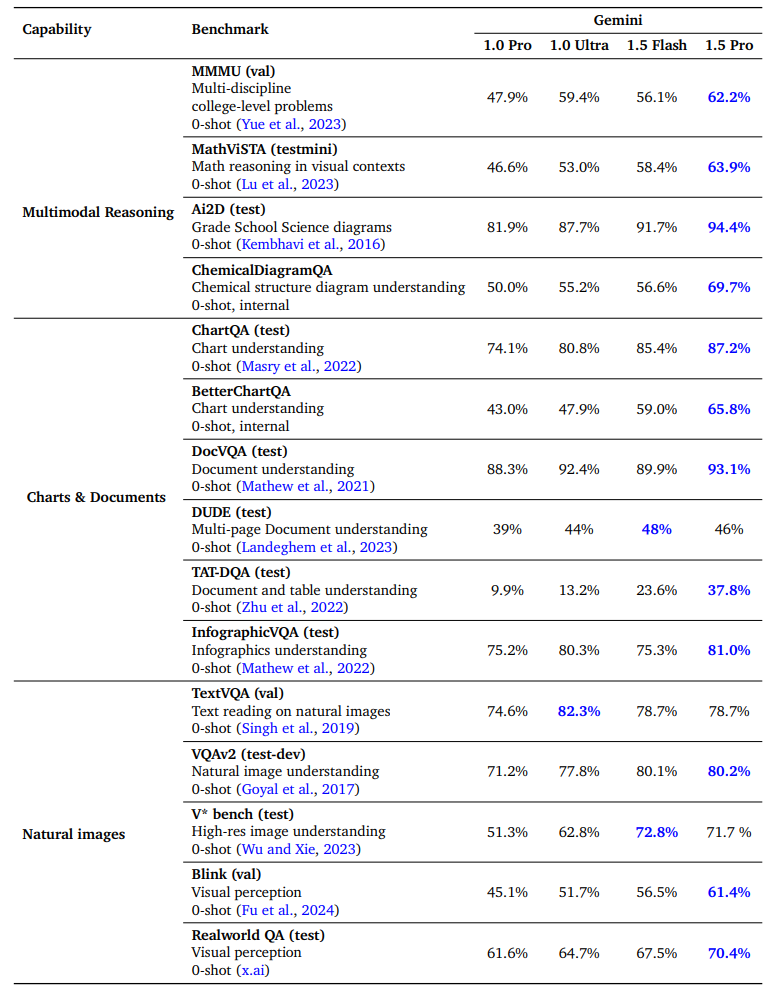 | Core vision & document multimodal benchmarks (reasoning, charts/documents, natural images) for Gemini 1.0 Pro/Ultra vs 1.5 Flash/Pro. |
| 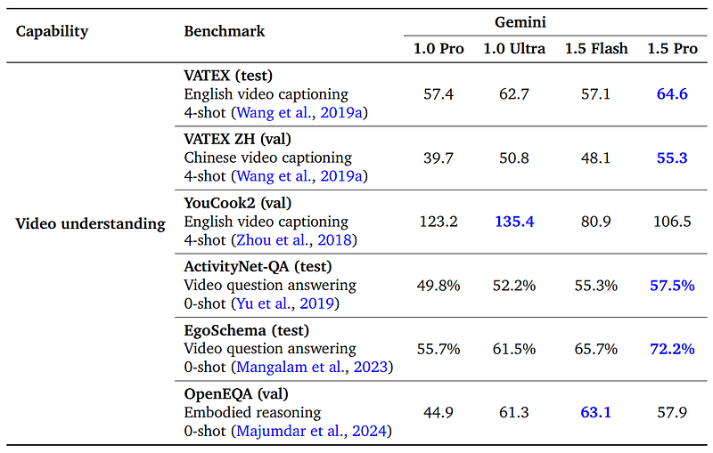 | Video understanding results on captioning (VATEX/YouCook2), QA (ActivityNet-QA, EgoSchema), and embodied OpenEQA across Gemini 1.0 and 1.5 variants. |
| 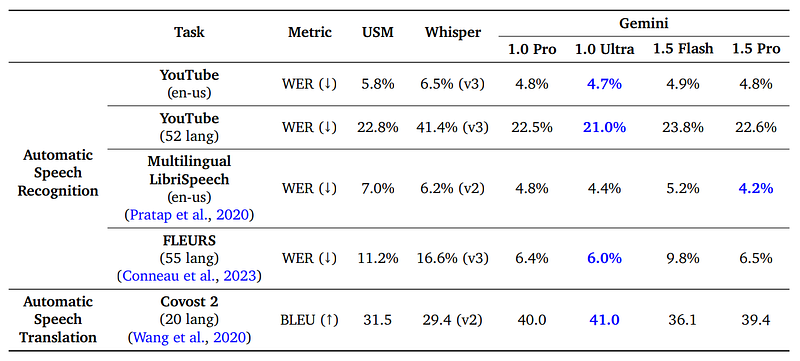 | Speech benchmarks: ASR WER (YouTube, MLS, FLEURS) and AST BLEU (Covost 2) for USM, Whisper, and Gemini 1.0/1.5 models (best scores highlighted). |
| 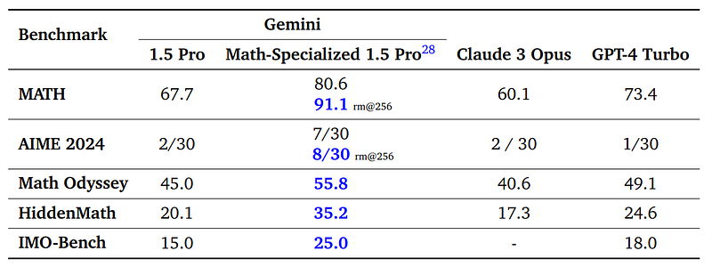 | Math-specialized Gemini 1.5 Pro vs baseline 1.5 Pro, Claude 3 Opus, and GPT‑4 Turbo on MATH (with rm@256), AIME, Math Odyssey, HiddenMath, IMO‑Bench. |
| 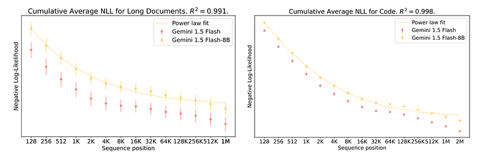 | Long-context scaling for Gemini 1.5 Flash vs Flash‑8B: cumulative average NLL vs sequence position on documents (to 1M tokens) and code (to 2M) with power-law overlays. |
| 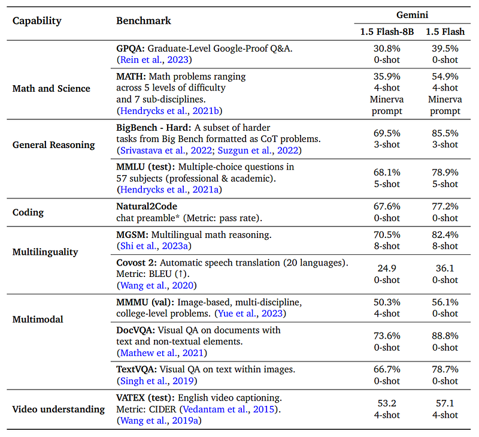 | Capability sweep comparing Gemini 1.5 Flash‑8B with full Flash on math, reasoning, coding, MGSM, Covost 2, MMMU, DocVQA, TextVQA, VATEX, etc. |
## Related

- [[Papers Explained Corpus]]
- [[Large Language Models]]
- [[Model Compression and Efficiency]]
- [[Vision Language Models]]
- [[Long Context]]
- [[Code Models]]
- [[Papers Explained 141 - Tool LLM]]
- [[Papers Explained 143 - Chameleon]]

#summary #topic
