# Papers Explained 143 - Chameleon

Chameleon is a family of early-fusion token-based mixed-modal models capable of reasoning over and generating interleaved image-text documents, setting a new bar for open multimodal foundation models.

This page ingests the source article into the wiki and connects it to [[Papers Explained Corpus]], [[Reasoning Models]], [[Vision Language Models]], [[Large Language Models]], [[Code Models]].

## Source Metadata

- Source file: `raw/2024-05-29_Papers-Explained-143--Chameleon-6cddfdbceaa8.md`
- Source title: Papers Explained 143: Chameleon
- Published: 2024-05-29
- Canonical: [https://medium.com/@ritvik19/papers-explained-143-chameleon-6cddfdbceaa8](https://medium.com/@ritvik19/papers-explained-143-chameleon-6cddfdbceaa8)

## Key Ideas

- It introduces architectural innovations and training techniques that enable the stable and scalable training of early-fusion token-based models, addressing key challenges in mixed-modal learning.
- An image tokenizer is trained which encodes a 512 × 512 image into 1024 discrete tokens from a codebook of size 8192. Given the importance of generating human faces, the percentage of images with faces is upsampled during pre-training by 2 times.
- A BPE tokenizer is trained over a subset of the training data outlined below with a vocabulary size of 65,536, which includes the 8192 image codebook tokens, using the sentence piece library.
- The pre-training consists of two stages. The first stage takes up the first 80% of training while the second stage takes the last 20%. All the Text-To-Image pairs are rotated so that 50% of the time the image comes before the text.
- The first stage uses very large-scale completely unsupervised data sets.

## Notes

Chameleon is a family of early-fusion token-based mixed-modal models capable of reasoning over and generating interleaved image-text documents, setting a new bar for open multimodal foundation models.

It introduces architectural innovations and training techniques that enable the stable and scalable training of early-fusion token-based models, addressing key challenges in mixed-modal learning.

## Pre-Training

### Tokenization

Image Tokenization

An image tokenizer is trained which encodes a 512 × 512 image into 1024 discrete tokens from a codebook of size 8192. Given the importance of generating human faces, the percentage of images with faces is upsampled during pre-training by 2 times. A core weakness of the tokenizer is in reconstructing images with a large amount of text.

Text Tokenization

A BPE tokenizer is trained over a subset of the training data outlined below with a vocabulary size of 65,536, which includes the 8192 image codebook tokens, using the sentence piece library.

### Data

The pre-training consists of two stages. The first stage takes up the first 80% of training while the second stage takes the last 20%. All the Text-To-Image pairs are rotated so that 50% of the time the image comes before the text.

First Stage

The first stage uses very large-scale completely unsupervised data sets.

- Text only: A total of 2.9T text only tokens, including pre training data of Llama 2 and Code Llama.

- Text-Image: A total of 1.5T text-image tokens, consisting of 1.4B text-image pairs of publicly available data sources and licensed data. The images are then resized and center cropped into 512 × 512 images for tokenization.

- Text Image Interleaved: A total of 400B tokens procured from publicly available web sources.

Second Stage

In the second stage, the weight of the first stage data is lowered by 50% and higher quality datasets are mixedin while maintaining a similar proportion of image text tokens. A filtered subset of the train sets from a large collection of instruction tuning sets is also included.

### Architecture

The architecture follows LLaMa-2, using RMSNorm for normalization, SwiGLU activation functions, and rotary positional embeddings (RoPE).

However, the standard LLaMa architecture experienced complex divergences during training, which were traced back to the softmax operation. This was due to the translation-invariant property of softmax, where softmax(z) = softmax(z + c), leading to a “competition” among modalities for representation space as they all share the same model weights.

To address the norm growth issue, query-key normalization (QK-Norm) is used; it directly controls the norm growth of inputs to softmax by applying layer norm to the query and key vectors within the attention mechanism.

Adding dropout after attention and feed-forward layers, along with QK-Norm, helped stabilize Chameleon-7B. However, for Chameleon-34B, additional normalization strategies were required due to its larger size.

For Chameleon-34B, a normalization strategy specific to the Swin transformer is used. This strategy bounds the norm growth of the feedforward block and works in conjunction with the SwiGLU activation function. The modified sequence for Chameleon-34B is:

It is observed that dropout was not beneficial for Chameleon-7B or Chameleon-34B when using the aforementioned normalization strategies. And that both Chameleon-7B and Chameleon-34B could be trained stably without dropout when norm reordering was applied, with QK-norm being essential in both cases.

*Figure: Summary of core architecture and optimization decisions made in Chameleon in contrast to LLaMa-1 and LLaMa-2.*

### Inference

Autoregressive, mixed-modal generation presents specific challenges during inference:

- Data-dependencies per-step: The model must adapt its decoding approach whether it’s generating text or images at a given step, requiring the inspection of tokens at each step to guide the control flow. This often involves transferring data from the GPU to the CPU (a blocking operation).

- Masking for modality-constrained generation: To generate content exclusively for one modality (like images only), tokens that don’t pertain to that modality are masked out so they can be ignored during the decoding process.

- Fixed-sized text units: Unlike text, which can vary in length, image token generation produces fixed-size blocks of tokens that correspond to an entire image.

To address these challenges, a standalone inference pipeline is designed that supports streaming for both text and images, and includes token-dependent conditional logic at each generation step. In the non-streaming setting, blocks of image tokens can be generated in a fused fashion without conditional computation, but token masking removes branching on the GPU. Additionally, when generating text, each output token must be inspected for image-start tokens to condition image-specific decoding augmentations.

## Alignment

The alignment stage utilizes supervised fine-tuning (SFT) on a diverse range of high-quality datasets categorized into Text, Code, Visual Chat, Image Generation, Interleaved Text/Image Generation, and Safety. The datasets draw upon existing datasets like LLaMa-2 for text and CodeLLaMa for code. For image generation,high-aesthetic images are selected using a licensed data source and an aesthetic classifier, filtering for images rated at least six on a scale.The selected images are 512 × 512 pixels in size. For Visual Chat and Interleaved Text/Image Generation, high-quality data is collected through third-party vendors.

*Figure: Supervised Fine-Tuning Dataset Statistics*

A variety of prompts that could potentially lead to unsafe content generation by the mode are includedl, along with refusal responses like “I can’t help with that.” This collection covers sensitive topics such as violence, controlled substances, privacy, and sexual content. It includes examples from LLaMa-2-Chat, synthetic text from Rainbow Teaming, image generation prompts from Pick-A-Pic for safety testing, cyber security safety examples, and internally collected mixed-modal prompts through manual annotation and automatic expansion. The mixed-modal prompts are particularly important as they address potential multi-modal attack vectors not covered by text-only or text-to-image safety tuning datasets.

The model is finetuned with a sequence length of 4096 tokens, with packing enabled. It is noted that an imbalance in modality pairings can cause the model to learn an unconditional prior, leading to either muted or overly exaggerated generation of a single modality.

## Evaluation

### Human Evaluation

Eevaluation of models focused on whether the responses completely, partially, or do not fulfill the tasks.

- Chameleon had the highest rate of responses that completely fulfilled the tasks (55.2%), followed by Gemini+ (37.6%) and GPT-4V+ (44.7%).

- Gemini and GPT-4V had significantly lower rates of task fulfillment, with 17.6% and 23.1%, respectively.

- The lower performance of Gemini and GPT-4V may be due to their text-only responses not fully aligning with the mixed-modal expectations of the prompts.

- Chameleon performs significantly better than both Gemini+ and GPT-4V+ in most cases, with substantial win rates that indicate a clear preference for its responses among human annotators.

- The inclusion of augmented images in Chameleon seems to enhance its performance compared to the original Gemini.

- Chameleon’s superiority over GPT-4V suggests that it may offer improvements over the baseline models, potentially due to better fine-tuning or integration of visual and textual information.

### Inter-annotator Agreement

The level of agreement between different annotators was examined to understand the consistency and reliability of their judgments.

*Figure: The inter-annotator agreement on the questions in the absolute evaluation.*

*Figure: The inter-annotator agreement on relative evaluations.*

- Human annotators demonstrated high agreement on questions with objective and simple properties, indicating their reliability in such contexts.

- The design of the questions appears to be reasonably effective, as there was a consistent level of agreement across different questions.

- The relative evaluation showed that while there were clear consensus cases, there was also a significant number of cases (approximately 55%-60%) where annotators’ judgments differed, indicating that distinguishing between models can be challenging.

- The results suggest that the models under evaluation are performing comparably to each other in many instances, which may make it difficult to discern fine-grained differences using this evaluation method.

### Safety Testing

Evaluation of the safety of the Chameleon model by crowdsourcing prompts that provoke the model to create unsafe content and assessing the model’s responses.

*Figure: Safety testing on 20,000 crowdsourced prompts and 445 red team interactions provoking the model to produce unsafe content.*

- The overwhelming majority of Chameleon’s responses are considered safe, with only 78 (0.39%) unsafe responses for the 7B model and 19 (0.095%) for the 30B model.

- In the interactive session, 7 (1.6%) responses were considered unsafe and 20 (4.5%) were labeled as unsure.

### Text Benchmark Evaluations

*Figure: Comparison of overall performance on collective academic benchmarks against open-source foundational models.*

- In Commonsense Reasoning and Reading Comprehension, Chameleon-7B and Chameleon-34B showed competitive performance compared to Llama-2 models, with Chameleon-34B outperforming Llama-2 70B on 5/8 tasks.

- On GSM8K, Chameleon-7B outperformed its Llama-2 counterpart and matched the performance of Mistral 7B. Chameleon-34B also outperformed Llama2–70B and approached the performance of Mixtral 8x7B.

- On MATH, both Chameleon models outperformed their Llama-2 counterparts and matched or exceeded the performance of Mistral 7B/Mixtral 8x7B on various accuracy metrics (maj@N).

- On MMLU, Chameleon-34B approached the performance of Mixtral 8x7B/Gemini-Pro.

- Chameleon outperforms LLaMa-2 across all evaluated tasks, with performance approaching that of Mistral 7B/Mixtral 8x7B in some cases.

### Image-To-Text Benchmark Evaluations

*Figure: Model Performances on Image-to-Text Capabilities.*

Image Captioning:

- Chameleon-34B (pre-trained, 2-shot) outperforms Flamingo and IDEFICS on COCO when using 32 shots.

- On Flickr30k, Chameleon-34B matches the performance of Flamingo and IDEFICS with 32 shots.

- Both Chameleon-34B multi-task and SFT variants outperform other models on COCO.

- The SFT model of Chameleon-34B outperforms others on Flickr30k, with the multitask model being a close second.

Visual Question Answering:

- Chameleon-34B (pre-trained, 2-shots) matches the performance of larger models like Flamingo and IDEFICS with 32 shots on VQA-v2.

- Chameleon-34B-Multitask approaches the performance of IDEFICS-80B-Instruct and Gemini Pro but trails larger models such as Flamingo-80B-FT, GPT-4V, and Gemini Ultra.

- Llava-1.5 outperforms Chameleon-34B on VQA-v2, potentially due to additional fine-tuning.

## Paper

Chameleon: Mixed-Modal Early-Fusion Foundation Models [2405.09818](https://arxiv.org/abs/2405.09818)

Recommended Reading [Multi Modal Transformers](https://ritvik19.medium.com/list/multi-modal-transformers-67453f215ecf)

## Figures

Figures from the Medium HTML export (`raw/2024-05-29_Papers-Explained-143--Chameleon-6cddfdbceaa8.md`); local copies under `wiki/assets/papers-explained-143-chameleon/` when download succeeded.

| Figure | Caption |
|--------|---------|
| 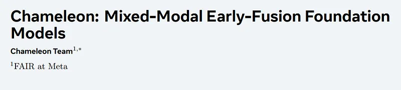 | Title slide for *Chameleon: Mixed-Modal Early-Fusion Foundation Models* (FAIR at Meta). |
| 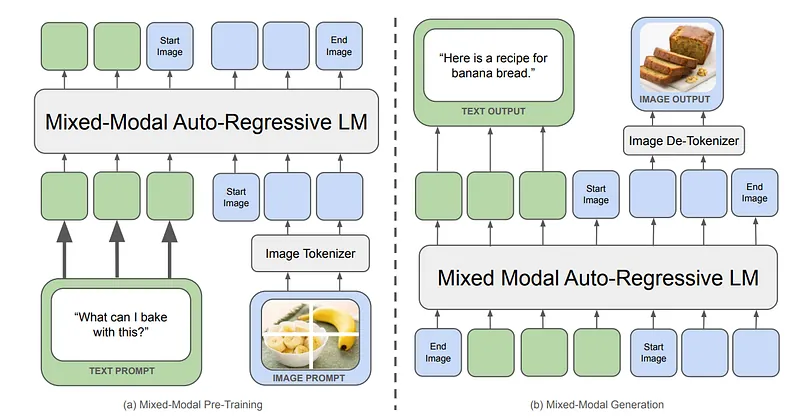 | Early-fusion tokenizer LM consumes interleaved text and discrete image tokens for multimodal pretraining and autoregressive generation with paired image decoder outputs. |
| 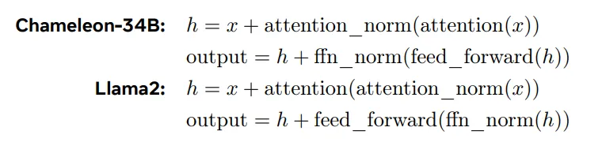 | Residual ordering contrast: Chameleon-34B applies attention/FFN norms inside the residual branch versus Llama 2’s pre-norm stacking. |
| 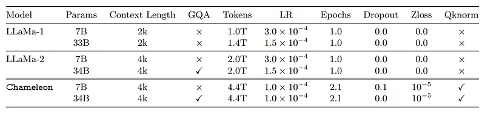 | Training recipe comparison among Llama 1/2 and Chameleon at 7B and 33–34B scales—tokens seen, LR, dropout, z-loss, and QK-norm usage. |
| 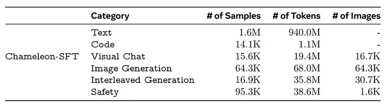 | Supervised fine-tuning mixture counts across text, code, visual chat, T2I, interleaved generation, and safety buckets (samples, tokens, images). |
| 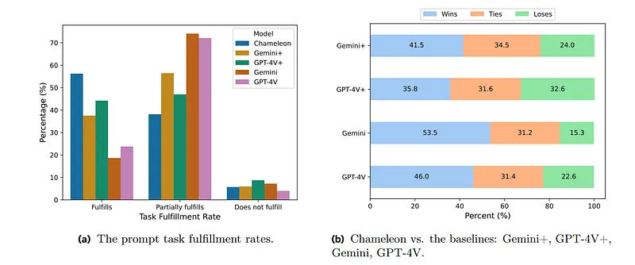 | Human study fulfillment buckets plus pairwise win/tie/loss bars for Chameleon against Gemini+ / GPT-4V+ / Gemini / GPT-4V. |
| 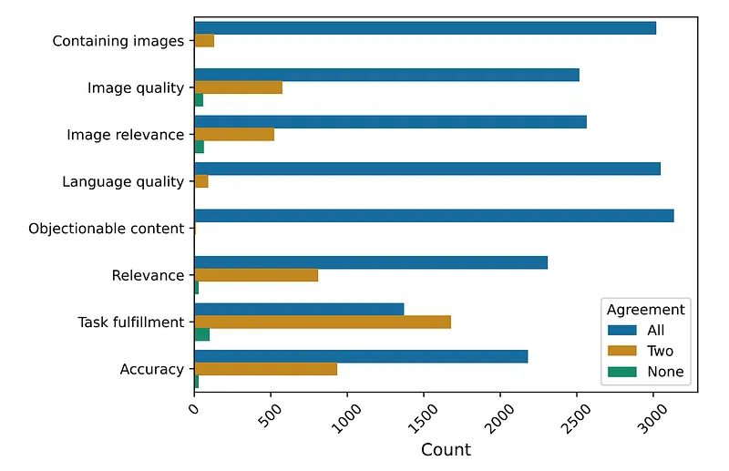 | Absolute-evaluation inter-annotator agreement histograms across accuracy, multimodal relevance, safety, and related rubric axes. |
| 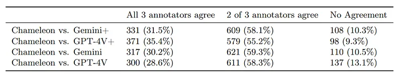 | Pairwise relative-eval consensus rates (3/3, 2/3, none) when judging Chameleon versus each closed multimodal baseline. |
| 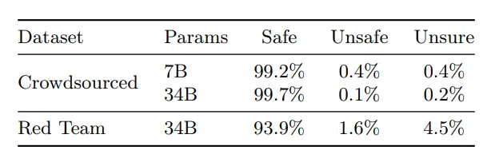 | Safety outcome percentages on crowdsourced probes vs interactive red-teaming for Chameleon-7B and Chameleon-34B. |
| 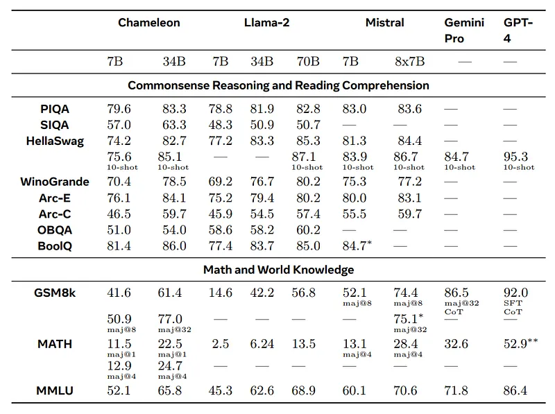 | Academic text benchmarks spanning commonsense QA, GSM8K/MATH aggregates, and MMLU vs Llama 2, Mistral, Gemini Pro, and GPT-4 variants. |
| 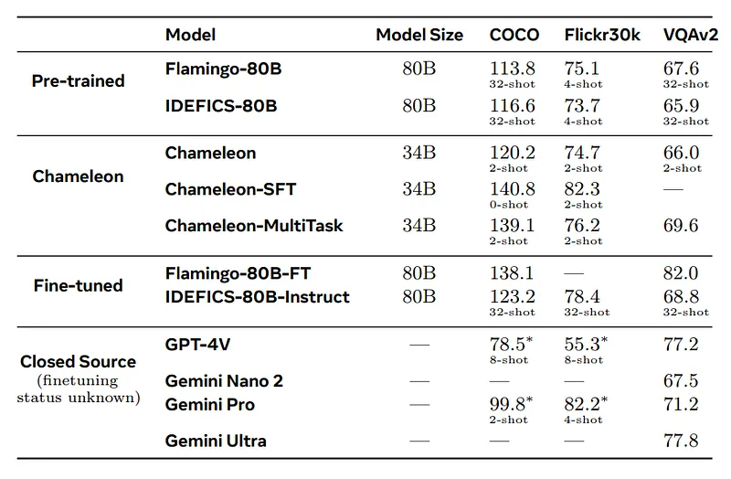 | Image-to-text scores on COCO captioning, Flickr30k, and VQA-v2 for pretrained, Chameleon-tuned, open fine-tuned, and proprietary VLMs. |
## Related

- [[Papers Explained Corpus]]
- [[Reasoning Models]]
- [[Vision Language Models]]
- [[Large Language Models]]
- [[Code Models]]
- [[Papers Explained 142 - Gemini 1.5 Flash]]
- [[Paper Explained 144 - Granite Code Models]]

#summary #topic
