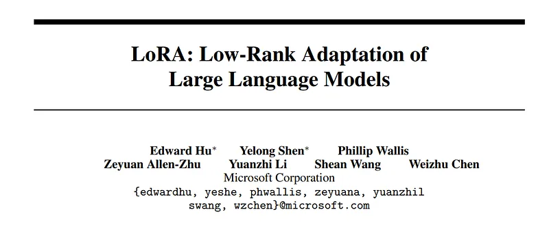
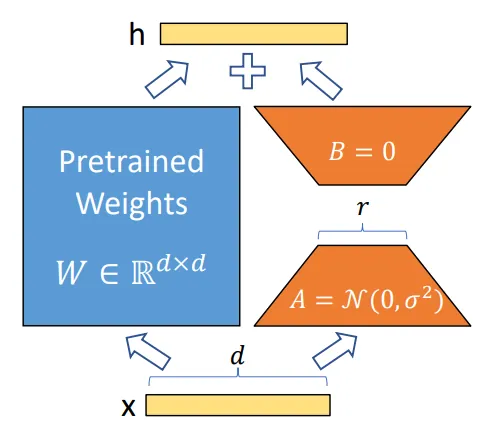
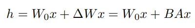
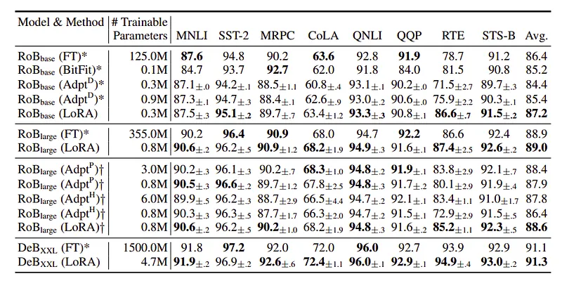
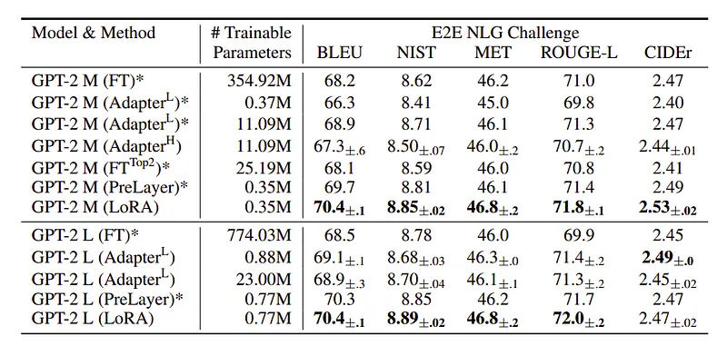
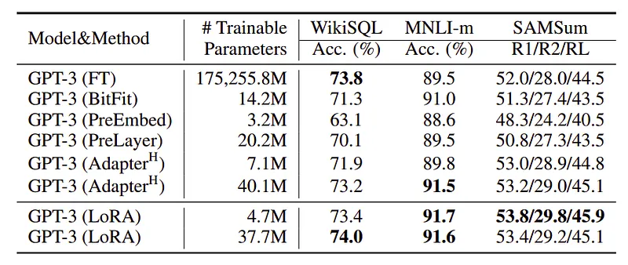
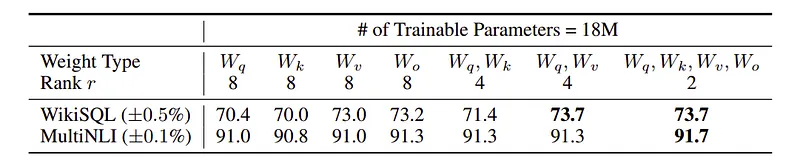
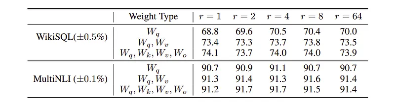
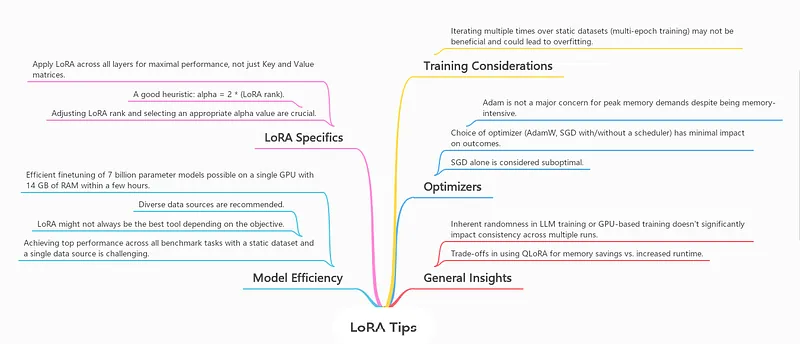

# Papers Explained 145 - LoRA

Low-Rank Adaptation or LoRA freezes the pretrained model weights and injects trainable rank decomposition matrices into each layer of the Transformer architecture, greatly reducing the number of trainable parameters for downstream tasks.

This page ingests the source article into the wiki and connects it to [[Papers Explained Corpus]], [[Large Language Models]], [[Model Compression and Efficiency]], [[Code Models]].

## Source Metadata

- Source file: `raw/2024-06-03_Papers-Explained-145--LoRA-a48359cecbfa.md`
- Source title: Papers Explained 145: LoRA
- Published: 2024-06-03
- Canonical: [https://medium.com/@ritvik19/papers-explained-lora-a48359cecbfa](https://medium.com/@ritvik19/papers-explained-lora-a48359cecbfa)

## Key Ideas

- LoRA performs on-par or better than fine tuning in model quality on RoBERTa, DeBERTa, GPT-2, and GPT-3, despite having fewer trainable parameters, a higher training throughput, and, unlike adapters, no additional inference latency.
- Code is available at [GitHub](https://github.com/microsoft/LoRA.)
- A neural network contains many dense layers which perform matrix multiplication. The weight matrices in these layers typically have full-rank.
- Inspired by this, LoRA hypothesizes that the updates to the weights also have a low “intrinsic rank” during adaptation.
- For a pre-trained weight matrix W0 (d×k), its update is constrained by representing the latter with a low-rank decomposition W0 +∆W = W0 + BA, where B (d×r’), A (r×k), and the rank r min(d, k).

## Notes

Low-Rank Adaptation or LoRA freezes the pretrained model weights and injects trainable rank decomposition matrices into each layer of the Transformer architecture, greatly reducing the number of trainable parameters for downstream tasks.

LoRA performs on-par or better than fine tuning in model quality on RoBERTa, DeBERTa, GPT-2, and GPT-3, despite having fewer trainable parameters, a higher training throughput, and, unlike adapters, no additional inference latency.

Code is available at [GitHub](https://github.com/microsoft/LoRA.)

## LoRA Finetuning

A neural network contains many dense layers which perform matrix multiplication. The weight matrices in these layers typically have full-rank. When adapting to a specific task the pre-trained language models have a low “intrinsic dimension” and can still learn efficiently despite a random projection to a smaller subspace.

Inspired by this, LoRA hypothesizes that the updates to the weights also have a low “intrinsic rank” during adaptation.

For a pre-trained weight matrix W0 (d×k), its update is constrained by representing the latter with a low-rank decomposition W0 +∆W = W0 + BA, where B (d×r’), A (r×k), and the rank r min(d, k). During training, W0 is frozen and does not receive gradient updates, while A and B contain trainable parameters. Note both W0 and ∆W = BA are multiplied with the same input, and their respective output vectors are summed coordinate-wise. For h = W0x, the modified forward pass yields:

A random Gaussian initialization is used for A and zero for B, so ∆W = BA is zero at the beginning of training. ∆Wx is scaled by α/r , where α is a constant in r.

```text
class
LoRALayer
(keras.layers.Layer):
def
__init__
(
self, in_dim, out_dim, rank, alpha
):
super
().__init__()
std_dev =
1
/ keras.ops.sqrt( keras.ops.cast(rank, keras.backend.floatx()))
self.A = self.add_weight(shape=(in_dim, rank), initializer=keras.initializers.RandomNormal()) * std_dev
self.B = self.add_weight(shape=(rank, out_dim), initializer=keras.initializers.Zeros())
self.alpha = alpha
def
forward
(
self, x
):
x = self.alpha * (x @ self.A @ self.B)
return
x
```

### Applying LoRA to Transformers

In principle, LoRA can be applied to any subset of weight matrices in a neural network to reduce the number of trainable parameters. In the Transformer architecture, there are four weight matrices in the self-attention module (Wq,Wk,Wv,Wo) and two in the MLP module. Wq (orWk, Wv) are treated as a single matrix of dimension dmodel ×dmodel, even though the output dimension is usually sliced into attention heads. The study is limited to only adapting the attention weights for downstream tasks and freezing the MLP modules both for simplicity and parameter-efficiency.

```text
class
LinearWithLoRA
(keras.layers.Layer):
def
__init__
(
self, linear, in_dim, out_dim, rank, alpha
):
super
().__init__()
self.linear = linear
self.lora = LoRALayer(in_dim, out_dim, rank, alpha)
def
forward
(
self, x
):
return
self.linear(x) + self.lora(x)
```

## Experiments

The experiments cover a wide range of tasks, including natural language understanding (NLU) and generation (NLG). RoBERTa, DeBERTa, GPT-2, and GPT-3 175B models are evaluated.

Baselines:

- Fine-Tuning (FT) is a common approach for adaptation, where the model is initialized with pre-trained weights and biases and undergoes gradient updates.

- A variant of fine-tuning called FTTop2 is used, which adapts only the last two layers.

- Bias-only or BitFit is a baseline where only the bias vectors are trained while freezing everything else.

- Prefix-embedding tuning (PreEmbed) inserts special tokens with trainable word embeddings among the input tokens.

- Prefix-layer tuning (PreLayer) extends prefix-embedding tuning by learning the activations after every Transformer layer.

- Adapter tuning inserts adapter layers between the self-attention module and the subsequent residual connection.

- Different designs of adapter layers are evaluated, including AdapterH, AdapterL, AdapterP, and AdapterDrop.

### RoBERTa and DeBERTa

*Figure: RoBERTabase, RoBERTalarge, and DeBERTaXXL with different adaptation methods on the GLUE benchmark.*

### GPT -2

*Figure: GPT-2 medium (M) and large (L) with different adaptation methods on the E2E NLG Challenge.*

### GPT -3

*Figure: Performance of different adaptation methods on GPT-3 175B.*

- Based on the above three results, it can be concluded that LoRA performs competitively with other fine-tuning techniques.

### Which weight matrices in transformer should we apply LoRA to?

*Figure: Validation accuracy on WikiSQL and MultiNLI after applying LoRA to different types of attention weights in GPT-3.*

- Adapting both Wq and Wv gives the best performance overall.

### What is the optimal rank for LoRA?

*Figure: Validation accuracy on WikiSQL and MultiNLI with different rank r.*

- Surprisingly, a rank as small as one suffices for adapting both Wq and Wv, while training Wq alone needs a larger r.

## LoRA in Action

- [Fine Tuning BERT](https://www.kaggle.com/code/ritvik1909/lora-bert/)

- [Fine Tuning BERT for NER](https://www.kaggle.com/code/ritvik1909/lora-bert-ner/)

- [Fine Tuning T5](https://www.kaggle.com/code/ritvik1909/lora-t5/)

- [Fine Tuning Tiny Llama](https://www.kaggle.com/code/ritvik1909/lora-tinyllama-1-1b/)

### Advantages of LoRA

- A pre-trained model can be shared and used to build many small LoRA modules for different tasks. The shared model can be frozen and tasks can be efficiently switched by replacing the matrices A and B, significantly reducing the storage requirement and task-switching overhead.

- LoRA makes training more efficient and lowers the hardware barrier to entry by up to 3 times when using adaptive optimizers since it does not need to calculate the gradients or maintain the optimizer states for most parameters. Instead, it only optimizes the injected, much smaller low-rank matrices.

- The simple linear design allows merging the trainable matrices with the frozen weights when deployed, introducing no inference latency compared to a fully fine-tuned model, by construction.

- LoRA is orthogonal to many prior methods and can be combined with many of them, such as prefix-tuning.

## Practical Tips for Finetuning LLMs Using LoRA

Source: [Practical Tips for Finetuning LLMs Using LoRA (Low-Rank Adaptation)](https://magazine.sebastianraschka.com/p/practical-tips-for-finetuning-llms)

## Paper

LoRA: Low-Rank Adaptation of Large Language Models [2106.09685](https://arxiv.org/abs/2106.09685)

Recommended Reading [Parameter Efficient Fine Tuning](https://ritvik19.medium.com/list/parameter-efficient-fine-tuning-2c00798f5b2b)

## Figures

Figures from the Medium HTML export (`raw/2024-06-03_Papers-Explained-145--LoRA-a48359cecbfa.md`); local copies under `wiki/assets/papers-explained-145-lora/` when download succeeded.

| Figure | Caption |
|--------|---------|
|  | Title page of *LoRA: Low-Rank Adaptation of Large Language Models*. |
|  | Frozen pretrained weights plus parallel rank-$r$ adapters ($A,B$) summed into the linear layer output. |
|  | Forward pass $h=W_0x+\Delta Wx=W_0x+BAx$ showing additive low-rank updates on frozen $W_0$. |
|  | GLUE averages for RoBERTa-base/large and DeBERTa-XXL: LoRA matches or beats full fine-tuning with $\ll1\%$ trainable params. |
|  | E2E NLG Challenge BLEU/ROUGE/CIDEr for GPT-2 Medium/Large comparing adapters, prefix tuning, and LoRA. |
|  | GPT-3 175B adaptation on WikiSQL, MNLI-matched, and SAMSum Rouge under BitFit, prefix tuning, adapters, and LoRA. |
|  | Fixed 18M-parameter budget ablations over which attention matrices receive LoRA on WikiSQL and MultiNLI. |
|  | Sensitivity of WikiSQL/MultiNLI accuracy to rank $r$ when adapting $W_q$, $(W_q,W_v)$, or all four attention projections. |
|  | Practical “LoRA tips” mind map covering layer coverage, $\alpha$ heuristics, hardware footprint, optimizers, and QLoRA trade-offs. |
## Related

- [[Papers Explained Corpus]]
- [[Large Language Models]]
- [[Model Compression and Efficiency]]
- [[Code Models]]
- [[Paper Explained 144 - Granite Code Models]]
- [[Papers Explained 146 - QLoRA]]
- [[LoRA Without Regret]] — 2025 empirical study showing LoRA ≈ FullFT when applied to all layers; refutes the original attention-only recommendation.

#summary #topic
