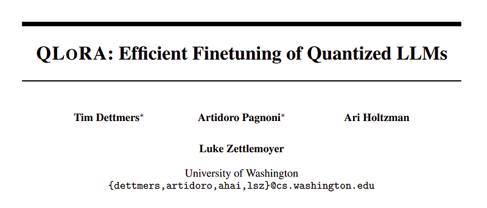
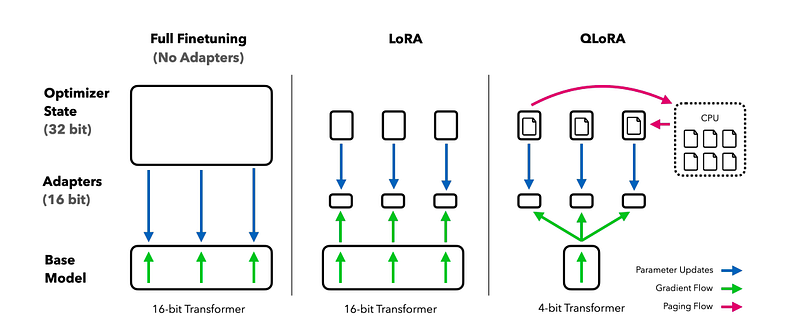
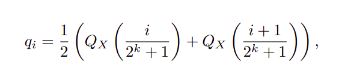
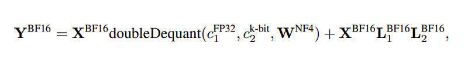
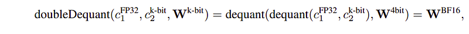
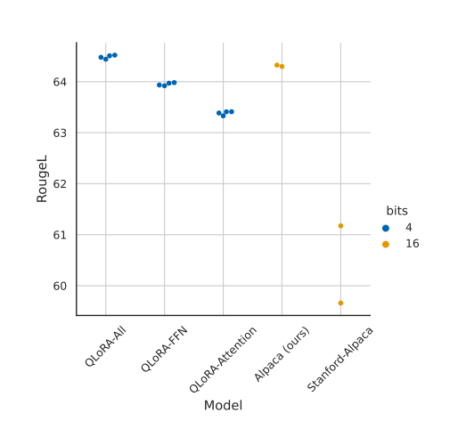
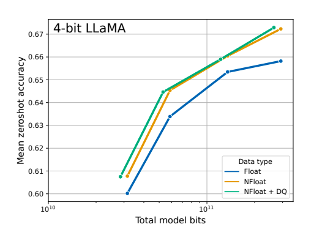
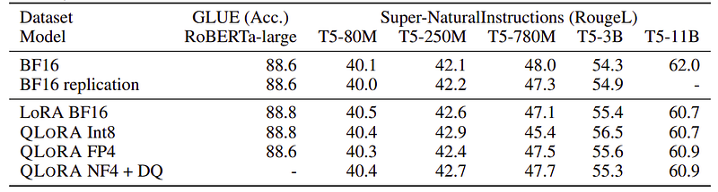
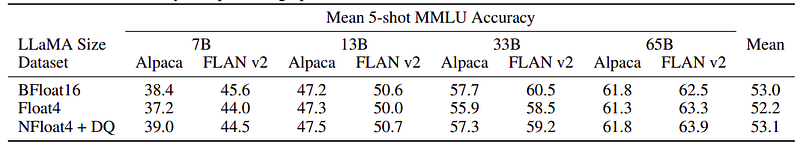
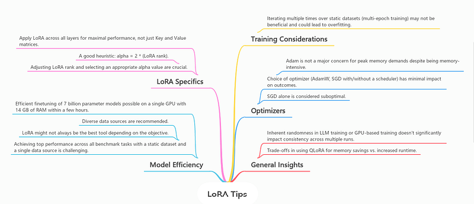

# Papers Explained 146 - QLoRA

QLoRA is an efficient finetuning approach that reduces memory usage for fine-tuning hplarge models on a single GPU while preserving full 16-bit fine tuning task performance by back propagating gradients through a frozen, 4-bit quantized pretrained language model into Low Rank Adapters.

This page ingests the source article into the wiki and connects it to [[Papers Explained Corpus]], [[Model Compression and Efficiency]], [[Large Language Models]], [[Code Models]], [[Supervised Fine-Tuning]].

## Source Metadata

- Source file: `raw/2024-06-05_Papers-Explained-146--QLoRA-a6e7273bc630.html`
- Source title: Papers Explained 146: QLoRA
- Published: 2024-06-05
- Canonical: [https://medium.com/@ritvik19/papers-explained-146-qlora-a6e7273bc630](https://medium.com/@ritvik19/papers-explained-146-qlora-a6e7273bc630)

## Key Ideas

- QLoRA is an efficient finetuning approach that reduces memory usage for fine-tuning hplarge models on a single GPU while preserving full 16-bit fine tuning task performance by back propagating gradients through a frozen, 4-bit quantized pretrained language...
- The code is available at [GitHub](https://github.com/TimDettmers/bitsandbytes).
- Recommended Reading [Papers Explained 145: LoRA](https://ritvik19.medium.com/papers-explained-lora-a48359cecbfa)
- QLORA has one low precision storage data type (usually 4-bit NormalFloat) and a computation data type (16-bit BrainFloat). The storage data type is dequantized to the computation data type in order to perform the forward and backward pass.
- The NormalFloat (NF) data type builds on Quantile Quantization that ensures each quantization bin has an equal number of values assigned from the input tensor by estimating the quantile of the input tensor through the empirical cumulative distribution...

## Notes

QLoRA is an efficient finetuning approach that reduces memory usage for fine-tuning hplarge models on a single GPU while preserving full 16-bit fine tuning task performance by back propagating gradients through a frozen, 4-bit quantized pretrained language model into Low Rank Adapters.

The code is available at [GitHub](https://github.com/TimDettmers/bitsandbytes).

Recommended Reading [Papers Explained 145: LoRA](https://ritvik19.medium.com/papers-explained-lora-a48359cecbfa)

## QLoRA Finetuning

QLORA has one low precision storage data type (usually 4-bit NormalFloat) and a computation data type (16-bit BrainFloat). The storage data type is dequantized to the computation data type in order to perform the forward and backward pass. However, weight gradients are only computed for the LoRA parameters which utilize 16-bit BrainFloat.

### 4-bit NormalFloat Quantization

The NormalFloat (NF) data type builds on Quantile Quantization that ensures each quantization bin has an equal number of values assigned from the input tensor by estimating the quantile of the input tensor through the empirical cumulative distribution function.

Expensive quantile estimates and approximation errors can be avoided when input tensors come from a distribution fixed up to a quantization constant.

Since pre trained neural network weights usually have a zero-centered normal distribution, all weights can be transformed to a single fixed distribution by scaling such that the distribution fits exactly into the range of the data type [−1, 1].

The data type is computed as follows:

(1) estimate the 2^(k + 1) quantiles of a theoretical N(0, 1) distribution to obtain a k-bit quantile quantization data type for normal distributions.

(2) take this data type and normalize its values into the [−1, 1] range

(3) quantize an input weight tensor by normalizing it into the [−1, 1] range through absolute maximum rescaling.

More formally, the 2k values qi of the data type are estimated as follows:

where QX(·) is the quantile function of the standard normal distribution N(0, 1).

A problem for a symmetric k-bit quantization is that this approach does not have an exact representation of zero. To ensure a discrete zeropoint of 0 and to use all 2k bits for a k-bit datatype, an asymmetric data type is created by estimating the quantiles qi of two ranges qi: 2k−1 for the negative part and 2k−1 + 1 for the positive part and then these sets of qi are unified and one of the two zeros that occur in both sets is removed.

The resulting data type that has equal expected number of values in each quantization bin is then termed as k-bit NormalFloat (NFk).

### Double Quantization

Double Quantization (DQ) is the process of quantizing the quantization constants for additional memory savings. While a small blocksize is required for precise 4-bit quantization, it also has a considerable memory overhead.

Double Quantization treats quantization constants c2 FP32 of the first quantization as inputs to a second quantization. This second step yields the quantized quantization constants c2 FP8 and the second level of quantization constants c1 FP32. 8-bit Floats with a block size of

256 are used for the second quantization as no performance degradation is observed for 8-bit quantization. Since the c2 FP32 are positive, the mean is subtracted from c2 before quantization to center the values around zero and make use of symmetric quantization.

### Paged Optimizers

Paged Optimizers use the NVIDIA unified memory feature, which does automatic page-to-page transfers between the CPU and GPU for error-free GPU processing in the scenario where the GPU occasionally runs out of memory. This feature is used to allocate paged memory for the optimizer states, which are then automatically evicted to CPU RAM when the GPU runs out-of-memory and paged back into GPU memory when the memory is needed in the optimizer update step.

### QLoRA

QLoRA for a single linear layer in the quantized base model with a single LoRA adapter is defined as follows:

where doubleDequant(·) is defined as:

NF4 with a block size of 64 is used for W for higher quantization precision and FP8 with a block size of 256 for c2 to conserve memory.

For parameter updates only the gradient with respect to the error for the adapters weights ∂E/∂Li are needed, and not for 4-bit weights ∂E/∂W. However, the calculation of ∂E/∂Li entails the calculation of ∂X/∂W which proceeds with dequantization from storage WNF4 to computation data type WBF16 to calculate the derivative ∂X/∂W in BFloat16 precision.

## Experiments

All three architectures (encoder, encoder-decoder, and decoder only) are considered for comparison with QLoRA using 16-bit adapter-finetuning and full-finetuning for models up to 3B. The advantages of NF4 over other 4-bit data types are studied using different models (OPT, LLaMA, BLOOM, Pythia) for model sizes 125m — 13B.

- Paged optimizers are critical for QLORA tuning on a single GPU, but hard measurements are not provided for them.

*Figure: RougeL for LLaMA 7B models on the Alpaca dataset.*

- Default LoRA hyperparameters do not match 16-bit performance, and applying LoRA on all linear transformer block layers are critical for matching full finetuning performance.

*Figure: Mean zero-shot accuracy over Winogrande, HellaSwag, PiQA, Arc-Easy, and ArcChallenge using LLaMA models with different 4-bit data types.*

- The NormalFloat data type significantly improves the bit-for-bit accuracy gains compared to regular 4-bit Floats.

- While Double Quantization (DQ) only leads to minor gains, it allows for a more fine-grained control over the memory footprint to fit models of certain size (33B/65B) into certain GPUs (24/48GB).

*Figure: Experiments comparing 16-bit BrainFloat (BF16), 8-bit Integer (Int8), 4-bit Float (FP4), and 4- bit NormalFloat (NF4) on GLUE and Super-NaturalInstructions.*

*Figure: Mean 5-shot MMLU test accuracy for LLaMA 7–65B models finetuned with adapters on Alpaca and FLAN v2 for different data types.*

- k-bit QLORA matches 16-bit full finetuning and 16-bit LoRA performance, suggesting that the performance lost due to quantization can be recovered through adapter finetuning.

- NF4 with double quantization fully recovers the 16-bit LoRA MMLU performance, and QLORA with FP4 lags behind the 16-bit brain float LoRA baseline.

- 4-bit QLORA with NF4 data type matches 16-bit full finetuning and 16-bit LoRA finetuning performance on academic benchmarks.

- Increasing the number of parameters in the base model while decreasing their precision is beneficial for efficiency benefits from QLORA.

## QLoRA in Action

- [Fine Tuning TinyLlama 1.1B](https://www.kaggle.com/code/ritvik1909/qlora-tinyllama-1-1b)

- [Fine Tuning Mistral 7B](https://www.kaggle.com/code/ritvik1909/qlora-mistral-7b)

## Practical Tips for Finetuning LLMs Using QLoRA

Source: [Practical Tips for Finetuning LLMs Using LoRA (Low-Rank Adaptation)](https://magazine.sebastianraschka.com/p/practical-tips-for-finetuning-llms)

## Paper

QLoRA: Efficient Finetuning of Quantized LLMs [2305.14314](https://arxiv.org/abs/2305.14314)

Recommended Reading [Parameter Efficient Fine Tuning](https://ritvik19.medium.com/list/parameter-efficient-fine-tuning-2c00798f5b2b)

## Figures

Figures from the Medium HTML export (`raw/2024-06-05_Papers-Explained-146--QLoRA-a6e7273bc630.html`); local copies under `wiki/assets/papers-explained-146-qlora/` when download succeeded.

| Figure | Caption |
|--------|---------|
|  | Title page of *QLoRA: Efficient Finetuning of Quantized LLMs*. |
|  | Memory schematic contrasting full fine-tuning, 16-bit LoRA, and 4-bit QLoRA with paged optimizer states. |
|  | Construction of NormalFloat bin centers $q_i$ from standard-normal quantiles for $k$-bit storage. |
|  | QLoRA linear layer: NF4 base weights dequantized through nested scales plus BF16 LoRA pathway. |
|  | Nested `doubleDequant` expands secondary quantization constants then restores BF16 weights for matmuls. |
|  | Alpaca RougeL scatter comparing QLoRA attention-only vs FFN vs full adapters against 16-bit Alpaca replicas. |
|  | Mean zero-shot accuracy vs model bits for Float4 vs NF4 vs NF4+double quantization across LLaMA sizes. |
|  | RoBERTa-large GLUE and T5-scale Super-NaturalInstructions Rouge under BF16, Int8, FP4, and NF4+DQ QLoRA. |
|  | Mean 5-shot MMLU after Alpaca/FLAN fine-tunes for BF16 vs Float4 vs NF4+DQ across LLaMA 7B–65B. |
|  | Duplicate practical LoRA/QLoRA guidance infographic (layer coverage, $\alpha$, epochs, optimizers, runtime trade-offs). |
## Related

- [[Papers Explained Corpus]]
- [[Model Compression and Efficiency]]
- [[Large Language Models]]
- [[Code Models]]
- [[Supervised Fine-Tuning]]
- [[Papers Explained 145 - LoRA]]
- [[Papers Explained 147 - LongLoRA]]

#summary #topic
