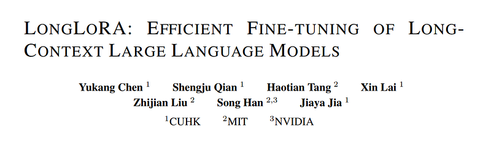
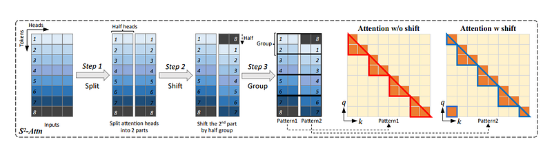
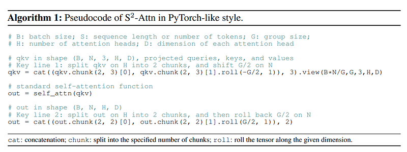
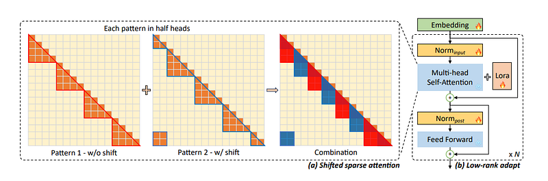
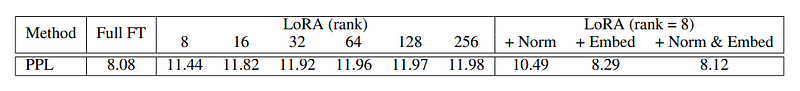
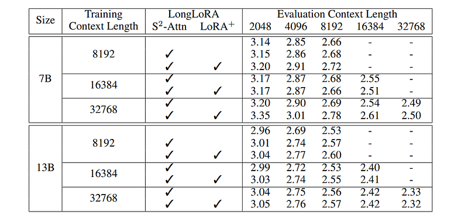
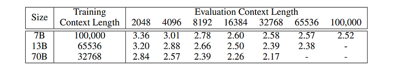
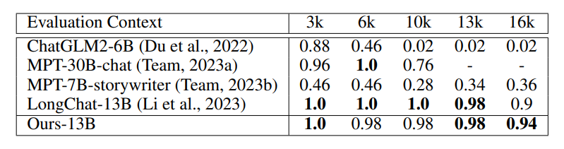
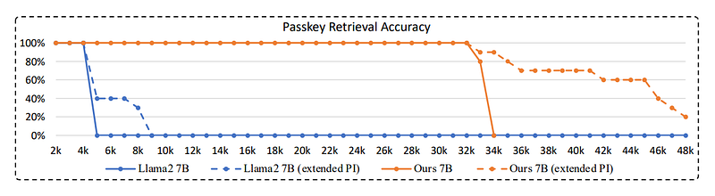

# Papers Explained 147 - LongLoRA

LongLoRA is an efficient fine-tuning approach that extends the context sizes of pre-trained LLMs, with limited computation cost.

This page ingests the source article into the wiki and connects it to [[Papers Explained Corpus]], [[Model Compression and Efficiency]], [[Long Context]], [[Embedding and Retrieval]], [[Code Models]], [[Supervised Fine-Tuning]].

## Source Metadata

- Source file: `raw/2024-06-07_Papers-Explained-147--LongLoRA-24f095b93611.html`
- Source title: Papers Explained 147: LongLoRA
- Published: 2024-06-07
- Canonical: [https://medium.com/@ritvik19/papers-explained-147-longlora-24f095b93611](https://medium.com/@ritvik19/papers-explained-147-longlora-24f095b93611)

## Key Ideas

- Although dense global attention is needed during inference, fine-tuning the model can be effectively and efficiently done by sparse local attention.
- The study finds that LoRA for context extension works well under the premise of trainable embedding and normalization.
- LongLoRA combines this improved LoRA with S2-Attn and extends models’ context while retaining their original architectures, and is compatible with most existing techniques, like Flash-Attention2.
- All the code is available at [GitHub](https://github.com/dvlab-research/LongLoRA).
- Adapting LLMs from short context length to long is not easy. An obvious gap between LoRA and full fine-tuning is observed empirically. The gap between LoRA and full fine-tuning grows as the target context length becomes larger.

## Notes

LongLoRA is an efficient fine-tuning approach that extends the context sizes of pre-trained LLMs, with limited computation cost.

Although dense global attention is needed during inference, fine-tuning the model can be effectively and efficiently done by sparse local attention. The proposed shifted sparse attention (S2-Attn) effectively enables context extension, leading to non-trivial computation saving with similar performance to fine-tuning with vanilla attention.

The study finds that LoRA for context extension works well under the premise of trainable embedding and normalization.

LongLoRA combines this improved LoRA with S2-Attn and extends models’ context while retaining their original architectures, and is compatible with most existing techniques, like Flash-Attention2.

All the code is available at [GitHub](https://github.com/dvlab-research/LongLoRA).

## LongLoRA Finetuning

### Shifted Sparse Attention

In S2-Attn, rather than applying full attention across the entire input sequence, attention is selectively focused on different groups within the sequence. This is achieved by partitioning the input into groups and introducing a shifted pattern, where the group partition is shifted by half the group size in half of the attention heads. This shift enables information exchange between different groups, facilitating communication and maintaining efficiency. The approach aims to reduce computational costs while ensuring the model’s ability to handle long-context fine-tuning and testing with full attention patterns.

### Improved LoRA for Long Context

Adapting LLMs from short context length to long is not easy. An obvious gap between LoRA and full fine-tuning is observed empirically. The gap between LoRA and full fine-tuning grows as the target context length becomes larger. Even LoRA with larger ranks cannot reduce the gap.

To bridge this gap, embedding and normalization layers are opened for training. They occupy limited parameters but make effects for long context adaptation. This improved version of LoRA is denoted as LoRA+.

## Experiments

The study extends the pre-trained 7B, 13B, and 70B Llama2 models up to context windows of 100k, 65536, and 32768 respectively. The position indices for these models are re-scaled with Position Interpolation.

### Long-sequence Language Modeling

*Figure: Perplexity evaluation on proof-pile (Rae et al., 2020) test split.*

- Models achieve better perplexity with longer context sizes, indicating the effectiveness of the efficient fine-tuning method.

- Perplexity decreases as the context size increases for the same training and evaluation context length cases.

- Increasing the context window size from 8192 to 32768 improves perplexity for the Llama2 7B model from 2.72 to 2.50 (-0.22) and reduces perplexity for the Llama2 13B model by -0.28.

*Figure: Maximum context length that can be fine-tuned for various model sizes on a single 8× A100 machine.*

- Llama2 7B, 13B, and 70B are extended to 100k, 65536, and 32768 context length respectively.

- LongLoRA achieves promising results on these extremely large settings.

- Perplexity degradation is observed on small context sizes for the extended models, which is a known limitation of Position Interpolation.

### Retrieval-based Evaluation

*Figure: Topic retrieval evaluation with LongChat.*

- The model achieves comparable performance to LongChat-13B, the state-of-the-art model in this task.

- The model even slightly outperforms LongChat-13B in the 16k evaluation.

*Figure: Accuracy comparison on passkey retrieval between Llama2 7B and the 7B model fine-tuned on 32768 context length.*

- The model achieves reasonable passkey retrieval accuracy until 33k or 34k.

- The max position embeddings are modified to 48k in the position interpolation for the finetuned 7B model.

- The finetuned 7B model can handle longer documents by simply extending the position interpolation.

- The model, fine-tuned on 32k context length, presents moderate retrieval ability in the range of 33k to 45k.

- Llama2 7B suffers from a sharp accuracy degradation after the 4k context length.

## Paper

LongLoRA: Efficient Fine-tuning of Long-Context Large Language Models [2309.12307](https://arxiv.org/abs/2309.12307)

Recommended Reading [Parameter Efficient Fine Tuning](https://ritvik19.medium.com/list/parameter-efficient-fine-tuning-2c00798f5b2b)

## Figures

Figures from the Medium HTML export (`raw/2024-06-07_Papers-Explained-147--LongLoRA-24f095b93611.html`); local copies under `wiki/assets/papers-explained-147-longlora/` when download succeeded.

| Figure | Caption |
|--------|---------|
|  | Title page of *LongLoRA: Efficient Fine-tuning of Long-Context Large Language Models*. |
|  | Shifted sparse attention ($S^2$-Attn): split heads, roll half by half a group, attend locally, then merge patterns for cross-group signal. |
|  | PyTorch-style pseudocode implementing head-wise chunking, rolling, grouped self-attention, and inverse roll. |
|  | Combined illustration of complementary sparse masks plus transformer stack where embeddings, norms, and LoRA adapters train while attention/MLP blocks stay frozen. |
|  | Proof-pile perplexity vs rank-only LoRA; opening embeddings/norms closes most of the gap to full fine-tuning at rank 8. |
|  | Llama2 7B/13B perplexities across train/eval context lengths with toggles for $S^2$-Attn and LoRA+. |
|  | Extreme-context scaling: 7B @100k, 13B @65k, 70B @32k train windows evaluated at increasing proof-pile lengths. |
|  | Topic retrieval accuracy vs evaluation context for LongChat-style baselines versus the LongLoRA 13B model. |
|  | Passkey retrieval accuracy out to 48k tokens for Llama2 7B vs LongLoRA 7B with optional extended position interpolation. |
## Related

- [[Papers Explained Corpus]]
- [[Model Compression and Efficiency]]
- [[Long Context]]
- [[Embedding and Retrieval]]
- [[Code Models]]
- [[Supervised Fine-Tuning]]
- [[Papers Explained 146 - QLoRA]]
- [[Papers Explained 148 - Direct Preference Optimization]]

#summary #topic
