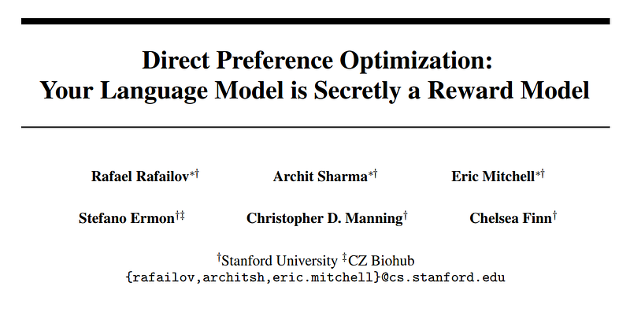
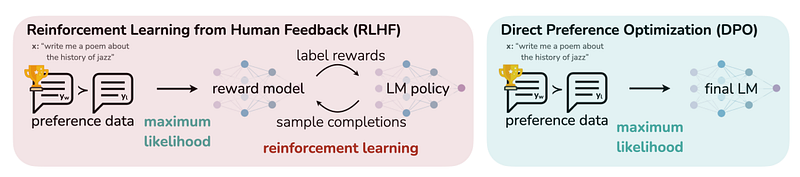
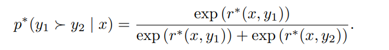
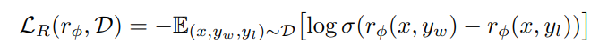
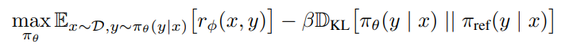
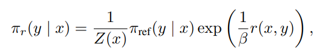
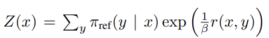
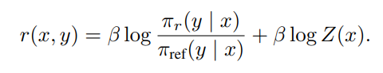
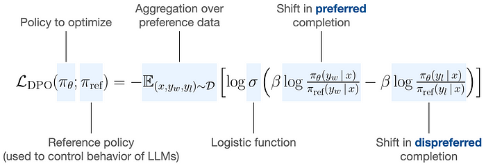

# Papers Explained 148 - Direct Preference Optimization

Supervised Fine-Tuning (SFT): This phase starts with fine-tuning a pre-trained Language Model (LM) on high-quality data relevant to the downstream tasks. The goal is to obtain a model, denoted as πSFT, that has been adjusted to perform well on the specific tasks of interest.

This page ingests the source article into the wiki and connects it to [[Papers Explained Corpus]], [[Reinforcement Learning Topic]], [[Safety and Alignment]], [[Large Language Models]], [[Synthetic Data]], [[Reinforcement Learning]], [[Supervised Fine-Tuning]].

## Source Metadata

- Source file: `raw/2024-06-10_Papers-Explained-148--Direct-Preference-Optimization-d3e031a41be1.html`
- Source title: Papers Explained 148: Direct Preference Optimization
- Published: 2024-06-10
- Canonical: [https://medium.com/@ritvik19/papers-explained-148-direct-preference-optimization-d3e031a41be1](https://medium.com/@ritvik19/papers-explained-148-direct-preference-optimization-d3e031a41be1)

## Key Ideas

- The RLHF pipeline, consists of three main phases:
- Supervised Fine-Tuning (SFT): This phase starts with fine-tuning a pre-trained Language Model (LM) on high-quality data relevant to the downstream tasks.
- A reward model rϕ(x, y) is then parameterized and estimated via maximum likelihood from a dataset of comparisons D, with the negative log-likelihood loss given by:
- RL Fine-Tuning Phase: The learned reward function is used to provide feedback to the language model in this phase. The optimization problem formulated is:
- where β is a parameter controlling the deviation from the base reference policy πref, which is the initial SFT model.

## Notes

Direct Preference Optimization (DPO) is a novel algorithm introduced for fine-tuning LLMs to align with human preferences without the complexities and instabilities associated with RLHF. DPO uses a new parameterization of the reward model in RLHF, which allows for the extraction of the corresponding optimal policy in closed form. This approach enables solving the standard RLHF problem with a simple classification loss, making DPO stable, performant, and computationally lightweight. It eliminates the need for sampling from the LM during fine-tuning or performing significant hyperparameter tuning.

*Figure: DPO optimizes for human preferences while avoiding reinforcement learning.*

## Reinforcement Learning from Human Feedback Pipeline

The RLHF pipeline, consists of three main phases:

Supervised Fine-Tuning (SFT): This phase starts with fine-tuning a pre-trained Language Model (LM) on high-quality data relevant to the downstream tasks. The goal is to obtain a model, denoted as πSFT, that has been adjusted to perform well on the specific tasks of interest.

Preference Sampling and Reward Learning: In this phase, the SFT model is used to generate pairs of answers (y1, y2) for given prompts x. These pairs are presented to human labelers who express a preference for one answer over the other, denoted as yw ≻ yl | x, where yw is the preferred and yl the dispreferred completion. The preferences are assumed to be generated by a latent reward model r∗(y, x), which is not directly accessible. The Bradley-Terry (BT) model is a popular choice for modeling these preferences, where the human preference distribution p∗ is defined as:

A reward model rϕ(x, y) is then parameterized and estimated via maximum likelihood from a dataset of comparisons D, with the negative log-likelihood loss given by:

where σ is the logistic function.

RL Fine-Tuning Phase: The learned reward function is used to provide feedback to the language model in this phase. The optimization problem formulated is:

where β is a parameter controlling the deviation from the base reference policy πref, which is the initial SFT model. This constraint prevents the model from deviating too far from the distribution on which the reward model is accurate, maintaining generation diversity and preventing mode-collapse. The optimization is typically performed using reinforcement learning, specifically Proximal Policy Optimization (PPO).

## Direct Preference Optimization

DPO works by directly mapping preferences to policy optimization without the need for an explicit reward model. This is achieved through a clever mathematical trick that reparameterizes the reward function in terms of the policy itself. Here’s a breakdown of the mathematics involved:

The method begins with a general reinforcement learning objective, which aims to find an optimal policy that maximizes rewards subject to a constraint on the divergence from a reference policy. This is represented mathematically as:

where (Z(x)) is a normalization factor known as the partition function

pi_ref is the reference policy, and (r(x, y)) is the reward function.

Reparameterization: Instead of directly optimizing this reward function, DPO reparameterizes the reward in terms of the policy. This is done by taking the logarithm of both sides of the equation and rearranging it, resulting in:

This reparameterization allows the optimization to be done directly on the policy rather than the reward function.

Preference Modeling: DPO utilizes models of human preferences, such as the Bradley-Terry model, to express the probability of one completion being preferred over another in terms of the optimal policy and the reference policy. This effectively transforms the problem into optimizing the policy to match human preferences.

Optimization Objective: The optimization objective in DPO is to maximize the likelihood of the policy given the preferences. This is represented as:

Gradient Update: The update rule for optimizing the policy increases the likelihood of preferred completions and decreases the likelihood of less preferred ones, weighted by how much the implicit reward model rates the unpreferred completions.

## Paper

Direct Preference Optimization: Your Language Model is Secretly a Reward Model [2305.18290](https://arxiv.org/abs/2305.18290)

## Figures

Figures from the Medium HTML export (`raw/2024-06-10_Papers-Explained-148--Direct-Preference-Optimization-d3e031a41be1.html`); local copies under `wiki/assets/papers-explained-148-direct-preference-optimization/` when download succeeded.

| Figure | Caption |
|--------|---------|
|  | Title page of *Direct Preference Optimization: Your Language Model is Secretly a Reward Model*. |
|  | RLHF pipeline with reward-model fit plus PPO loop versus single-stage DPO likelihood training on preference tuples. |
|  | Bradley–Terry preference likelihood expressed via latent rewards $r^\*(x,y)$. |
|  | Negative log-sigmoid loss for training parametric reward models on $(x,y_w,y_l)$ pairs. |
|  | KL-regularized RL objective maximizing learned rewards while staying near the reference policy. |
|  | Closed-form optimal policy $\pi_r$ as a Gibbs tilt of $\pi_{\text{ref}}$ controlled by reward and inverse temperature $\beta$. |
|  | Partition function $Z(x)$ normalizing the tilted distribution over completions. |
|  | Reward reparameterization via log policy ratios to $\pi_{\text{ref}}$ plus the $Z(x)$ offset. |
|  | Annotated DPO classification loss contrasting implicit reward shifts for preferred vs dispreferred completions. |
## Related

- [[Papers Explained Corpus]]
- [[Reinforcement Learning Topic]]
- [[Safety and Alignment]]
- [[Large Language Models]]
- [[Synthetic Data]]
- [[Reinforcement Learning]]
- [[Supervised Fine-Tuning]]
- [[Papers Explained 147 - LongLoRA]]
- [[Papers Explained 149 - RLHF Workflow]]
- [[Reinforcement Learning from Human Feedback]] — textbook chapter with DPO derivation, weaknesses, and DAA vs RL trade-offs.
- [[Direct Preference Optimization]] — concept stub linking paper summary to the broader RLHF book treatment.
- [[Final Token Preference Optimization]] — DPO variant scoped to a single loop-starting token (Liquid AI Antidoom).
- [[Uncensor any LLM with abliteration]] — DPO used to heal abliterated models after weight orthogonalization degrades benchmarks.

#summary #topic
