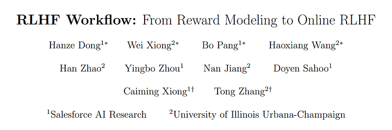
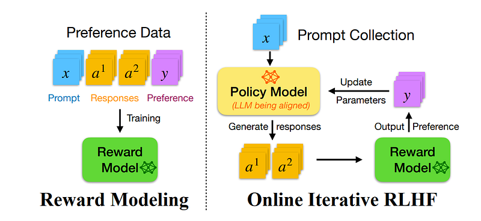
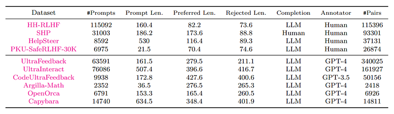
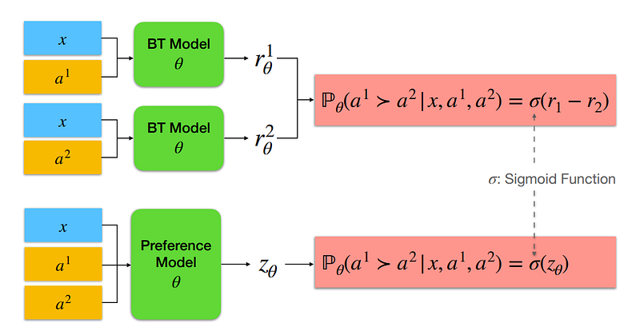
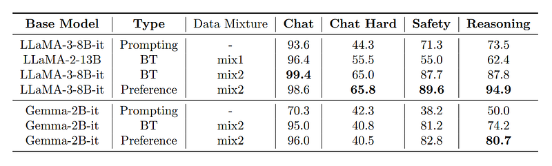
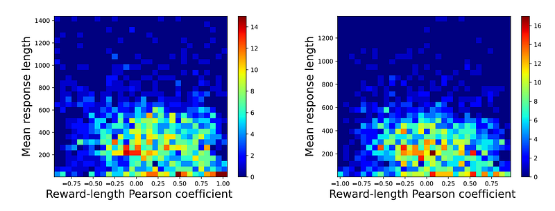
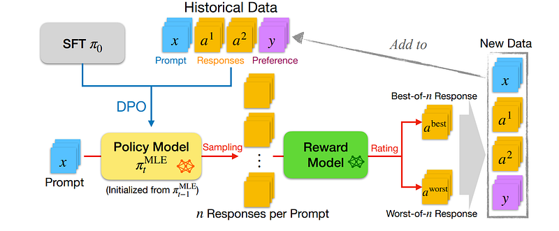
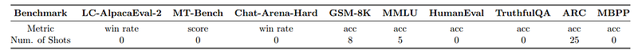
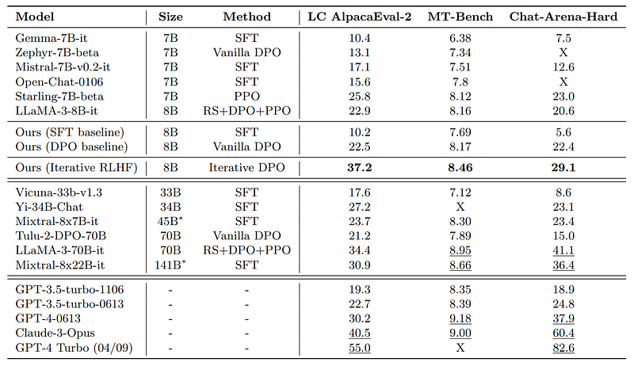
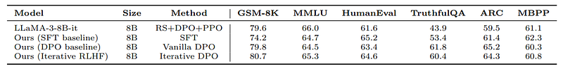

# Papers Explained 149 - RLHF Workflow

This work presents the workflow of Online Iterative Reinforcement Learning from Human Feedback (RLHF) and discusses the theoretical insights and algorithmic principles behind online iterative RLHF, followed by a detailed practical implementation.

This page ingests the source article into the wiki and connects it to [[Papers Explained Corpus]], [[Reinforcement Learning Topic]], [[Safety and Alignment]], [[Synthetic Data]], [[Reinforcement Learning]].

## Source Metadata

- Source file: `raw/2024-06-12_Papers-Explained-149--RLHF-Workflow-56b4e00019ed.html`
- Source title: Papers Explained 149: RLHF Workflow
- Published: 2024-06-12
- Canonical: [https://medium.com/@ritvik19/papers-explained-149-rlhf-workflow-56b4e00019ed](https://medium.com/@ritvik19/papers-explained-149-rlhf-workflow-56b4e00019ed)

## Key Ideas

- The details are available at https://github.com/RLHFlow/RLHF-Reward-Modeling and https://github.com/RLHFlow/Online-RLHF.
- Existing RLHF methods can be largely divided into two categories:
- Deep RL-based approach using Proximal Policy Optimization (PPO)
- The process of online iterative RLHF can be summarized as follows:
- Given the pre-collected preference dataset D = Doff (if applicable, otherwise empty), for each iteration t ∈ [T]:

## Notes

This work presents the workflow of Online Iterative Reinforcement Learning from Human Feedback (RLHF) and discusses the theoretical insights and algorithmic principles behind online iterative RLHF, followed by a detailed practical implementation.

The details are available at https://github.com/RLHFlow/RLHF-Reward-Modeling and https://github.com/RLHFlow/Online-RLHF.

### Existing RLHF Algorithms

Existing RLHF methods can be largely divided into two categories:

- Deep RL-based approach using Proximal Policy Optimization (PPO)

- Direct preference learning (e.g., DPO)

DRL-based framework

The DRL-based framework has two stages: first, a reward model is trained, and then DRL methods like PPO are applied to optimize against the regularized reward. However, tuning the DRL method for optimal performance requires extensive efforts in hyper-parameter selection and code-level optimization., especially when working with Large Language Models (LLMs), which are computationally expensive to fine-tune. Additionally, the PPO algorithm requires loading multiple LLMs simultaneously, which can be memory-intensive and may be a problem for resource-constrained projects.

Direct preference learning

The most common method in this category, DPO, formulates rewards as a function of policy and uses a preference dataset to optimize the loss function. While this approach is easier to tune and requires fewer computational resources compared to DRL methods, it has some challenges. Specifically, it is considered “offline” because it learns from a fixed dataset and cannot query the preference oracle during training. This leads to the problem of over-optimization, as the finite dataset may not cover the entire space of possible prompts and responses, resulting in poor performance when faced with new, out-of-distribution data.

### Online Iterative RLHF

The process of online iterative RLHF can be summarized as follows:

Given the pre-collected preference dataset D = Doff (if applicable, otherwise empty), for each iteration t ∈ [T]:

- first update the policy pair based on the historical data D collected so far.

- collect m tuples as Dt: sample a random prompt, collect two responses and query the preference signal.

- update D ← D ∪ Dt.

Initially, the policy is trained using low-reward responses, which allows the reward model to accurately evaluate these responses. As the policy improves and generates higher-reward responses, these responses may fall outside the scope of the reward model’s training data, making it less reliable.Using an intermediate policy to generate new responses, collecting human feedback on these samples, and incorporating them into the training set can address this issue. This helps to improve the reliability of the reward model in the high-reward regime, leading to better policy performance. This approach can also be applied to direct preference learning algorithms, where the preference dataset is continuously updated with new online data.

## Reward Modeling as Human Feedback Approximation

### Preference Datasets

A mixture of the following open source datasets is used as the training set:

- HH-RLHF: A dataset of pairwise preferences with conversation histories and two alternative responses written by an early Claude model. Human annotators provided the preferences.

- SHP: A dataset of Reddit posts with questions/instructions and pairs of top-level comments, where one comment is preferred by more Reddit users than the other. Only samples with a score ratio > 2 are used, and at most 5 pairs are taken for each prompt.

- HelpSteer: A dataset of prompts, responses, and human-annotated attributes (helpfulness, correctness, coherence, complexity, and verbosity) ranging from 0 to 4. The prompts are generated using a mixture of template-generated and human-generated methods, while responses are generated by an in-house LLM.

- PKU-SafeRLHF: A dataset of expert comparison data with 30k+ samples, each including two responses to a question and two preference signals for helpfulness and safety, respectively. The responses are generated by open-source chatbots, and the preference signals are merged through the results of 14 harm category multi-class classification.

- UltraFeedback: A dataset of 64k prompts from diverse resources (including UltraChat, ShareGPT, Evol-Instruct, TruthfulQA, FalseQA, and FLAN) and 4 responses per prompt generated using 4 different LLMs. The preference is from GPT-4 based on a fine-grained annotation instruction, which contains 4 different aspects (instruction-following, truthfulness, honesty, and helpfulness).

- UltraInteract: A preference dataset designed for complex reasoning tasks, where a preference tree is collected for each instruction, with the instruction being the root and each action a node. Paired correct and incorrect nodes or trajectories are used for preference learning.

- Distilabel-Capybara: A preference dataset of multi-turn dialogues whose prompts are taken from Amplify-instruct, where the responses are generated by open-source LLMs and preferences are generated by GPT4.

- Distilabel-Orca3: A dataset collected similarly to Capybara but with prompts from open-orca.

*Figure: A summarization of open-source preference datasets.*

To improve the quality of training data, a filtering process is applied to open-source datasets, removing:

- Low-quality and meaningless samples

- Conversations with empty rounds or incorrect labels

- Pairwise comparisons with small margins (if absolute scores are available) as these signals tend to be noisy

This process roughly deletes 10% of the data.

The datasets are available at [HuggingFace](https://huggingface.co/collections/RLHFlow/standard-format-preference-dataset-662eec0252e194d5d40c252a).

### Bradley-Terry Reward Model and Preference Model

*Figure: Illustration of the Bradley-Terry (BT) model and preference model.*

The reward model is initialized using the SFT model, replacing the last layer with a linear head to predict a scalar score suitable for preference learning.

The (pairwise) preference model takes a prompt x and two responses a1, a2 as the input and predicts the probability of P(a1 ≻ a2|x, a1, a2) and leverages the LLM’s capability as a next-token predictor for preference modeling.

Both types of models are trained for 1 epoch. For the preference models, the samples are packed into blocks with length 3072.

Two versions of training set are Considered:

- Mix1: HH-RLHF + SHP + UltraFeedback + Summarization

- Mix2: all the mentioned datasets

### Evaluation Result

Three different approaches to model preference signals were tested:

- prompting LLM as a judge

- reward model

- preference model

The models were evaluated using RewardBench, which assesses capabilities in four categories: Chat, Chat-Hard, Safety, and Reasoning.

*Figure: Comparison of the test accuracy between the Bradley-Terry (BT) reward model and the preference model.*

- The prompting approach is outperformed by both the BT model and the preference model across all metrics.

- The preference model outperformed the BT model in tasks related to coding and math.

- Models trained with Mix2 showed higher accuracy in safety and reasoning tasks than Mix1.

- Ultra-RM-13B, a reference model, demonstrated superior performance due to the inclusion of extra data related to safety and reasoning, as well as a stronger base model

*Figure: The heatmap of the Pearson correlation coefficients between reward and response length.*

- The length bias in reward modeling is evident, with both reward models biased toward longer responses to some degree

## Iterative Policy Optimization

Self-Fine-Tuning (SFT) is performed on LLaMA-3–8B base model to obtain the initial policy π0, rather than using an instruction model. The SFT process combines the following instruction datasets, including ShareGPT, Evol-Instruct, SlimOrca, MathInstruct, Magicoder-Evol-Instruct, GPT4-LLM, OrcaMath, GPTeacher, UltraInteract.. The training is done for one epoch with a block size of 8192.

### Iterative Direct Preference Learning

*Figure: Illustration of the proposed implementation of iterative direct preference learning.*

The algorithm consists of two main components: a main agent and an enhancer agent. Here’s a step-by-step explanation of the algorithm:

- Data Collection: Historical interaction data between users and the LLM is collected, including prompts, responses, and user feedback.

- Policy Training: The MLE policy is trained using the collected data to maximize the likelihood of observed interactions.

- Exploration with Enhancer Agent: An enhancer agent is introduced to explore new areas of the response space that the MLE policy might have missed. The enhancer agent consists of multiple policies derived from the MLE policy with modifications to introduce diversity.

- Online Interaction: Both the MLE policy and the enhancer agent interact online with users. The MLE policy is used as the default response generator, while the enhancer agent is used to explore new responses when there is uncertainty or lack of confidence in the MLE policy’s output.

- Feedback Incorporation: User feedback is incorporated into the system to refine both the MLE policy and the enhancer agent.

- Policy Update: The policies are updated iteratively based on the feedback received. The MLE policy is updated to better match observed interactions, while the enhancer agent’s policies are updated to explore different areas of the response space effectively.

- Termination Condition: The algorithm continues until a termination condition is met, such as achieving a satisfactory performance level or reaching a maximum number of iterations.

### Prompt Set

Prompts are collected from UltraFeedback, HelpSteer, OpenOrca, UltraInteract, Capybara and DIBT-10K.

The prompt collection is available at [HuggingFace](https://huggingface.co/datasets/RLHFlow/prompt-collection-v0.1).

## Evaluation of the Model

The models are evaluated by standard benchmarks, including AlpacaEval-2, MT-Bench, and Chat-Arena-Hard

*Figure: A summarization of the benchmarks used in this project.*

### Online iterative RLHF significantly improves conversation quality

*Figure: Evaluation results and comparison between the resulting models and existing models.*

*Figure: Evaluation results of the resulting model on academic benchmarks and comparison with other open-access LLMs*

- SFR-Iterative-DPO-LLaMA-3–8B-R outperformed other open-source models (less than 10B) on conversation and instruction-following benchmarks by a significant margin.

- The model consistently showed better performance compared to its vanilla offline DPO counterpart, indicating the advantage of online iterative RLHF.

- The model’s performance was superior to that of Tulu-2-DPO-70B and GPT-3.5-turbo-1106, which are larger models.

### Ablation study on filtering data with length penalty

- The model trained with the length penalty produced significantly shorter responses than the vanilla model..

- The model with the length penalty achieved a superior win rate on the AlpacaEval-2 benchmark, indicating improved performance in terms of response length control.

- The model also showed better results on some academic benchmarks when trained with the length penalty.

## Paper

RLHF Workflow: From Reward Modeling to Online RLHF [2405.07863](https://arxiv.org/abs/2405.07863)

## Figures

Figures from the Medium HTML export (`raw/2024-06-12_Papers-Explained-149--RLHF-Workflow-56b4e00019ed.html`); local copies under `wiki/assets/papers-explained-149-rlhf-workflow/` when download succeeded.

| Figure | Caption |
|--------|---------|
|  | Title slide for *RLHF Workflow: From Reward Modeling to Online RLHF*. |
|  | Offline reward-model training on labeled preferences versus online loops that sample policy outputs, score them, and update the aligned LLM. |
|  | Preference corpus statistics: prompt counts, lengths, completion sources, annotators (human vs GPT-4), and pair totals. |
|  | Bradley–Terry scalar reward heads vs a joint preference head emitting logits fed through a sigmoid. |
|  | RewardBench breakdown for LLaMA-3/Gemma variants comparing prompting, Bradley–Terry heads, and preference models on mix1/mix2. |
|  | Heatmaps of reward–length Pearson correlation against mean response length for diagnosing length bias. |
|  | Iterative DPO workflow: expand preference buffer via best-of-$n$ / worst-of-$n$ ranking from a frozen reward model, then re-run DPO. |
|  | Benchmark card listing metrics and shot counts for chat arenas, math, code, knowledge, and truthfulness evaluations. |
|  | Instruction-centric leaderboard scores comparing iterative RLHF 8B models with larger open and proprietary chat systems. |
|  | Academic suite (GSM8K, MMLU, HumanEval, TruthfulQA, ARC, MBPP) comparing SFT, vanilla DPO, and iterative DPO baselines. |
## Related

- [[Papers Explained Corpus]]
- [[Reinforcement Learning Topic]]
- [[Safety and Alignment]]
- [[Synthetic Data]]
- [[Reinforcement Learning]]
- [[Papers Explained 148 - Direct Preference Optimization]]
- [[Papers Explained 150 - MarianMT]]

#summary #topic
