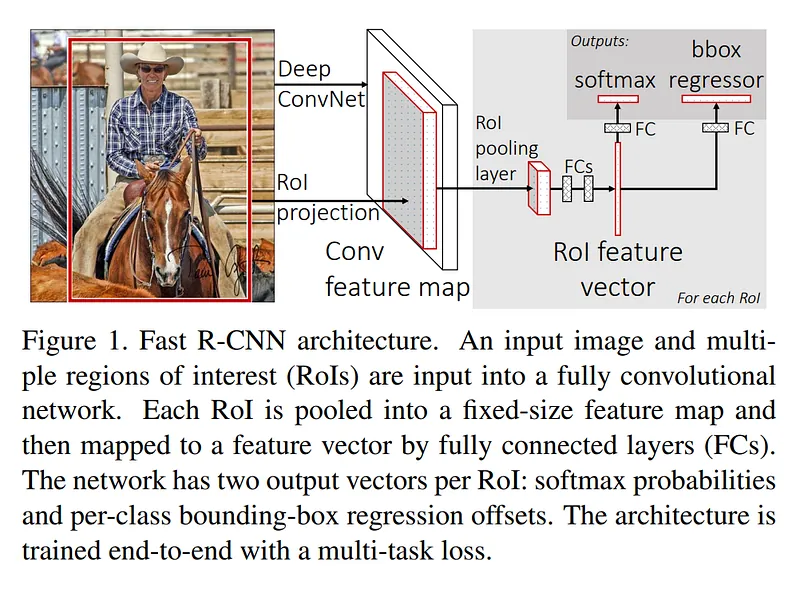

# Papers Explained 15 - Fast RCNN

Training is a multi-stage pipeline: R-CNN first finetunes a ConvNet on object proposals using log loss. Then, it fits SVMs to ConvNet features. These SVMs act as object detectors, replacing the softmax classifier learnt by fine-tuning. In the third training stage, bounding-box regressors are learned.

This page ingests the source article into the wiki and connects it to [[Papers Explained Corpus]], [[Computer Vision]], [[Embedding and Retrieval]], [[Reasoning Models]], [[Supervised Fine-Tuning]].

## Source Metadata

- Source file: `raw/2023-02-07_Papers-Explained-15--Fast-RCNN-28c1792dcee0.md`
- Source title: Papers Explained 15: Fast RCNN
- Published: 2023-02-07
- Canonical: [https://medium.com/@ritvik19/papers-explained-15-fast-rcnn-28c1792dcee0](https://medium.com/@ritvik19/papers-explained-15-fast-rcnn-28c1792dcee0)

## Key Ideas

- Training is a multi-stage pipeline: R-CNN first finetunes a ConvNet on object proposals using log loss. Then, it fits SVMs to ConvNet features. These SVMs act as object detectors, replacing the softmax classifier learnt by fine-tuning.
- Training is expensive in space and time: For SVM and bounding-box regressor training, features are extracted from each object proposal in each image and written to disk. These features require hundreds of gigabytes of storage.
- Object detection is slow: At test-time, features are extracted from each object proposal in each test image.
- R-CNN is slow because it performs a ConvNet forward pass for each object proposal, without sharing computation.
- Spatial pyramid pooling networks (SPPnets) were proposed to speed up R-CNN by sharing computation.

## Notes

## Limitations of RCNN and SPPnets

- Training is a multi-stage pipeline: R-CNN first finetunes a ConvNet on object proposals using log loss. Then, it fits SVMs to ConvNet features. These SVMs act as object detectors, replacing the softmax classifier learnt by fine-tuning. In the third training stage, bounding-box regressors are learned.

- Training is expensive in space and time: For SVM and bounding-box regressor training, features are extracted from each object proposal in each image and written to disk. These features require hundreds of gigabytes of storage.

- Object detection is slow: At test-time, features are extracted from each object proposal in each test image.

R-CNN is slow because it performs a ConvNet forward pass for each object proposal, without sharing computation.

Spatial pyramid pooling networks (SPPnets) were proposed to speed up R-CNN by sharing computation. The SPPnet method computes a convolutional feature map for the entire input image and then classifies each object proposal using a feature vector extracted from the shared feature map.

## Fast RCNN Architecture

A Fast R-CNN network takes as input an entire image and a set of object proposals. The network first processes the whole image with several convolutional (conv) and max pooling layers to produce a conv feature map.

Then, for each object proposal a region of interest (RoI) pooling layer extracts a fixed-length feature vector from the feature map.

Each feature vector is fed into a sequence of fully connected (fc) layers that finally branch into two sibling output layers: one that produces softmax probability estimates over K object classes plus a catch-all “background” class and another layer that outputs four real-valued numbers for each of the K object classes. Each set of 4 values encodes refined bounding-box positions for one of the K classes.

RoI Pooling Layer

The RoI pooling layer uses max pooling to convert the features inside any valid region of interest into a small feature map with a fixed spatial extent of H × W (e.g., 7 × 7), where H and W are layer hyper-parameters that are independent of any particular RoI.

Each RoI is defined by a four-tuple (r, c, h, w) that specifies its top-left corner (r, c) and its height and width (h, w).

RoI max pooling works by dividing the h × w RoI window into an H × W grid of sub-windows of approximate size h/H × w/W and then max-pooling the values in each sub-window into the corresponding output grid cell. Pooling is applied independently to each feature map channel, as in standard max pooling.

Initiaizing from pre-trained networks

When a pre-trained network initializes a Fast R-CNN network, it undergoes three transformations:

- The last max pooling layer is replaced by a RoI pooling layer that is configured by setting H and W to be compatible with the net’s first fully connected layer (e.g., H = W = 7 for VGG16).

- The network’s last fully connected layer and softmax are replaced with the two sibling layers (a fully connected layer and softmax over K + 1 categories and category-specific bounding-box regressors).

- The network is modified to take two data inputs: a list of images and a list of RoIs in those images.

## Paper

Fast R-CNN [1504.08083](https://arxiv.org/abs/1504.08083)

## Figures

Figures from the Medium HTML export (`raw/2023-02-07_Papers-Explained-15--Fast-RCNN-28c1792dcee0.md`); local copies under `wiki/assets/papers-explained-15-fast-rcnn/` when download succeeded.

| Figure | Caption |
|--------|---------|
|  | Title card: Fast RCNN. |
|  | Spatial pyramid pooling networks (SPPnets) were proposed to speed up R-CNN by sharing computation. |
## Related

- [[Papers Explained Corpus]]
- [[Computer Vision]]
- [[Embedding and Retrieval]]
- [[Reasoning Models]]
- [[Supervised Fine-Tuning]]
- [[Papers Explained 14 - RCNN]]
- [[Papers Explained 16 - Faster RCNN]]
- [[Object Detection for Dummies Part 3]] — RoI pooling, joint loss, smooth L1 (Weng tutorial).

#summary #topic
