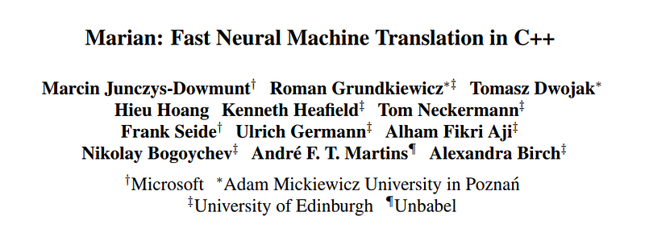

# Papers Explained 150 - MarianMT

Marian is a robust and self-contained Neural Machine Translation system. It is entirely implemented in C++ and features a built-in automatic differentiation engine using dynamic computation graphs.

This page ingests the source article into the wiki and connects it to [[Papers Explained Corpus]], [[Multilingual Models]], [[Large Language Models]], [[Model Compression and Efficiency]], [[Evaluation and Benchmarks]], [[Agentic AI]].

## Source Metadata

- Source file: `raw/2024-06-13_Papers-Explained-150--MarianMT-1b44479b0fd9.html`
- Source title: Papers Explained 150: MarianMT
- Published: 2024-06-13
- Canonical: [https://medium.com/@ritvik19/papers-explained-150-marianmt-1b44479b0fd9](https://medium.com/@ritvik19/papers-explained-150-marianmt-1b44479b0fd9)

## Key Ideas

- The deep-learning back-end is based on reverse-mode auto-differentiation with dynamic computation graphs, similar to DyNet.
- The encoder and decoder are implemented as classes with a simplified interface:
- The encoder-decoder model is implemented as a Bahdanau-style model, where the encoder is built inside `Encoder::build` and the resulting encoder context is stored in the `EncoderState` object.
- The framework allows for combining different encoders and decoders, such as RNN-based encoders with Transformer decoders, and reduces implementation effort. It is possible to implement a single inference step to train, score, and translate with a new model.
- Additionally, Marian includes many efficient meta-algorithms, such as:

## Notes

Marian is a robust and self-contained Neural Machine Translation system. It is entirely implemented in C++ and features a built-in automatic differentiation engine using dynamic computation graphs. Its encoder-decoder framework is specifically designed to combine efficient training and rapid translation, rendering it an ideal research-friendly toolkit.

## Design Outline

The deep-learning back-end is based on reverse-mode auto-differentiation with dynamic computation graphs, similar to DyNet. The back-end is optimized for machine translation and similar use cases, with efficient implementations of fused RNN cells, attention mechanisms, and atomic layer-normalization.

The encoder and decoder are implemented as classes with a simplified interface:

```text
class
Encoder
{
EncoderState
build
(Batch)
;
};
class
Decoder
{
DecoderState
startState
(EncoderState[])
;
DecoderState
step
(DecoderState, Batch)
;
};
```

The encoder-decoder model is implemented as a Bahdanau-style model, where the encoder is built inside `Encoder::build` and the resulting encoder context is stored in the `EncoderState` object. The decoder receives a list of `EncoderState` objects and creates the initial `DecoderState`. The `Decoder::step` function consumes the target part of a batch to produce the output logits of the model.

The framework allows for combining different encoders and decoders, such as RNN-based encoders with Transformer decoders, and reduces implementation effort. It is possible to implement a single inference step to train, score, and translate with a new model.

Additionally, Marian includes many efficient meta-algorithms, such as:

- Multi-device (GPU or CPU) training, scoring, and batched beam search

- Ensembling of heterogeneous models (e.g. Deep RNN models and Transformer or language models)

- Multi-node training

## Architecture and Training

The Marian toolkit is used to implement a sequence-to-sequence model with a Transformer-style architecture.

The model architecture consists of:

- A sequence-to-sequence model with single-layer RNNs in both the encoder and decoder

- Bi-directional RNN in the encoder

- Stacked GRU-blocks in the encoder and decoder

- Attention mechanism between the first and second block in the decoder

- Embeddings size of 512, RNN state size of 1024

- Layer normalization and variational dropout inside GRU-blocks and attention

The training recipe consists of:

- Preprocessing of training data, including tokenization, true-casing, and vocabulary reduction

- Training of a shallow model for backtranslation on parallel WMT17 data

- Translation of 10M German monolingual news sentences to English

- Concatenation of artificial training corpus with original data (times two) to produce new training data

- Training of four left-to-right (L2R) deep models (either RNN-based or Transformer-based)

- Training of four additional deep models with right-to-left (R2L) orientation

- Ensemble-decoding with four L2R models resulting in an n-best list of 12 hypotheses per input sentence

- Rescoring of n-best list with four R2L models, with all model scores weighted equally

- Evaluation on newstest-2016 (validation set) and newstest-2017 with sacreBLEU

## Paper

Marian: Fast Neural Machine Translation in C++ [1804.00344](https://arxiv.org/abs/1804.00344)

## Figures

Figures from the Medium HTML export (`raw/2024-06-13_Papers-Explained-150--MarianMT-1b44479b0fd9.html`); local copies under `wiki/assets/papers-explained-150-marianmt/` when download succeeded.

| Figure | Caption |
|--------|---------|
|  | Title page of *Marian: Fast Neural Machine Translation in C++* with author list and institution footnotes (Microsoft, Adam Mickiewicz University, Edinburgh, Unbabel). |
## Related

- [[Papers Explained Corpus]]
- [[Multilingual Models]]
- [[Large Language Models]]
- [[Model Compression and Efficiency]]
- [[Evaluation and Benchmarks]]
- [[Agentic AI]]
- [[Papers Explained 149 - RLHF Workflow]]
- [[Papers Explained 151 - Aya 23]]

#summary #topic
