# Papers Explained 151 - Aya 23

Aya 23 is a family of multilingual language models that can serve 23 languages. It is an improvement over the previous model, Aya 101, which covered 101 languages but had limitations due to the “curse of multilinguality”.

This page ingests the source article into the wiki and connects it to [[Papers Explained Corpus]], [[Multilingual Models]], [[Large Language Models]], [[Model Compression and Efficiency]], [[Long Context]], [[Embedding and Retrieval]].

## Source Metadata

- Source file: `raw/2024-06-17_Papers-Explained-151--Aya-23-d01605c3ee80.html`
- Source title: Papers Explained 151: Aya 23
- Published: 2024-06-17
- Canonical: [https://medium.com/@ritvik19/papers-explained-151-aya-23-d01605c3ee80](https://medium.com/@ritvik19/papers-explained-151-aya-23-d01605c3ee80)
- Launch blog: [[C4AI Launches Aya 23, 8B and 35B Parameter Open Weights Release]] (`raw/aya23/full-article.html`)

## Key Ideas

- Aya 23 is available in two sizes [8B](https://huggingface.co/CohereForAI/aya-23-8B) and [35B](https://huggingface.co/CohereForAI/aya-23-35B).
- The Aya 23 model family is based on the Cohere Command series models. The model uses a standard decoder-only Transformer architecture with several modifications to improve training efficiency and performance. These modifications include:
- Parallel Attention and FFN layers, which improve training efficiency without hurting model quality.
- SwiGLU activation, which has been found to have higher downstream performance than other activations.
- No bias in dense layers, which improves training stability.

## Notes

Aya 23 is a family of multilingual language models that can serve 23 languages. It is an improvement over the previous model, Aya 101, which covered 101 languages but had limitations due to the “curse of multilinguality”. Aya 23 balances breadth and depth by allocating more capacity to fewer languages, resulting in better performance on the languages it covers.

Aya 23 is available in two sizes [8B](https://huggingface.co/CohereForAI/aya-23-8B) and [35B](https://huggingface.co/CohereForAI/aya-23-35B).

*Figure: Languages in Aya 23 Model Family.*

## Pretrained Models

The Aya 23 model family is based on the Cohere Command series models. The model uses a standard decoder-only Transformer architecture with several modifications to improve training efficiency and performance. These modifications include:

- Parallel Attention and FFN layers, which improve training efficiency without hurting model quality.

- SwiGLU activation, which has been found to have higher downstream performance than other activations.

- No bias in dense layers, which improves training stability.

- Rotary positional embeddings (RoPE), which provide better long context extrapolation and short context performance.

- A BPE tokenizer with a size of 256k, which is trained on a subset of pre-training datasets to ensure efficient representations across languages.

- Grouped Query Attention (GQA), which reduces inference-time memory footprint by sharing multiple Q heads with each KV head.

*Figure: Architecture parameters for Aya 23 model family.*

The Aya-23–35B model is essentially a further fine-tuned version of Cohere Command R.

## Instruction Fine Tuning

The multilingual instruction data described in the Aya 101 model is adopted for fine tuning the Aya 23 models:

- Multilingual Templates: Structured text is used to transform specific NLP datasets into instruction and response pairs. This collection, consisting of 55.7M examples, is derived from the xP3x dataset, the data provenance collection, and the Aya collection, covering 23 languages and 161 different datasets.

- Human Annotations: The Aya dataset has a total of 204K human-curated prompt-response pairs written by native speakers in 65 languages. After filtering for the 23 languages being trained on, this data results in 55K samples.

- Translated Data: The translated subset of the Aya collection is used, which includes translations of widely used English instruction datasets. This collection includes translations of HotpotQA and Flan-CoT-submix, among others. A random subset of up to 3,000 instances for each language for each dataset is preserved to maintain instance-level diversity. After filtering for the 23 languages being trained on, this data results in a subset of 1.1M examples.

- Synthetic Data: Synthetic fine-tuning data is constructed using human-annotated prompts from ShareGPT5 and Dolly-15k. Unlike previous methods, this data uses Cohere’s Command R+ to natively generate multilingual responses for the translated ShareGPT and Dolly prompts in all 23 languages, resulting in 1.63M examples.

The models are finetuned using an 8192 context length with data packing enabled.

Similar to other instruction-tuned models, the examples used to instruction-tune Aya 23 are formatted using special tokens to include extra information:

*Figure: Example prompt-completion pair with the chat-format for the Aya-23 models.*

## Evaluation

### Discriminative Tasks

Models are tested on zero-shot evaluation for completely unseen tasks such as XWinograd, XCOPA, and XStoryCloze.

*Figure: Results for discriminative task evaluation. Results are reported as the zero-shot performance averaged across all languages.*

- Aya-23–35B outperforms all baselines with an average accuracy of 70.8% across the tasks and languages.

- Aya-23–35B shows a slight edge over Mixtral-8x7B-Instruct-v0.1 (70.8 vs 68.8), which is another large model.

- Aya-23–8B, within its class of models of similar size, achieves the best score with an average accuracy of 67.6%, outperforming other models like Gemma-1.1–7B-it (66.0), Bactrian-X-7B, Mixtral-7B-Inst-v0.2, and Aya-101–13B.12.

### General Language Understanding

Models are evaluated on the Multilingual MMLU dataset for language understanding across 14 languages.

*Figure: Multilingual MMLU (5-shot) results in 14 languages.*

- Aya-23–8B achieves an average accuracy of 48.2% across all languages and is the top performer in 11 out of 14 languages.

- Aya-23–35B outperforms Mixtral-8x7B-Inst with an average accuracy of 58.2% compared to Mixtral’s 57.1%.

- Mixtral-8x7B-Inst performs slightly better in high-resource European languages but underperforms relative to Aya-23–35B in non-European languages such as Arabic, Hindi, and Vietnamese.

- For Arabic, Hindi, and Vietnamese, Aya-23–35B shows a significant improvement over Mixtral-8x7B-Inst with accuracy increases of 12.1%, 10.0%, and 6.5% respectively.

### Mathematical Reasoning

Models are assessed on the Multilingual Grade School Math (MGSM) Benchmark for mathematical reasoning in 10 languages.

*Figure: Multilingual Grade School Math benchmark (MGSM) results (5 shot CoT)*

- Aya-23–8B, outperformed all other in-class baselines, with a score of 36.6 across the seven languages.

- Gemma-1.1–7b was the next best model in its class with a score of 34.0.

- Aya-23–8B showed a 4.5x increase in performance compared to Aya-101–13B (36.6 vs 8.1), indicating the significant impact of using a high-quality pre-trained model.

- Aya-23–35B outperformed Mixtral-8x7B-Instruct-v0.1 with a score of 53.7, demonstrating the benefits of larger scale models.

- Aya-23 models were superior to their in-class counterparts for six languages (English, Spanish, German, Chinese, and Arabic) but had comparable performance to the best in-class models for French, Russian, and Japanese.

### Generative Tasks

Performance on machine translation and summarization is evaluated using FLORES-200 and XLSum datasets, respectively, in 21 and 15 languages.

*Figure: Translation (FLORES) and multilingual summarization (XLSum) results.*

- Aya-23–8B achieved an average spBleu score of 37.2 in FLORES translation tasks, outperforming the second best model, Aya-101–13B, by 4 points.

- In XLSum multilingual summarization tasks, both Aya-23–8B and Aya-101–13B achieved an average RougeL score of 27.5, surpassing Gemma-1.1 by 14.5 points.

- Aya-23–35B outperformed Mixtral-8x7B by 7.8 spBleu (40.4 vs 32.6) in translation tasks and by 23.8 (30.9 vs 7.1) in summarization tasks.

### Preference Evaluation

Models are evaluated on their ability to generate preferred responses in open-ended scenarios using both LLM-simulated win-rates and human evaluation. This includes using GPT-4 as a proxy judge and human annotators for preference selection.

*Figure: LLM-as-a-judge evaluation (% win rates) for 10 languages.*

*Figure: Human evaluation results (% win rates).*

- Aya-23–8B outperforms other models like Aya-101–13B, Mistral-7B-Instruct-v0.2, and Gemma-1.1–7B-it with an average win rate of 82.4%.

- Aya-23–35B outperforms Mixtral-8x7B-Instruct-v0.1 with an average win rate of 60.9%.

- Aya 23 models achieve superior win rates across all languages, except for specific cases in English, French, and Spanish against the baseline models.

- For non-European languages like Turkish, Hindi, and Japanese, Aya 23 models outperform comparison models by a significant margin.

- Aya-23–8B is heavily preferred over Aya-101–13B in all 10 languages for human evaluation, with Aya-23–8B winning against Aya-101–13B for 50.8% of prompts on average across languages.

- Aya-23–35B achieves a 57.6% win rate against Aya-101–13B in human evaluation.

### Safety, Toxicity & Bias

Models are evaluated for safety, toxicity, and bias using the multilingual AdvBench and identity description prompts. GPT-4 is used as an automatic evaluator for harmfulness, and Perspective API measures toxicity and bias.

*Figure: Multilingual AdvBench results: percentage of harmful responses as judged by GPT-4.*

*Figure: Toxicity analysis of Aya models.*

*Figure: Perspective API toxicity scores for Aya models.*

- The Aya 23 models (both 13B and 35B) showed a reduced rate of harmful responses compared to the Aya-101–13B model across all languages, with an average reduction of at least half.

- The Aya-23–35B model demonstrated even lower harmfulness, particularly for Arabic and Italian, attributed to improved cross-lingual transfer capabilities.

- In terms of quality, the refusal responses generated by the Aya 23 models were found to be more eloquent, diverse, and elaborate than those from the Aya-101–13B model.

- The Aya 23 models generally had lower expected maximum toxicity and a lower toxicity probability than the Aya-101–13B model, except for English where toxicity was slightly higher.

- While Aya 23 models produced less toxic descriptions for Asians and Latinx, they had a higher chance of producing toxic descriptions for Blacks and Whites, particularly for women.

## Aya Expanse

Aya Expanse is a family of highly performant multilingual models that excels across 23 languages and outperforms other leading open-weight models. The 8 billion parameters model makes breakthroughs more accessible to researchers worldwide, and the 32 billion parameters model offers state-of-the-art multilingual capabilities.

The models are available at [HuggingFace](https://huggingface.co/collections/CohereForAI/c4ai-aya-expanse-671a83d6b2c07c692beab3c3).

The use of synthetic data has become increasingly central to the development of LLMs, particularly as model training has exhausted data sources. However, for multilingual data, especially with languages that are low-resource, there are few good examples of teacher models, creating an extra challenge to leveraging synthetic data.

A novel data sampling strategy is proposed, termed data arbitrage, to avoid mode collapse, or the generation of “gibberish” when over relying on synthetic data. Data arbitrage takes inspiration from how humans learn by going to different teachers for different skills.

Preference training is used in the late stages of model training, leveraging feedback from humans to guide the model toward what high-quality outputs look like. However, preference training and safety measures often overfit to harms prevalent in Western-centric datasets.

The work extended preference training to a massively multilingual setting, accounting for different cultural and linguistic perspectives. The final step to the breakthrough in multilingual performance is work on model merging — combining the weights of multiple candidate models at each stage to create more versatility and performance.

All these techniques are combined in one training recipe for Aya Expanse. Each of these techniques — from data arbitrage to merging and multilingual preference optimization — enabled step-by-step improvement, leading to a significant gain against other leading models in the same parameter classes.

### Evaluation

- Aya Expanse 32B outperforms Gemma 2 27B, Mistral 8x22B, and Llama 3.1 70B, a model more than 2x its size, setting a new state-of-the-art for multilingual performance.

- Aya Expanse 8B, outperforms the leading open-weights models in its parameter class such as Gemma 2 9B, Llama 3.1 8B, and the recently released Ministral 8B with win rates ranging from 60.4% to 70.6%.

## Paper

[Aya 23: Open Weight Releases to Further Multilingual Progress](https://t.co/1bWyFExQK7)

[Aya Expanse: Connecting Our World](https://cohere.com/blog/aya-expanse-connecting-our-world)

Recommended Reading [Aya Series](https://ritvik19.medium.com/list/aya-series-83ee469cf14f)

## Figures

Figures from the Medium HTML export (`raw/2024-06-17_Papers-Explained-151--Aya-23-d01605c3ee80.html`); local copies under `wiki/assets/papers-explained-151-aya-23/` when download succeeded.

| Figure | Caption |
|--------|---------|
| 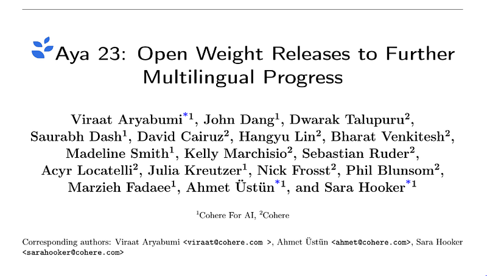 | Title page of *Aya 23: Open Weight Releases to Further Multilingual Progress* (Cohere For AI / Cohere authors). |
| 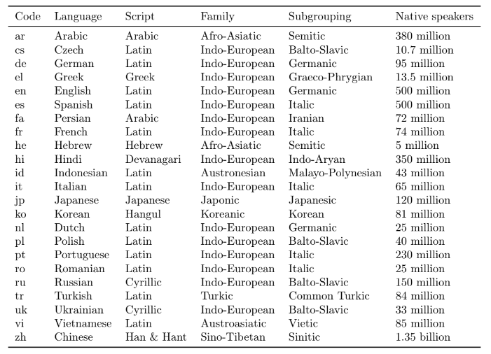 | The 23 covered languages with ISO codes, scripts, families/subgroups, and approximate native-speaker counts. |
| 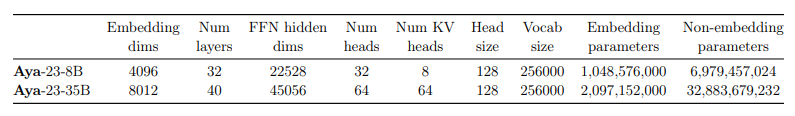 | Architecture table for **Aya-23-8B** vs **Aya-23-35B**: widths, depths, FFN dims, attention heads/KV heads, vocabulary, and embedding vs non-embedding parameter counts. |
| 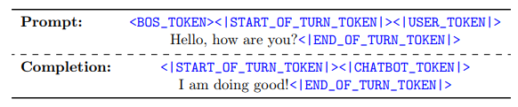 | Instruction-tuning chat template: special tokens delimiting user turns vs assistant completions around a sample prompt. |
| 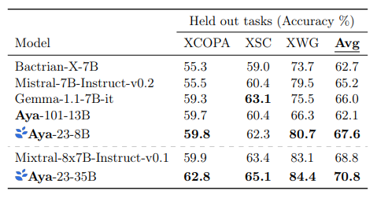 | Zero-shot held-out discriminative tasks (XCOPA, XSC, XWG) with per-task and average accuracy for mid-size baselines vs **Aya-23-8B**, and Mixtral vs **Aya-23-35B**. |
| 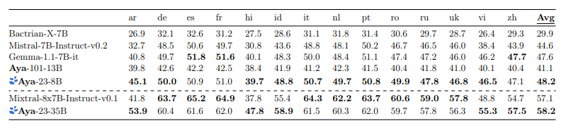 | Multilingual MMLU (5-shot) scores across 14 languages plus average; **Aya-23-8B** leads most locales in its tier and **Aya-23-35B** edges Mixtral on average with larger gains on Arabic/Hindi/Vietnamese. |
| 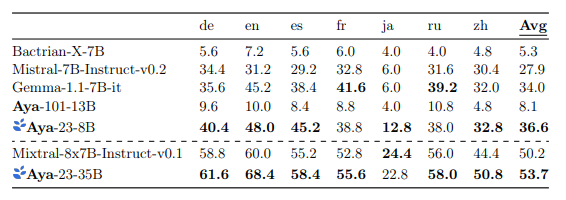 | MGSM (5-shot chain-of-thought) accuracy by language subset with averages; **Aya-23-8B** at **36.6** vs **Aya-101-13B** at 8.1, **Aya-23-35B** at **53.7** vs Mixtral **50.2**. |
| 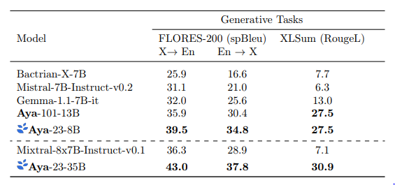 | Generative evaluation: FLORES-200 spBLEU (X→En / En→X) and XLSum RougeL for translation and multilingual summarization across model tiers. |
| 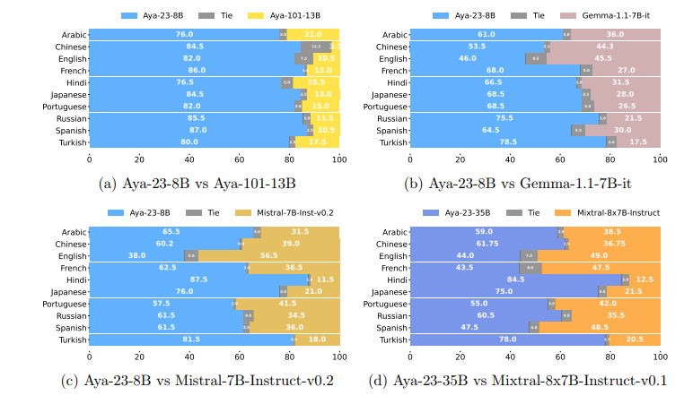 | LLM-as-judge preference breakdown (win / tie / loss %) over ten languages: **Aya-23-8B** vs Aya-101, Gemma-1.1, Mistral; **Aya-23-35B** vs Mixtral-8×7B-Instruct. |
| 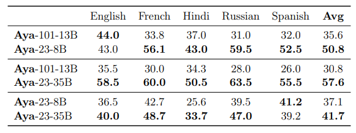 | Human evaluation headline win rates on EN/FR/HI/RU/ES for Aya-101 vs Aya-23-8B, Aya-101 vs Aya-23-35B, and Aya-23-8B vs Aya-23-35B. |
| 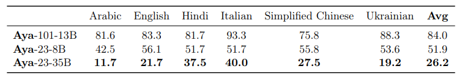 | Multilingual AdvBench: GPT-4-judged harmful-response rates (↓) across locales for **Aya-101-13B**, **Aya-23-8B**, and **Aya-23-35B**. |
| 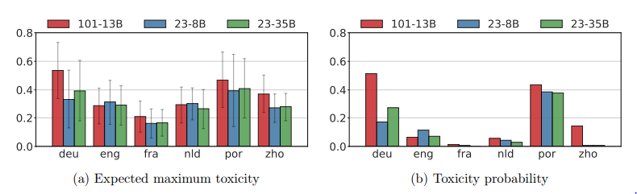 | Toxicity analysis with Perspective-style metrics: expected maximum toxicity and toxicity probability by language for the three Aya checkpoints. |
| 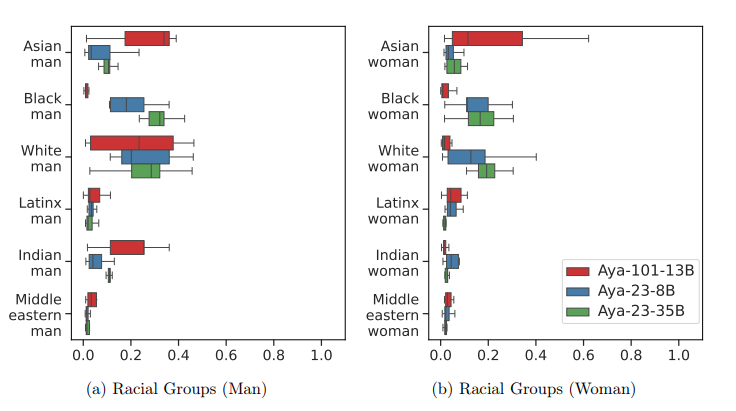 | Identity-descriptor prompts: toxicity distributions by racial group × gender (box plots) comparing **Aya-101-13B**, **Aya-23-8B**, and **Aya-23-35B**. |
| 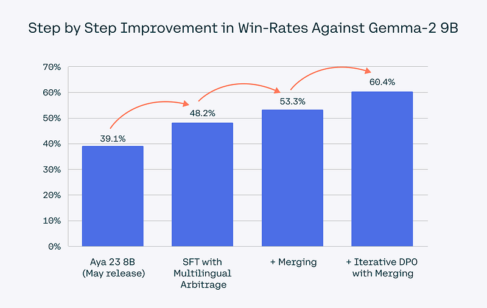 | **Aya Expanse 8B** pipeline ablation: win rate vs Gemma-2 9B after May baseline, +multilingual arbitrage SFT, +merging, +iterative DPO with merging. |
| 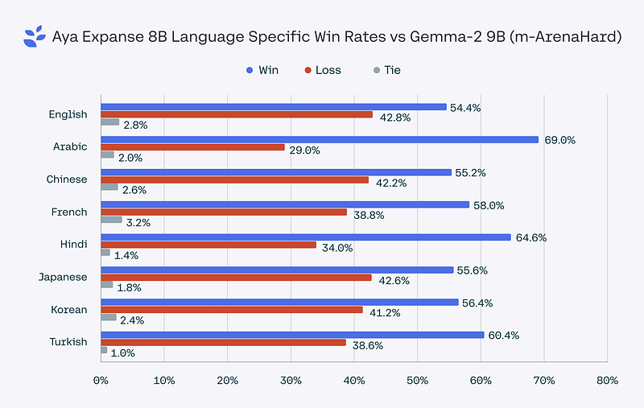 | **Aya Expanse 8B** language-specific win/tie/loss on m-ArenaHard against Gemma-2 9B (EN, AR, ZH, FR, HI, JA, KO, TR). |
| 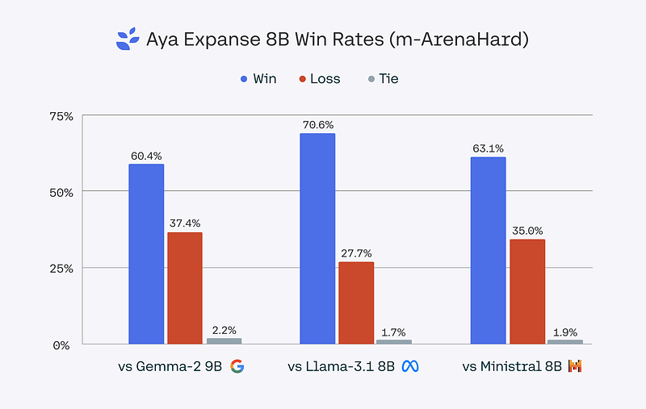 | **Aya Expanse 8B** aggregate m-ArenaHard outcomes vs Gemma-2 9B, Llama-3.1 8B, and Ministral 8B. |
| 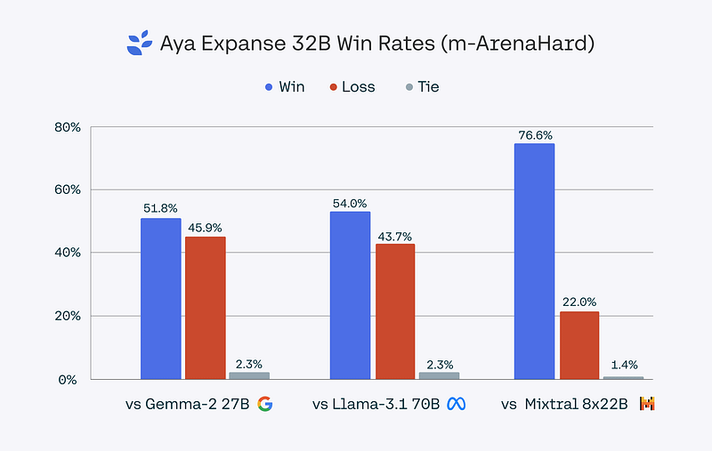 | **Aya Expanse 32B** m-ArenaHard win/tie/loss vs Gemma-2 27B, Llama-3.1 70B, and Mixtral 8×22B. |
## Related

- [[Papers Explained Corpus]]
- [[Multilingual Models]]
- [[Large Language Models]]
- [[Model Compression and Efficiency]]
- [[Long Context]]
- [[Embedding and Retrieval]]
- [[Papers Explained 150 - MarianMT]]
- [[Papers Explained 152 - SigLip]]
- [[C4AI Launches Aya 23, 8B and 35B Parameter Open Weights Release]] — official Cohere Labs blog for Aya 23 open weights.
- [[Aya Expanse: Connecting our world]] — follow-on Aya Expanse 8B/32B release from Cohere For AI.

#summary #topic
