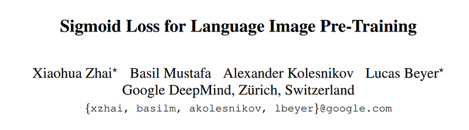
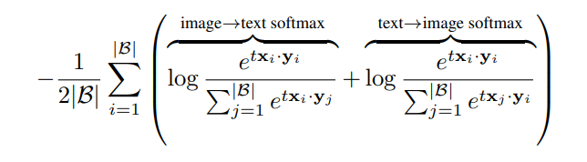
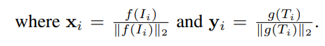
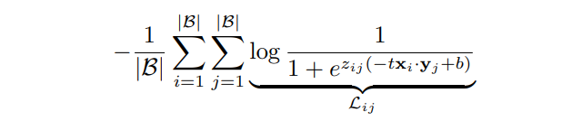
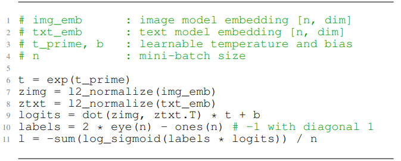
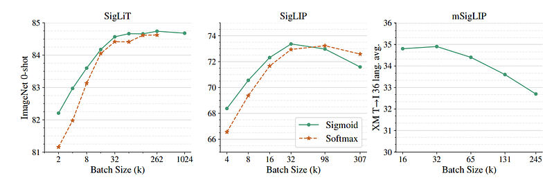
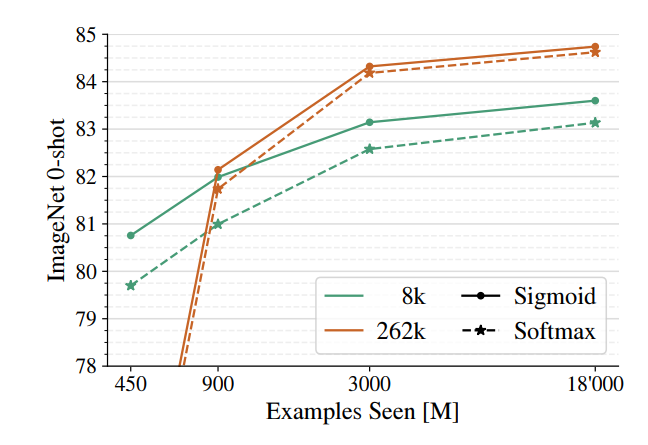
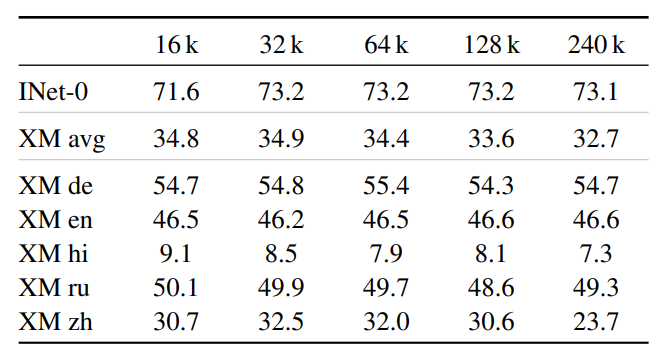
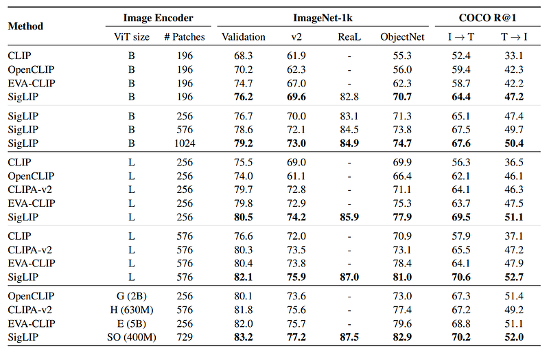

# Papers Explained 152 - SigLip

This paper proposes a simple pairwise Sigmoid loss for Language-Image Pre-training (SigLIP). Unlike standard contrastive learning with softmax normalization, the sigmoid loss operates solely on image-text pairs and does not require a global view of the pairwise similarities for normalization.

This page ingests the source article into the wiki and connects it to [[Papers Explained Corpus]], [[Vision Language Models]], [[Embedding and Retrieval]], [[Model Compression and Efficiency]], [[Computer Vision]], [[Synthetic Data]].

## Source Metadata

- Source file: `raw/2024-06-20_Papers-Explained-152--SigLip-011c48f9d448.html`
- Source title: Papers Explained 152: SigLip
- Published: 2024-06-20
- Canonical: [https://medium.com/@ritvik19/papers-explained-152-siglip-011c48f9d448](https://medium.com/@ritvik19/papers-explained-152-siglip-011c48f9d448)

## Key Ideas

- This paper proposes a simple pairwise Sigmoid loss for Language-Image Pre-training (SigLIP).
- The models are available [here](https://github.com/google-research/big_vision).
- For a mini-batch B = {(I1, T1), (I2, T2), . . . } of image-text pairs, the contrastive learning objective aims to align the embeddings of matching pairs (Ii, Ti) while pushing apart the embeddings of non-matching pairs (Ii, Tj), where j≠i .
- The contrastive learning objective is designed to optimize the embeddings of image-text pairs in a mini-batch B = {(I1, T1), (I2, T2),…}, by bringing together the embeddings of matching pairs (Ii, Ti) and pushing apart those of non-matching pairs (Ii, Tj ≠...
- When using the softmax loss to formalize this objective, an image model f(·) and a text model g(·) are trained to minimize the following objective:

## Notes

This paper proposes a simple pairwise Sigmoid loss for Language-Image Pre-training (SigLIP). Unlike standard contrastive learning with softmax normalization, the sigmoid loss operates solely on image-text pairs and does not require a global view of the pairwise similarities for normalization.

The models are available [here](https://github.com/google-research/big_vision).

## Method

For a mini-batch B = {(I1, T1), (I2, T2), . . . } of image-text pairs, the contrastive learning objective aims to align the embeddings of matching pairs (Ii, Ti) while pushing apart the embeddings of non-matching pairs (Ii, Tj), where j≠i . For practical purposes, it is assumed that for any image i, the text associated with a different image j is unrelated to i, and vice-versa. However, this assumption is generally noisy and imperfect.

The contrastive learning objective is designed to optimize the embeddings of image-text pairs in a mini-batch B = {(I1, T1), (I2, T2),…}, by bringing together the embeddings of matching pairs (Ii, Ti) and pushing apart those of non-matching pairs (Ii, Tj ≠ i). In practice, it is assumed that the text associated with an image i is unrelated to any other image j, and vice versa. However, this assumption is often imperfect and noisy.

### Softmax loss for language image pre-training

When using the softmax loss to formalize this objective, an image model f(·) and a text model g(·) are trained to minimize the following objective:

Note that due to the asymmetry of the softmax loss, the normalization is independently performed two times: across images and across texts.

### Sigmoid loss for language image pre-training

The sigmoid-based loss processes every image-text pair independently, effectively turning the learning problem into the standard binary classification on the dataset of all pair combinations, with a positive labels for the matching pairs (Ii, Ti) and negative labels for all other pairs (Ii, Tj=i). It is defined as follows:

where zij is the label for a given image and text input, which equals 1 if they are paired and −1 otherwise. At initialization, the heavy imbalance coming from the many negatives dominates the loss, leading to large initial optimization steps attempting to correct this bias.

To alleviate this, an additional learnable bias term b similar to the temperature t is introduced.

## Experiments

*Figure: The effect of pre-training batch size.*

### SigLiT: Scaling batch size to the limit

Evaluation of the impact of batch size on contrastive learning and compare the performance of sigmoid and softmax losses at different batch sizes.

- Used precomputed embeddings with a ViT-g vision model.

- Trained a base size text tower from scratch using the LiT image-text dataset.

- Conducted experiments across a wide range of batch sizes, from 512 to 1 M, to study their impact on contrastive learning.

- Compared sigmoid and softmax losses at various batch sizes.

- For batch sizes smaller than 16 k, sigmoid loss outperforms softmax loss significantly.

- As the batch size increases, softmax loss performance improves and becomes comparable to or slightly underperforms sigmoid loss for very large batch sizes.

- The optimal batch size for performance saturates at 32 k, with only a minor boost observed when scaling up to 1 M batch size.

- The best SigLiT model with a B-sized text mode achieved 84.7% zero-shot transfer accuracy on ImageNet, compared to the original LiT paper’s 85.2% with a larger g-sized text model.

### SigLIP: Sigmoid loss is beneficial for language-image pre-training

Tto pre-train SigLIP (Sigmoid Language-Image Pre-training) models on English subset of WebLI dataset and compare the performance and efficiency of SigLIP with the CLIP baseline pre-trained on the same dataset, specifically focusing on batch size and computational resources.

- The models used were moderately-sized: B/16 Vision Transformer (ViT) for image embeddings and a B-sized transformer for text embeddings.

- Image inputs were resized to 224×224 pixels.

- Text was tokenized using a 32 k vocabulary SentencePiece tokenizer trained on the English C4 dataset, with a maximum of 16 text tokens retained.

- The SigLIP models used the sigmoid loss function, while the CLIP baseline used the standard softmax loss.

- SigLIP outperformed the CLIP baseline with batch sizes less than 32 .

- The sigmoid loss allowed for much larger batch sizes, enabling a Base SigLIP model to fit 2x batch size compared to the CLIP model.

- SigLIP’s performance was optimal at a batch size of 32 k, while the softmax loss required a larger batch size (98 k) for optimal performance and still did not outperform the sigmoid-based variant.

- Both the sigmoid and softmax losses showed a decrease in performance as the batch size scaled to 307 k or higher.

### mSigLIP: Multi-lingual pre-training

Scaling up the training data using the WebLI dataset, which includes 100 languages and evaluate the impact of different tokenizer vocabulary sizes on model performance.

Assess the impact of different batch sizes on model pre-training in a multilingual context.

- Used B-sized ViT and text models with 900 million total examples seen.

- Compared two tokenizers: a small multilingual vocabulary with 32k tokens and a large one with 250k tokens.

- Introduced a “bottlenecked” token embedding method, where the larger of the two vocabularies is compressed into a smaller intermediate size (K) before mapping to the full embedding dimension (W).

*Figure: Multilingual SigLIP results with various batch sizes, pre-trained for 30 billion seen examples.*

- A slightly more than 1% improvement in model performance when using the larger vocabulary.

- The “bottlenecked” token embedding can be as efficient as using a full large vocabulary, with only about a half percent quality drop on ImageNet zero-shot transfer when K = 96 for a Base architecture with W = 768.

- A batch size of 32k is sufficient for multilingual pre-training, with no clear improvements observed with larger batch sizes beyond this point.

- Achieved a new state-of-the-art on the XM3600 text to image retrieval task with a Base size model (34.9%), which is more than 6% higher than the previous result (28.5%) using a larger four billion ViT-e model.

### Scaling up SigLIP and mSigLIP

Scaling up the SigLIP model by “overtraining” it using larger datasets and longer training times to improve its performance on various vision tasks.

- The models were trained on 40 billion examples using a batch size of 32 k.

- Training involved using 256 image patches and 64 text tokens per example, which is larger than the 16 image patches and 16 text tokens used previously.

- To adapt the models for different resolutions, an additional 5 billion examples were trained at the target resolution with a 100x smaller learning rate and no weight decay.

- The same scaling approach was applied to a multilingual version of SigLIP (mSigLIP).

*Figure: Comparison with other publicly released models.*

- The scaled-up SigLIP models demonstrated zero-shot classification performance on benchmarks such as ImageNet, ObjectNet, ImageNet-v2, and ImageNet ReaL.

- For image-to-text and text-to-image retrieval tasks, the models were tested on MSCOCO.

- The scaled-up SigLIP ViT-B model achieved a 42.6% image retrieval recall@1 and a 54.1% text retrieval recall@1 on the XM36000 benchmark across 36 languages, which is a state-of-the-art result for a Base model.

- The multilingual mSigLIP ViT-B model also achieved high performance, with 42.6% image retrieval recall@1 and 54.1% text retrieval recall@1, slightly outperformed by Nllb-clip.

## Paper

Sigmoid Loss for Language Image Pre-Training

Recommended Reading: [Retrieval and Representation Learning](https://ritvik19.medium.com/list/retrieval-and-representation-learning-bcd23de0bd8e)

## Figures

Figures from the Medium HTML export (`raw/2024-06-20_Papers-Explained-152--SigLip-011c48f9d448.html`); local copies under `wiki/assets/papers-explained-152-siglip/` when download succeeded.

| Figure | Caption |
|--------|---------|
|  | Title page of *Sigmoid Loss for Language Image Pre-Training* (Google DeepMind, Zürich). |
|  | Symmetric softmax contrastive objective: dual image→text and text→image cross-entropy over batch negatives with temperature $t$. |
|  | $L_2$-normalized image and text embeddings $\mathbf{x}_i$, $\mathbf{y}_i$ from encoders $f$, $g$. |
|  | Pairwise sigmoid loss summing $\mathcal{L}_{ij}$ over all batch pairs with labels $z_{ij}=\pm1$, temperature $t$, and learnable bias $b$. |
|  | Pseudocode: batched logits from normalized embeddings, diagonal-positive label matrix, and mean `log_sigmoid` SigLIP loss. |
|  | Effect of batch size (SigLiT ImageNet 0-shot, SigLIP accuracy, mSigLIP XM text→image avg): sigmoid vs softmax where compared; mSigLIP peaks then declines past ~32k. |
|  | ImageNet 0-shot vs training examples seen for 8k vs 262k vocabularies under sigmoid vs softmax—sigmoid leads at matched compute/vocab stages until large-scale convergence. |
|  | Multilingual tokenizer ablation (16k–240k vocab): ImageNet zero-shot and XM3600-style retrieval averages plus per-language XM rows. |
|  | Leaderboard-style comparison of CLIP/OpenCLIP/EVA-CLIP/CLIPA vs scaled **SigLIP** on ImageNet val/v2/ReaL/ObjectNet and MSCOCO recall@1 (image↔text) across ViT scales and patch counts. |
## Related

- [[Papers Explained Corpus]]
- [[Vision Language Models]]
- [[Embedding and Retrieval]]
- [[Model Compression and Efficiency]]
- [[Computer Vision]]
- [[Synthetic Data]]
- [[Papers Explained 151 - Aya 23]]
- [[Papers Explained 153 - CTRL]]

#summary #topic
