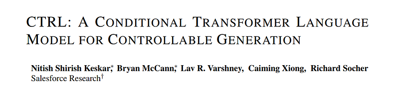
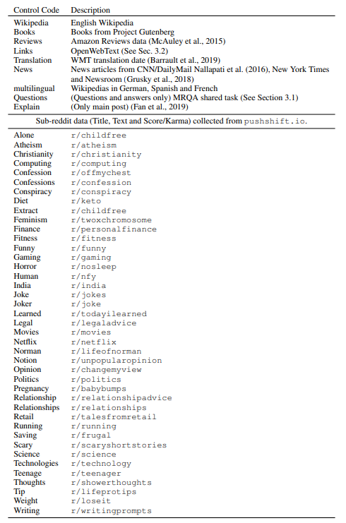

# Papers Explained 153 - CTRL

CTRL is a 1.63 billion-parameter conditional transformer language model, trained to condition on control codes that govern style, content, and task-specific behavior.

This page ingests the source article into the wiki and connects it to [[Papers Explained Corpus]], [[Large Language Models]], [[Synthetic Data]], [[Code Models]].

## Source Metadata

- Source file: `raw/2024-06-21_Papers-Explained-153--CTRL-146fcd18a566.html`
- Source title: Papers Explained 153: CTRL
- Published: 2024-06-21
- Canonical: [https://medium.com/@ritvik19/papers-explained-153-ctrl-146fcd18a566](https://medium.com/@ritvik19/papers-explained-153-ctrl-146fcd18a566)

## Key Ideas

- CTRL is a conditional language model that is always conditioned on a control code c and learns the distribution p(x|c).
- CTRL learns pθ(xi |x < i, c) by training on sequences of raw text prepended with control codes. After minimal preprocessing.
- CTRL is trained on 140 GB of text drawing from a wide variety of domains:
- Europarl and UN data from WMT (En-De, En-Es, En-Fr)
- question-answer pairs (no context documents) from ELI5

## Notes

CTRL is a 1.63 billion-parameter conditional transformer language model, trained to condition on control codes that govern style, content, and task-specific behavior. Control codes were derived from structure that naturally co-occurs with raw text, preserving the advantages of unsupervised learning while providing more explicit control over text generation. These codes also allow CTRL to predict which parts of the training data are most likely given a sequence.

## Language Modeling with CTRL

CTRL is a conditional language model that is always conditioned on a control code c and learns the distribution p(x|c).

CTRL learns pθ(xi |x < i, c) by training on sequences of raw text prepended with control codes. After minimal preprocessing.

## Data

CTRL is trained on 140 GB of text drawing from a wide variety of domains:

- Wikipedia (En, De, Es, Fr)

- Project Gutenberg

- Submissions from 45 subreddits

- OpenWebText

- a large collection of news data

- Amazon Reviews

- Europarl and UN data from WMT (En-De, En-Es, En-Fr)

- question-answer pairs (no context documents) from ELI5

- the MRQA shared task, which includes the Stanford Question Answering Dataset, NewsQA, TriviaQA, SearchQA, HotpotQA, and Natural Questions.

*Figure: Data and control codes.*

- Most control codes for our model specify the overall style of generated text by indicating a particular domain of training data.

- Additional control codes can be added to the domain code in order to increasingly constrain generation.

- A small number of control codes are related to specific tasks like question answering and translation.

- Wikipedia, Books, News and multilingual have no secondary code.

- Reviews can be followed by Rating: and a value of {1.0, 2.0, 3.0, 4.0, 5.0}.

- For Links, a full or partial URL can be provided.

- For all the Reddit data, the secondary code can be Title: or Text:, which is the title and text of the article, respectively.

## Experimental Settings

BPE codes are learned and the data is tokenized with a large vocabulary of roughly 250K tokens.

CTRL has model dimension d = 1280, inner dimension f = 8192, 48 layers, and 16 heads per layer. Dropout with probability 0.1 follows the residual connections in each layer. Token embeddings were tied with the final output embedding layer.

## Paper

CTRL: A Conditional Transformer Language Model for Controllable Generation [1909.05858](https://arxiv.org/abs/1909.05858)

## Figures

Figures from the Medium HTML export (`raw/2024-06-21_Papers-Explained-153--CTRL-146fcd18a566.html`); local copies under `wiki/assets/papers-explained-153-ctrl/` when download succeeded.

| Figure | Caption |
|--------|---------|
|  | Title block of *CTRL: A Conditional Transformer Language Model for Controllable Generation* (Salesforce Research). |
|  | Control-code cheat sheet: domain codes (Wikipedia, Books, Reviews, News, Translation, …) plus long tail of Subreddit-derived codes with short descriptions. |
## Related

- [[Papers Explained Corpus]]
- [[Large Language Models]]
- [[Synthetic Data]]
- [[Code Models]]
- [[Papers Explained 152 - SigLip]]
- [[Papers Explained 154 - BLIP]]

#summary #topic
