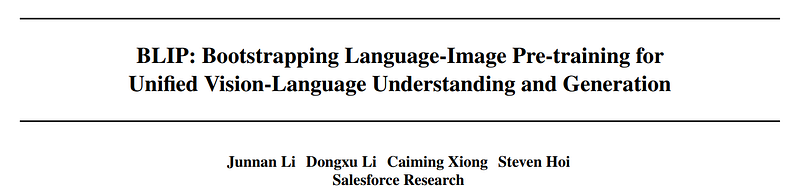
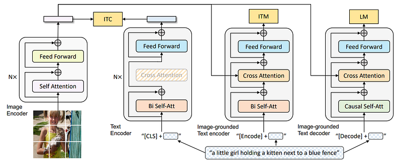
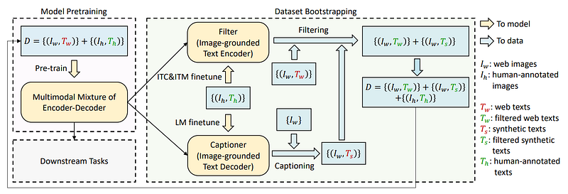
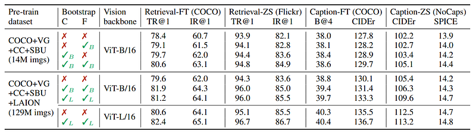
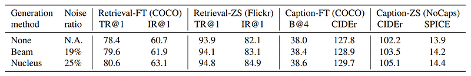
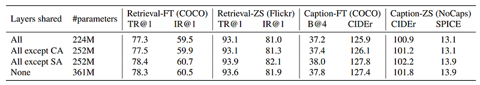
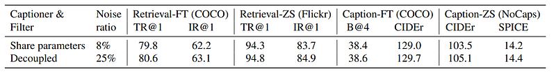

# Papers Explained 154 - BLIP

BLIP is a new VLP framework which transfers flexibly to both vision-language understanding and generation tasks. BLIP effectively utilizes the noisy web data by bootstrapping the captions, where a captioner generates synthetic captions and a filter removes the noisy ones.

This page ingests the source article into the wiki and connects it to [[Papers Explained Corpus]], [[Vision Language Models]], [[Synthetic Data]], [[Large Language Models]], [[Embedding and Retrieval]].

## Source Metadata

- Source file: `raw/2024-06-24_Papers-Explained-154--BLIP-6d85c80a744d.html`
- Source title: Papers Explained 154: BLIP
- Published: 2024-06-24
- Canonical: [https://medium.com/@ritvik19/papers-explained-154-blip-6d85c80a744d](https://medium.com/@ritvik19/papers-explained-154-blip-6d85c80a744d)

## Key Ideas

- BLIP is a new VLP framework which transfers flexibly to both vision-language understanding and generation tasks.
- The project is available on [GitHub](https://github.com/salesforce/BLIP).
- A visual transformer is used as the image encoder. It divides an input image into patches and encodes them as a sequence of embeddings, with an additional [CLS] token to represent the global image feature.
- In order to pre-train a unified model with both understanding and generation capabilities, A multimodal mixture of encoder-decoder (MED) is proposed. It is a multi-task model which can operate in one of the three functionalities:
- Unimodal encoder, which separately encodes image and text. The text encoder is the same as BERT, where a [CLS] token is appended to the beginning of the text input to summarize the sentence.

## Notes

BLIP is a new VLP framework which transfers flexibly to both vision-language understanding and generation tasks. BLIP effectively utilizes the noisy web data by bootstrapping the captions, where a captioner generates synthetic captions and a filter removes the noisy ones.

The project is available on [GitHub](https://github.com/salesforce/BLIP).

## Model Architecture

*Figure: Pre-training model architecture and objectives of BLIP (same parameters have the same color).*

A visual transformer is used as the image encoder. It divides an input image into patches and encodes them as a sequence of embeddings, with an additional [CLS] token to represent the global image feature.

In order to pre-train a unified model with both understanding and generation capabilities, A multimodal mixture of encoder-decoder (MED) is proposed. It is a multi-task model which can operate in one of the three functionalities:

- Unimodal encoder, which separately encodes image and text. The text encoder is the same as BERT, where a [CLS] token is appended to the beginning of the text input to summarize the sentence.

- Image-grounded text encoder, which injects visual information by inserting one additional cross-attention (CA) layer between the self-attention (SA) layer and the feed forward network (FFN) for each transformer block of the text encoder. A task-specific [Encode] token is appended to the text, and the output embedding of [Encode] is used as the multimodal representation of the image-text pair.

- Image-grounded text decoder, which replaces the bidirectional self-attention layers in the image-grounded text encoder with causal self-attention layers. A [Decode] token is used to signal the beginning of a sequence, and an end-of-sequence token is used to signal its end.

### Pre-training Objectives

Three objectives are jointly optimized during pre-training, with two understanding-based objectives and one generation based objective.

Image-Text Contrastive Loss (ITC) activates the unimodal encoder. It aims to align the feature space of the visual transformer and the text transformer by encouraging positive image-text pairs to have similar representations in contrast to the negative pairs. The ITC loss is used, where a momentum encoder is introduced to produce features, and soft labels are created from the momentum encoder as training targets to account for the potential positives in the negative pairs.

Image-Text Matching Loss (ITM) activates the image grounded text encoder. It aims to learn image-text multimodal representation that captures the fine-grained alignment between vision and language. ITM is a binary classification task, where the model predicts whether an image-text pair is positive (matched) or negative (unmatched) given their multimodal feature. In order to find more informative negatives, the hard negative mining strategy where negative pairs with higher contrastive similarity in a batch are more likely to be selected to compute the loss is used.

Language Modeling Loss (LM) activates the image grounded text decoder, which aims to generate textual descriptions given an image. It optimizes a cross entropy loss which trains the model to maximize the likelihood of the text in an autoregressive manner.

In order to perform efficient pre-training while leveraging multi-task learning, the text encoder and text decoder share all parameters except for the SA layers. The reason is that the differences between the encoding and decoding tasks are best captured by the SA layers. In particular, the encoder employs bi-directional self-attention to build representations for the current input tokens, while the decoder employs causal self-attention to predict next tokens. On the other hand, the embedding layers, CA layers and FFN function similarly between encoding and decoding tasks, therefore sharing these layers can improve training efficiency while benefiting from multi-task learning,

### Cap Filt

*Figure: Learning framework of BLIP.*

In order to generate high quality (image, text) pairs from the data collected from the web, BLIP introduces two modules: a captioner to generate captions given web images, and a filter to remove noisy image-text pairs. Both the captioner and the filter are initialized from the same pre-trained MED model, and fine tuned individually on the COCO dataset. The finetuning is a lightweight procedure.

Specifically, the captioner is an image-grounded text decoder, fine tuned with the LM objective to decode texts given images. Given the web images Iw, the captioner generates synthetic captions Ts with one caption per image. The filter is an image-grounded text encoder, fine tuned with the ITC and ITM objectives to learn whether a text matches an image. The filter removes noisy texts in both the original web texts Tw and the synthetic texts Ts.

Finally, the filtered image-text pairs are combined with the human-annotated pairs to form a new dataset, which are used to pre-train a new model.

### Pretraining Details

The image transformer is initialized from ViT pre-trained on ImageNet, and the text transformer is initialized from BERTbase. Two variants of ViTs are explored: ViT-B/16 and ViT-L/16. Unless otherwise specified, all results reported in this paper as “BLIP” uses ViT-B. The model is pretrained for 20 epochs.

Random image crops of resolution 224 × 224 are taken during pre-training, the image resolution is increased to 384 × 384 during finetuning.

## Evaluation

### Effect of CapFilt

*Figure: Evaluation of the effect of the captioner and filter for dataset bootstrapping.*

- Performance improvement observed when applying CapFilt to the dataset with 14M images, either individually or in combination.

- Substantial improvements over using original noisy web texts were noted when both captioner and filter were applied together.

- Scalability of CapFilt was confirmed by its ability to boost performance on larger datasets and models (ViT-L).

### Diversity is Key for Synthetic Captions

- Employing nucleus sampling as a stochastic decoding technique in CapFilt. Each token is sampled from a set of tokens whose cumulative probability mass exceeds a threshold p, where p = 0.9 for the experiments.

- Comparing nucleus sampling with beam search method (deterministic).

*Figure: Comparison between beam search and nucleus sampling for synthetic caption generation. Models are pre-trained on 14M images.*

- Nucleus sampling leads to better performance, despite being more noisy (higher noise ratio from the filter).

- Nucleus sampling generates more diverse and surprising captions, which contain more new information that the model could benefit from.

- Beam search tends to generate safe captions that are common in the dataset, hence offering less extra knowledge.

### Parameter Sharing and Decoupling

*Figure: Comparison between different parameter sharing strategies for the text encoder and decoder during pre-training.*

- Sharing all layers except SA leads to better performance compared to not sharing, with reduced model size and improved training efficiency (Table 3)

- If SA layers are shared, the model’s performance degrades due to conflict between encoding and decoding tasks

*Figure: Effect of sharing parameters between the captioner and filter. Models are pre-trained on 14M images.*

- When captioner and filter share parameters, downstream task performance decreases, attributed to confirmation bias. Noise ratio decreases from 25% to 8%.

## Paper

BLIP: Bootstrapping Language-Image Pre-training for Unified Vision-Language Understanding and Generation [2201.12086](https://arxiv.org/abs/2201.12086)

Recommended Reading [Multi Modal Transformers](https://ritvik19.medium.com/list/multi-modal-transformers-67453f215ecf)

## Figures

Figures from the Medium HTML export (`raw/2024-06-24_Papers-Explained-154--BLIP-6d85c80a744d.html`); local copies under `wiki/assets/papers-explained-154-blip/` when download succeeded.

| Figure | Caption |
|--------|---------|
|  | Title page of *BLIP: Bootstrapping Language-Image Pre-training for Unified Vision-Language Understanding and Generation* (Salesforce Research). |
|  | MED pre-training architecture: ViT image encoder with unimodal text encoder (ITC), image-grounded encoder (ITM), and causal decoder (LM) sharing colors for tied parameters. |
|  | CapFilt bootstrapping loop: pretrain MED on web+human pairs; fork captioner (LM) and filter (ITC+ITM); filter noisy web and synthetic captions; re-pretrain on cleaned union. |
|  | CapFilt ablations on 14M vs 129M images, ViT-B vs ViT-L: retrieval (COCO FT, Flickr ZS) and captioning (COCO FT, NoCaps ZS) when enabling captioner/filter checkmarks. |
|  | Synthetic-caption decoding: beam vs nucleus sampling trade-offs with reported filter noise ratios across retrieval and captioning benchmarks. |
|  | Text encoder–decoder sharing study: which transformer layers are shared vs separate (#parameters vs TR/IR/BLEU/CIDEr/SPICE). |
|  | Captioner vs filter parameter sharing: shared-weights (lower noise ratio) vs decoupled CapFilt (higher noise tolerance, better downstream metrics). |
## Related

- [[Papers Explained Corpus]]
- [[Vision Language Models]]
- [[Synthetic Data]]
- [[Large Language Models]]
- [[Embedding and Retrieval]]
- [[Papers Explained 153 - CTRL]]
- [[Papers Explained 155 - BLIP 2]]

#summary #topic
