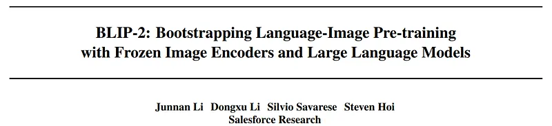
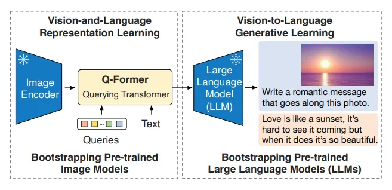
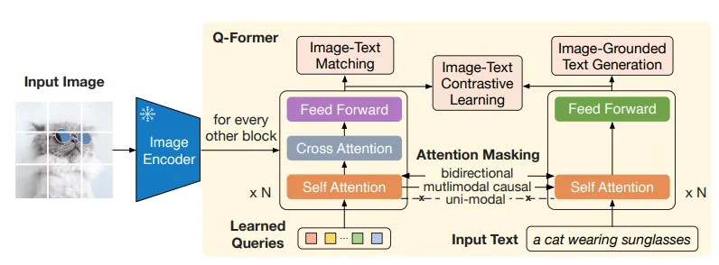
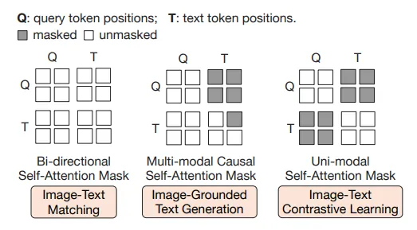
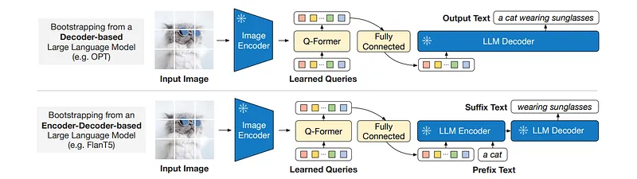
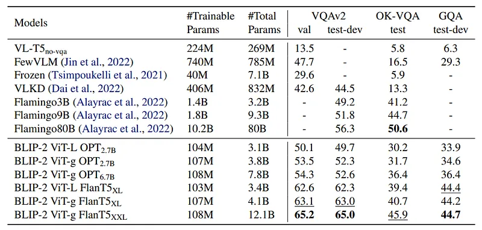
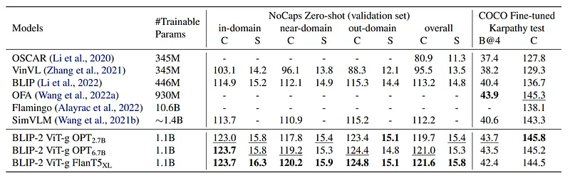
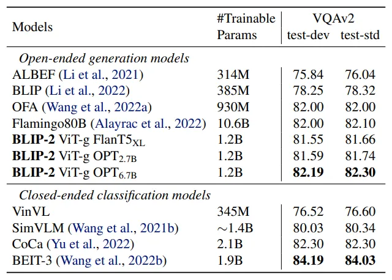
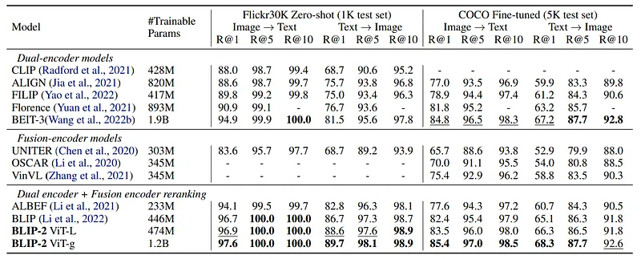
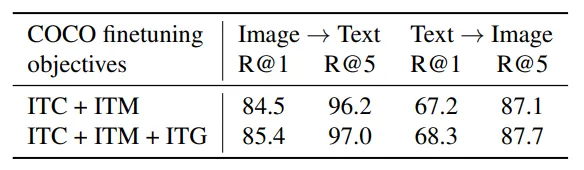

# Papers Explained 155 - BLIP 2

BLIP-2 is a generic and efficient pretraining strategy that bootstraps vision-language pre-training from off-the-shelf frozen pre-trained image encoders and frozen large language models. BLIP-2 bridges the modality gap with a lightweight Querying Transformer, which is pre-trained in two stages.

This page ingests the source article into the wiki and connects it to [[Papers Explained Corpus]], [[Large Language Models]], [[Vision Language Models]], [[Model Compression and Efficiency]], [[Embedding and Retrieval]], [[Computer Vision]].

## Source Metadata

- Source file: `raw/2024-06-26_Papers-Explained-155--BLIP-2-135fff70bf65.md`
- Source title: Papers Explained 155: BLIP 2
- Published: 2024-06-26
- Canonical: [https://medium.com/@ritvik19/papers-explained-155-blip-2-135fff70bf65](https://medium.com/@ritvik19/papers-explained-155-blip-2-135fff70bf65)

## Key Ideas

- BLIP-2 is a generic and efficient pretraining strategy that bootstraps vision-language pre-training from off-the-shelf frozen pre-trained image encoders and frozen large language models.
- The project is available at [GitHub](https://github.com/salesforce/LAVIS/tree/main/projects/blip2).
- Recommended Reading [BLIP](https://ritvik19.medium.com/papers-explained-154-blip-6d85c80a744d)
- Q-Former is a trainable module to bridge the gap between the frozen image encoder and LLM.
- A set number of learnable query embeddings are created as input to the image transformer.

## Notes

BLIP-2 is a generic and efficient pretraining strategy that bootstraps vision-language pre-training from off-the-shelf frozen pre-trained image encoders and frozen large language models. BLIP-2 bridges the modality gap with a lightweight Querying Transformer, which is pre-trained in two stages. The first stage bootstraps vision-language representation learning from a frozen image encoder. The second stage bootstraps vision-to-language generative learning from a frozen language model.

The project is available at [GitHub](https://github.com/salesforce/LAVIS/tree/main/projects/blip2).

Recommended Reading [BLIP](https://ritvik19.medium.com/papers-explained-154-blip-6d85c80a744d)

## Model Architecture

*Figure: Overview of BLIP-2’s framework.*

Q-Former is a trainable module to bridge the gap between the frozen image encoder and LLM. It consists of two transformer submodules that share the same self-attention layers: (1) an image transformer that interacts with the frozen image encoder for visual feature extraction, (2) a text transformer that can function as both a text encoder and a text decoder.

A set number of learnable query embeddings are created as input to the image transformer. The queries interact with each other through self-attention layers, and interact with frozen image features through cross-attention layers and can additionally interact with the text through the same self-attention layers. Depending on the pre-training task, different self-attention masks are applied to control query-text interaction.

In the experiments 32 queries with a dimension of 768 (same as the hidden dimension of the Q-Former) are used.

QFormer is initialized with the pre-trained weights of BERT base, whereas the cross-attention layers are randomly initialized.

The size of output query representation Z (32 × 768) is much smaller than the size of frozen image features (e.g. 257 × 1024 for ViT-L/14) forcing the queries to extract visual information that is most relevant to the text.

### Bootstrap Vision-Language Representation Learning from a Frozen Image Encoder

*Figure: Model architecture of Q-Former and BLIP-2’s first-stage vision-language representation learning objectives.*

Q-Former is connected to a frozen image encoder and pre-training is performed using image-text pairs aiming to make the queries learn to extract visual representation that is most informative of the text.

Inspired by BLIP three pre-training objectives are jointly optimized, sharing the same input format and model parameters, but employing a different attention masking strategy between queries and text to control their interaction.

*Figure: The self-attention masking strategy for each objective to control query-text interaction.*

Image-Text Contrastive Learning (ITC) learns to align image representation and text representation such that their mutual information is maximized by contrasting the image-text similarity of a positive pair against those of negative pairs.

The output query representation Z from the image transformer is aligned with the text representation t from the text transformer, where t is the output embedding of the [CLS] token. Since Z contains multiple output embeddings (one from each query), the pairwise similarity between each query output and t, is computed and then the highest one is selected as the image-text similarity. To avoid information leak, a unimodal self-attention mask, where the queries and text are not allowed to see each other is used.

Image-grounded Text Generation (ITG) loss trains the Q-Former to generate texts, given input images as the condition.

A multimodal causal self-attention mask is used to control query-text interaction.The queries can attend to each other but not the text tokens. Each text token can attend to all queries and its previous text tokens. The [CLS] token is replaced with a new [DEC] token as the first text token to signal the decoding task.

Image-Text Matching (ITM) aims to learn fine-grained alignment between image and text representation. It is a binary classification task where the model is asked to predict whether an image-text pair is positive (matched) or negative (unmatched).

A bi-directional self-attention mask is used where all queries and texts can attend to each other. The output query embeddings Z thus capture multimodal information. Each output query embedding is fed into a two-class linear classifier to obtain a logit, and the logits across all queries are averaged as the output matching score. Hard negative mining strategy is used to create informative negative pairs.

### Bootstrap Vision-to-Language Generative Learning from a Frozen LLM

*Figure: . BLIP-2’s second-stage vision-to-language generative pre-training, which bootstraps from frozen large language models (LLMs).*

QFormer (with the frozen image encoder attached) is connected to a frozen LLM to harvest the LLM’s generative language capability. A fully-connected layer is used to linearly project the output query embeddings Z into the same dimension as the text embedding of the LLM.

The projected query embeddings are then prepended to the input text embeddings to function as soft visual prompts that condition the LLM on visual representation extracted by the Q-Former.

For decoder based LLMs, the frozen LLM is tasked to generate the text conditioned on the visual representation from Q-Former.

For encoder-decoder-based LLMs, text is split into two parts. The prefix text is concatenated with the visual representation as input to the LLM’s encoder. The suffix text is used as the generation target for the LLM’s decoder.

### Pre-training settings

The same pre-training data as BLIP is used. The models are pre-trained for 250k steps in the first stage and 80k steps in the second stage.

For the image encoder, ViT-L/14 from CLIP and ViT-g/14 from EVA-CLIP are explored. The last layer of the ViT is removed and the second last layer’s output features are used, which leads to slightly better performance.

For the decode only LLMs, OPT model family is explored. For encoder-decoder-based language models FlanT5 model family is explored.

## Evaluation

### Instructed Zero-shot Image-to-Text Generation

- Appended text and visual prompts are used as inputs for the LLM.

- Zero-shot VQA evaluation performed using OPT models (prompt format “Question: {} Answer:”) and FlanT5 models (prompt format “Question: {} Short answer:”).

- Beam search with a beam width of 5 used during generation, along with a length-penalty set to -1.

*Figure: Comparison with state-of-the-art methods on zero-shot visual question answering.*

- BLIP-2 achieves state-of-the-art results on VQAv2 and GQA datasets.

- Outperforms Flamingo80B by 8.7% on VQAv2 despite having 54x fewer trainable parameters.

- Comes secondary to Flamingo80B on OK-VQA dataset, possibly due to focus on open-world knowledge rather than visual understanding.

### Image Captioning

BLIP 2 model are fintuned. The prompt “a photo of” is used as an initial input to the LLM. The model is trained with language modeling loss while keeping the LLM frozen and updating the parameters of the Q-Former together with the image encoder.

*Figure: Comparison with state-of-the-art image captioning methods on NoCaps and COCO Caption.*

- Achieved state-of-the-art performance on image captioning task.

- Significant improvement over existing methods in NoCaps domain.

### Visual Question Answering

Q-Former and image encoder are finetuned using annotated VQA data, while keeping LLM frozen.

*Figure: Comparison with state-of-the-art models fine-tuned for visual question answering.*

- State-of-the-art results among open-ended generation models

### Image-Text Retrieval

The first-stage-pretrained model without LLM is finetuned for image-text retrieval using the same objectives as pre-training: ITC (Image-Text Contrast), ITM (Image-Text Matching), and ITG (Image-Grounded Text Generation)

*Figure: Comparison with state-of-the-art image-text retrieval methods, finetuned on COCO and zero-shot transferred to Flickr30K.*

- State-of-the-art performance with significant improvement over existing methods on zero-shot image-text retrieval

- ITC and ITM losses are essential for image-text retrieval as they directly learn image-text similarity

- ITG loss is also beneficial for image-text retrieval, supporting the intuition that it enforces queries to extract visual features most relevant to text

## Paper

BLIP-2: Bootstrapping Language-Image Pre-training with Frozen Image Encoders and Large Language Models [2301.12597](https://arxiv.org/abs/2301.12597)

Recommended Reading [Multi Modal Transformers](https://ritvik19.medium.com/list/multi-modal-transformers-67453f215ecf)

## Figures

Figures from the Medium HTML export (`raw/2024-06-26_Papers-Explained-155--BLIP-2-135fff70bf65.md`); local copies under `wiki/assets/papers-explained-155-blip-2/` when download succeeded.

| Figure | Caption |
|--------|---------|
|  | Title page of *BLIP-2: Bootstrapping Language-Image Pre-training with Frozen Image Encoders and Large Language Models* (Salesforce Research). |
|  | Two-stage blueprint: (left) frozen ViT + trainable Q-Former for vision-language representation; (right) frozen LLM conditioned on projected queries for open-ended generation. |
|  | Q-Former internals: learned queries cross-attend frozen image patches while a parallel text tower supports ITC, ITG, and ITM heads under shared self-attention machinery. |
|  | Query–text self-attention masks for ITM (bidirectional), image-grounded text generation (multimodal causal), and ITC (uni-modal blocks). |
|  | Stage-2 wiring for decoder-only LLMs (e.g. OPT) vs encoder–decoder LLMs (e.g. FlanT5): linear projection of queries into LLM token space as soft visual prompts / prefixes. |
|  | Zero-shot VQA comparison: trainable/total params vs VQAv2, OK-VQA, GQA for Flamingo-scale baselines and BLIP-2 variants (ViT-L/g × OPT/FlanT5). |
|  | Image captioning leaderboard: NoCaps zero-shot (domain splits + overall) and Karpathy COCO fine-tune BLEU/CIDEr vs OSCAR, VinVL, BLIP, OFA, Flamingo, SimVLM, BLIP-2. |
|  | Fine-tuned VQAv2 test-dev/test-std for open-ended generative models vs closed-classifier heads—BLIP-2 OPT$_\mathrm{6.7B}$ leads generative rows; BEIT-3 tops closed-set. |
|  | Image–text retrieval: dual-encoder, fusion, and BLIP-style rerankers on Flickr30K zero-shot and COCO fine-tune with bidirectional R@1/5/10. |
|  | COCO retrieval ablation: adding image-grounded generation (**ITG**) to **ITC+ITM** finetuning boosts image→text and text→image R@1/R@5. |
## Related

- [[Papers Explained Corpus]]
- [[Large Language Models]]
- [[Vision Language Models]]
- [[Model Compression and Efficiency]]
- [[Embedding and Retrieval]]
- [[Computer Vision]]
- [[Papers Explained 154 - BLIP]]
- [[Papers Explained 156 - InstructBLIP]]

#summary #topic
