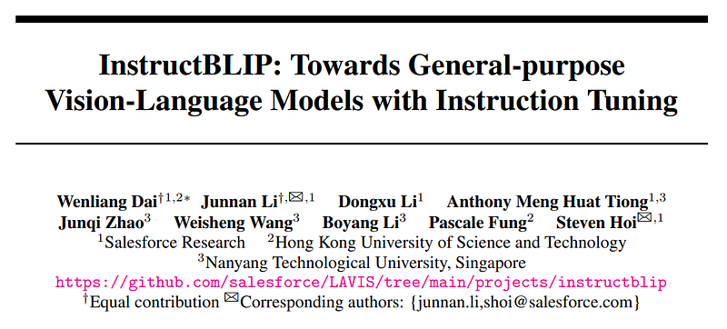
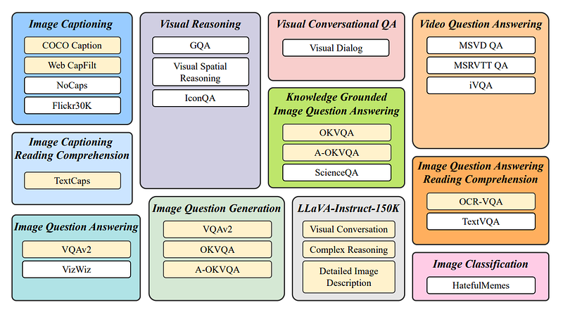
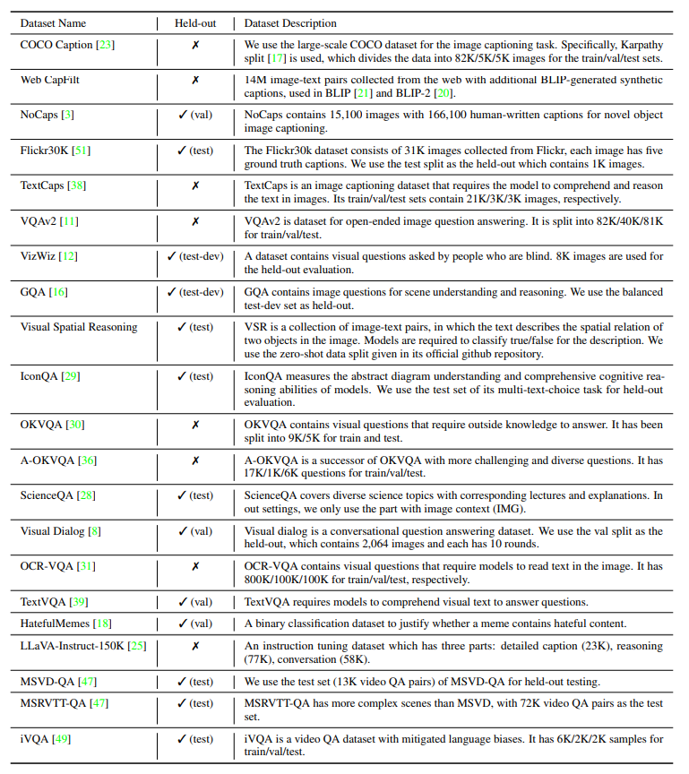
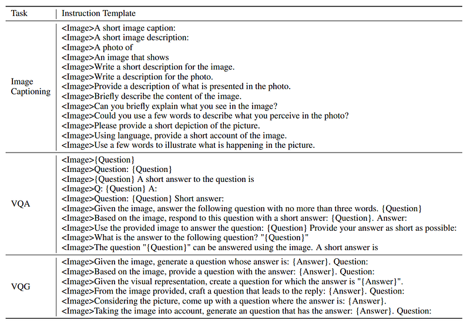
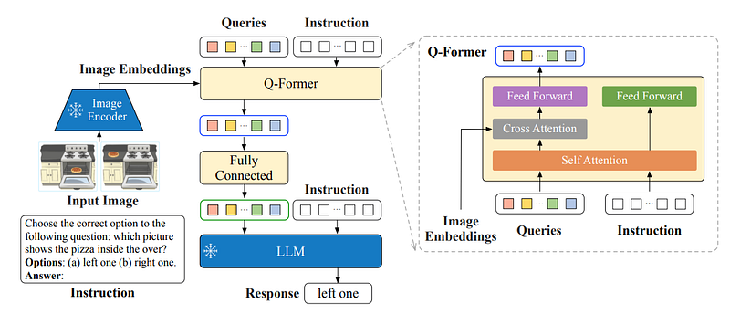
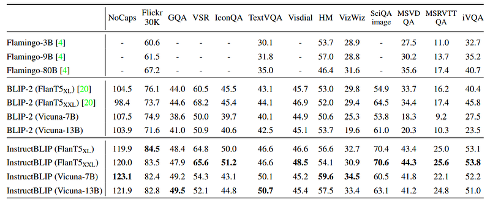
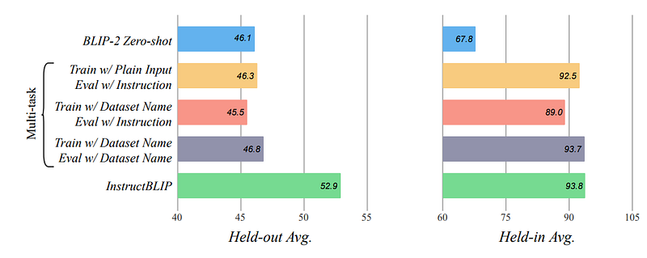
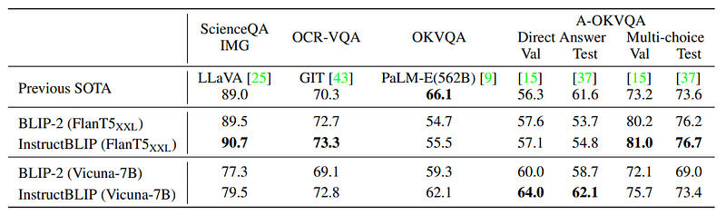

# Papers Explained 156 - InstructBLIP

This paper conducts a systematic and comprehensive study on vision-language instruction tuning based on the pretrained BLIP-2 models. 26 publicly available datasets, covering a wide variety of tasks and capabilities are transformed into instruction tuning format.

This page ingests the source article into the wiki and connects it to [[Papers Explained Corpus]], [[Vision Language Models]], [[Large Language Models]], [[Embedding and Retrieval]], [[Synthetic Data]], [[Evaluation and Benchmarks]], [[Supervised Fine-Tuning]].

## Source Metadata

- Source file: `raw/2024-06-28_Papers-Explained-156--InstructBLIP-c3cf3291a823.html`
- Source title: Papers Explained 156: InstructBLIP
- Published: 2024-06-28
- Canonical: [https://medium.com/@ritvik19/papers-explained-156-instructblip-c3cf3291a823](https://medium.com/@ritvik19/papers-explained-156-instructblip-c3cf3291a823)

## Key Ideas

- This paper conducts a systematic and comprehensive study on vision-language instruction tuning based on the pretrained BLIP-2 models.
- The project is available at [GitHub](https://github.com/salesforce/LAVIS/tree/main/projects/instructblip).
- Recommended Reading [BLIP2](https://ritvik19.medium.com/papers-explained-155-blip-2-135fff70bf65)
- The final collection covers 11 task categories and 26 datasets. The training sets of the held-in datasets are used for instruction tuning and their validation or test sets for held-in evaluation.
- For every task, 10 to 15 distinct instruction templates are crafted in natural language.

## Notes

This paper conducts a systematic and comprehensive study on vision-language instruction tuning based on the pretrained BLIP-2 models. 26 publicly available datasets, covering a wide variety of tasks and capabilities are transformed into instruction tuning format. It also introduces instruction-aware Query Transformer to extract informative features tailored to the given instruction.

The project is available at [GitHub](https://github.com/salesforce/LAVIS/tree/main/projects/instructblip).

Recommended Reading [BLIP2](https://ritvik19.medium.com/papers-explained-155-blip-2-135fff70bf65)

## Tasks and Datasets

The final collection covers 11 task categories and 26 datasets. The training sets of the held-in datasets are used for instruction tuning and their validation or test sets for held-in evaluation.

*Figure: Tasks and their corresponding datasets used for vision-language instruction tuning. The held-in datasets are indicated by yellow and the held-out datasets by white.*

*Figure: Description of datasets in our held-in instruction tuning and held-out zero-shot evaluations.*

For every task, 10 to 15 distinct instruction templates are crafted in natural language.

*Figure: Instruction templates used for transforming held-in datasets into instruction tuning data.*

For public datasets inherently favoring short responses, terms such as short and briefly are used into some of their corresponding instruction templates to reduce the risk of the model overfitting to always generate short outputs. For the LLaVA-Instruct-150K dataset, no additional instruction templates are added since it is naturally structured in the instruction format.

Furthermore, for datasets that involve scene texts, the OCR tokens are added in the instruction as supplementary information.

## Instruction-aware Visual Feature Extraction

*Figure: Model architecture of InstructBLIP.*

Similar to BLIP-2, InstructBLIP utilizes a Query Transformer, or Q-Former, to extract visual features from a frozen image encoder. The input to the Q-Former contains a set of K learnable query embeddings, which interact with the image encoder’s output through cross attention. The output of the Q-Former consists of K encoded visual vectors, one per query embedding, which then go through a linear projection and are fed to the frozen LLM.

As in BLIP-2, the Q-Former is pre-trained in two stages using image-caption data before instruction tuning. The first stage pretrains the Q-Former with the frozen image encoder for vision-language representation learning. The second stage adapts the output of Q-Former as soft visual prompts for text generation with a frozen LLM.

Extending BLIP-2, InstructBLIP proposes an instruction-aware Q-former module, which takes in the instruction text tokens as additional input. The instruction interacts with the query embeddings through self-attention layers of the Q-Former, and encourages the extraction of task-relevant image features. As a result, the LLM receives visual information conducive to instruction following.

## Implementation Details

Due to the large number of training datasets and the significant differences in the size of each dataset, mixing them uniformly could cause the model to overfit smaller datasets and underfit larger datasets. To mitigate the problem, datasets are sampled with probabilities proportional to the square root of their sizes, or the numbers of training samples.

Four variations of BLIP-2 with the same image encoder (ViT-g/14) but different frozen LLMs, including FlanT5XL (3B), FlanT5-XXL (11B), Vicuna-7B and Vicuna-13B are initialized from the pre-trained BLIP-2 checkpoints. Only the parameters of Q-Former are fine tuned, while both the image encoder and the LLM remain frozen.

The models are trained with the standard language modeling loss to directly generate the response given the instruction.

## Evaluation

### Zero-shot Evaluation

*Figure: Zero-shot results on the held-out datasets.*

- The CIDEr score is reported for NoCaps and Flickr30K, iVQA accuracy for iVQA, AUC score for HatefulMemes, and Mean Reciprocal Rank (MRR) for Visual Dialog.

- InstructBLIP achieves new zero-shot SOTA results on all 13 datasets.

- Consistently surpasses its original backbone, BLIP-2, by a significant margin across all LLMs (e.g., average relative improvement of 15.0% for InstructBLIP FlanT5XL vs. BLIP-2 FlanT5XL).

- Instruction tuning boosts zero-shot generalization on unseen task categories such as video QA.

- InstructBLIP achieves up to 47.1% relative improvement on MSRVTT-QA over the previous SOTA despite having never been trained with temporal video data.

- Smallest InstructBLIP FlanT5XL (4B parameters) outperforms Flamingo-80B on all six shared evaluation datasets, with an average relative improvement of 24.8%.

### Instruction Tuning vs. Multitask Learning

Two multitask training approaches were considered:

- Approach 1 (vanilla input-output format): Model is trained without instructions but evaluated with them during testing. Exception for image captioning where only the image is used.

- Approach 2 (instruction tuning): Prepends a “[Task:Dataset]” identifier to text inputs during training, and evaluates using both instructions and identifiers on held-out datasets.

*Figure: Comparison of instruction tuning and multitask training based on BLIP-2 FlanT5XL backbone.*

- Instruction tuning and multitask learning perform similarly on seen datasets, indicating comparable adaptability to different input patterns with appropriate training data.

- Significant improvement in zero-shot generalization for instruction tuning over multitask learning on unseen held-out datasets.

### Finetuning InstructBLIP on Downstream Tasks

*Figure: Results of finetuning BLIP-2 and InstructBLIP on downstream datasets.*

- Compared to BLIP-2, InstructBLIP provides a better weight initialization model and achieves SOTA performance on three out of four datasets.

- FlanT5-based InstructBLIP excels in multi-choice tasks while Vicuna-based InstructBLIP performs better in open-ended generation tasks, due to the nature of their respective instruction data and frozen LLMs.

## Paper

InstructBLIP: Towards General-purpose Vision-Language Models with Instruction Tuning [2305.06500](https://arxiv.org/abs/2305.06500)

Recommended Reading [Multi Modal Transformers](https://ritvik19.medium.com/list/multi-modal-transformers-67453f215ecf)

## Figures

Figures from the Medium HTML export (`raw/2024-06-28_Papers-Explained-156--InstructBLIP-c3cf3291a823.html`); local copies under `wiki/assets/papers-explained-156-instructblip/` when download succeeded.

| Figure | Caption |
|--------|---------|
|  | Title page of *InstructBLIP: Towards General-purpose Vision-Language Models with Instruction Tuning* with Salesforce/HKUST/NTU authors and LAVIS project link. |
|  | Eleven task families (captioning, VQA, reasoning, dialog, video QA, OCR QA, classification, LLaVA-mix, …) with constituent datasets—held-in vs held-out styling per paper legend. |
|  | Dataset sheet: names, held-out markers (✓/✗), and brief corpus descriptions/splits for the 26 instruction sources. |
|  | Example `<Image>`-prefixed instruction templates for captioning, VQA, and visual question generation. |
|  | **InstructBLIP** diagram: frozen ViT, instruction-conditioned Q-Former (queries attend to image patches and instruction tokens), projection into frozen LLM for grounded answers. |
|  | Zero-shot held-out leaderboard across 13 benchmarks: Flamingo vs BLIP-2 vs **InstructBLIP** with multiple frozen LLM backbones. |
|  | Instruction tuning vs multitask baselines: held-in vs held-out averages showing **InstructBLIP** gains OOD generalization over plain multi-task training. |
|  | Downstream finetuning gains: **InstructBLIP** vs BLIP-2 (FlanT5-XXL / Vicuna-7B) vs prior SOTA on ScienceQA (IMG), OCR-VQA, OKVQA, A-OKVQA splits. |
## Related

- [[Papers Explained Corpus]]
- [[Vision Language Models]]
- [[Large Language Models]]
- [[Embedding and Retrieval]]
- [[Synthetic Data]]
- [[Evaluation and Benchmarks]]
- [[Supervised Fine-Tuning]]
- [[Papers Explained 155 - BLIP 2]]
- [[Papers Explained 157 - Gemma 2]]

#summary #topic
