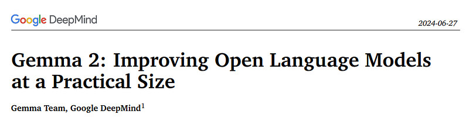
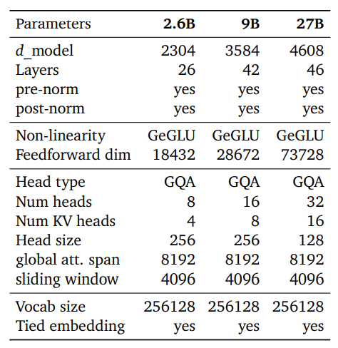
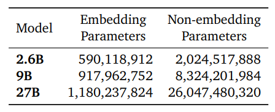
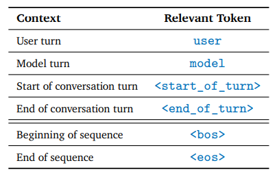
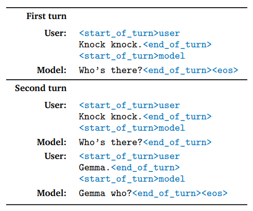
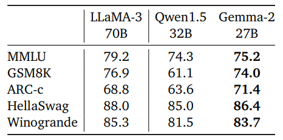
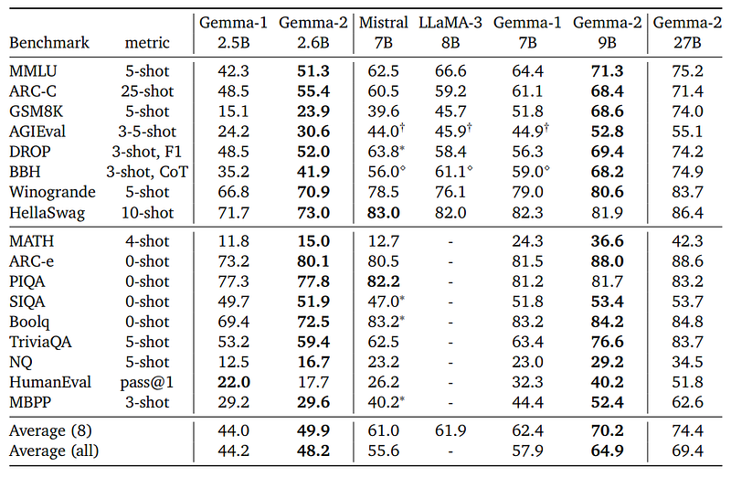
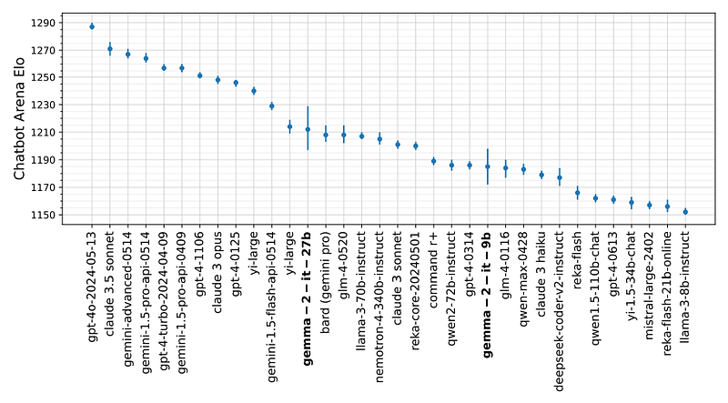

# Papers Explained 157 - Gemma 2

Gemma 2 is a new addition to the Gemma family with several technical modifications, including interleaving local-global attentions and group-query attention. The model is trained with knowledge distillation instead of next token prediction, which results in better performance for its size and competitive performance with larger models.

This page ingests the source article into the wiki and connects it to [[Papers Explained Corpus]], [[Large Language Models]], [[Model Compression and Efficiency]], [[Embedding and Retrieval]], [[Model Distillation]].

## Source Metadata

- Source file: `raw/2024-07-01_Papers-Explained-157--Gemma-2-f1b75b56b9f2.html`
- Source title: Papers Explained 157: Gemma 2
- Published: 2024-07-01
- Canonical: [https://medium.com/@ritvik19/papers-explained-157-gemma-2-f1b75b56b9f2](https://medium.com/@ritvik19/papers-explained-157-gemma-2-f1b75b56b9f2)

## Key Ideas

- Gemma 2 is a new addition to the Gemma family with several technical modifications, including interleaving local-global attentions and group-query attention.
- The models are available at [HuggingFace](https://huggingface.co/collections/google/gemma-2-release-667d6600fd5220e7b967f315).
- Recommended Reading [Papers Explained 106: Gemma](https://ritvik19.medium.com/papers-explained-106-gemma-ca2b449321ac)
- Gemma 2 are somewhat similar to Gemma 1 models:
- the use of Rotary Position Embeddings (RoPE)

## Notes

Gemma 2 is a new addition to the Gemma family with several technical modifications, including interleaving local-global attentions and group-query attention. The model is trained with knowledge distillation instead of next token prediction, which results in better performance for its size and competitive performance with larger models.

The models are available at [HuggingFace](https://huggingface.co/collections/google/gemma-2-release-667d6600fd5220e7b967f315).

Recommended Reading [Papers Explained 106: Gemma](https://ritvik19.medium.com/papers-explained-106-gemma-ca2b449321ac)

## Model Architecture

*Figure: Overview of the main model parameters and design choices.*

Gemma 2 are somewhat similar to Gemma 1 models:

- a context length of 8192 tokens

- the use of Rotary Position Embeddings (RoPE)

- the approximated GeGLU non-linearity

However there are several notable differences:

- Gemma 2 alternates between a local sliding window attention and global attention in every other layer. The sliding window size of local attention layers is set to 4096 tokens, while the span of the global attention layers is set to 8192 tokens.

- To stabilize training, RMSNorm is used to normalize the input and output of each transformer sub-layer, the attention layer, and the feedforward layer.

- Both the 27B and 9B models use GQA with num_groups = 2

- Following Gemini 1.5, the logits in each attention layer and the final layer are capped as logits ← soft_cap ∗ tanh(logits/soft_cap). For the 9B and 27B models, the attention logits are capped at 50.0 and final logits at 30.0.

*Figure: Parameter counts for the Gemma models.*

## Pre Training

The pre-training data is primarily English and comes from a variety of data sources, including web documents, code, and science articles.

- 27B model is trained on 13T tokens

- 9B model on 8T tokens

- 2.6B model on 2T tokens

The same tokenizer as Gemma 1 and Gemini is used: a SentencePiece tokenizer with split digits, preserved whitespace, and byte-level encodings, resulting in a vocabulary of 256k.

The same data filtering techniques as Gemma 1 are used . Specifically, the pretraining dataset is filtered to minimize the risk of unwanted or unsafe utterances. Certain personal information or other sensitive data is filtered out. The evaluation sets in the pre-training data mixture are removed from the pre-training data mixture. The risk of recitation is minimized by eliminating the proliferation of sensitive outputs.

Increasing the length of training only scales logarithmically with dataset size, therefore the focus is to improve the quality of information received by the network at each training step by replacing the next token prediction task with a richer objective. Hence, the 9B and 2.6B models are trained using knowledge distillation with the 27B model as the teacher. Since the vocabulary has 256k entries, only a sampled subset of the teacher probabilities are stored.

## Post Training

The post-training process for Gemma 2 models involves three phases:

- Supervised Fine-Tuning (SFT): The pre-trained models are fine-tuned on a mix of text-only, English-only synthetic and human-generated prompt-response pairs using behavioral cloning and distillation from a larger teacher model.

- Reinforcement Learning from Human Feedback (RLHF): The fine-tuned models are then used as the policy in an RLHF algorithm, where the reward model is trained on labeled English-only preference data and the policy is based on the same prompts as the SFT phase.

- Model Merging: The models obtained after each phase are averaged to improve their overall performance. The models are merged using Warp, a new merging technique that merges models in three distinct stages:

- Exponential Moving Average (EMA): This is applied during the reinforcement learning (RL) fine-tuning process.

- Spherical Linear intERPolation (SLERP): This is applied after the RL fine-tuning of multiple policies.

- Linear Interpolation Towards Initialization (LITI): This stage is applied after the SLERP stage.

The post-training recipe includes tuned hyperparameters chosen to improve helpfulness while minimizing model harms. The data mixtures used for post-training are a combination of internal and external public data, including prompts from LMSYS-chat-1M but not the answers.

### Formatting

Gemma 2 models are fine-tuned with a different formatting schema from Gemma 1 models, but use the same control tokens.

*Figure: Relevant formatting control tokens used for Gemma models.*

The model explicitly ends generations with <end_of_turn><eos> tokens, while previously it only generated <eos>.

*Figure: Example dialogue with user and model control tokens.*

## Evaluation

### Pre-training Evaluations

- Gemma 2 27B model outperforms Qwen1.5 32B and is only a few percent below LLaMA-3 70B despite being 2.5× smaller and trained on 2/3rds less data.

- Overall, the Gemma 2 models are the best in their size category and are even competitive with a larger model that is trained for longer.

### Post-training Evaluations

*Figure: Evaluation of Gemma 2 9B and 27B Instruction Tuned models on the Chatbot Arena.*

- Preliminary results show that the Gemma 27B model sets a new state of the art for open-weights model, slightly surpassing the much larger Llama3–70BInstruct and Nemotron-4–340B-Instruct models.

- Gemma 9B strongly outperforms all other models in the same range of parameters.

## Paper

[Gemma 2: Improving Open Language Models at a Practical Size](https://storage.googleapis.com/deepmind-media/gemma/gemma-2-report.pdf)

Recommended Reading [Gemini / Gemma Models](https://ritvik19.medium.com/list/gemini-gemma-models-4cb7dfc50d42) [Small LLMs](https://ritvik19.medium.com/list/small-llms-41124d5c7c80)

## Figures

Figures from the Medium HTML export (`raw/2024-07-01_Papers-Explained-157--Gemma-2-f1b75b56b9f2.html`); local copies under `wiki/assets/papers-explained-157-gemma-2/` when download succeeded.

| Figure | Caption |
|--------|---------|
|  | Header of the Gemma 2 technical report (*Gemma 2: Improving Open Language Models at a Practical Size*, Google DeepMind, dated 2024-06-27). |
|  | Architecture hyperparameters for **2.6B / 9B / 27B**: widths, depths, GeGLU FFN, GQA heads/KV heads, sliding-window vs global spans (4096 / 8192), 256k vocab. |
|  | Parameter accounting: embedding vs non-embedding counts for each Gemma 2 scale. |
|  | Chat formatting glossary mapping user/model turns and sequence boundaries to `<start_of_turn>`, `<end_of_turn>`, `<bos>`, `<eos>`. |
|  | Two-turn “knock knock” example showing multi-turn token layout and final `<end_of_turn><eos>` termination. |
|  | Spot-check base benchmarks: **Gemma-2 27B** vs **LLaMA-3 70B** and **Qwen1.5 32B** on MMLU, GSM8K, ARC-c, HellaSwag, Winogrande. |
|  | Wide pre-training suite comparing Gemma 1 vs Gemma 2 sizes against Mistral 7B and LLaMA-3 8B across knowledge, math, logic, coding, and averaged summaries. |
|  | Chatbot Arena Elo rankings with **gemma-2-it-9b** and **gemma-2-it-27b** highlighted among proprietary and open chat models. |
## HF Blog Cross-References

- [Welcome Gemma 2 - Google's new open LLM](https://huggingface.co/blog/gemma2) (2024-06-27) — Hugging Face integration post covering the 9B/27B base and instruct checkpoints, Transformers/Google Cloud/TRL integration, and a walkthrough of sliding-window attention, soft-capping, distillation, and merging that mirrors the technical report above.
- [Google releases Gemma 2 2B, ShieldGemma and Gemma Scope](https://huggingface.co/blog/gemma-july-update) (2024-07-31) — one month later, Google shipped a 2.6B Gemma 2 variant for on-device use (same architecture, sliding attention + soft-capping), plus [[ShieldGemma]]-style safety classifiers and Gemma Scope, an open suite of sparse autoencoders trained on Gemma 2 2B/9B activations for interpretability research.

## Related

- [[Papers Explained Corpus]]
- [[Large Language Models]]
- [[Model Compression and Efficiency]]
- [[Embedding and Retrieval]]
- [[Model Distillation]]
- [[Papers Explained 156 - InstructBLIP]]
- [[Papers Explained 158 - XLM]]

#summary #topic
