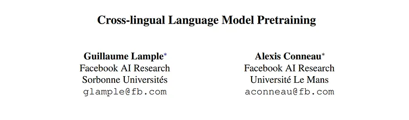
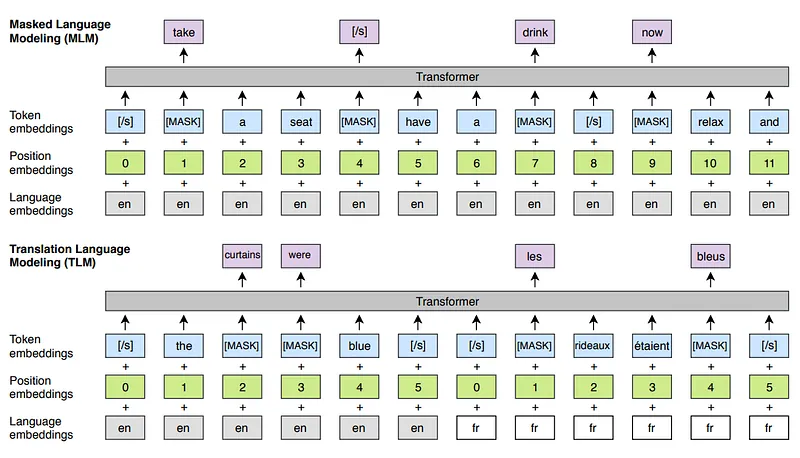

# Papers Explained 158 - XLM

XLM is a transformer-based model, built by Meta. It extends the approach of generative pretraining to multiple languages and shows the effectiveness of cross-lingual pretraining.

This page ingests the source article into the wiki and connects it to [[Papers Explained Corpus]], [[Multilingual Models]], [[Large Language Models]].

## Source Metadata

- Source file: `raw/2024-07-03_Papers-Explained-158--XLM-42a175e93caf.md`
- Source title: Papers Explained 158: XLM
- Published: 2024-07-03
- Canonical: [https://medium.com/@ritvik19/papers-explained-158-xlm-42a175e93caf](https://medium.com/@ritvik19/papers-explained-158-xlm-42a175e93caf)

## Key Ideas

- CLM deals with predicting the next word in a sentence given the context of the previous words. The term “causal” refers to the fact that the model is conditioned on the past but not on the future.
- In MLM certain words in a sentence are randomly masked or hidden, and the model is then required to predict these masked words.
- Both the CLM and MLM objectives are unsupervised and only require monolingual data. TLM objective is an extension of MLM, where instead of considering monolingual text streams, parallel sentences are concatenated.
- A Transformer architecture with 1024 hidden units, 8 heads, GELU activations, and a dropout rate of 0.1 is used. The models are trained with the Adam optimizer, a linear warmup, and learning rates varying from 10^(-4) to 5 × 10^(-4).
- Raw sentences are extracted from Wikipedia dumps using WikiExtractor, and they are used as monolingual data for the CLM and MLM objectives. For the TLM objective, parallel data involving English is used.

## Notes

XLM is a transformer-based model, built by Meta. It extends the approach of generative pretraining to multiple languages and shows the effectiveness of cross-lingual pretraining.

## Pretraining

*Figure: Cross-lingual language model pretraining*

### Causal Language Modeling

CLM deals with predicting the next word in a sentence given the context of the previous words. The term “causal” refers to the fact that the model is conditioned on the past but not on the future. In other words, the model can only attend to and utilize information from the preceding words in the sentence while generating the next word.

### Masked Language Modeling

In MLM certain words in a sentence are randomly masked or hidden, and the model is then required to predict these masked words. This approach is used to train models to understand the bidirectional context of words in a sentence, unlike causal language modeling, which only looks at the preceding context.

### Translation Language Modeling

Both the CLM and MLM objectives are unsupervised and only require monolingual data. TLM objective is an extension of MLM, where instead of considering monolingual text streams, parallel sentences are concatenated. Words are masked randomly in both the source and target sentences. To predict a word masked in a source sentence, the model can either attend to surrounding source words or to the target translation, encouraging the model to align the source and target representations.

## Training Details

A Transformer architecture with 1024 hidden units, 8 heads, GELU activations, and a dropout rate of 0.1 is used. The models are trained with the Adam optimizer, a linear warmup, and learning rates varying from 10^(-4) to 5 × 10^(-4).

## Data Preprocessing

Raw sentences are extracted from Wikipedia dumps using WikiExtractor, and they are used as monolingual data for the CLM and MLM objectives. For the TLM objective, parallel data involving English is used.

- MultiUN for French, Spanish, Russian, Arabic and Chinese

- IIT Bombay corpus for Hindi.

The following corpora are extracted from the OPUS 3 website.:

- EUbookshop corpus for German, Greek and Bulgarian

- OpenSubtitles 2018 for Turkish, Vietnamese and Thai

- Tanzil for Urdu and Swahili

- GlobalVoices for Swahili

## Paper

Cross-lingual Language Model Pretraining [1901.07291](https://arxiv.org/abs/1901.07291)

## Figures

Figures from the Medium HTML export (`raw/2024-07-03_Papers-Explained-158--XLM-42a175e93caf.md`); local copies under `wiki/assets/papers-explained-158-xlm/` when download succeeded.

| Figure | Caption |
|--------|---------|
|  | Title page of *Cross-lingual Language Model Pretraining* (Lample & Conneau, Facebook AI Research). |
|  | **MLM** on monolingual English vs **TLM** on concatenated parallel EN–FR sentences: summed language/position/token embeddings through a Transformer with masked-token predictions leveraging cross-lingual context. |
## Related

- [[Papers Explained Corpus]]
- [[Multilingual Models]]
- [[Large Language Models]]
- [[Papers Explained 157 - Gemma 2]]
- [[Papers Explained 159 - XLM Roberta]]

#summary #topic
