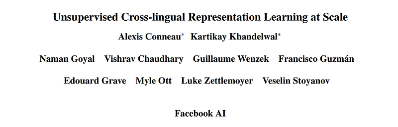
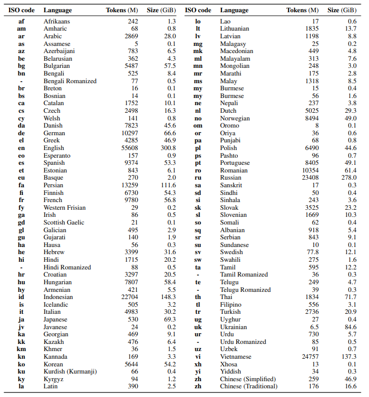

# Papers Explained 159 - XLM Roberta

XLM-RoBERTa combines RoBERTa techniques with XLM, excluding translation language modelling. Instead, it focuses on masked language modelling in sentences from a single language. The model is trained on a vast array of languages (100) and possesses the ability to identify the input language without relying on language embeddings.

This page ingests the source article into the wiki and connects it to [[Papers Explained Corpus]], [[Large Language Models]], [[Multilingual Models]], [[Embedding and Retrieval]].

## Source Metadata

- Source file: `raw/2024-07-05_Papers-Explained-159--XLM-Roberta-2da91fc24059.html`
- Source title: Papers Explained 159: XLM Roberta
- Published: 2024-07-05
- Canonical: [https://medium.com/@ritvik19/papers-explained-159-xlm-roberta-2da91fc24059](https://medium.com/@ritvik19/papers-explained-159-xlm-roberta-2da91fc24059)

## Key Ideas

- XLM-RoBERTa combines RoBERTa techniques with XLM, excluding translation language modelling. Instead, it focuses on masked language modelling in sentences from a single language.
- A Transformer model is trained with the multilingual masked language modeling (MLM) objective using only monolingual data. Streams of text are sampled from each language, and the model is trained to predict the masked tokens in the input.
- A large vocabulary size of 250,000 is used with a full softmax, and two different models are trained.: XLM-R Base (L = 12, H = 768, A = 12, 270M params) and XLM-R (L = 24, H = 1024, A = 16, 550M params).
- Unsupervised Cross-lingual Representation Learning at Scale [1911.02116](https://arxiv.org/abs/1911.02116)

## Notes

XLM-RoBERTa combines RoBERTa techniques with XLM, excluding translation language modelling. Instead, it focuses on masked language modelling in sentences from a single language. The model is trained on a vast array of languages (100) and possesses the ability to identify the input language without relying on language embeddings.

## Model

A Transformer model is trained with the multilingual masked language modeling (MLM) objective using only monolingual data. Streams of text are sampled from each language, and the model is trained to predict the masked tokens in the input. Subword tokenization is applied directly on raw text data using SentencePiece.

A large vocabulary size of 250,000 is used with a full softmax, and two different models are trained.: XLM-R Base (L = 12, H = 768, A = 12, 270M params) and XLM-R (L = 24, H = 1024, A = 16, 550M params).

## Data

*Figure: Languages and statistics of the CC-100 corpus*

## Paper

Unsupervised Cross-lingual Representation Learning at Scale [1911.02116](https://arxiv.org/abs/1911.02116)

## Figures

Figures from the Medium HTML export (`raw/2024-07-05_Papers-Explained-159--XLM-Roberta-2da91fc24059.html`); local copies under `wiki/assets/papers-explained-159-xlm-roberta/` when download succeeded.

| Figure | Caption |
|--------|---------|
|  | Title page of *Unsupervised Cross-lingual Representation Learning at Scale* (Conneau et al., Facebook AI)—the XLM-R paper. |
|  | CC-100 corpus statistics: ISO codes, language names, token counts (millions), and per-language compressed sizes (GiB) across ~100 languages. |
## Related

- [[Papers Explained Corpus]]
- [[Large Language Models]]
- [[Multilingual Models]]
- [[Embedding and Retrieval]]
- [[Papers Explained 158 - XLM]]
- [[Papers Explained 160 - Orca]]

#summary #topic
