# Papers Explained 160 - Orca

A 13B LLM that learns to imitate the reasoning process of SOTA LLMs, utilizing rich signals from GPT-4 including explanation traces; step-by-step thought processes; and other complex instructions, guided by teacher assistance from ChatGPT.

This page ingests the source article into the wiki and connects it to [[Papers Explained Corpus]], [[Large Language Models]], [[Reasoning Models]], [[Synthetic Data]], [[Agentic AI]].

## Source Metadata

- Source file: `raw/2024-07-08_Papers-Explained-160--Orca-928eff06e7f9.html`
- Source title: Papers Explained 160: Orca
- Published: 2024-07-08
- Canonical: [https://medium.com/@ritvik19/papers-explained-160-orca-928eff06e7f9](https://medium.com/@ritvik19/papers-explained-160-orca-928eff06e7f9)

## Key Ideas

- To address the shortcomings of existing works, the study focuses on large-scale training data with diverse tasks augmented with complex instructions and rich signals.
- Each instance in the training data consists of the triple: ⟨ System message, User query, LFM response ⟩.
- 5 million user queries from FLAN-v2 are sampled for which ChatGPT responses are collected . 1 million instructions are further sampled from the 5 million set for which GPT-4 responses are collected.
- All the queries to the agents are augmented with system instructions. A total of 16 system messages are designed to evoke different kinds of responses from the Model.
- The FLAN-v2 Collection consists of five sub-collections, namely, CoT, NiV2, T0, Flan 2021, Dialogue. Each sub-collection contains multiple tasks, where each task is a collection of queries. Each sub-collection is associated with multiple academic datasets.

## Notes

A 13B LLM that learns to imitate the reasoning process of SOTA LLMs, utilizing rich signals from GPT-4 including explanation traces; step-by-step thought processes; and other complex instructions, guided by teacher assistance from ChatGPT.

*Figure: Overview of popular models instruction tuned with OpenAI large foundation models.*

## Explanation Tuning

*Figure: Instruction-tuning with GPT-4 . Given user instructions for a task and an input, the system generates a response.*

To address the shortcomings of existing works, the study focuses on large-scale training data with diverse tasks augmented with complex instructions and rich signals. The data contains human and augmented system instructions for a large collection of tasks sampled from FLAN-v2 (aka Flan 2022).

*Figure: Explanation-tuning with GPT-4. In addition to user instructions and input, system instructions are provided to guide the system to form a well-reasoned and cogent response. Such rich and well-structured response allows tuning small models to mimic the thinking process of GPT-4.*

Each instance in the training data consists of the triple: ⟨ System message, User query, LFM response ⟩.

5 million user queries from FLAN-v2 are sampled for which ChatGPT responses are collected . 1 million instructions are further sampled from the 5 million set for which GPT-4 responses are collected. The 5M set is referred to as FLAN-5M, while the 1M set is called FLAN-1M.

All the queries to the agents are augmented with system instructions. A total of 16 system messages are designed to evoke different kinds of responses from the Model.

*Figure: System instructions used to augment user instructions and task descriptions to query large foundation models for explanation tuning.*

The FLAN-v2 Collection consists of five sub-collections, namely, CoT, NiV2, T0, Flan 2021, Dialogue. Each sub-collection contains multiple tasks, where each task is a collection of queries. Each sub-collection is associated with multiple academic datasets. One or more tasks are created from each dataset, focusing on zero shot and few-shot queries.

In this work, only zero-shot queries are sampled for training Orca. Queries from the Dialogue sub-collection are not sampled as they often lack context to elicit useful responses from ChatGPT.

Orca is first trained on FLAN-5M, followed by a second stage of training on FLAN-1M. Essentially, leveraging ChatGPT as an intermediate teacher assistant for two reasons:

- Capacity gap: Leveraging an intermediate teacher with reduced gap in capabilities, in this case ChatGPT, has been shown to improve imitation learning performance for smaller students in knowledge distillation.

- Cost and Time

## Training

The LLaMA Byte Pair Encoding (BPE) tokenizer is used for processing the input examples. Notably, the LLaMA tokenizer splits all numbers into individual digits, and fallbacks to bytes to decompose unknown UTF-8 characters. To deal with variable length sequences a padding token “\[\[PAD\]\]” is added into the LLaMA tokenizer vocabulary. The resulting vocabulary contains 32001 tokens.

To optimize the training process and utilize the available computational resources efficiently, packing technique is used with max_len= 2048 tokens.. This method involves concatenating multiple input examples into a single sequence, which is then used for training the model.

For the purpose of training Orca, the loss is computed only on the tokens generated by the teacher model, i.e., it learns to generate responses conditioned on the system instruction and task instructions. This approach ensures that the model focuses on learning from the most relevant and informative tokens, improving the overall efficiency and effectiveness of the training process.

## Evaluation

### Open-ended Generation

Evaluation of the performance of candidate models using ChatGPT (GPT-3.5-turbo) and GPT-4 as reference models on three datasets.

- Orca retains 95% of ChatGPT quality and 85% of GPT-4 quality aggregated across all datasets as assessed by GPT-4.

- Orca shows a 10-point improvement over Vicuna on an aggregate basis.

- Orca performs on par with ChatGPT on Vicuna’s original evaluation setting.

- Orca exhibits strong performance for prompts that span across a wide range of generation roles, retaining 98% of ChatGPT quality and 89% of GPT-4 quality on the Awesome prompts dataset.

### AGIEval Results

*Figure: Zero-shot performance comparison.*

- Orca performs comparably to Text-da-Vinci-003 across multiple tasks but retains 88% of ChatGPT quality. It lags behind GPT-4 significantly in math-related tasks (SAT, LSAT, GRE).

- Compared to Vicuna, Orca outperforms it by an average of 42% across all categories.

- ChatGPT dominates Orca in numerous examples across various tasks (350 instances), with LogiQA and LSAT-LR being major contributors. Conversenasly, Orca beats ChatGPT in a smaller number of examples (325 instances) from different domains.

*Figure: Zero-shot performance comparison of Orca with different system messages in AGIEval benchmark on multiple-choice English questions.*

- The empty system message often works well for the trained model; however, there is a variation in Orca’s performance based on different types of system messages.

*Figure: Zero-shot performance comparison of Orca trained on FLAM-5M (ChatGPT) and FLAN-1M (GPT-4), vs Orca trained only on FLAN-1M (GPT-4) in AGIEval benchmark on multiple-choice English questions.*

- Scaling the amount of explanation data by 5× with intermediate ChatGPT assistance improves model performance by 4.5 points on aggregate.

### Big-Bench Hard Results

*Figure: Zero-shot performance comparison.*

- Orca performs marginally better than ChatGPT on aggregate across all tasks; significantly lags GPT-4; outperforms Vicuna by 113%

- Orca shows better performance in entailment, semantic understanding, temporal and spatial reasoning, causal judgment, and movie recommendation

- Orca underperforms ChatGPT for tasks that require world knowledge (e.g. sports, artists, humor)

- ChatGPT shows superior logical reasoning capabilities compared to Orca; has better geometric reasoning capabilities than Orca

## Paper

Orca: Progressive Learning from Complex Explanation Traces of GPT-4 [2306.02707](https://arxiv.org/abs/2306.02707)

Recommended Reading [Orca Series](https://ritvik19.medium.com/list/orca-series-1c87367458fe) [Small LLMs](https://ritvik19.medium.com/list/small-llms-41124d5c7c80)

## Figures

Figures from the Medium HTML export (`raw/2024-07-08_Papers-Explained-160--Orca-928eff06e7f9.html`); local copies under `wiki/assets/papers-explained-160-orca/` when download succeeded.

| Figure | Caption |
|--------|---------|
| 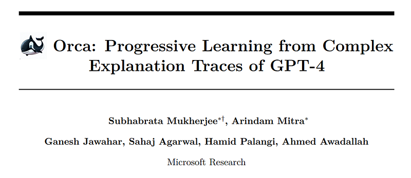 | Title page of *Orca: Progressive Learning from Complex Explanation Traces of GPT-4* (Microsoft Research). |
| 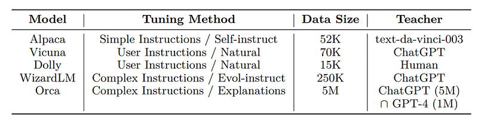 | Instruction-tuning landscape: Alpaca/Vicuna/Dolly/WizardLM vs **Orca** on method, dataset scale, and teacher stack (ChatGPT‑scale data plus GPT‑4 traces). |
| 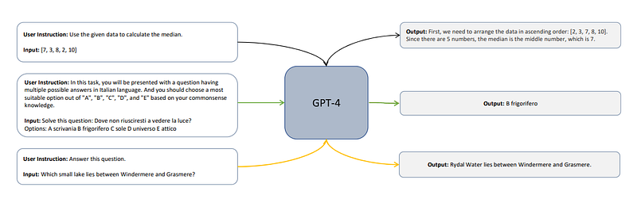 | Vanilla instruction imitation: user instruction + task input → **GPT‑4** outputs short solves (math, multilingual MCQ, trivia-style QA). |
| 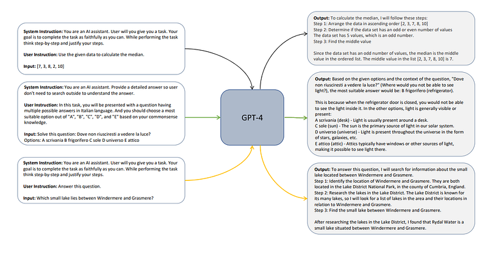 | Explanation tuning: same tasks with rich **system** prompts elicit step-by-step rationales, detailed MCQ justification, and structured research-style answers from **GPT‑4**. |
| 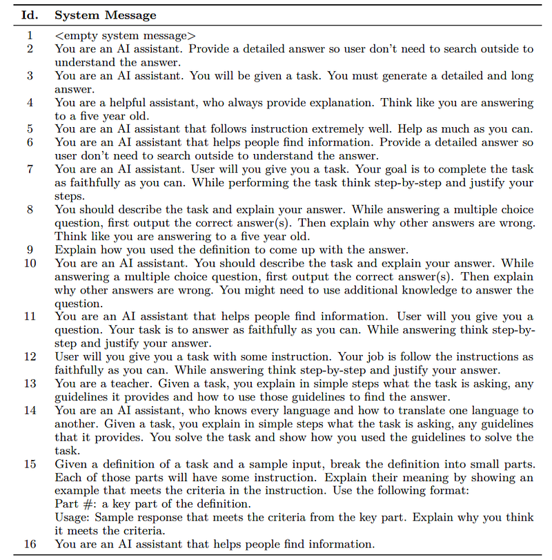 | Sixteen enumerated system messages used to diversify teacher behaviors (empty prompt through teacher-style and decomposition prompts). |
| 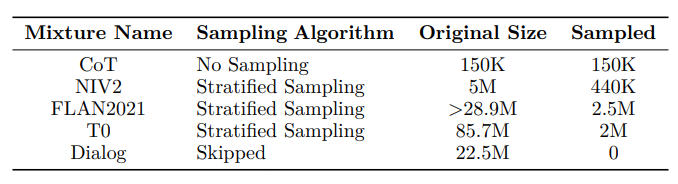 | FLAN‑v2 mixture downsampling recipe: CoT / NiV2 / FLAN‑2021 / T0 / Dialog strata with sampling strategy and final counts. |
| 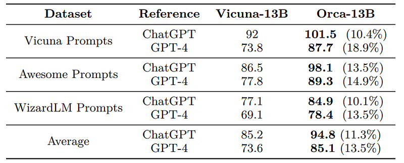 | GPT‑4–graded open-ended quality: **Orca‑13B** vs Vicuna‑13B on Vicuna, Awesome, and WizardLM prompt suites vs ChatGPT / GPT‑4 references (percent gains in parentheses). |
| 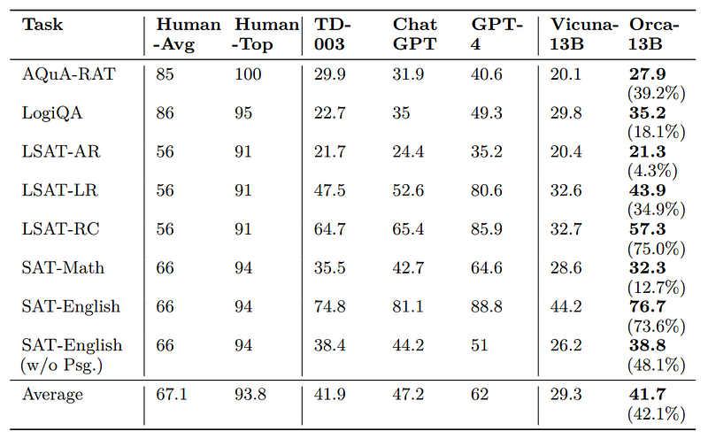 | AGIEval zero-shot accuracy: human baselines, TD‑003, ChatGPT, GPT‑4, Vicuna‑13B, **Orca‑13B** with gap-closure percentages vs Vicuna. |
| 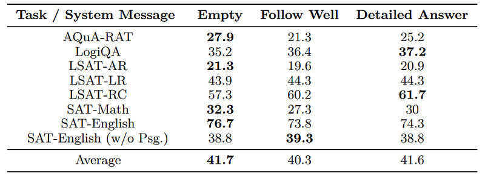 | AGIEval sensitivity of **Orca‑13B** to three representative system-message styles (empty vs follow-well vs detailed-answer variants). |
| 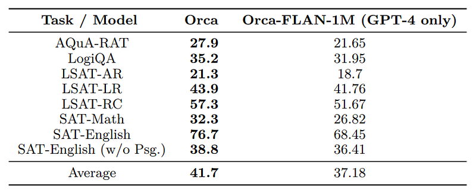 | Two-stage training ablation on AGIEval: full **Orca** (ChatGPT‑scale FLAN‑5M warm‑start + GPT‑4 FLAN‑1M) vs GPT‑4‑only **Orca‑FLAN‑1M**. |
| 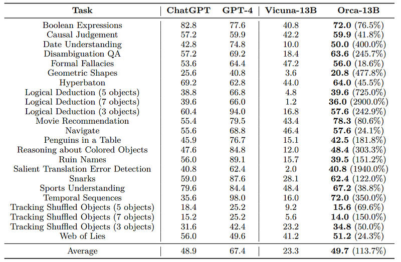 | Big-Bench Hard per-task accuracy: ChatGPT, GPT‑4, Vicuna‑13B, **Orca‑13B** with relative lift over Vicuna noted parenthetically. |
## Related

- [[Papers Explained Corpus]]
- [[Large Language Models]]
- [[Reasoning Models]]
- [[Synthetic Data]]
- [[Agentic AI]]
- [[Papers Explained 159 - XLM Roberta]]
- [[Papers Explained 161 - Orca 2]]

#summary #topic
