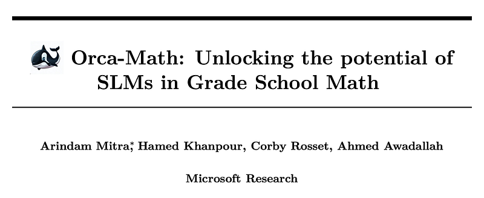
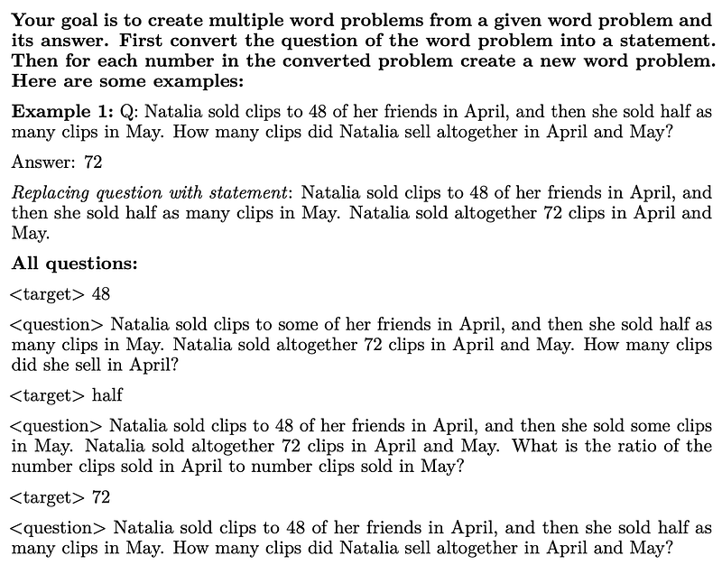
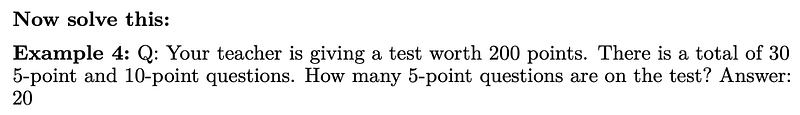
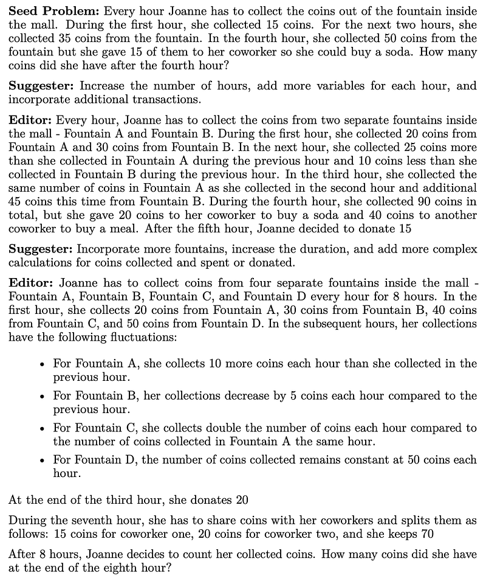
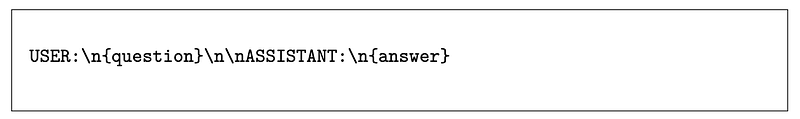
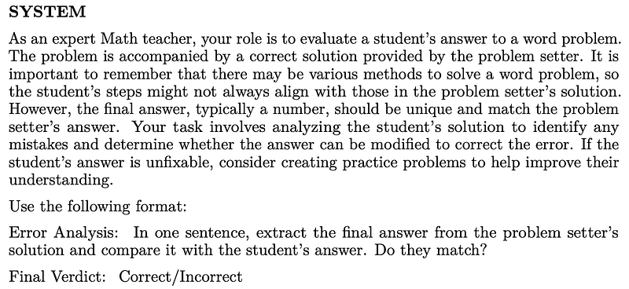
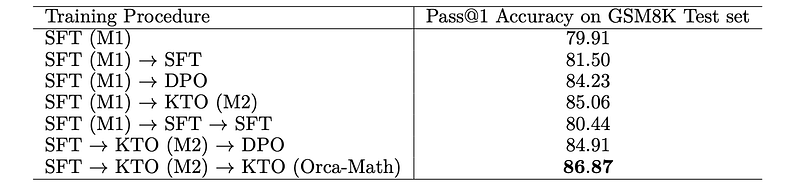
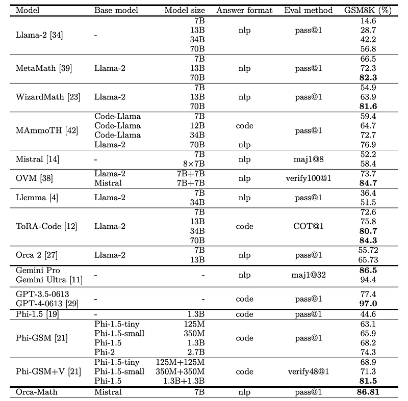

# Papers Explained 163 - Orca Math

Orca-Math is a 7B-sized language model (SLM) based on the Mistral-7B. It achieves an accuracy rate of 86.81% on the GSM8k dataset without requiring multiple model calls, verifiers, or external tools. The key elements of Orca-Math’s approach are:

This page ingests the source article into the wiki and connects it to [[Papers Explained Corpus]], [[Reasoning Models]], [[Large Language Models]], [[Synthetic Data]], [[Agentic AI]], [[Reinforcement Learning Topic]].

## Source Metadata

- Source file: `raw/2024-07-15_Papers-Explained-163--Orca-Math-ae6a157ce48d.html`
- Source title: Papers Explained 163: Orca Math
- Published: 2024-07-15
- Canonical: [https://medium.com/@ritvik19/papers-explained-163-orca-math-ae6a157ce48d](https://medium.com/@ritvik19/papers-explained-163-orca-math-ae6a157ce48d)

## Key Ideas

- A high-quality synthetic dataset of 200,000 math problems created using a multi-agent setup where agents collaborate to generate the data.
- An iterative learning technique that allows the SLM to practice solving problems, receive feedback on its solutions, and learn from preference pairs that incorporate the SLM’s solutions and the feedback.
- The dataset is available at [HuggingFace](https://huggingface.co/datasets/microsoft/orca-math-word-problems-200k/).
- Recommended Reading [Papers Explained 160: Orca](https://ritvik19.medium.com/papers-explained-160-orca-928eff06e7f9) [Papers Explained 161: Orca-2](https://medium.com/@ritvik19/papers-explained-161-orca-2-b6ffbccd1eef)
- A total of 36,217 math word problems are collected from existing open-source datasets, specifically NumGLUE, AddSub, ALGES, ASDiv, DRAW, GSM8k, MATHQA, MultiArith, SingleOP, and SingleEQ.

## Notes

Orca-Math is a 7B-sized language model (SLM) based on the Mistral-7B. It achieves an accuracy rate of 86.81% on the GSM8k dataset without requiring multiple model calls, verifiers, or external tools. The key elements of Orca-Math’s approach are:

- A high-quality synthetic dataset of 200,000 math problems created using a multi-agent setup where agents collaborate to generate the data.

- An iterative learning technique that allows the SLM to practice solving problems, receive feedback on its solutions, and learn from preference pairs that incorporate the SLM’s solutions and the feedback.

The dataset is available at [HuggingFace](https://huggingface.co/datasets/microsoft/orca-math-word-problems-200k/).

Recommended Reading [Papers Explained 160: Orca](https://ritvik19.medium.com/papers-explained-160-orca-928eff06e7f9) [Papers Explained 161: Orca-2](https://medium.com/@ritvik19/papers-explained-161-orca-2-b6ffbccd1eef)

## Dataset Construction: Agent-Instruct

Seed set

A total of 36,217 math word problems are collected from existing open-source datasets, specifically NumGLUE, AddSub, ALGES, ASDiv, DRAW, GSM8k, MATHQA, MultiArith, SingleOP, and SingleEQ.

Agent — Ask Me Anything

The seed set is expanded by creating multiple word problems from each problem in the set, using the following prompt:

*Figure: The Few shot examples of this prompt are truncated.*

This agent creates a total of 120,445 new problems. The solutions to these word problems are generated using GPT4-Turbo.

Agent — Suggester & Editor

The seed set is further expanded by developing challenging problems, using two new agents, namely Suggester and Editor. The Suggester examines a specific problem and proposes several methods for enhancing its complexity without creating the actual problem. Subsequently, the Editor takes the original word problem and the Suggester’s recommendations to generate an updated, more challenging problem.

*Figure: An example of the iterative process.*

Two rounds of iterations are performed per problem. Each round involves using the GPT-4 Turbo model to generate a response.If the generated answer exceeds 1800 characters, it is filtered out. The process resulted in 37,157 problems.

DMath

Furthermore, 6,216 problems sourced from DMath are also included. These problems represent a subset of the 7,943 problems present in the DMath training set, in which the solution computed by GPT4-Turbo aligns with the precise gold-standard answer.

## Training

### Supervised Fine-Tuning Experiment (Iteration #1)

Mistral-7B is fine-tuned on the Orca-Math-200K dataset for one epoch without using packing. The loss is computed only on the answer tokens. The data is presented in the following instruction format:

### Iterative Learning from both Positive and Negative Signals

Dataset Construction Iteration #2

To generate additional positive and negative solutions for each problem, four responses from the SFT-tuned model (top_p = 0.95 and temperature = 0.7) from iteration #1 are sampled. Subsequently, GPT4-Based-Exact-Match is employed to assess the alignment between the teacher’s (GPT4-Turbo) answer and the student’s answer. For all solutions where the student-generated answer does not match the teacher’s answer, are labeled as negative; otherwise, positive. A preference dataset is then constructed.

*Figure: System prompt for GPT4-based-Exact-Match.*

Dataset Construction Iteration #3

Let M2 denote the model trained with KTO on the dataset constructed for Iteration #2. The same procedure for the construction of dataset is replicated for Iteration #3; however, M2 is used to generate the four responses instead of the SFT-tuned model from iteration #1.

## Experiment Setup and Results

Mistral-7B is fine-tuned for up to three iterations. In the first iteration, supervised fine-tuning is used to obtain M1. For the second iteration, SFT, DPO, and KTO are compared. The model trained with KTO performs better in this group, referred to as M2. M2 is then used to generate the dataset for iteration #3. In the third iteration, DPO and KTO are compared, with M2 serving as the starting point. These models are also compared against three epochs of SFT training on the Orca-Math-200K dataset.

*Figure: The performance of several iterative learning experiments and baselines on the GSM8k test set.*

### Performance Against other LLMs

*Figure: Results on GSM8K.*

- The model exceeds much bigger models like LLAMA-2–70B (56.8%) , WizardMath-70B (81.6%), Gemini Pro (86.5% with 32 trials) and GPT-3.5 (77.4%).

- Most notably it can reach this level with only 200K examples (orders of magnitude less than other datasets).

## Paper

Orca-Math: Unlocking the potential of SLMs in Grade School Math [2402.14830](https://arxiv.org/abs/2402.14830)

Recommended Reading [Orca Series](https://ritvik19.medium.com/list/orca-series-1c87367458fe) [Small LLMs](https://ritvik19.medium.com/list/small-llms-41124d5c7c80)

## Figures

Figures from the Medium HTML export (`raw/2024-07-15_Papers-Explained-163--Orca-Math-ae6a157ce48d.html`); local copies under `wiki/assets/papers-explained-163-orca-math/` when download succeeded.

| Figure | Caption |
|--------|---------|
|  | Paper title: *Orca-Math: Unlocking the potential of SLMs in Grade School Math*. |
|  | **Ask Me Anything** agent: turn one Q/A into many problems by converting to a factual statement, then re-asking for each numeric target. |
|  | Truncated **few-shot** excerpt from that prompt (illustrative word problem + answer). |
|  | **Suggester** / **Editor** example: two rounds that complexify a seed math word problem. |
|  | Supervised fine-tuning format: `USER: {question}` / `ASSISTANT: {answer}` (loss on answer tokens). |
|  | **GPT4-based-Exact-Match** system prompt: expert math teacher compares student vs. reference final answer. |
|  | **GSM8K** Pass@1 for iterative pipelines (SFT, DPO, KTO, multi-stage); best row is final Orca-Math training. |
|  | **GSM8K** leaderboard-style comparison: Orca-Math (Mistral-7B) vs. larger math-tuned and proprietary models. |
## Related

- [[Papers Explained Corpus]]
- [[Reasoning Models]]
- [[Large Language Models]]
- [[Synthetic Data]]
- [[Agentic AI]]
- [[Reinforcement Learning Topic]]
- [[Papers Explained 162 - PEGASUS]]
- [[Papers Explained 164 - Orca 3 (Agent Instruct)]]

#summary #topic
