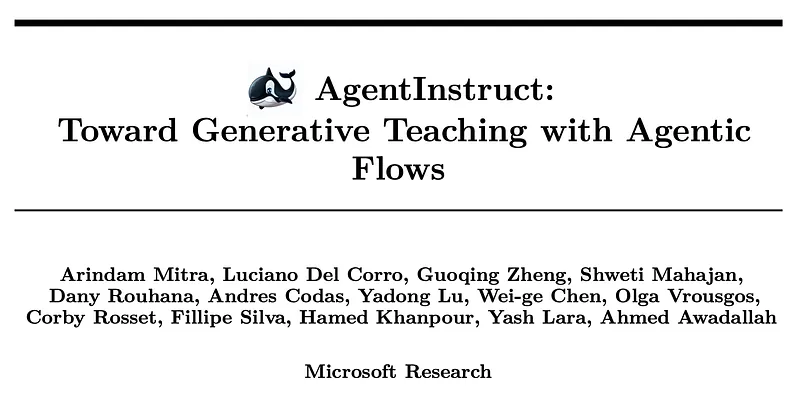
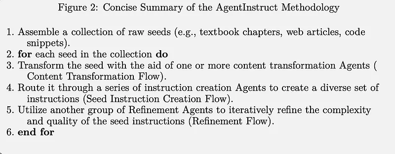
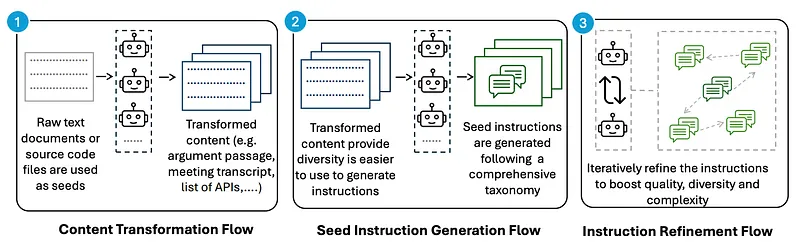
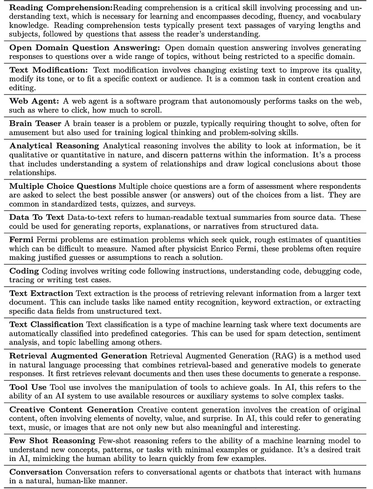
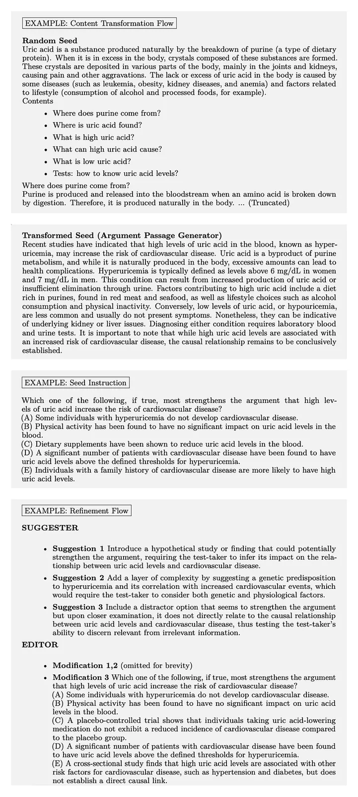
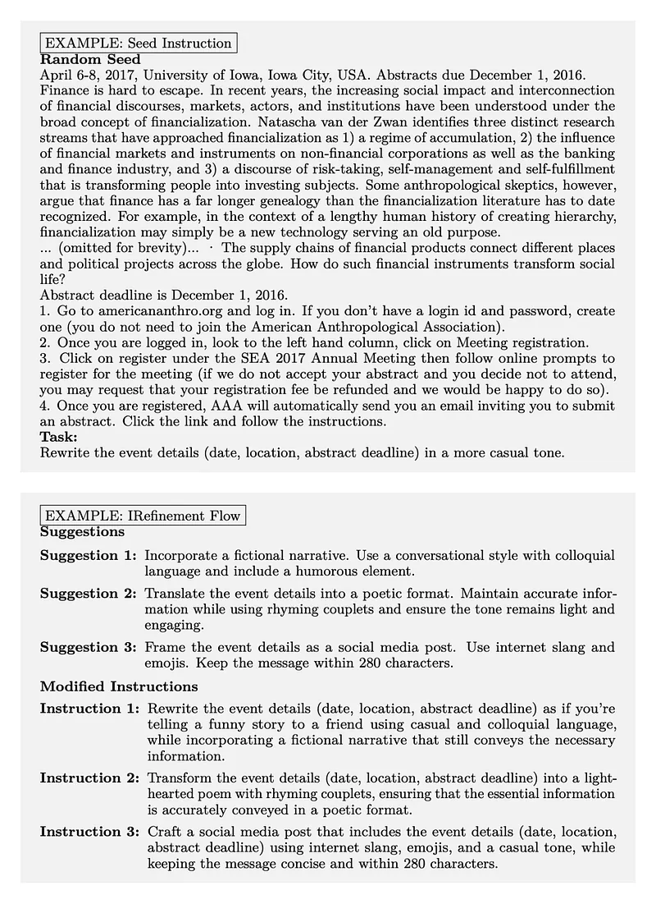
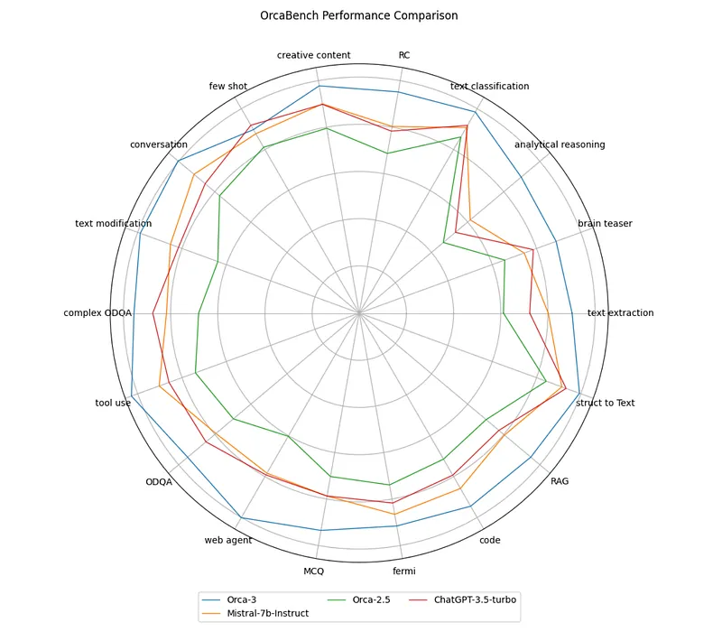
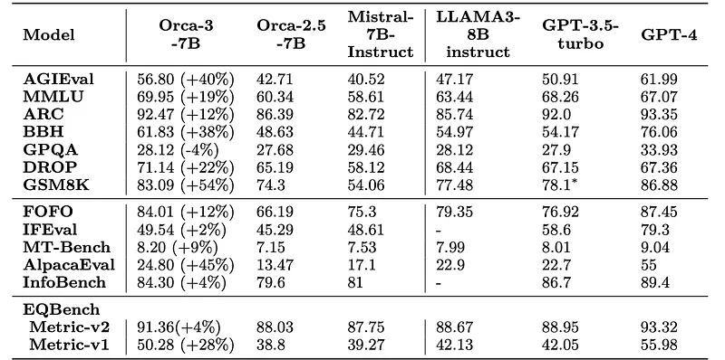

# Papers Explained 164 - Orca 3 (Agent Instruct)

The study focuses on using synthetic data for post-training, specifically creating data by powerful models to teach a new skill or behavior to another model, referred to as Generative Teaching.

This page ingests the source article into the wiki and connects it to [[Papers Explained Corpus]], [[Synthetic Data]], [[Agentic AI]], [[Reasoning Models]], [[Large Language Models]], [[Code Models]].

## Source Metadata

- Source file: `raw/2024-07-17_Papers-Explained-164--Orca-3--Agent-Instruct--41340505af36.md`
- Source title: Papers Explained 164: Orca 3 (Agent Instruct)
- Published: 2024-07-17
- Canonical: [https://medium.com/@ritvik19/papers-explained-164-orca-3-agent-instruct-41340505af36](https://medium.com/@ritvik19/papers-explained-164-orca-3-agent-instruct-41340505af36)

## Key Ideas

- AgentInstruct, an extensible framework that generates large amounts of diverse and high-quality synthetic data including both prompts and responses, by using raw data sources such as text documents and code files as seeds.
- Mistral-7b post trained with the data (called as Orca-3) demonstrates significant improvements across many benchmarks over Mistral-7b-Instruct.
- Recommended Reading [Papers Explained 160: Orca](https://ritvik19.medium.com/papers-explained-160-orca-928eff06e7f9)[Papers Explained 161: Orca-2](https://medium.com/@ritvik19/papers-explained-161-orca-2-b6ffbccd1eef) [[Papers Explained 163...
- AgentInstruct defines three different flows:
- The Content Transformation Flow converts raw seeds into an intermediate representation, simplifying instruction creation for specific objectives. This process involves multiple agents and generates high-quality data while introducing diversity.

## Notes

The study focuses on using synthetic data for post-training, specifically creating data by powerful models to teach a new skill or behavior to another model, referred to as Generative Teaching.

AgentInstruct, an extensible framework that generates large amounts of diverse and high-quality synthetic data including both prompts and responses, by using raw data sources such as text documents and code files as seeds.

Mistral-7b post trained with the data (called as Orca-3) demonstrates significant improvements across many benchmarks over Mistral-7b-Instruct.

Recommended Reading [Papers Explained 160: Orca](https://ritvik19.medium.com/papers-explained-160-orca-928eff06e7f9)[Papers Explained 161: Orca-2](https://medium.com/@ritvik19/papers-explained-161-orca-2-b6ffbccd1eef) [Papers Explained 163 Orca-Math](https://ritvik19.medium.com/papers-explained-163-orca-math-ae6a157ce48d)

## Generative Teaching : AgentInstruct

*Figure: A thematic overview of the roles played by different groups of agents.*

AgentInstruct defines three different flows:

- The Content Transformation Flow converts raw seeds into an intermediate representation, simplifying instruction creation for specific objectives. This process involves multiple agents and generates high-quality data while introducing diversity.

- The Seed Instruction Generation takes the transformed seed as input and generates diverse instructions using a predefined taxonomy. Its sole goal is to introduce diversity.

- The Instruction Refinement Flow, iteratively enhances instruction complexity and quality by proposing various approaches through Suggester-Editor Agents. These agents initially suggest ways to increase instruction intricacy, which Editor agents then modify accordingly.

These flows are implemented for 17 different skills

### AgentInstruct Flow for Reading Comprehension

Reading Comprehension transformation agents:

- Argument Passage Generator: This agent is adept at creating passages that articulate arguments, which may occasionally contain logical inconsistencies.

- Debate Passage Generator: It specializes in crafting passages that mimic the structure and content of debate transcripts.

- Conversation Passage Generator: This agent generates passages that depict dialogues.

- Meeting Transcript Generator: It is designed to produce meeting transcripts.

- Poem Generator: This agent generates poems.

- Satirical Passage Generator: It creates texts infused with satirical wit.

- Instructional Passage Generator: This agent generates passages resembling instructional manuals.

- Long Text Generator: It extends the original text by incorporating additional information, thereby increasing its length.

- Identity Agent: A straightforward agent that replicates the input text verbatim.

Instruction Taxonomy for Seed Instruction Generation Flow

- Literal Comprehension Question (Short Answer(or list)): a question that asks for a specific detail(s) or fact(s) clearly stated in the text.

- Numerical Discrete Reasoning (Reasoning): questions that require the reader to use numerical reasoning over many facts from the text.

- Critical Comprehension Question (True/False): construct two statements about the purpose or point of view that the reader must assess as true or false, with one being true and the other false.

- Evaluative Comprehension Question (Essay): an open-ended question that prompts an in-depth analysis of the text’s theme or the effectiveness of an argument.

- Vocabulary and Language Use (Fill-in-the-Blank): a fill-in-the-blank question that tests understanding of a particular word or phrase used in the text.

- Relationship Comprehension Question (Matching): a matching question where respondents pair items based on a specific criterion.

- Sequencing Events (Ordering): a series of events from the text arranged in the correct chronological order.

- Strengthen: identify information that would make the argument’s conclusion more likely to be true.

- Weaken: find evidence or an argument that would make the conclusion less likely to be true.

- Assumption (Necessary Assumption): determine what must be true for the argument to hold.

- Flaw: point out a mistake in the argument’s reasoning.

- Inference (Must Be True): Choose an option that logically follows from the information provided.

- Principle (Identify the Principle): Recognize the general rule or principle that underlies the argument.

- Method of Reasoning (Describe the Argument): Describe how the argument is constructed logically.

### AgentInstruct Flow for Text Modification

Instruction Taxonomy for Seed Instruction Generation Flow

- Paraphrasing: Rewriting text using different words and sentence structures while maintaining the original meaning.

- Text Simplification: Making text easier to read and understand by using simpler words and sentence structures, often for children or language learners.

- Text Expansion: Adding more information or detail to make text more comprehensive or to meet a certain word count.

- Text Translation: Converting text from one language to another while attempting to preserve the original meaning as closely as possible.

- Text Formatting: Altering the appearance of text to improve readability or for stylistic purposes.

- Sentiment Modification: Changing the tone of the text to alter its emotional impact, such as making a sentence sound more positive or negative.

- Text Annotation: Adding notes, comments, or explanations to a text, often for the purpose of analysis or to provide additional context.

- Keyword Replacement: Substituting specific words or phrases with synonyms or related terms.

- Text Removing: Redacting or removing content from text.

- Text Capitalization: Adjusting the case of letters in text, such as converting to uppercase, lowercase, title case, or sentence case, starting every sentence with a particular letter, word.

- Text Styling: Applying styles like bold, italics, underline, etc., to emphasize certain parts of the text or for aesthetic purposes.

- Content Rewriting: Extensively modifying a text to produce a new version, which could involve changing the perspective, style, or target audience.

- Data Normalization: Standardizing text to ensure consistency, such as converting dates and times to a standard format or unifying the spelling of words.

- Plagiarism Rewording: Altering text to avoid plagiarism, ensuring that the content is original.

- Code Switching: Alternating between languages or dialects within a text, often to reflect bilingual speakers’ patterns or for creative writing.

- Text Obfuscation: Intentionally making text vague or harder to understand, sometimes for security purposes (like masking personal data).

- Textual Entailment: Modifying a sentence or phrase to either entail or contradict another sentence, often used in natural language processing tasks.

- Rewriting with vocabulary limitations: Rewriting the entire text or a piece of it while using a limited vocabulary. For example, all words should start with letter ’a’, all n-th word should start with letter ’b’, each sentence should start with a ’vowel’, etc.

## Orca-3

A collection of 22M instructions is curated using unstructured text and code files sampled from KnowledgePile, AutoMathText, a subset of openstax and a subset of apache-2.0 licensed source code files from CodeParrot.

In addition to the 22 M instructions, approximately 3.8 M paired instructions are sourced from Orca-1, Orca-2, Orca-Math and samples from other publicly available sources. This data is referred to as Orca-2.5dataset.

The culmination of these datasets (25.8 M paired instructions), are incorporated into the training of Orca-3. Furthermore, a separate model, referred to as Orca-2.5, is trained using the 3.8M instructions (Orca-2.5-dataset).

Mistral-7b-v0.1 is fine tuned for a maximum sequence length of 8192 with packing for three epochs.

## Evaluation Results

### Orca Bench

- The Orca-Bench dataset is used as a held-out test set, containing 100 samples per skill (except ODQA, which has two subsets: ODQA and Complex ODQA).

- Baselines are evaluated on Orca-Bench and scored relative to GPT-4 on a scale of 0 to 10.

*Figure: Performance Comparison between Baselines and Orca3 Checkpoints.*

- AgentInstruct data leads to significant performance improvements in a broad range of capabilities, except few shot.

*Figure: Average Performance of Different Models on Orca-Bench.*

- Orca-3, trained with AgentInstruct data, outperforms Orca-2.5 by 33.94% and Mistral-Instruct-7B by 14.92% on average.

### Benchmark Results

*Figure: Performance of Orca-3 and other baseline models on all the benchmarks.*

- The results indicate that Orca-3 performs well across a range of benchmarks demonstrating its effectiveness in zero-shot settings for the tasks evaluated.

## Paper

AgentInstruct: Toward Generative Teaching with Agentic Flows [2407.03502](https://arxiv.org/abs/2407.03502)

Recommended Reading [Orca Series](https://ritvik19.medium.com/list/orca-series-1c87367458fe) [Small LLMs](https://ritvik19.medium.com/list/small-llms-41124d5c7c80)

## Figures

Figures from the Medium HTML export (`raw/2024-07-17_Papers-Explained-164--Orca-3--Agent-Instruct--41340505af36.md`); local copies under `wiki/assets/papers-explained-164-orca-3-agent-instruct/` when download succeeded.

| Figure | Caption |
|--------|---------|
|  | Paper title: *AgentInstruct: Toward Generative Teaching with Agentic Flows*. |
|  | Concise **AgentInstruct** loop: seeds → content transformation → seed instructions → refinement agents. |
|  | Thematic overview: **Content Transformation** → **Seed Instruction Generation** → **Instruction Refinement** flows. |
|  | Short definitions of the **17** AgentInstruct skills (RC, ODQA, coding, RAG, tool use, etc.). |
|  | Reading-comprehension walkthrough: raw seed → argument passage → seed MCQ → **Suggester**/**Editor** refinement. |
|  | Text-modification walkthrough: simple rewrite task → refinement suggestions → multiple stylized instructions. |
|  | **Orca-Bench** radar: Orca-3 vs Mistral-7B-Instruct, Orca-2.5, ChatGPT-3.5 across skill axes. |
|  | Average **Orca-Bench** score vs baselines, including Orca-3 checkpoints by training epoch. |
|  | Broad zero-shot table: reasoning, instruction-following, chat, and EQBench vs Orca-2.5, Mistral, Llama-3-8B, GPT-3.5, GPT-4. |
## Related

- [[Papers Explained Corpus]]
- [[Synthetic Data]]
- [[Agentic AI]]
- [[Reasoning Models]]
- [[Large Language Models]]
- [[Code Models]]
- [[Papers Explained 163 - Orca Math]]
- [[Papers Explained 165 - Reformer]]

#summary #topic
